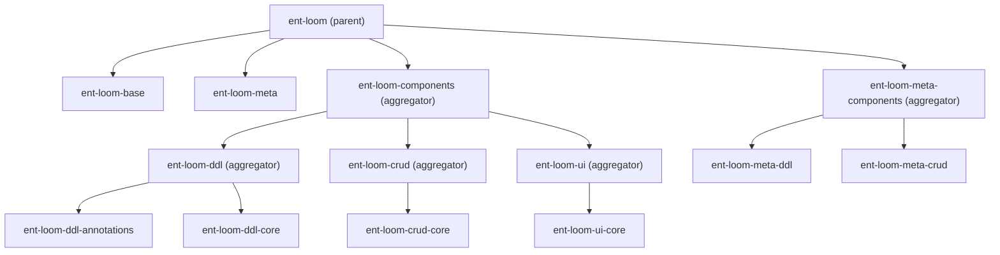
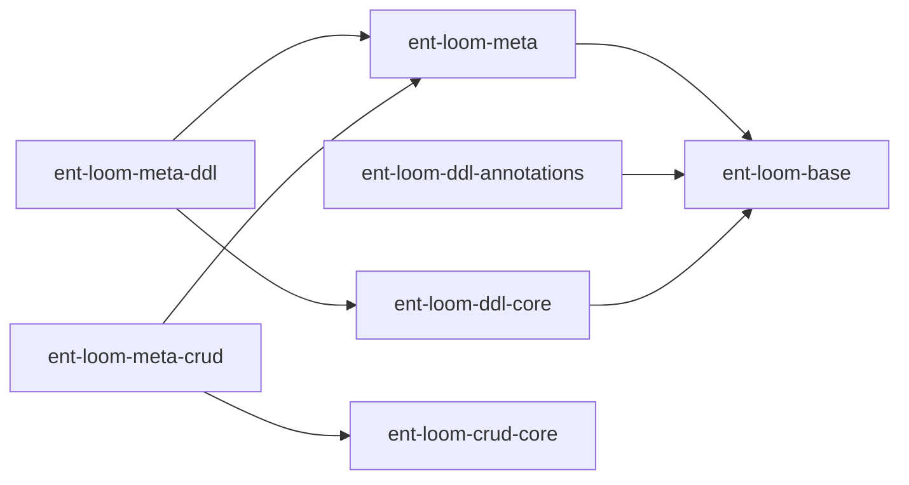

# ent-loom 模块梳理（2026-04-06）

基于当前仓库目录与 `pom.xml` 汇总。

## 1. 当前聚合层级（Maven modules）

## 2. 当前模块状态

| 模块 | 状态 | 说明 |
|---|---|---|
| `ent-loom-base` | implemented | 基础工具与公共类型 |
| `ent-loom-meta` | implemented | 实体元信息注解 |
| `ent-loom-ddl-annotations` | implemented | DDL 注解层 |
| `ent-loom-ddl-core` | scaffold | DDL 执行层骨架 |
| `ent-loom-crud-core` | implemented | CRUD 核心契约（Provider + Contract DTO） |
| `ent-loom-ui-core` | implemented | UI 核心契约（Provider + Contract DTO） |
| `ent-loom-meta-ddl` | scaffold | meta 到 ddl 适配层骨架 |
| `ent-loom-meta-crud` | scaffold | meta 到 crud 适配层骨架 |

## 3. 当前依赖方向（以 POM 依赖为准）

## 4. 命名与边界约定

1. `ent-loom-components`: 放置纯能力组件聚合（ddl/crud/ui）。
2. `ent-loom-meta-components`: 放置 `meta -> 具体能力` 的适配层。
3. `*-core` 模块承载跨层可复用契约，不混入实现细节。
4. 根 `dependencyManagement` 只维护真实存在的 artifactId。
