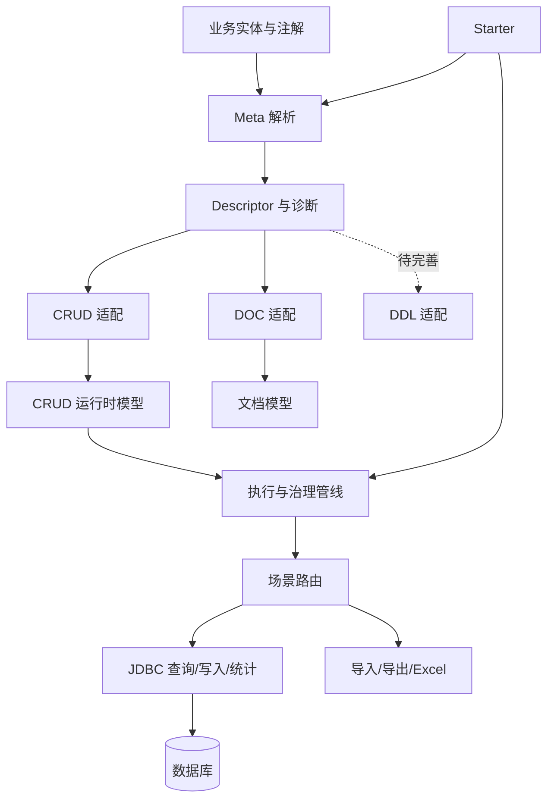
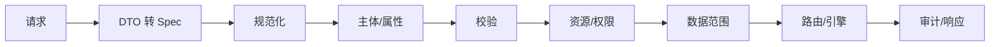

# ent-loom 仓库总结

## 定位

`ent-loom` 是 Java/Maven 多模块、元数据驱动的后端框架。实体语义声明一次，可投影到 CRUD、DDL、文档和 UI，并统一权限、数据范围与审计。

## 架构

## 模块

| 模块 | 职责 |
|---|---|
| `base` | 公共值类型与工具。 |
| `meta` | Descriptor、诊断、注解、反射解析与关系推断。 |
| `crud` | Query、Command、Stats、Import、Export，含 JDBC、Excel 和 Starter。 |
| `ddl` | DDL 模型、MySQL 建表、执行器与 Spring 集成。 |
| `doc` | 文档注解、实体文档模型及 SPI。 |
| `ui` | UI 实体、字段和 Schema Provider 契约。 |
| `meta-adapters` | Meta 到 CRUD/DOC 的投影与自动装配。 |

## 执行主链

CRUD 是主体：统一管线覆盖五类能力，内置 Gateway 必须经过治理；场景 Handler 可替换默认引擎。Command 支持幂等，Import/Export 包含任务、文件访问与 Excel。SQL 白名单、权限、Scope 和审计构成安全边界。

Meta 注解不是子框架硬依赖。子框架可独立解析原生注解，Adapter 再合并通用 Meta；显式值通常优先，冲突进入诊断。

## 现状

仓库约有 563 个主 Java 文件、94 个测试 Java 文件，覆盖 Meta、治理、路由、幂等、JDBC、Starter 与 Excel；文档分层较完整。

主要缺口：关系查询默认以 `ROOT_FIRST` 补数，不支持关联过滤、排序和 JOIN 投影；普通更新 Patch API 尚未统一；DDL Adapter 为空壳；UI 未接入 Meta Starter；部分异步任务仍在路线图。

## 阅读顺序

从 `README.md`、`docs/architecture/overview.md` 开始；现状以 `docs/architecture/` 为准，未来规划以 `docs/roadmap/` 为准。
