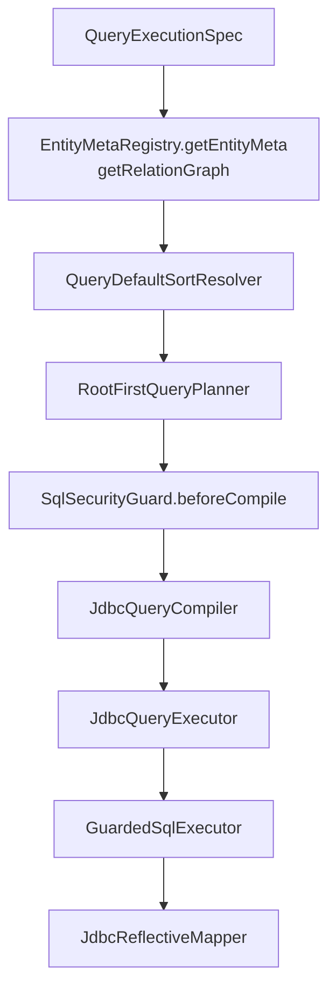
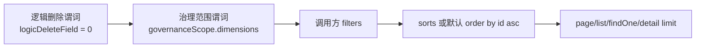
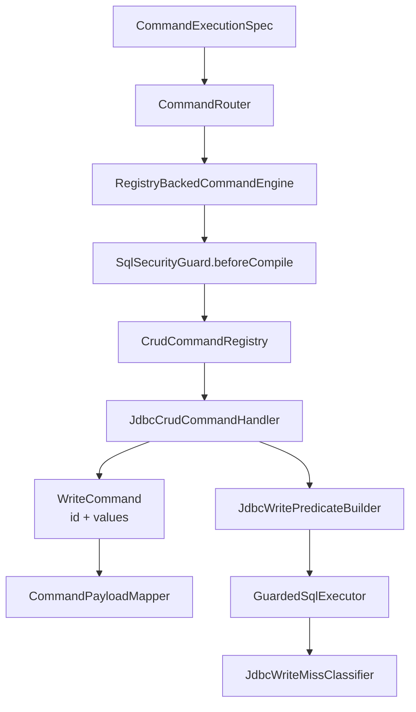
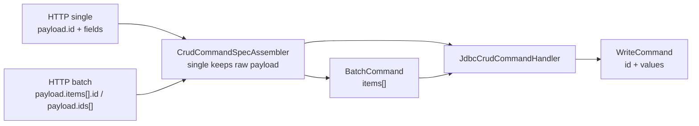

# Default Engine 当前实现

默认引擎由 `JdbcQueryEngine` 和 `RegistryBackedCommandEngine` 组成，目标是提供安全的单表 CRUD 与有限 ROOT_FIRST 关系读。它不是通用 SQL 生成器，也不是完整 ORM。

## 默认 Query 执行链



关键实现：

- `JdbcQueryEngine.prepareWorkingSpec` 会复制 Spec 并设置当前操作。
- 默认排序由 `ConfigurableQueryDefaultSortResolver` 注入，仅在请求未显式排序时生效。
- `RootFirstQueryPlanner` 只接受最终策略 `ROOT_FIRST`，其他策略抛 `UnsupportedQueryStrategyException`。
- `JdbcQueryCompiler` 只从根表 `select * from <table> t` 编译 SQL。
- `JdbcQueryExecutor` 执行主查询，再按 `expandEdges` 批量补关联对象。

## Query SQL 编译规则



当前限制：

- 默认编译器不支持关联字段过滤：`field.contains(".")` 会被拒绝。
- 默认编译器不支持关联字段排序。
- 治理范围维度必须是根实体字段，否则抛 `DataScopeDeniedException`。
- `FIND_ONE` 和 `DETAIL` 都会限制为最多两条，用于判定多条冲突。
- `PageCountMode.NONE` 会多取一条判断 `hasNext`，不查总数。

## 默认 Command 执行链



默认 Command 支持：

- `CREATE`：载荷字段取实体白名单交集；无 id 时返回数据库生成主键。
- `UPDATE`：默认通过 `payload.id` 定位目标，进入 core 后归一为 `WriteCommand(id, values)`；`values` 不包含 id，where 包含逻辑删除、治理范围、主键目标、可选 `expectedVersion`。
- `DELETE`：默认通过 `payload.id` 定位目标；有逻辑删除字段时更新为 1，否则物理删除。
- `SAVE_OR_UPDATE`：有 id 且存在时更新；无 id 或 id 不存在时创建。
- `CREATE_BATCH/UPDATE_BATCH/DELETE_BATCH/SAVE_OR_UPDATE_BATCH`：HTTP 使用 `payload.items[].id` 或 `payload.ids[]`，core 使用 `BatchCommand(items: List<WriteCommand>)`。
- `targetFilters`：保留为高级目标选择器，适合内部调用、action 编排或定制代码；普通前端 CRUD 不应直接依赖它。

默认 Command 不支持：

- `ACTION`：必须由 `CommandActionSceneHandler` 处理。
- 默认跨表写：需要业务 Handler 自己编排，并可通过 `delegate.invoke(...)` 复用单表写。
- POJO payload：默认 JDBC handler 只接受 `Map`、`CrudRecord` 或已经归一化的 `WriteCommand`。HTTP 单条 CRUD 保留原始 JSON payload 给 SceneHandler 使用，进入默认 JDBC handler 后再归一为 `WriteCommand`；HTTP 批量 CRUD 会先归一为 `BatchCommand`；HTTP `ACTION` 会按 action contract 转换 payload。

## 写入载荷归一化



推荐的外部请求形态：

```json
{
  "payload": {
    "items": [
      { "id": 1, "orderNo": "ORD-1-UPDATED" },
      { "id": 2, "orderNo": "ORD-2" }
    ]
  }
}
```

## 写入 0 行的错误分类

`JdbcWriteMissClassifier` 会在 update/delete 影响行数为 0 时做三次存在性检查：

```mermaid
flowchart TB
    zero["rows == 0"]
    target["按目标选择器查是否存在"]
    granted["按 grantedScope 查是否存在"]
    governance["按 governanceScope 查是否存在"]
    version["expectedVersion 是否存在"]
    notFound["RouteNotFoundException<br/>目标不存在"]
    denied1["DataScopeDeniedException<br/>超出已授权范围"]
    denied2["DataScopeDeniedException<br/>超出治理范围"]
    conflict["ValidationException<br/>版本不匹配或目标状态变化"]

    zero --> target
    target -->|不存在| notFound
    target -->|存在| granted
    granted -->|不存在| denied1
    granted -->|存在| governance
    governance -->|不存在| denied2
    governance -->|存在| version
    version -->|有 expectedVersion| conflict
    version -->|无 expectedVersion| notFound
```



## SQL 安全与日志

默认 SQL 执行必须经过 `GuardedSqlExecutor`：

- `SqlIdentifierAllowlistValidator` 校验 filters、sorts、payload、targetFilters 字段都在元数据白名单内。
- `SqlParameterLimiter` 限制 IN 列表、字符串长度和批量条数。
- `SqlSafetyGuard.beforeExecute` 校验 SQL 非空，以及有参数时必须存在 `?` 占位符。
- `SqlExecutionLogger` 支持 SAFE/FULL、采样、慢 SQL 总是记录、模板/可执行 SQL 输出。
