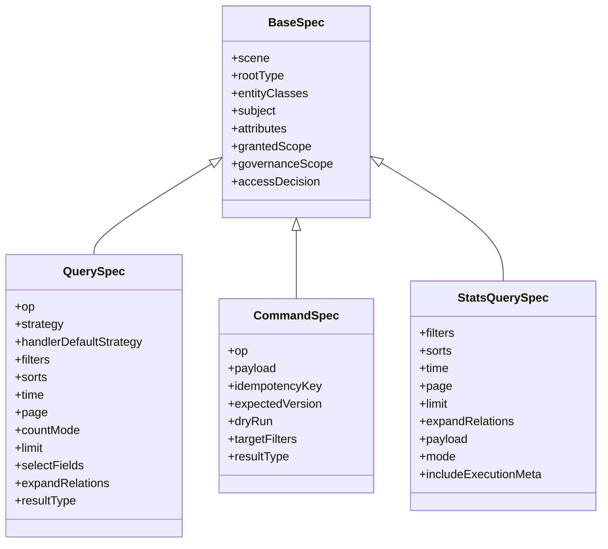
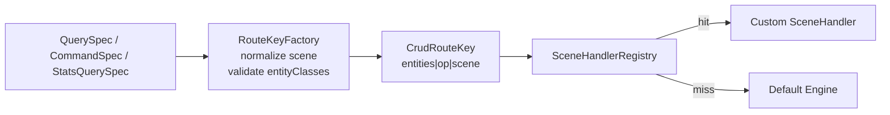
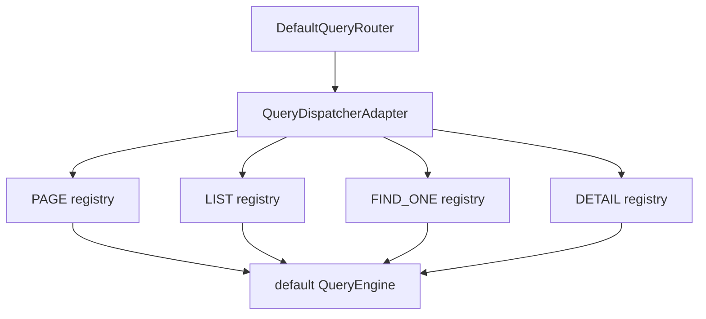
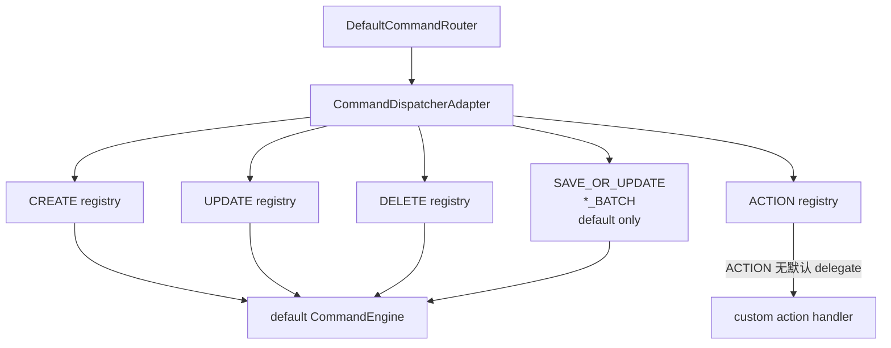
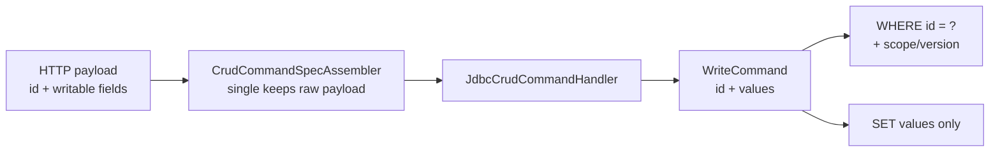
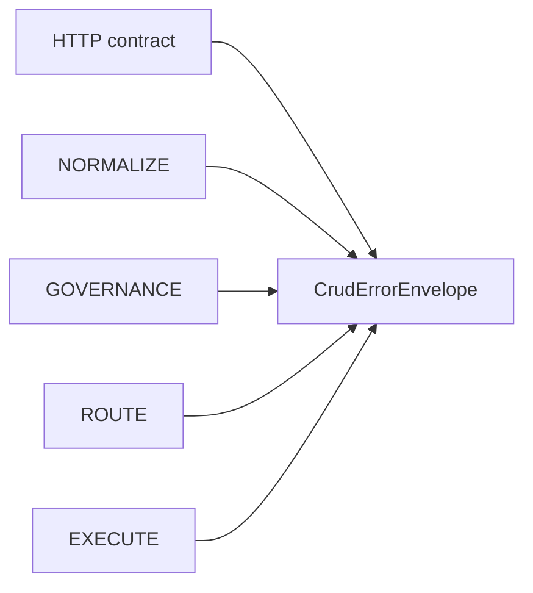
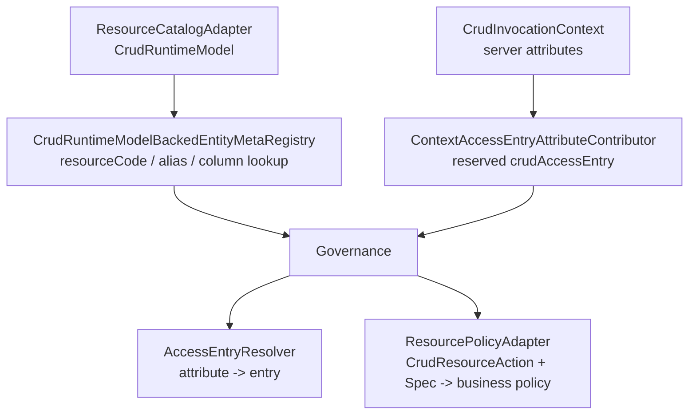

# Query/Command 协议与路由明细

本框架的运行时合同由不可变 `Spec`、`CrudRouteKey` 和 `SceneHandler` 组成。HTTP、SDK 或业务 Controller 最终都要收敛为 `QuerySpec`、`CommandSpec` 或 `StatsQuerySpec`。

## Spec 模型



规则：

- `BaseSpec`、`QuerySpec`、`CommandSpec` 都是不可变对象；迁移期保留的 `setXxx` 会直接抛异常。
- `entityClasses` 首项必须等于 `rootType`。
- `subject` 可由上游传入，也可由 `CrudSubjectResolver` 在治理阶段补齐。
- `attributes` 会先剥离框架保留治理键，再由 `CrudSpecAttributeContributor` 贡献业务属性。
- `QueryExecutionSpec`、`CommandExecutionSpec` 是治理后的执行态副本。
- `StatsQuerySpec` 是 Stats 一等协议，直接继承 `BaseSpec`，不再继承普通 `QuerySpec`，治理后仍返回 `StatsQuerySpec`。

## 操作语义

| 类型 | 操作 | 语义 |
|---|---|---|
| Query | `PAGE` | 分页查询，默认 page=1、limit=10，最大 limit=1000 |
| Query | `LIST` | 列表查询，默认 limit=200，最大 limit=1000 |
| Query | `FIND_ONE` | 允许不存在；0 条返回 `null`，多条抛 `QUERY_NOT_UNIQUE` |
| Query | `DETAIL` | 必须存在；0 条抛 `NOT_FOUND`，多条抛 `QUERY_NOT_UNIQUE` |
| Stats | `STATS` | 聚合查询，走 StatsGateway/StatsQueryEngine |
| Command | `CREATE` | 单表插入，可返回生成主键 |
| Command | `UPDATE` | 单表更新，默认通过 `payload.id` 定位，core 归一为 `WriteCommand(id, values)` |
| Command | `DELETE` | 单表删除或逻辑删除，默认通过 `payload.id` 定位 |
| Command | `SAVE_OR_UPDATE` | 有 id 且存在则更新；无 id 或 id 不存在则创建 |
| Command | `CREATE_BATCH` | 批量新增，HTTP 使用 `payload.items[]` |
| Command | `UPDATE_BATCH` | 批量更新，HTTP 使用 `payload.items[].id` |
| Command | `DELETE_BATCH` | 批量删除，HTTP 使用 `payload.ids[]` 或 `payload.items[].id` |
| Command | `SAVE_OR_UPDATE_BATCH` | 批量保存或更新，HTTP 使用 `payload.items[].id` |
| Command | `ACTION` | 业务动作，必须由自定义 `CommandActionSceneHandler` 处理 |

## routeKey 结构

`CrudRouteKey` 由三段组成：

```text
entityTypeName[>entityTypeName...] | operation | scene
```

示例：

```text
com.example.Order|PAGE
com.example.Order>com.example.OrderItem|PAGE|full
com.example.Order|ACTION|submit
```

构建规则：

- `RouteKeyFactory.normalizeScene(scene)` 会 trim 并转小写；空 scene 归一化为空字符串。
- `RouteKeyFactory.buildQueryRoute(spec)`、`buildCommandRoute(spec)` 和 `buildStatsRoute(spec)` 会按 `entityClasses/rootType` 生成实体段。
- `ACTION` 路由不允许空 scene；默认 Command 引擎也不会处理 `ACTION`。



## Query 路由

`DefaultQueryRouter` 内部使用 `QueryDispatcherAdapter`，按 `PAGE/LIST/FIND_ONE/DETAIL` 分别维护场景注册表。



自定义 Query Handler：

- 实现 `QueryPageSceneHandler`、`QueryListSceneHandler`、`QueryFindOneSceneHandler` 或 `QueryDetailSceneHandler`。
- Spring 启动期 `SceneHandlerRegistrar` 会注册 Bean。
- 如果类上存在 `@EntCrudQueryHandler`，启动期会校验 `entityClasses`、`scenes`、`defaultStrategy` 与 `routeKeys()` 一致。
- Handler 的 `handle(spec, delegate)` 可直接返回，也可调用 `delegate.invoke(modifiedSpec)` 复用默认引擎。

## Command 路由

`DefaultCommandRouter` 内部使用 `CommandDispatcherAdapter`，按 `CREATE/UPDATE/DELETE/ACTION` 分别维护场景注册表；`SAVE_OR_UPDATE` 和显式批量操作直接走默认命令引擎。



自定义 Command Handler：

- `CREATE/UPDATE/DELETE` 场景 Handler 可调用 `delegate.invoke(...)` 继续走默认单表写。
- `SAVE_OR_UPDATE` 与显式批量写暂不提供独立 SceneHandler 注册表，复杂逻辑建议走 `ACTION` 或自定义业务 Handler。
- `ACTION` 场景 Handler 必须提供 `CommandActionContract`，HTTP 组装器会按 contract 把原始 payload 转为目标请求类型。
- `AbstractSimpleActionHandler` 封装了单实体 `ACTION` 的 routeKey、contract 和 `CommandResult.success(...)` 返回。

## Command 写入合同

对外 HTTP 合同使用约定俗成的 `payload.id`。单条 `CREATE/UPDATE/DELETE/SAVE_OR_UPDATE` 会保留原始 payload 给 SceneHandler 使用；进入默认 JDBC handler 后再归一为显式的 `WriteCommand(id, values)`。`id` 只用于定位记录，不能进入更新字段集合。



单条写入：

```json
{
  "payload": {
    "id": 101,
    "orderNo": "ORD-101-UPDATED"
  }
}
```

批量写入保持同构：单条是 `payload.id`，批量就是 `payload.items[].id`。

```json
{
  "payload": {
    "items": [
      { "id": 101, "orderNo": "ORD-101-UPDATED" },
      { "id": 102, "orderNo": "ORD-102" }
    ]
  }
}
```

`targetFilters` 仍在 `CommandSpec` 上保留，但定位为高级目标选择器，用于内部编排、action 或定制代码；普通 `update/delete/saveOrUpdate` 不应把它作为主入口。

## HTTP 合同

默认控制器基础路径：`/api/ent-crud`，可用 `entloom.crud.controller.base-path` 修改。

| 路由 | 请求 DTO | 入口 |
|---|---|---|
| `POST /{entity}/page[/scene]` | `CrudReadHttpRequest` | `QueryGateway.page` |
| `POST /{entity}/list[/scene]` | `CrudReadHttpRequest` | `QueryGateway.list` |
| `POST /{entity}/findOne[/scene]` | `CrudReadHttpRequest` | `QueryGateway.findOne` |
| `POST /{entity}/detail[/scene]` | `CrudReadHttpRequest` | `QueryGateway.detail` |
| `POST /{entity}/stats[/scene]` | `CrudStatsHttpRequest` | `StatsGateway.stats` |
| `POST /{entity}/create[/scene]` | `CrudCommandHttpRequest` | `CommandGateway.action` |
| `POST /{entity}/update[/scene]` | `CrudCommandHttpRequest` | `CommandGateway.action` |
| `POST /{entity}/delete[/scene]` | `CrudCommandHttpRequest` | `CommandGateway.action` |
| `POST /{entity}/saveOrUpdate[/scene]` | `CrudCommandHttpRequest` | `CommandGateway.action` |
| `POST /{entity}/createBatch[/scene]` | `CrudCommandHttpRequest` | `CommandGateway.action` |
| `POST /{entity}/updateBatch[/scene]` | `CrudCommandHttpRequest` | `CommandGateway.action` |
| `POST /{entity}/deleteBatch[/scene]` | `CrudCommandHttpRequest` | `CommandGateway.action` |
| `POST /{entity}/saveOrUpdateBatch[/scene]` | `CrudCommandHttpRequest` | `CommandGateway.action` |
| `POST /{entity}/action/{scene}` | `CrudCommandHttpRequest` | `CommandGateway.action` |

HTTP 请求合同由 `RequestContractValidator` 统一校验：

- `scene` 只能来自 URL 路径，`options.scene` 会被拒绝。
- `options.sortExpression` 已移除，会被拒绝。
- 未显式建模的 `options.*` 和顶层字段会被拒绝。
- read/stats 当前仍保留 `filter`、`filters`、`filterMap`、`filterList`、`sort`、`sorts`，后续是否收敛以 远期增强 计划为准。

## 错误信封

失败响应会保留顶层 `code/message/requestId/traceId/op`，同时提供结构化 `error`，方便前端展示、日志检索和问题定位。

```json
{
  "success": false,
  "code": "ROUTE_NOT_FOUND",
  "message": "未找到查询路由: com.example.Order|PAGE|missing",
  "requestId": "req-1",
  "traceId": "trace-1",
  "op": "PAGE",
  "error": {
    "code": "ROUTE_NOT_FOUND",
    "message": "未找到查询路由: com.example.Order|PAGE|missing",
    "stage": "ROUTE",
    "routeKey": "com.example.Order|PAGE|missing",
    "requestId": "req-1",
    "traceId": "trace-1",
    "reason": "ROUTE_NOT_FOUND"
  },
  "data": null,
  "meta": {}
}
```



阶段语义：

| stage | 含义 |
|---|---|
| `HTTP_CONTRACT` | HTTP DTO、options、顶层字段、请求合同校验失败 |
| `NORMALIZE` | Gateway 请求快照或 op 规范化失败 |
| `GOVERNANCE` | subject、attribute、permission、data scope 治理失败 |
| `ROUTE` | 显式 scene 路由未命中或路由冲突 |
| `EXECUTE` | 默认引擎或 SceneHandler 执行失败 |
| `UNKNOWN` | 非框架异常且无法归类 |

## Business Adapter SPI

业务系统可以通过框架级 adapter 接入既有资源目录、访问入口和策略体系，不需要再复制默认反射 registry 或在权限/数据范围解析器里重复做 resourceCode 桥接。



落地规则：

- Spring 默认 `EntityMetaRegistry` 只消费 `ResourceCatalogAdapter.runtimeModel()`，合并后构建 `CrudRuntimeModelBackedEntityMetaRegistry`；没有 adapter bean 时启动失败。
- `CrudRuntimeModelBackedEntityMetaRegistry` 会索引 `ResourceDescriptor.resourceCode` 与 aliases，并提供按数据库列名反查字段名的能力，适合业务数据范围把 column policy 转为字段 policy。
- `crudAccessEntry` 只能从服务端 `CrudInvocationContext` 注入；HTTP `options.crudAccessEntry` 会被合同校验拒绝。
- `ResourcePolicyAdapter` 只负责把框架动作映射为业务策略对象，权限判定和数据范围收窄仍分别由 `CrudPermissionService`、`CrudDataScopeResolver` 执行。
