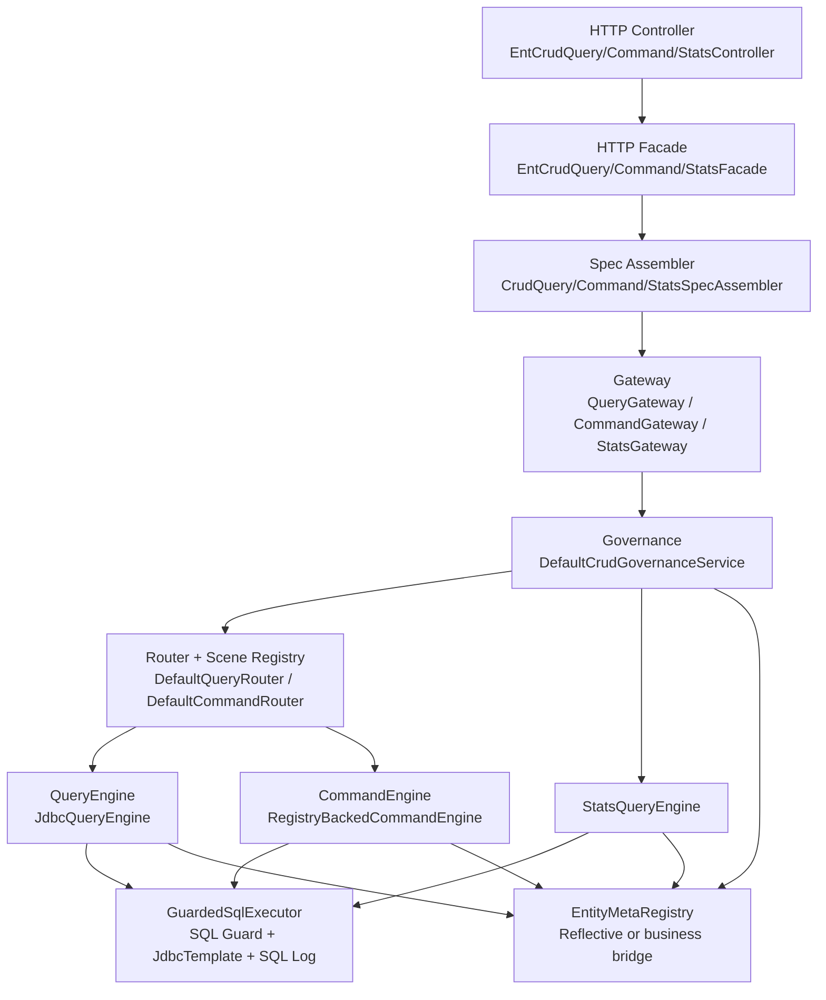
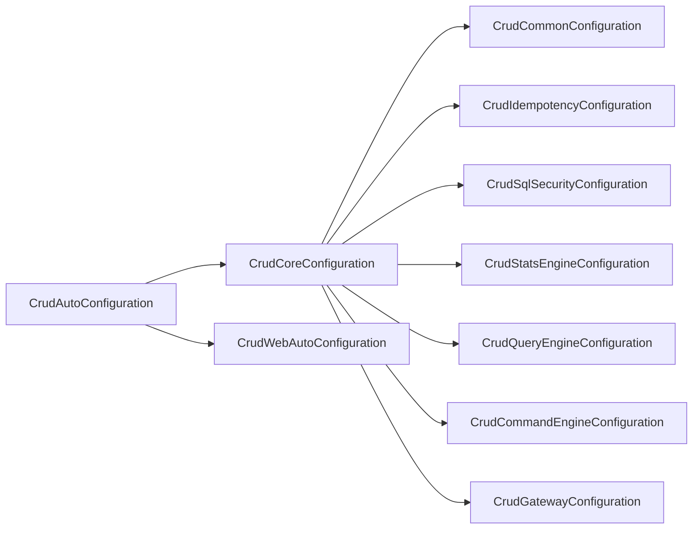
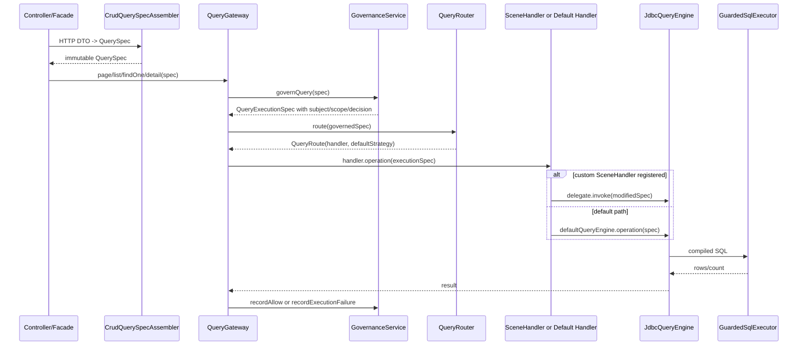
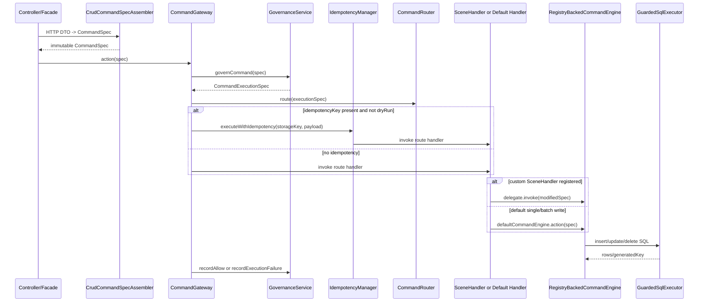

# 总体架构总览

`ent-loom-crud` 的当前实现是一条“统一网关 + 治理主链 + 可截获路由 + 默认 JDBC 引擎”的 CRUD 主链。框架把普通单表 CRUD、ROOT_FIRST 关系读、Stats 聚合、业务场景 Handler、权限治理、SQL 安全和 Spring Boot HTTP 接入收敛到同一套 Spec 与 routeKey 上。

## 分层结构

## Spring 装配入口

`CrudAutoConfiguration` 导入 `CrudCoreConfiguration` 和 `CrudWebAutoConfiguration`。核心配置再按依赖顺序导入公共能力、幂等、安全、Stats、Query、Command 和 Gateway。

关键 Bean：

| Bean | 默认实现 | 可替换点 |
|---|---|---|
| `EntityMetaRegistry` | `CrudRuntimeModelBackedEntityMetaRegistry` | 业务提供 `ResourceCatalogAdapter` / `CrudRuntimeModel` |
| `CrudSubjectResolver` | `FailClosedCrudSubjectResolver` | 业务必须替换为登录态解析 |
| `CrudPermissionService` | `RuleBasedCrudPermissionService` | 业务可替换为角色/策略实现 |
| `CrudDataScopeResolver` | `DefaultCrudDataScopeResolver` | 业务可替换为组织/学校/班级/学生范围 |
| `CrudGovernanceAuditRecorder` | logging + optional JDBC | 业务可替换审计落库/日志 |
| `QueryEngine` | `JdbcQueryEngine` | 可替换查询引擎 |
| `CommandEngine` | `RegistryBackedCommandEngine` | 可替换命令引擎 |
| `StatsQueryExecutor` | `JdbcStatsQueryExecutor` | 可替换 Stats 执行器 |

## 一次 Query 调用

## 一次 Command 调用

## 当前能力边界

| 能力 | 当前实现 |
|---|---|
| 单表 Query | `PAGE/LIST/FIND_ONE/DETAIL` 已实现 |
| 单表 Command | `CREATE/UPDATE/DELETE/SAVE_OR_UPDATE` 和显式批量已实现，`ACTION` 必须定制 |
| 关系 Query | `ROOT_FIRST` 一跳/有限路径展开，默认不做 join 过滤/排序 |
| Stats | 单表指标、分组、having、分页/list/scalar 已实现 |
| 治理 | 主体解析、权限判定、数据范围交集、审计闭环已实现 |
| SQL 安全 | 字段白名单、参数规模限制、执行前占位符检查、SQL 日志已实现 |
| HTTP | 默认 Starter Controller 可开关；业务也可复用 Facade 自建 Controller |
