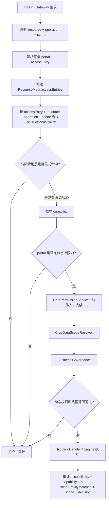

# Scene Policy 治理边界定稿

更新时间：2026-04-27

适用范围：`ent-loom-crud` 中 Query、Command、Stats 以及业务 `ACTION` 场景的能力点声明、入口上限和治理上下文。

## 1. 定稿结论

`ScenePolicy` 应进入 `ent-loom-crud` 框架体系，但必须保持框架抽象。框架只定义“资源场景能力点”的元数据，不定义具体业务角色、端名称或德育规则。

建议框架注解命名为：

```java
@EntCrudScenePolicy
```

它负责声明：

- `accessEntry + resource + operation + scene` 的稳定能力点。
- `capability` 的默认推导规则。
- `portals` 静态入口上限。
- 治理和审计需要的稳定维度。

其中 `accessEntry + resource + operation + scene` 是 ScenePolicy registry 的唯一查找键；`capability` 不是 key，而是该场景对应的业务权限码。一个 key 在 当前版本只解析出一个 capability；多个 key 可以复用同一个 capability。

它不负责声明：

- 教师是否真正能执行。
- 家长是否绑定学生。
- 学校管理员是否在本校范围内。
- 德育职务权限、时间窗、状态流转、业务例外。

这些应由业务侧的 `CrudPermissionService`、`CrudDataScopeResolver`、`BusinessAccessEntryGovernance` 或业务 Handler 校验承接。

落地按最小可用优先推进：第一阶段先补稳定能力点、`ACTION/IMPORT/EXPORT` 拒绝兜底、可信 portal 来源和审计关键字段。`STATS` 只允许普通低风险统计按白名单继承查询能力。

### 1.1 与 ResourceMeta 的联合定稿口径

`ResourceMeta + ResourceAccessProfile + EntCrudScenePolicy + Business Governance` 组合，是 business v2 桥接 `ent-loom-crud` 时的推荐治理实践。

这套组合的目标是把资源默认边界、场景能力点、静态入口上限、动态业务规则和数据范围拆到各自合适的位置：

| 层级 | 解决的问题 | 不应承载 |
| --- | --- | --- |
| `ResourceMeta` | 资源事实元数据、默认 CRUD 边界、角色动作上限、业务入口 | 复杂 scene/action/stats/import/export 规则 |
| `ResourceAccessProfile` | business v2 适配层的资源访问模板 | 框架 core 概念、具体业务规则 |
| `EntCrudScenePolicy` | `accessEntry + resource + operation + scene` 能力点、默认 `capability`、静态 `portal` 上限 | 教师、家长、学校、德育等业务语义 |
| `Business Governance` | 当前主体、当前端、当前数据是否真的允许执行 | 框架通用场景元数据 |
| `CrudDataScopeResolver / Contributor` | 数据范围底线和业务收窄条件 | 通过调用方筛选放宽授权范围 |

联合原则：

1. 默认 CRUD 路由优先由 `ResourceMeta`、`ResourceAccessProfile`、`accessEntry` 和数据范围治理。
2. `EntCrudScenePolicy` 是例外和高风险能力的显式边界，不是替代 `ResourceMeta` 的全量动作表。
3. 普通低风险派生读场景可以按约定继承查询能力，但不包含 `EXPORT`；高风险、多端差异、专用能力或 `ACTION/IMPORT/EXPORT` 场景必须显式声明。
4. `ACTION` 不继承 `CREATE/UPDATE/DELETE`。`submit/revoke/approve` 等业务动作必须有独立 `operation + scene + capability` 语义。
5. `portal` 和 `accessEntry` 必须区分：`accessEntry` 表示业务入口，例如 `moral`；`portal` 表示端入口静态上限，例如 `teacher.moral`、`admin.school`。
6. 最终权限必须同时经过 `portal + accessEntry + resource + operation + scene + capability + subject + scope + business rule` 判断。

### 1.2 与 ResourceMeta 的统一执行模型

`EntCrudScenePolicy` 不单独决定授权。它进入统一治理链后，只负责把请求变成稳定、可审计、可匹配端入口上限的能力点。

统一顺序：

1. 服务端解析可信 `portal`、`accessEntry`、`resource`、`operation`、`scene`。
2. 校验 `ResourceMeta.accessEntries`，确认当前业务入口可以使用该资源。
3. 查找 ScenePolicy registry，唯一键为 `accessEntry + resource + operation + scene`。先精确匹配当前 `accessEntry`，再匹配未限定 `accessEntry` 的通用策略；通用策略只能在资源入口已通过校验后兜底，不能扩大入口。
4. `ACTION/IMPORT/EXPORT` 必须命中显式 ScenePolicy；高风险 `STATS` 必须命中显式 ScenePolicy；普通低风险 `STATS` 必须进入显式白名单后才可继承 `QUERY`。
5. 推导或读取规范化后的 `capability`，并校验 `portals` 静态入口上限。普通 CRUD 即使没有 ScenePolicy，也必须生成稳定 capability 供审计和业务入口治理使用。
6. 进入 `CrudPermissionService`、`CrudDataScopeResolver` 和 Business Governance。
7. 审计 `resource/operation/scene/accessEntry/capability/portal/scenePolicyMatched/decision/reason/scope`。

因此，ScenePolicy 阶段必须位于 `CrudPermissionService` 之前。旧的 `ACTION` scene 名称映射、角色动作判断和业务动态治理都不能替代 ScenePolicy 命中检查。

动作入口门禁定稿：

| 场景 | 默认行为 |
| --- | --- |
| 普通 CRUD | 不要求 ScenePolicy，按 `ResourceMeta` 的角色动作、入口和数据范围治理。 |
| `ENTRY_GOVERNED` CRUD | 允许由业务 capability 显式打开低权限主体访问，但必须命中 `accessEntry`、业务治理和数据范围。 |
| `ACTION` | 不继承 CRUD，未注册 ScenePolicy 直接拒绝。 |
| `IMPORT` | 不继承 `CREATE`，未注册 ScenePolicy 直接拒绝。 |
| `EXPORT` | 不继承 `QUERY`，未注册 ScenePolicy 直接拒绝。 |
| `STATS` | 普通低风险统计可白名单继承 `QUERY`；高风险、多端差异或专用能力必须注册 ScenePolicy。 |

一句话结论：

```text
ResourceMeta 管资源默认边界；
ScenePolicy 管例外和高风险场景能力点；
Business Governance 管当前人当前数据能不能真的做；
DataScope 保证所有请求筛选只能收窄，不能放宽。
```

## 2. 为什么不只靠 ResourceMeta

`ResourceMeta` 适合描述资源默认边界，例如主键、范围字段、角色基础动作和业务入口。

但以下能力不适合塞进 `ResourceMeta`：

- `/action/{scene}`：如 `submit`、`revoke`、`approve`。
- `/stats/{scene}`：如排行榜、汇总统计。
- 导入、导出等高风险派生动作。
- 同一个资源下多个语义完全不同的场景。
- 多端静态可见性差异，例如教师端可见、家长端不可见。

因此应拆分职责：

| 组件 | 职责 |
| --- | --- |
| `ResourceMeta` | 资源默认边界、范围字段、基础动作上限。 |
| `ResourceAccessProfile` | 业务适配层的常见资源类型模板，减少重复配置；不属于 `ent-loom-crud` core。 |
| `EntCrudScenePolicy` | 非默认 scene/action/stats/import/export 的能力点和静态入口上限。 |
| `CrudPermissionService` | 角色、能力点、入口的权限判定。 |
| `CrudDataScopeResolver` | 数据范围底线。 |
| 业务 Governance | 职务权限、端规则、时间窗、状态机等动态判断。 |

## 3. 约定优先，例外显式声明

`EntCrudScenePolicy` 不应变成“每个 scene 都必须写一条”的全量清单。最佳实践是先用框架约定和资源 profile 覆盖大部分标准场景，只有例外、高风险或多端差异明确的场景才显式声明。

推荐原则：

```text
标准 CRUD 路由：由 ResourceMeta / ResourceAccessProfile 覆盖。
派生读场景：普通低风险读场景可按白名单继承查询能力，必要时显式声明。
派生写场景：当前版本不做隐式继承；除默认 CRUD 路由别名归一化外，写类派生场景必须显式声明。
ACTION：默认不继承 CRUD，必须显式声明 scene/capability。
IMPORT/EXPORT：默认不继承 CRUD，必须显式声明 scene/capability。
多端差异：需要 portals 静态上限时显式声明。
高风险场景：import/export/revoke/submit/approve 等显式声明。
```

当前版本默认继承要更保守：

- `ACTION` 未注册 `EntCrudScenePolicy` 时直接拒绝，不再根据 scene 名称推断 `CREATE/DELETE`。
- `IMPORT/EXPORT` 未注册 `EntCrudScenePolicy` 时直接拒绝，不继承 `CREATE/QUERY`。
- `STATS` 只有普通汇总、无多端差异、无专用能力时才允许继承查询能力。
- 除 `/create`、`/update`、`/delete` 这类默认 CRUD 路由外，写类派生场景不得通过基础写动作隐式放行。
- 需要多端静态上限的能力点必须写 `portals`，否则不做端隔离声明。

默认映射建议：

| 路由/场景 | 默认治理来源 | 是否需要 `EntCrudScenePolicy` |
| --- | --- | --- |
| `/list`、`/page`、`/detail`、`/findOne` | `ResourceMeta` 的查询动作和数据范围 | 通常不需要 |
| `/create`、`/update`、`/delete` | `ResourceMeta` 的基础写动作和数据范围 | 通常不需要 |
| `/stats/{scene}` | 白名单继承查询能力 | 普通低风险统计可不写；高风险、多端差异或专用能力要写 |
| `/export/{scene}` | 不继承查询能力 | 必须显式声明 |
| `/import/{scene}` | 不继承新增能力 | 必须显式声明 |
| `/action/{scene}` | 不继承 CRUD | 必须显式声明 |

### 3.1 最小闭环运行契约

当前版本按以下规则实现，优先保证高风险场景 fail-closed、能力点稳定和审计可追溯。

#### 3.1.1 registry 匹配顺序

ScenePolicy registry 的最终策略解析顺序：

1. 精确匹配 `accessEntry + resource + operation + scene`。
2. 未命中精确策略时，当前 `accessEntry` 已通过 `ResourceMeta.accessEntries` 校验后，再匹配策略 `accessEntries` 为空的通用策略。
3. 同一请求只能得到一条最终策略；同一匹配层级内多条命中时，启动期或首次解析时失败。

`accessEntries` 为空的 ScenePolicy 只表示“跟随资源已允许的入口”，不表示资源对所有入口开放。`base` 只作为默认 CRUD 的内置入口；高风险场景若要支持 `base`，必须由框架和业务侧显式确认。

当前版本额外收紧：

1. `ACTION/IMPORT/EXPORT` 和高风险 `STATS` 原则上必须显式声明 `accessEntries`，避免资源新增入口后被通用策略自动覆盖。
2. 只有确认跨入口语义完全一致、无端差异、无专用能力的低风险策略，才允许 `accessEntries` 为空。
3. 空 `accessEntries` 策略必须在启动期或首次解析时记录为通用策略，审计中能区分 `scenePolicyAccessEntry=generic` 和精确入口策略。
4. 资源新增 `ResourceMeta.accessEntries` 时，必须复核该资源下所有通用 ScenePolicy 是否仍适用于新增入口。

#### 3.1.2 默认 CRUD capability

普通 CRUD 不要求注册 ScenePolicy，但治理上下文必须得到稳定 capability。

规范化规则：

| 路由 | operation | scene |
| --- | --- | --- |
| `/list`、`/page` | `QUERY` | `list` |
| `/detail`、`/findOne` | `QUERY` | `detail` |
| `/create` | `CREATE` | `create` |
| `/update` | `UPDATE` | `update` |
| `/delete` | `DELETE` | `delete` |

默认 capability：

```text
accessEntry + "." + resourceCode + "." + operation + "." + scene
```

普通资源默认 CRUD 仍由 ResourceMeta 角色动作上限授权，capability 主要用于审计和后续收窄。`ENTRY_GOVERNED` 资源允许业务侧用该 capability 显式打开低权限主体访问，但必须由业务治理和数据范围继续判定，框架不直接根据 capability 放行。

#### 3.1.3 ENTRY_GOVERNED 打开约束

`ENTRY_GOVERNED` 是默认 CRUD 中唯一允许“低权限角色动作关闭，但由业务入口 capability 打开”的资源模型。

当前版本如果尚未实现 `ResourceAccessProfile` 运行时推导，必须维护一张精确资源白名单，至少包含：

- `resourceCode`。
- 允许的 `accessEntry`。
- 可被入口 capability 打开的默认 CRUD operation/scene。
- 必需的数据范围字段，例如 `schoolId/classId/studentId`。
- 业务治理实现类或规则标识。
- 负责人和迁移/复核说明。

只有命中该白名单或运行时明确识别为 `ENTRY_GOVERNED` 的资源，才允许进入入口 capability 打开逻辑。`teacher = {}`、`accessEntries` 命中、请求参数包含 `schoolId` 都不能单独触发该放行路径。

审计必须记录 `entryCapabilityOverride=true`、资源归类来源、最终 capability、scope 和业务治理放行原因。未命中资源归类或白名单时，应按普通默认 CRUD 的角色动作上限处理并拒绝低权限访问。

#### 3.1.4 STATS 白名单

普通低风险 `STATS` 继承 `QUERY` 必须进入显式白名单，白名单 key 为：

```text
accessEntry + resource + STATS + scene
```

白名单必须是可扫描、可审计的配置或代码 registry，不能分散在 Handler 内部用临时 if 判断。启动期或首次解析时必须能按 key 精确查到白名单条目。

白名单条目至少包含继承来源 capability、风险说明、负责人和复核说明。默认继承来源为：

```text
accessEntry + "." + resourceCode + ".QUERY.list"
```

命中白名单时，治理上下文记录：

```text
scenePolicyMatched=false
statsWhitelistMatched=true
inheritedFrom=QUERY
capability=<继承来源 capability>
```

未命中白名单且未注册 ScenePolicy 的 `STATS` 默认拒绝。`EXPORT` 不允许通过 STATS 白名单或 QUERY 继承间接放行。

白名单治理要求：

1. 白名单 key 必须是 `accessEntry + resource + STATS + scene`，不能只按 scene 名称匹配。
2. 条目必须声明“无导出语义、无多端差异、无专用能力、无敏感聚合”的低风险结论。
3. 条目必须记录负责人、复核说明和迁移目标；临时迁移条目还必须记录截止说明。
4. 同一个 stats 场景如果后续出现端差异、专用能力、敏感聚合或导出语义，必须移出白名单并注册显式 ScenePolicy。
5. 白名单命中也必须进入统一审计，不能被当作普通 `QUERY.list` 静默放行。

示例：普通列表查询不需要 scene policy。

```text
BusPosition + QUERY.list
```

由 `ResourceMeta`、`ResourceAccessProfile`、`accessEntry` 和数据范围共同治理。

示例：业务撤销动作必须声明。

```java
@EntCrudScenePolicy(
    value = MoralSceneCodes.BusMoralRecordBatch.Command.REVOKE,
    operation = EntCrudSceneOperation.ACTION,
    accessEntries = {"moral"}
)
```

这个声明是完整性的一环：它不负责最终授权，但负责把 `revoke` 变成稳定、可审计、可被 portal 上限和 capability 治理识别的能力点。

示例：普通低风险 stats 可进入白名单后继承查询能力；当它存在端差异或专用能力时必须声明。

```java
@EntCrudScenePolicy(
    value = MoralSceneCodes.BusMoralRecordLine.Stats.TEACHER_STUDENT_RANK,
    operation = EntCrudSceneOperation.STATS,
    portals = {MoralPortalCodes.TEACHER_MORAL}
)
```

一句话原则：

```text
ScenePolicy 是例外和高风险能力的显式边界，不是替代 ResourceMeta 的全量动作表。
```

## 4. 建议注解形态

```java
@Retention(RetentionPolicy.RUNTIME)
@Target({ElementType.TYPE, ElementType.ANNOTATION_TYPE})
@Repeatable(EntCrudScenePolicies.class)
public @interface EntCrudScenePolicy {
    /**
     * 资源 code。标在资源类型上时可为空，由框架推导；标在 Handler / Action 类型上时必须填写。
     */
    String resource() default "";

    /**
     * scene 稳定 code。
     */
    String value();

    /**
     * 技术操作类型。
     */
    EntCrudSceneOperation operation();

    /**
     * 业务能力码。为空时由框架按 accessEntry/resource/operation/scene 推导。
     */
    String capability() default "";

    /**
     * 适用的业务入口。为空表示跟随 ResourceMeta.accessEntries，作为该资源的通用场景策略。
     */
    String[] accessEntries() default {};

    /**
     * 静态入口上限。框架只按字符串比较，不理解业务含义。
     */
    String[] portals() default {};
}
```

`EntCrudSceneOperation` 建议作为框架通用枚举：

```java
public enum EntCrudSceneOperation {
    QUERY,
    CREATE,
    UPDATE,
    DELETE,
    STATS,
    IMPORT,
    EXPORT,
    ACTION
}
```

说明：

- `value` 是路由场景名，优先复用业务已有 scene 常量。
- `resource` 只有在无法从资源类型推导时才填写，典型场景是标在 Handler 或 Command Action 上。
- `capability` 默认不手写，由框架推导。
- `accessEntries` 用于同一资源同一 scene 在不同业务入口下存在不同能力或端上限的情况。
- `portals` 是静态入口上限，不是最终授权。
- `portals` 用 `String[]`，不放框架枚举，避免框架依赖具体业务端。

## 5. capability 推导规则

`capability` 的定位是业务权限码，不是 ScenePolicy registry key。

默认规则：

```text
capability = accessEntry + "." + resourceCode + "." + operation + "." + scene
```

推导使用请求上下文中的实际 `accessEntry`。当 `EntCrudScenePolicy.accessEntries` 为空时，同一个策略可服务多个入口，但 capability 仍按当前入口分别生成。

规范化要求：

- `operation` 使用 `EntCrudSceneOperation` 枚举名，统一大写。
- `scene` 使用治理链解析后的稳定 scene，不使用未归一化的路由别名。
- 默认 CRUD 必须按 `/list`、`/page` 归一到 `QUERY.list`，`/detail`、`/findOne` 归一到 `QUERY.detail`。
- 自定义 `ACTION/IMPORT/EXPORT/STATS` 使用显式 scene 常量；兼容旧接口时，可以用 `capability` 覆盖能力码，但 registry key 仍必须稳定。
- capability 一旦进入权限配置或审计，不应因为路由别名、大小写或旧接口迁移发生漂移。

示例：

```java
@EntCrudScenePolicy(
    value = MoralSceneCodes.BusMoralRecordBatch.Command.REVOKE,
    operation = EntCrudSceneOperation.ACTION,
    accessEntries = {"moral"},
    portals = {
        MoralPortalCodes.TEACHER_MORAL,
        MoralPortalCodes.SCHOOL_ADMIN
    }
)
```

若请求上下文为：

```text
accessEntry = moral
resourceCode = BusMoralRecordBatch
operation = ACTION
scene = revoke
```

则默认能力码为：

```text
moral.BusMoralRecordBatch.ACTION.revoke
```

只有以下情况才显式覆盖 `capability`：

- 多个 scene 共享同一个业务能力。
- 外部路由 scene 为兼容旧接口不能改名，但内部能力码需要规范化。
- 一个 scene 内部需要拆成更细能力。
- 能力码需要跨资源统一。

当前约束：

1. 一个 ScenePolicy key 只产生一个 capability。
2. 多个 ScenePolicy key 可以复用一个 capability。
3. 不在 `EntCrudScenePolicy` 上表达“一个 key 需要多个 capability”的组合关系。
4. 复杂组合判断，例如“有撤销权限且满足超窗例外权限”，放到 Business Governance。
5. 角色、职务、岗位等主体权限模型只授予 capability，不直接授予 ScenePolicy key。

可以理解为：

```text
请求 -> 命中 ScenePolicy key
ScenePolicy key -> 解析 capability
角色/职务/岗位 -> 拥有哪些 capability
Business Governance -> 当前 capability + 当前数据 + 当前规则 是否允许
```

示例：

```java
@EntCrudScenePolicy(
    value = MoralSceneCodes.BusMoralRecordBatch.Command.REVOKE,
    operation = EntCrudSceneOperation.ACTION,
    accessEntries = {"moral"},
    capability = MoralCapabilityCodes.Record.REVOKE
)
```

## 6. portal 的定位

`portals` 表达静态入口上限，而不是最终权限。

```java
@EntCrudScenePolicy(
    value = MoralSceneCodes.BusMoralRecordBatch.Command.REVOKE,
    operation = EntCrudSceneOperation.ACTION,
    portals = {
        MoralPortalCodes.TEACHER_MORAL,
        MoralPortalCodes.SCHOOL_ADMIN
    }
)
```

定稿语义：

- 教师德育端、学校管理端最多可以进入后续治理。
- 家长端、其他端静态拒绝。
- 教师是否能撤销，仍由德育职务权限、撤销范围、时间窗和目标数据范围决定。
- 学校管理员是否能撤销，仍要受学校范围、资源策略和业务规则约束。

建议业务端入口使用字符串常量：

```java
public interface MoralPortalCodes {
    String TEACHER_MORAL = "teacher.moral";
    String PARENT_MORAL = "parent.moral";
    String SCHOOL_ADMIN = "admin.school";
    String PLATFORM_ADMIN = "admin.platform";
}
```

框架只保存和比较字符串，不对端含义做解释。

当前版本必须先定义可信来源：

- `portal` 不从请求 body 或普通 query 参数直接采信。
- 推荐由网关、登录态解析器或服务端 controller 根据当前入口写入治理上下文。
- 当 `EntCrudScenePolicy.portals` 非空但无法解析可信 `portal` 时，按静态入口不匹配拒绝。
- 当 `portals` 为空时，表示该能力点不做静态端上限，继续进入后续权限和数据范围治理。

最小实现建议：

1. 框架定义标准 `portal` 属性键和解析器。
2. business v2 Controller 或入口适配器根据服务端入口写入 `portal`，例如德育教师端写入 `teacher.moral`。
3. `portal` 解析失败时不回退到请求参数。
4. 测试覆盖 `portals` 非空且缺少可信 `portal` 的拒绝路径。

## 7. 治理链位置



顺序建议：

1. 解析 `resource + operation + scene`。
2. 解析可信 `portal + accessEntry`。
3. 校验 `accessEntry` 和资源入口。
4. 查找 ScenePolicy registry。
5. 解析或推导 `capability`。
6. 校验 `portal` 静态上限。
7. 校验角色动作或入口 capability。
8. 计算数据范围。
9. 进入业务动态治理。
10. 执行 Handler 或默认引擎。
11. 审计。

当前治理链可以先做五件事：

1. 在治理前段解析 `accessEntry + resource + operation + scene` 并查 registry。
2. 对 `ACTION/IMPORT/EXPORT` 要求必须命中 scene policy，未命中直接拒绝并审计。
3. 对高风险 `STATS` 要求命中 scene policy；普通低风险统计必须进入白名单后才可继承 `QUERY`。
4. 对命中的 scene policy 推导 `capability`，校验可信 `portal`。
5. 审计记录 `accessEntry/capability/portal/scenePolicyMatched`，业务动态规则仍由现有治理组件承接。

最小闭环不要求第一阶段实现通用 `/import`、`/export` 路由；如果导入导出暂时仍由业务 Controller 承接，该 Controller 必须主动调用同一套 ScenePolicy/Governance 校验，否则导入导出不算进入统一治理链。

框架应提供一个可复用的统一治理入口，供 ent-crud 路由和独立业务 Controller 调用。调用方必须传入可信 `portal/accessEntry/resource/operation/scene` 以及请求筛选或目标 id；治理入口必须返回 capability、portal 判定、scenePolicyMatched、scope 和拒绝原因。独立 Controller 没有治理结果时，不允许只靠旧角色判断、方法级注解或请求参数继续执行。

独立 Controller 接入是最小闭环验收项：

1. 没有治理结果或治理结果为拒绝时，Controller 必须停止执行。
2. 测试必须覆盖缺少可信 `portal/accessEntry`、未命中 ScenePolicy、scope 超界和 Business Governance 拒绝。
3. 审计必须能区分调用来源是 ent-crud 通用路由还是独立 Controller。
4. 历史接口短期豁免必须进入迁移白名单，并记录负责人和截止说明。

## 8. ACTION 不继承 CRUD

`ACTION` 不应默认继承 `CREATE/UPDATE/DELETE`。业务动作通常有独立语义。

反例：

```java
@ResourceScene(name = "revoke", operation = ACTION, requires = DELETE)
```

问题：

- `DELETE` 表示删除资源本身。
- `revoke` 表示撤销业务事实或业务状态。
- 能删除配置，不代表能撤销点评。
- 能撤销本人记录，不代表能删除记录。
- 撤销可能有时间窗、范围、状态和超窗例外。

推荐：

```java
@EntCrudScenePolicy(
    value = MoralSceneCodes.BusMoralRecordBatch.Command.REVOKE,
    operation = EntCrudSceneOperation.ACTION,
    accessEntries = {"moral"}
)
```

由 `capability` 和业务治理表达撤销能力，不绑定 `DELETE`。

兼容迁移要求：

1. 现有按 scene 末尾词推断 `submit -> CREATE`、`revoke -> DELETE` 的逻辑只能作为短期迁移白名单存在。
2. 白名单必须按 `accessEntry + resource + operation + scene` 精确列出，并带迁移截止说明。
3. 新增 `ACTION` 禁止进入白名单，必须注册 `EntCrudScenePolicy`。
4. 白名单命中也要审计 `scenePolicyMatched=false`，避免误以为已经完成治理改造。
5. 白名单判断必须发生在 ScenePolicy 阶段，不能隐藏在 `CrudPermissionService` 的动作映射里。

Operation 基础能力关系：

| Operation | 默认能力关系 |
| --- | --- |
| `QUERY` | 基础查询能力。 |
| `CREATE` | 基础新增能力。 |
| `UPDATE` | 基础修改能力。 |
| `DELETE` | 基础删除能力。 |
| `STATS` | 普通低风险统计可白名单继承查询能力，高风险统计必须显式声明。 |
| `EXPORT` | 不继承查询能力，必须显式声明。 |
| `IMPORT` | 不继承新增能力，必须显式声明。 |
| `ACTION` | 默认不继承 CRUD，必须注册 scene/capability。 |

## 9. 多端权限如何落地

`EntCrudScenePolicy.portals` 只解决“这个能力点最多允许哪些端进入”。

最终权限仍需按以下维度判断：

```text
portal + accessEntry + resource + operation + scene + capability + subject + scope + business rule
```

典型判断：

| 主体/端 | 静态 portal | 动态治理 |
| --- | --- | --- |
| 教师德育端 | `teacher.moral` 命中后继续 | 任教范围、德育职务权限、view/edit/revoke/evaluate scope、时间窗。 |
| 家长德育端 | 未配置则静态拒绝 | 若配置，则必须按绑定学生范围治理。 |
| 学校后台 | `admin.school` 命中后继续 | 学校范围、管理员角色动作、业务规则。 |
| 平台后台 | `admin.platform` 命中后继续 | 平台 explicitAll、审计和高危动作控制。 |

一句话原则：

```text
ScenePolicy 定义能力点和端入口上限；
Business Governance 决定当前主体是否真的能执行；
DataScope 决定最多碰到哪一圈数据；
Audit 固化 accessEntry、capability、scope、decision 和 reason。
```

## 10. 与现有 Scene Handler 的关系

现有 `EntCrudQueryHandler`、`EntCrudCommandAction` 和各类 `SceneHandler` 负责路由与执行。

`EntCrudScenePolicy` 负责治理元数据。

两者可以共存：

- Handler 声明“我能处理什么 scene”。
- ScenePolicy 声明“这个 scene 的能力码、端入口上限和审计维度是什么”。
- 没有 ScenePolicy 的普通 CRUD 继续走默认资源策略。
- 高风险 `ACTION/import/export/stats` 建议逐步补 ScenePolicy。
- Handler 必须消费治理链输出的 scope 约束；请求筛选只能与 scope 取交集，不能在 Handler 内重新扩大。

挂载位置定稿：

- 标在资源类型上：`resource` 可为空，由框架按资源类型推导。
- 标在 Handler、`EntCrudCommandAction` 或其他执行类型上：必须填写 `resource`，否则启动失败。
- 同一个 `accessEntry + resource + operation + scene` 只能解析到一条最终策略；多条命中时启动失败，避免运行时随机选择。

Handler 执行契约：

1. 默认引擎和自定义 Handler 都只能使用治理后的 scope 作为授权范围来源。
2. Handler 可以继续添加业务筛选，但不能从原始请求参数重新构造授权范围。
3. 请求中的 `schoolId/classId/studentId` 只能作为筛选条件参与交集，不能作为授权依据。
4. 自定义 Handler 若无法消费治理 scope，应在启动期或路由注册期失败。
5. 审计必须能记录最终 scope、请求筛选、收窄结果和 Handler 信息。

后续可以考虑让 `EntCrudCommandAction` 内嵌或派生 `EntCrudScenePolicy` 元数据，但第一阶段不建议把两者强耦合，避免路由注解过重。

## 11. 落地节奏

1. 增加 `EntCrudScenePolicy`、`EntCrudScenePolicies`、`EntCrudSceneOperation`，先不设计复杂表达式。
2. 启动期扫描并生成只读 scene policy registry，唯一键为 `accessEntry + resource + operation + scene`，通用策略以空 `accessEntry` 参与兜底匹配。
3. 在治理链前段查 registry，先强制 `ACTION/IMPORT/EXPORT` 必须命中；高风险 `STATS` 必须命中，普通低风险统计走白名单继承。
4. 定义可信 `portal` 来源，并在 `portals` 非空时 fail-closed。
5. 在审计事件中补充 `accessEntry`、`capability`、`portal`、`scenePolicyMatched`，先不追求完整权限报表。
6. 建立可扫描的 `STATS` 白名单、旧 scene 动作映射白名单和 `ENTRY_GOVERNED` 资源临时归类白名单；白名单必须能审计负责人和复核说明。
7. business v2 先接德育 `submit/revoke/approve` 等高风险 `ACTION`，再接导入导出、独立 Controller 和多端 stats。
8. 最后再考虑 Handler 注解和 ScenePolicy 做组合注解或元注解简化。

验收标准：

- `ACTION` 不再通过 `CREATE/UPDATE/DELETE` 语义兜底授权。
- `IMPORT/EXPORT` 不再通过 `CREATE/QUERY` 语义兜底授权。
- 写类派生场景除默认 CRUD 路由外，不通过基础写动作隐式放行。
- 多端静态入口拒绝能在治理链前段明确记录。
- 审计日志稳定记录 `resource/operation/scene/accessEntry/capability/portal/decision/reason/scope`。
- 业务动态权限仍留在业务治理层，不反向污染框架。
- 未注册高风险能力点默认拒绝，而不是隐式继承或按 scene 名称猜测权限。
- `STATS` 继承、旧 scene 动作映射和 `ENTRY_GOVERNED` 打开都必须命中可审计白名单或显式策略。
- 独立 Controller 未调用统一治理入口时不算通过闭环验收。
