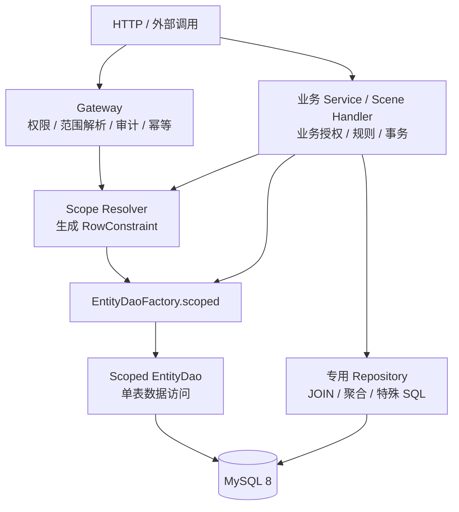
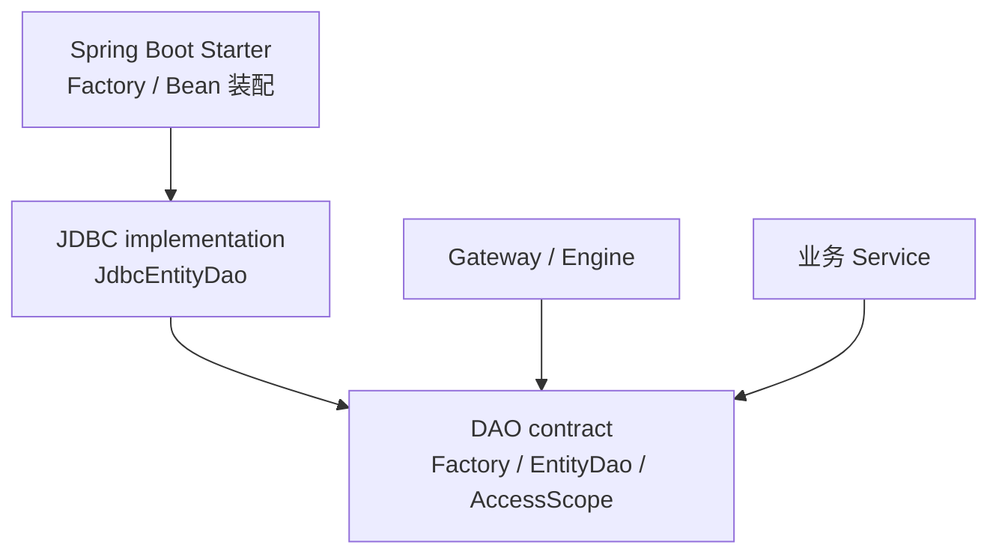

# 实体 DAO

> 状态：In Progress（D0-D4.3 主键 CRUD 闭环已完成；D4.1 数据库类型矩阵和 D5 待后续）<br>
> 最近核验：2026-09-17
> 实施跟踪：[实体 DAO 实施清单](../../../evolution/roadmap/crud/实体DAO实施清单.md)

当前实现已落地 `crud-core` 的 `EntityDao<T, ID>`、`EntityDaoFactory`、`EntityType`、`EntityAccessScope`、不可变 `RowConstraint` 及 Patch 规范化模型，并在 `crud-engine-jdbc` 提供 `JdbcEntityDaoFactory` 的 H2 与 MySQL 8 主键 CRUD 验收闭环。逻辑删除的未删除值和已删除值由实体元数据显式声明并在注册时校验。`OrderTestEntity` 的 CommandGateway 单条 CREATE/UPDATE/DELETE 测试入口已切换到 DAO，空/非空 Scene、租户/组织范围拒绝、普通目标条件拒绝、完整审计、幂等、外层事务回滚、H2 并发和 MySQL 8 全链路证据已补齐；Starter 仅在元数据与 JDBC 安全执行器齐备时装配可覆盖的 Factory，不注册裸 DAO，也不把 DAO Handler 自动设为全局默认处理器；选定实体的命令切换由业务按实体显式注册，未迁移实体、批量和 save-or-update 继续使用旧 Handler。MySQL 启动期会检查范围字段的生成列、AUTO_INCREMENT、ON UPDATE 和触发器结构，失败时记录告警但不阻塞主应用启动；相关实体创建 scoped DAO 时仍会严格校验并拒绝使用。触发器检查要求校验账号对目标表具备 `TRIGGER` 或 `ALL PRIVILEGES` 元数据可见性；更完整数据库字段/时区/常用类型矩阵继续按实施清单推进。

## 定位

`EntityDao<T, ID>` 是面向单实体、单表操作的基础数据访问合同。它供业务 Service 直接使用，也供通用 CRUD 的 Gateway / Engine 执行链复用。

当前框架尚未上线，实体 DAO 落地不承担历史 API、配置或运行行为兼容责任。实现以本文目标合同为唯一基线：同一闭环内切换仓库中的调用者并删除被替代的类型、配置、SQL 路径和测试，不引入 deprecated 入口、适配层、兼容开关或新旧双轨。现有实现若与目标合同冲突，测试应改为验证目标语义，而不是维持旧行为。

DAO 不解析调用主体，不判断角色和权限，也不计算租户、组织或业务数据范围。上层先将这些规则解析为 `RowConstraint`，再通过 `EntityDaoFactory` 获得绑定访问范围的 DAO。DAO 负责把已经确定的范围与主键、逻辑删除、期望版本一起原子落实到 SQL。



核心边界是：**上层负责范围解析，DAO 负责范围执行**。DAO 不理解“当前用户为什么只能访问这些组织”，但必须保证每次读写都带上已经绑定的行约束。

信任边界明确如下：Gateway、Scene Handler 和业务 Service 属于可信应用层，负责正确完成授权、范围解析和业务规则；DAO 防止 HTTP 参数、DTO、查询条件等外部输入绕过已经确定的范围，但不防止可信业务代码主动构造错误范围或显式选择全量范围。后者属于业务代码审查、模块边界和运维治理责任，不伪装成 DAO 能够解决的安全问题。

## 按访问范围获取 DAO

默认入口不直接按实体类型获取裸 DAO，而是显式绑定访问范围：

```java
public interface EntityDaoFactory {
    <T, ID> EntityDao<T, ID> scoped(
        EntityType<T, ID> entityType,
        EntityAccessScope scope
    );
}
```

`EntityType<T, ID>` 是同时携带实体类型和主键类型的不可变描述符。Factory 使用它校验注册元数据中的主键类型；不能只依赖 `EntityDao<T, ID>` 返回值的泛型推断，因为 `ID` 在运行时会被擦除。

业务调用示例：

```java
RowConstraint constraint = scopeResolver.resolve(subject, Order.class);
EntityAccessScope scope = EntityAccessScope.of(constraint);

EntityDao<Order, Long> orderDao =
    entityDaoFactory.scoped(ORDER_ENTITY_TYPE, scope);

orderDao.findById(orderId);
orderDao.updateById(orderId, patch);
orderDao.deleteById(orderId);
```

`EntityAccessScope` 是 scoped DAO 的不可变访问上下文，第一阶段只包含必需的 `RowConstraint`，不为尚未出现的分片需求预留 `PersistenceRouteHint`。首个真实分片项目出现后，再根据已验证的路由需求扩展创建 DAO 的合同。

这里的“不可变”是深不可变快照，而不只是没有 setter：构造 `EntityAccessScope`、`RowConstraint` 及其节点时必须防御性复制集合、数组等可变入参，访问器不得暴露可变内部状态，组合约束必须返回新对象。当前 Core 和 JDBC Factory 已保存该快照；调用方之后修改原始集合、构造器或普通查询条件，都不能改变已绑定范围。

`RowConstraint` 只表达当前实体字段上的行约束，不携带主体、角色、Scene Policy 等治理对象，也不允许包含 SQL 片段。字段和操作符必须经过实体元数据白名单校验，值始终使用参数化绑定。外部请求只能提供用于收窄范围的普通业务条件，不能直接提交、反序列化或替换可执行的 `RowConstraint`；可信应用层负责把授权结果和必要的业务条件解析为最终约束。

约束规则：

- `scope == null` 或 `scope.rowConstraint == null` 视为编程错误并拒绝创建 DAO。
- 需要访问全部数据时必须显式使用 `RowConstraint.unrestricted()`，不以 `null` 表示无限制。
- `RowConstraint.unrestricted()` 是可信应用层可使用的显式能力，不代表 DAO 能阻止业务代码主动放宽范围；常规业务路径仍应通过 scope resolver 获得约束。
- `EntityDao` 实例绑定的约束不可变，可在线程间安全复用；一次调用不能临时移除或放宽它。
- DAO 方法不接收 scope 替换参数。主键、普通查询条件和写入参数只能与绑定范围做 `AND` 合并；调用方条件缺失、恒真或覆盖同名字段时，绑定范围仍完整保留。
- 查询、更新、覆盖和删除始终应用绑定约束与逻辑删除谓词。
- 新增数据必须满足绑定约束；实体缺少范围字段或字段值超出约束时拒绝写入，不静默创建到范围之外。
- 框架默认不注册可被业务代码随意注入的 unscoped DAO；全表维护使用显式的专用 Repository。

## 第一阶段合同

第一阶段以 `OrderTestEntity` 的 `t_order` 根表为代表性测试样板，覆盖 `CommandGateway` 的真实执行链测试入口。该入口用于证明主键读写技术闭环，不作为真实业务调用者证据。样板实体使用显式主键、`schoolId` / `tenantId` 范围字段和 `isDeleted` 逻辑删除；实体的 `items` 一对多关系不进入 DAO 元数据、SQL 或本阶段验收。第一阶段暂不启用乐观锁、数据库生成主键或依赖数据库计算的范围字段。不一次纳入列表、分页、多主键查询、实体非 `null` 选择性更新、全量覆盖、批量、upsert、条件写和键集分页：

```java
public interface EntityDao<T, ID> {
    Optional<T> findById(ID id);

    ID insert(T entity);

    int updateById(ID id, UpdatePatch<T> patch);

    int deleteById(ID id);
}
```

`UpdatePatch<T>` 复用 CRUD 强类型边界中的普通单表 PATCH 模型，能够区分“未提供字段”“显式更新为 `null`”和“更新为具体值”。不再新增同名或近义的 DAO `EntityPatch`，避免与现有聚合 `EntityPatch<T>` 混淆。

乐观锁和 `WriteOptions.expectedVersion` 不进入第一阶段合同，待真实版本实体出现后独立扩展。DAO 首期不承载主体、权限或数据范围替换参数。

## 查询语义

所有查询的有效条件均为：

```text
绑定的 RowConstraint
+ 逻辑未删除谓词
+ 调用方查询条件或主键条件
```

| 方法 | 语义 |
|---|---|
| `findById` | 在有效条件内按主键查询；未命中返回 `Optional.empty()` |

DAO 不通过额外查询向普通读取调用方区分“数据不存在”和“数据存在但不在当前范围”，避免扩大数据可见性。

## 更新语义

第一阶段只提供 `updateById(ID, UpdatePatch<T>)`：只更新 Patch 明确出现的可写字段，并支持显式写入 `null`。实体非 `null` 选择性更新和全量覆盖在出现真实调用需求后分别设计，避免用同一实体参数表达不同意图。

共同规则：

- 主键只使用方法参数 `id`；实体或 Patch 中的主键若存在，必须与参数一致。
- 主键、逻辑删除、范围约束字段、版本字段等框架受控字段不能作为普通更新字段绕过约束。
- `UpdatePatch<T>` 为空时拒绝执行。
- 所有字段都经过实体元数据白名单校验，值使用参数化绑定。

## 统一写入约束

DAO 在执行按主键更新、覆盖或删除时，将以下部分组合成不可放宽的 `WriteConstraint`：

```text
目标主键
+ scoped DAO 绑定的 RowConstraint
+ 实体元数据声明的逻辑未删除谓词
（首期不包含版本谓词）
```

例如：

```sql
UPDATE orders
SET status = ?, version = version + 1
WHERE id = ?
  AND tenant_id = ?
  AND org_id IN (?, ?)
  AND deleted = 0
  AND version = ?;
```

`WriteConstraint` 是 DAO 编译写入 SQL 使用的内部统一模型，不等同于治理模型：

- 主键来自方法参数。
- 数据范围来自创建 DAO 时绑定的 `RowConstraint`。
- 逻辑删除来自实体元数据。
- 后续乐观锁扩展时，期望版本来自本次调用的 `WriteOptions`；首期不包含该部分。

首期不提供版本条件写入。后续增加乐观锁时，版本匹配与版本递增必须在同一条 SQL 中完成，不能通过默认重载或静默忽略参数引入。

## 写入未命中语义

更新或删除正常返回时影响行数只能是 `1`；影响 `0` 行必须转换为稳定异常，不把驱动影响行数直接暴露给调用方，也不通过写入后的多次查询推断唯一原因。按主键写入若报告大于 `1` 行，视为实体元数据、主键约束或 SQL 编译不变量被破坏，抛出持久化执行异常，不把该行数作为正常结果返回：

- 首期所有 `0` 行写入统一表示“目标不存在或不可写”，不区分不存在、逻辑删除和范围拒绝。
- 无版本更新固定采用 matched-rows 语义；目标行存在且范围匹配时，即使新旧值相同也返回 `1`。实现必须在启动期校验 MySQL 驱动及 `useAffectedRows` 等相关配置，不满足时 fail-fast，不承诺兼容会改变影响行数语义的连接配置。

现有 `JdbcWriteMissClassifier` 及写入后的分类查询不进入目标架构。选定的 `OrderTestEntity` Gateway 主键入口切换到 DAO 时，必须同时删除该入口的分类器调用点和只验证精细分类的测试，不保留诊断旁路或开关；其他尚未迁移的 Engine 入口不在首期切换范围。DAO 的正确性不能依赖写入后的查询，也不能假设多条语句天然处于同一事务或使用同一连接。

### D0.2 合同测试设计

下列用例在 D2 的 JDBC DAO 行为测试中实现；D0 只固定可观察结果，不提前创建 DAO 公共类型或 JDBC 实现。

| 场景 | 写入结果 | 必须观察到的结果 | 禁止行为 |
|---|---:|---|---|
| 未命中 | `0` | 抛出“目标不存在或不可写”稳定异常 | 区分不存在、逻辑删除或范围拒绝 |
| 按主键写入成功 | `1` | 正常返回唯一成功结果 | 返回驱动相关的 matched / changed rows 差异 |
| 无变化更新 | 目标行存在但新旧值相同 | 仍返回 `1` | 依赖 changed-rows 模式返回 `0` |
| 按主键异常多行 | `>1` | 抛出持久化执行异常 | 将多行影响视为正常成功 |
| 未命中后的状态变化 | 主写入返回 `0` 后，另一事务插入、删除或修改同一主键 | 对外异常保持“目标不存在或不可写” | 发起存在性查询并据竞态结果改判异常 |

测试执行器应记录主写入后的 SQL 调用次数，并断言 DAO 在 `0` 行分支不再发起用于业务分类的查询。首期并发用例只验证范围谓词与主键写入由同一条 SQL 原子执行；版本并发留到乐观锁扩展。

## 新增语义

- `insert` 返回显式主键；数据库生成主键不属于第一阶段合同。
- 显式主键必须符合实体主键策略和类型。
- 第一阶段只允许用字段等值、非空字段 `IN` 及其 `AND` 组合校验新增数据；`OR`、`NOT`、范围比较、数据库函数或无法从最终持久化值确定的约束直接拒绝。
- 等值和单元素 `IN` 规范化为唯一值并由 DAO 强制填充；调用方提供冲突值时拒绝。多元素 `IN` 不存在唯一可填值，调用方必须提供范围字段，DAO 校验其属于集合；字段缺失时拒绝。
- 数据库默认值、生成列、字符集、排序规则或触发器参与范围字段最终值时，不得用 Java 内存判断伪装成数据库等价语义；无法可靠判定时 fail-closed。
- 逻辑删除元数据必须显式声明未删除值和已删除值，并校验其与字段类型兼容；调用方不能借普通字段覆盖。现有 JDBC 中隐含的 `0/1` 不能作为稳定合同；版本初始值和递增不属于第一阶段合同。
- DAO 不处理业务必填、状态流转和跨实体规则。

### MySQL 结构校验权限

`JdbcInsertScopeDatabaseValidator` 对已有 MySQL 表读取 `information_schema.columns` 和 `information_schema.triggers`，并执行 `SHOW GRANTS` 确认当前连接能看到目标表触发器。MySQL 对只有表级 DML 权限的账号可能返回空触发器结果，即使触发器实际存在；因此范围表校验要求当前账号对目标表或目标 schema 具有 `TRIGGER` / `ALL PRIVILEGES`，或者传入具备该元数据可见性的专用校验连接。通过角色获得的权限必须在当前连接中激活或设为默认角色；仅授予但未激活的角色仍按元数据不可见处理。权限不足时启动和显式 Factory 都直接失败，不把空结果当成“没有触发器”。

## 后续扩展

以下能力不进入第一阶段最小合同，等主键读写闭环稳定后再逐项加入。

### 查询能力

- 出现真实列表调用后，再增加有硬上限的 `list(EntityQuery)`，不提供无界 `listAll()`。`EntityQuery` 只表达当前实体的过滤和排序，不直接复用带 Scene、权限或跨表语义的 `QuerySpec`。
- 出现真实分页调用后，再定义确定性排序、精确计数及页码合同；调用方未指定排序时按主键升序，非唯一排序字段必须以主键收尾，数据与计数使用同一有效条件。
- 出现至少两个真实多主键调用后，再增加 `findByIds`；结果按入参 ID 首次出现顺序排列，未命中 ID 被忽略；便利 Map 视图优先由调用方转换，若形成稳定需求再增加只读有序映射视图。
- 精确分页成本不可接受且有真实大表场景后，再设计键集分页。

候选查询合同如下，仅作为后续阶段设计保留，不属于第一阶段公共接口：

```java
List<T> findByIds(Collection<ID> ids);

List<T> list(EntityQuery query);

EntityPage<T> page(EntityQuery query, PageRequest pageRequest);
```

所有后续查询仍必须叠加 scoped DAO 的绑定范围和逻辑未删除谓词，不能因为增加过滤、排序或分页参数而放宽范围。

### 实体更新与覆盖

出现真实调用需求后，再分别增加两种不同意图的入口，不能把它们合并为同一个实体参数：

```java
int updateById(ID id, T changes, WriteOptions options);

int replaceById(ID id, T entity, WriteOptions options);
```

- `updateById(ID, T, ...)` 只更新 `changes` 中非 `null` 的可更新持久化属性，`null` 表示忽略。
- `replaceById(ID, T, ...)` 更新除主键和框架受控字段外的全部可更新属性，`null` 表示写入 `null`，仍须遵守数据库非空约束。
- 两种入口都必须沿用主键、绑定范围、逻辑删除和可选版本条件；空可写字段、主键不一致和受控字段修改直接拒绝。
- 是否同时提供不带 `WriteOptions` 的便利重载，待真实调用者和版本实体策略确定后再决定。

### 非原子批量

批量方法必须在名称中明确 `NonAtomic`，例如：

```java
List<ID> insertBatchNonAtomic(List<T> entities);

int updateBatchByIdNonAtomic(Map<ID, T> entities);

int deleteBatchByIdNonAtomic(Collection<ID> ids);
```

这里的“非原子”表示 DAO 自身不创建事务，也不承诺全部成功或全部失败：

- 实现可以依据数据库限制分块。
- 任一项或任一分块失败时立即抛出异常，但此前操作可能已经提交。
- 调用方需要全量回滚时，必须在 Service 或 Gateway 外层显式开启事务。
- 空集合不访问数据库并返回空结果或 `0`；`null` 入参视为编程错误。
- 方法正常返回表示所有项均已执行，不表示 DAO 曾创建事务。

如果未来提供 DAO 自己保证原子性的批量入口，应使用不同名称和明确的事务合同，不能静默改变上述语义。

### 主键 upsert

`insertOrUpdateById` 只允许把主键冲突视为同一实体，其他唯一键冲突必须抛出约束异常。MySQL `ON DUPLICATE KEY UPDATE` 会响应任意唯一键冲突，不能直接满足该合同；实现算法和并发行为经过 MySQL 8 验收前，不进入第一阶段接口。

### 条件写

后续可增加：

```java
int updateByCondition(EntityCondition condition, UpdatePatch<T> patch);

int deleteByCondition(EntityCondition condition);
```

调用方条件始终与 scoped DAO 的 `RowConstraint`、逻辑删除条件共同生效。空条件、规范化后恒真的条件或空 Patch 直接拒绝；DAO 不提供 `updateAll`、`deleteAll`。

### 键集分页

键集分页稳定后再增加 `keysetPage`。游标由 DAO 生成和解析，至少绑定实体、完整查询指纹、排序字段、排序方向、末行排序值和元数据版本，并进行完整性校验。游标与当前查询不匹配时拒绝执行，不静默回到第一页。

## 职责边界

| Entity DAO 负责 | Entity DAO 不负责 |
|---|---|
| 执行已绑定的 `RowConstraint` | 从主体、角色计算数据范围 |
| 实体元数据到表、列的映射 | 用户、角色与权限判断 |
| 单表 SQL 编译和参数绑定 | Scene Policy 与业务状态校验 |
| 主键、范围、逻辑删除和版本的原子写入谓词 | 幂等与治理审计 |
| 数据库生成主键回收和异常转换 | 跨实体事务编排 |
| 逻辑删除、版本等持久化映射策略 | JOIN、聚合、报表和特殊 SQL |
| 参数化、标识符白名单等 SQL 安全 | 默认创建事务 |

所谓“不处理治理”，是指 DAO 不拥有治理规则和解析过程，不表示 DAO 可以忽略上层已经解析好的行约束。范围执行、逻辑删除、乐观锁、字段映射和 SQL 安全都属于 DAO 必须守住的数据库边界。

DAO 的安全保证从“收到最终 `EntityAccessScope`”开始：它保证绑定范围不会被查询条件或写入参数放宽，并保证范围进入实际 SQL；它不验证可信应用层为何生成该范围，也不承担防止业务代码主动传入错误范围的职责。

## 调用边界

- Controller 不直接暴露 DAO；对外通用 CRUD 仍先经过 Gateway 治理。
- HTTP 参数、请求 DTO 和其他不可信输入不能直接映射为 `EntityAccessScope` 或 `RowConstraint`。
- Gateway 解析治理范围并创建 scoped DAO，不能先做范围查询再调用不带范围的写入。
- 业务 Service 作为可信边界，可以使用自身的 scope resolver 或显式范围创建 scoped DAO，并负责业务授权、规则和事务编排。
- 复杂查询和跨表持久化使用专用 Repository；Repository 同样不能绕过必要的数据范围。
- 常规业务不应通过 `RowConstraint.unrestricted()` 构造捷径；全表维护优先使用职责明确的专用 Repository 和事务。该约束由应用架构与代码审查保证，不由 DAO 冒充权限系统强制判断。

### D0.1 合同测试设计

下列用例先固定验收意图。D1 已覆盖 Core 不可变性和 Factory 绑定，D3 已覆盖 Gateway 越权与可信调用路径，Starter Web 装配已验证外部输入不能形成可执行 scope。

| 阶段 | 场景 | 操作 | 必须观察到的结果 |
|---|---|---|---|
| D1 | 构造后修改入参 | 用可变组织 ID 集合构造范围并创建 DAO，再修改原集合 | scope 与 DAO 仍使用创建时快照 |
| D1 | 尝试从访问器修改 | 获取约束中的集合值并尝试增删 | 无可变内部状态可获得；原约束保持不变 |
| D1 | 组合约束 | 对已有约束追加 `AND` 条件 | 返回新约束，原约束及已创建 DAO 均不变化 |
| D1 | 调用级范围替换 | 检查 `findById`、`insert`、`updateById`、`deleteById` 合同并执行普通参数调用 | 方法不存在 scope 参数；有效谓词始终保留绑定范围 |
| D1 | 非法显式范围 | Service 显式构造含未知字段或非法操作符的范围并交给 Factory | 在统一元数据白名单入口拒绝，尚未访问数据库 |
| D3 | 外部租户越权 | 已授权租户 A，请求参数或 DTO 提交租户 B | 外部值不能替换 scope；最终条件仍包含租户 A，结果为空或写入未命中 |
| D3 | 外部组织集合扩张 | 已授权组织 `{1, 2}`，请求组织 `{1, 2, 3}` 或省略组织条件 | 普通条件只与授权范围取交集；组织 3 不可见、不可写 |
| D3 | 普通条件覆盖 | 已绑定范围后提交恒真条件、同名字段条件或不提交条件 | 条件只能通过 `AND` 收窄，绑定范围不能被移除或覆盖 |
| D3 | 外部提交可执行范围 | 请求体携带伪造的 scope / constraint 结构或 `unrestricted` 标记 | Web 绑定层不产生 `EntityAccessScope` / `RowConstraint`，Factory 只接收可信应用层产物 |
| D3 | Resolver 可信调用 | Gateway 使用 Resolver 产出的合法范围创建 DAO | 经过与显式范围相同的 Factory 校验、冻结和参数绑定路径 |
| D3 | Service 可信调用 | Service 显式构造与上一用例等价的合法范围创建 DAO | SQL 谓词及参数与 Resolver 路径等价；非法字段、操作符的拒绝行为也一致 |

测试不得通过断言“请求 DTO 恰好没有某个字段”代替安全验证；必须从装配边界和最终 DAO 谓词两端证明外部输入没有形成替换范围的通道。外部普通条件与授权范围的组合统一定义为逻辑交集；空交集产生恒假条件或等价的不可见结果，绝不回退为授权范围、请求范围或全量范围。

## 水平分片演进边界

第一阶段不定义 `PersistenceRouteHint`、`ShardId` 或其他分片公共类型。首个真实分片项目出现后，先验证单路由键、单分片和同一事务不切换数据源的最小闭环，再决定是否需要扩展创建 scoped DAO 的合同。路由信息与 `RowConstraint` 的关系、命名和类型以该项目的实际需求为依据，不从任意条件树中反向猜测分片键。

后续路由合同可以保留以下候选语义，但在真实项目出现前不将其作为公共类型或实现承诺：路由提示只表达单个实体字段的等值逻辑路由，不向业务层暴露物理库、物理表、`DataSource` 或 `JdbcTemplate`。候选形态可以类似：

```java
EntityAccessScope scope = EntityAccessScope.builder()
    .rowConstraint(rowConstraint)
    .routeHint(PersistenceRouteHint.by("tenantId", tenantId))
    .build();
```

最终合同仍需由真实分片项目验证后定稿。

分片实体默认遵守：

- 缺少路由键直接拒绝，不静默广播。
- 一次 DAO 调用只允许命中一个分片；未来的多主键查询和批量写同样不跨分片。
- `insert` 的实体分片字段、`RowConstraint` 和最终路由信息必须一致。
- 同一事务不允许切换分片；路由必须在首次获取连接前确定。
- 逻辑删除和版本条件必须在同一分片的一条写入 SQL 中完成。
- 跨分片 JOIN、事务、精确分页、全局排序、聚合和导出不进入通用 DAO，改用专用读模型、Search 或 OLAP。
- 分片后主键需保证全局唯一；跨分片业务唯一性不依赖单库唯一索引。

实现取舍：

| 场景 | 建议 |
|---|---|
| 仅按 `tenantId` 等稳定归属键选择数据源，严格单分片 | 实现轻量 JDBC 路由 |
| 同时分库分表，需要逻辑表 SQL 改写、读写分离等标准能力 | 选用 ShardingSphere-JDBC |
| 大量跨分片查询、排序、分页或聚合 | 调整 OLTP 边界，不在 DAO 或分片中间件中硬扛 |

轻量自研只包含“路由键校验、固定逻辑分片计算、路由表到数据源映射、配置热更新和事务路由一致性”；不自研 SQL 解析、表名改写、广播执行、结果归并或分布式事务。ShardingSphere-JDBC 作为可选 `DataSource` 实现时，DAO 仍先校验逻辑路由键并默认禁止广播，不因中间件“可以执行”而放宽 OLTP 边界。

## 模块建议

DAO 合同不依赖 Gateway、具体治理模型或 Spring：



第一阶段放在现有 `crud-core` 与 `crud-engine-jdbc` 的清晰包边界内：前者放置 `dao` 合同，后者放置 `dao` JDBC 实现及谓词、变更 SQL 和异常转换部件。Starter 为默认 Factory 注入 `JdbcInsertScopeDatabaseValidator`，并在容器刷新最低优先级再次校验，以覆盖同一容器中 DDL 完成后的表结构。自定义 `EntityMetaRegistry` 必须提供完整元数据快照；自定义 `GuardedSqlExecutor` 必须显式传入数据库校验器。逻辑删除和乐观锁属于 DAO 的持久化一致性，不是额外拆分 `crud-core-governance` 或 `crud-core-dao` 的理由。

第一阶段不新增占位 Maven 模块。只有出现第二种持久化实现、业务项目需要独立依赖 DAO，或 DAO 已形成独立发布和演进验证需求后，再提取稳定的 `ent-loom-crud-dao-api` 和 `ent-loom-crud-dao-jdbc`。轻量路由或 ShardingSphere 适配模块同样等真实项目需求出现后再建立，不让普通单库项目承担分片依赖。

## 落地顺序

1. 选定 `OrderTestEntity` 的 `t_order` 根表作为代表性测试样板，明确排除 `items` 一对多关系，并使用 `CommandGateway` 真实执行链测试入口完成 D0 决策、第一阶段 API 草案和测试用例设计。
2. 定义 `RowConstraint`、`EntityAccessScope`、携带实体与主键类型的 `EntityType<T, ID>`、`EntityDaoFactory` 和不含版本选项的最小 `EntityDao` 合同，并用样板实体验证表达能力。
3. 补齐显式逻辑删除值元数据，并从现有查询编译器和 `JdbcWritePredicateBuilder` 提取行约束与逻辑删除谓词的复用部件。
4. 实现 scoped `JdbcEntityDao` 的主键查询、新增、Patch 更新和删除；写入未命中按稳定粗粒度异常映射，不依赖后置分类查询。
5. 让样板实体先完成 Factory -> DAO -> H2 闭环，再将一个真实 Gateway / Service 入口的主键路径直接切换到 DAO；在该入口闭环删除重复 SQL、`JdbcWriteMissClassifier` 及旧分类测试，并通过目标合同与外部越权测试确认治理范围和逻辑删除正确。
6. 使用同一样板实体完成 MySQL 8 方言与全链路验收，再提供 Spring Bean 装配。
7. 按真实调用需求逐项增加列表、分页、多主键查询、实体选择性更新、全量覆盖、非原子批量、条件写、主键 upsert 和键集分页。
8. 首个真实分片项目出现后，再设计路由合同并验证单分片闭环；只有需要 SQL 改写时才引入 ShardingSphere-JDBC 适配。

当前仓库已提供首期 `EntityDao` Core 合同和 JDBC 实现；后续以本文及实施清单作为列表、批量、版本和分片能力的演进边界。
