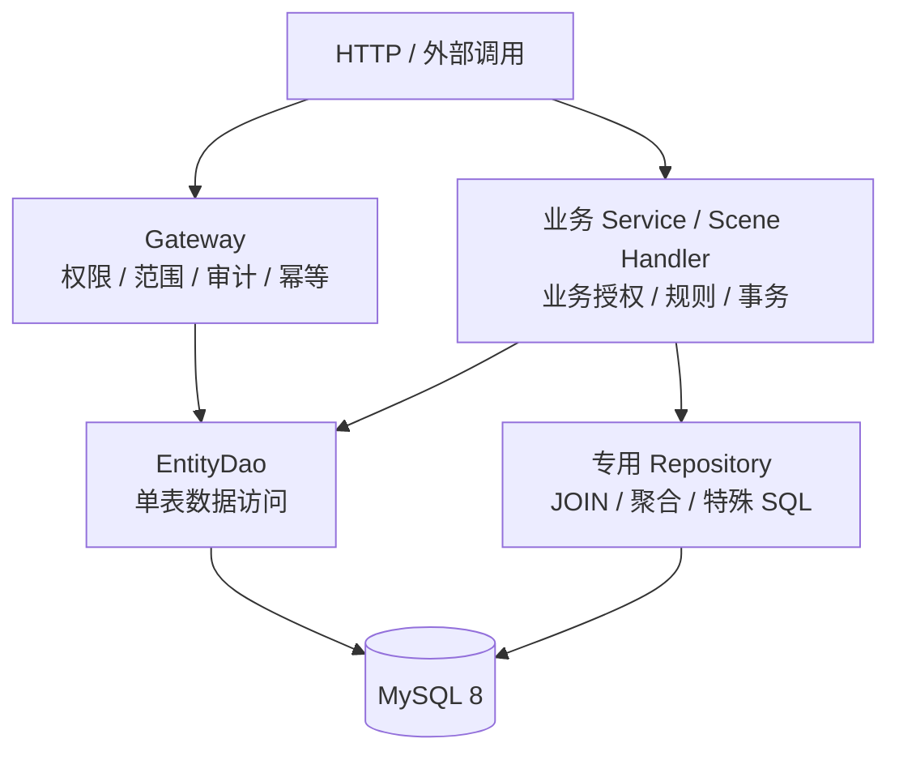
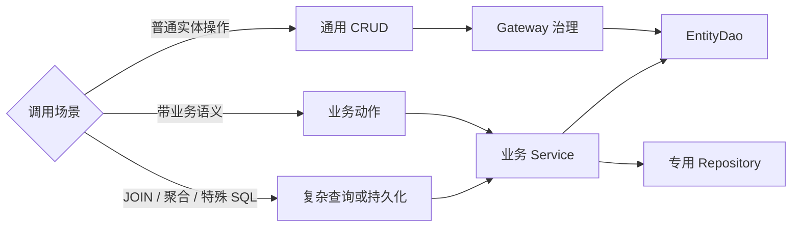
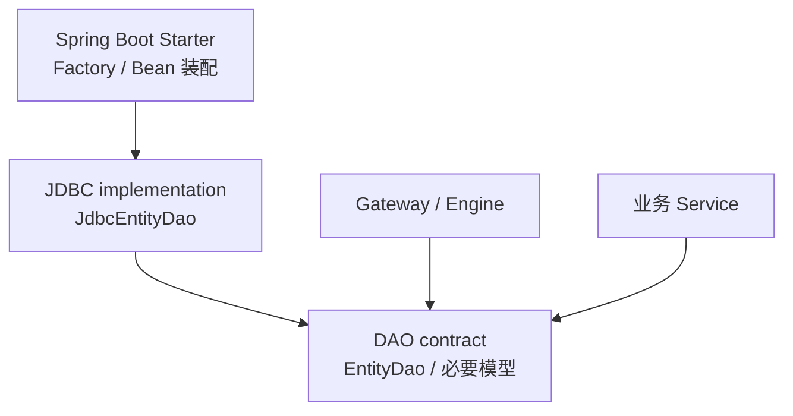

# 实体 DAO

> 状态：Proposed<br>
> 最近核验：2026-09-16

## 定位

`EntityDao<T, ID>` 是面向单实体、单表操作的基础数据访问合同。它供业务 Service 直接使用，也供通用 CRUD 的 Gateway / Engine 执行链复用。

DAO 只处理数据库访问所必需的工作，不解析调用主体，不判断权限，不计算数据范围，不处理 Scene Policy、幂等或业务规则。权限和业务范围由调用 DAO 的上层入口负责。



## 建议合同

第一阶段保持较小闭环，不复制 Query/Command Gateway 的完整能力：

```java
public interface EntityDao<T, ID> {
    Optional<T> findById(ID id);

    ID insert(T entity);

    int updateById(ID id, T entity);

    int deleteById(ID id);
}
```

明确出现局部更新需求后，再增加能够区分“未提供字段”和“显式更新为 `null`”的 Patch 类型。批量写、条件更新和条件删除应在事务、结果及防误操作合同明确后独立增加。

第一阶段不提供 `save` / `saveBatch`。它们隐含存在性查询、并发窗口和新增/更新选择，不属于纯粹、可预期的 DAO 原语。

## 职责边界

| Entity DAO 负责 | Entity DAO 不负责 |
|---|---|
| 实体元数据到表、列的映射 | 用户、角色与权限判断 |
| 单表 SQL 编译和参数绑定 | 租户、组织和业务范围解析 |
| 数据库生成主键回收 | Scene Policy 与业务状态校验 |
| 影响行数和数据库异常转换 | 幂等与治理审计 |
| 逻辑删除等持久化映射策略 | 跨实体事务编排 |
| 参数化、标识符白名单等 SQL 安全 | JOIN、聚合、报表和特殊 SQL |

所谓“不带非数据库层面校验”，是指不耦合治理和业务规则，不表示取消数据库执行安全。实体元数据、主键类型、字段映射、SQL 参数化和数据库约束仍属于 DAO 必须守住的边界。

## 调用边界



- Controller 不直接暴露 DAO；对外通用 CRUD 仍先经过 Gateway 治理。
- 业务 Service 可以直接依赖 DAO，由业务入口完成授权、范围和事务编排。
- DAO 不自动附加租户或组织条件；多租户业务由上层提供明确目标，或使用表达该语义的专用 Repository。
- 复杂查询 Repository 与 Entity DAO 并列存在，不要求一个 Repository 对应一张表。
- 禁止提供无条件 `updateAll`、`deleteAll` 等高风险捷径。

## 模块建议

DAO 合同不应依赖 Gateway、治理模型或 Spring：



第一阶段可先放在现有 `crud-core` 与 `crud-engine-jdbc` 的清晰包边界内，不新增占位 Maven 模块。出现第二种持久化实现或独立调用者后，再评估提取稳定的 DAO contract artifact。

## 落地顺序

1. 定义最小 `EntityDao<T, ID>` 与工厂合同，固定主键、影响行数和不存在语义。
2. 从 `JdbcCrudCommandHandler` 提取可复用的实体 SQL 编译与执行部件。
3. 实现 `JdbcEntityDao`，复用现有元数据、方言、逻辑删除、生成主键和 SQL 安全能力。
4. 让默认 Gateway / Engine 改为调用 DAO，避免维护两套单表写入实现。
5. 增加 H2 行为测试与 MySQL 8 方言验收，再提供 Spring Bean 装配。

当前仓库尚未提供 `EntityDao` 实现，后续以本文作为 DAO 落地边界。
