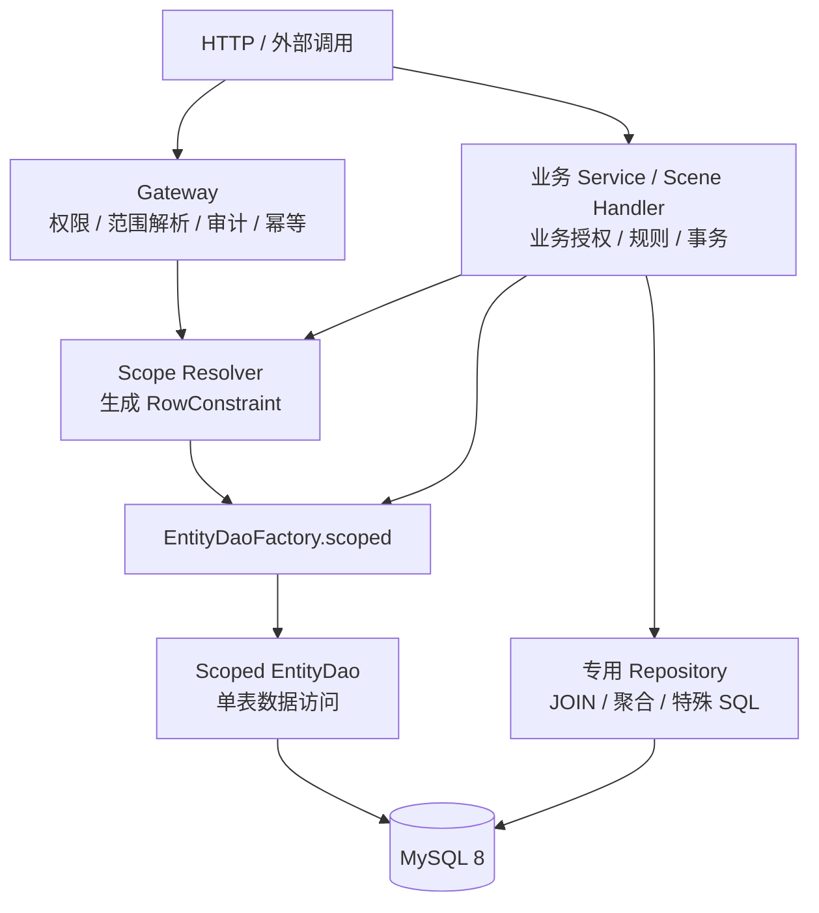
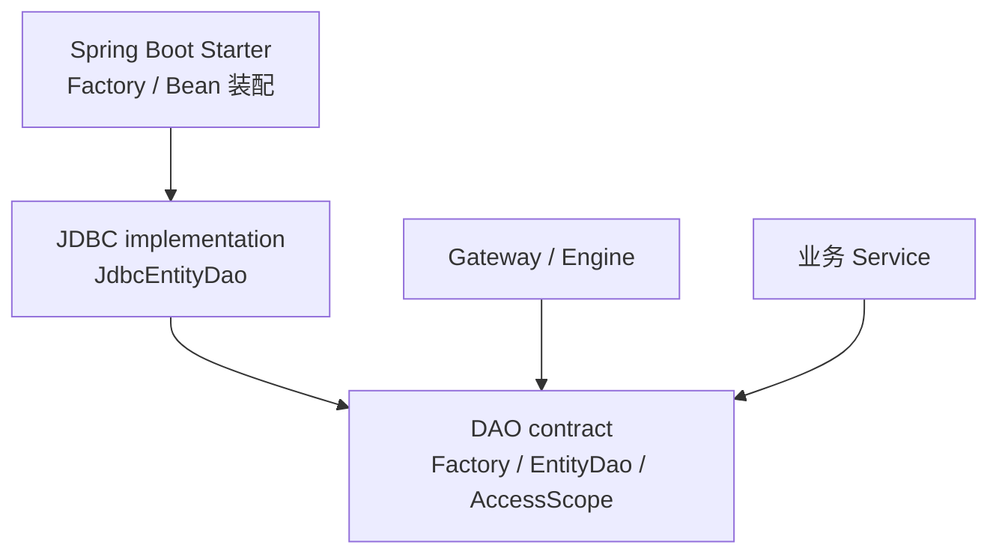

# 实体 DAO

> 状态：Proposed<br>
> 最近核验：2026-09-17
> 实施跟踪：[实体 DAO 实施清单](../../../evolution/roadmap/crud/实体DAO实施清单.md)

## 定位

`EntityDao<T, ID>` 是面向单实体、单表操作的基础数据访问合同。它供业务 Service 直接使用，也供通用 CRUD 的 Gateway / Engine 执行链复用。

DAO 不解析调用主体，不判断角色和权限，也不计算租户、组织或业务数据范围。上层先将这些规则解析为 `RowConstraint`，再通过 `EntityDaoFactory` 获得绑定访问范围的 DAO。DAO 负责把已经确定的范围与主键、逻辑删除、期望版本一起原子落实到 SQL。



核心边界是：**上层负责范围解析，DAO 负责范围执行**。DAO 不理解“当前用户为什么只能访问这些组织”，但必须保证每次读写都带上已经绑定的行约束。

信任边界明确如下：Gateway、Scene Handler 和业务 Service 属于可信应用层，负责正确完成授权、范围解析和业务规则；DAO 防止 HTTP 参数、DTO、查询条件等外部输入绕过已经确定的范围，但不防止可信业务代码主动构造错误范围或显式选择全量范围。后者属于业务代码审查、模块边界和运维治理责任，不伪装成 DAO 能够解决的安全问题。

## 按访问范围获取 DAO

默认入口不直接按实体类型获取裸 DAO，而是显式绑定访问范围：

```java
public interface EntityDaoFactory {
    <T, ID> EntityDao<T, ID> scoped(
        Class<T> entityType,
        EntityAccessScope scope
    );
}
```

业务调用示例：

```java
RowConstraint constraint = scopeResolver.resolve(subject, Order.class);
EntityAccessScope scope = EntityAccessScope.of(constraint);

EntityDao<Order, Long> orderDao =
    entityDaoFactory.scoped(Order.class, scope);

orderDao.findById(orderId);
orderDao.updateById(orderId, patch);
orderDao.deleteById(orderId);
```

`EntityAccessScope` 是 scoped DAO 的不可变访问上下文，第一阶段只包含必需的 `RowConstraint`，不为尚未出现的分片需求预留 `PersistenceRouteHint`。首个真实分片项目出现后，再根据已验证的路由需求扩展创建 DAO 的合同。

`RowConstraint` 只表达当前实体字段上的行约束，不携带主体、角色、Scene Policy 等治理对象，也不允许包含 SQL 片段。字段和操作符必须经过实体元数据白名单校验，值始终使用参数化绑定。外部请求只能提供用于收窄范围的普通业务条件，不能直接提交、反序列化或替换可执行的 `RowConstraint`；可信应用层负责把授权结果和必要的业务条件解析为最终约束。

约束规则：

- `scope == null` 或 `scope.rowConstraint == null` 视为编程错误并拒绝创建 DAO。
- 需要访问全部数据时必须显式使用 `RowConstraint.unrestricted()`，不以 `null` 表示无限制。
- `RowConstraint.unrestricted()` 是可信应用层可使用的显式能力，不代表 DAO 能阻止业务代码主动放宽范围；常规业务路径仍应通过 scope resolver 获得约束。
- `EntityDao` 实例绑定的约束不可变，可在线程间安全复用；一次调用不能临时移除或放宽它。
- 查询、更新、覆盖和删除始终应用绑定约束与逻辑删除谓词。
- 新增数据必须满足绑定约束；实体缺少范围字段或字段值超出约束时拒绝写入，不静默创建到范围之外。
- 框架默认不注册可被业务代码随意注入的 unscoped DAO；全表维护使用显式的专用 Repository。

## 第一阶段合同

第一阶段只覆盖一个真实样板实体所需的主键读写闭环，不一次纳入列表、分页、多主键查询、实体非 `null` 选择性更新、全量覆盖、批量、upsert、条件写和键集分页：

```java
public interface EntityDao<T, ID> {
    Optional<T> findById(ID id);

    ID insert(T entity);

    int updateById(ID id, UpdatePatch<T> patch);

    int updateById(ID id, UpdatePatch<T> patch, WriteOptions options);

    int deleteById(ID id);

    int deleteById(ID id, WriteOptions options);
}
```

`UpdatePatch<T>` 复用 CRUD 强类型边界中的普通单表 PATCH 模型，能够区分“未提供字段”“显式更新为 `null`”和“更新为具体值”。不再新增同名或近义的 DAO `EntityPatch`，避免与现有聚合 `EntityPatch<T>` 混淆。

`WriteOptions` 只承载单次写入的数据库执行选项。第一阶段至少包含可选的 `expectedVersion`；默认重载等价于未提供期望版本。它不承载主体、权限或数据范围。

## 查询语义

所有查询的有效条件均为：

```text
绑定的 RowConstraint
+ 逻辑未删除谓词
+ 调用方查询条件或主键条件
```

| 方法 | 语义 |
|---|---|
| `findById` | 在有效条件内按主键查询；未命中返回 `Optional.empty()` |

DAO 不通过额外查询向普通读取调用方区分“数据不存在”和“数据存在但不在当前范围”，避免扩大数据可见性。

## 更新语义

第一阶段只提供 `updateById(ID, UpdatePatch<T>)`：只更新 Patch 明确出现的可写字段，并支持显式写入 `null`。实体非 `null` 选择性更新和全量覆盖在出现真实调用需求后分别设计，避免用同一实体参数表达不同意图。

共同规则：

- 主键只使用方法参数 `id`；实体或 Patch 中的主键若存在，必须与参数一致。
- 主键、逻辑删除、范围约束字段、版本字段等框架受控字段不能作为普通更新字段绕过约束。
- `UpdatePatch<T>` 为空时拒绝执行。
- 所有字段都经过实体元数据白名单校验，值使用参数化绑定。

## 统一写入约束

DAO 在执行按主键更新、覆盖或删除时，将以下部分组合成不可放宽的 `WriteConstraint`：

```text
目标主键
+ scoped DAO 绑定的 RowConstraint
+ 实体元数据声明的逻辑未删除谓词
+ WriteOptions 中可选的 expectedVersion
```

例如：

```sql
UPDATE orders
SET status = ?, version = version + 1
WHERE id = ?
  AND tenant_id = ?
  AND org_id IN (?, ?)
  AND deleted = 0
  AND version = ?;
```

`WriteConstraint` 是 DAO 编译写入 SQL 使用的内部统一模型，不等同于治理模型：

- 主键来自方法参数。
- 数据范围来自创建 DAO 时绑定的 `RowConstraint`。
- 逻辑删除来自实体元数据。
- 期望版本来自本次调用的 `WriteOptions`。

实体没有版本元数据时，传入 `expectedVersion` 直接拒绝。更新时，版本匹配与版本递增必须在同一条 SQL 中完成；删除时，版本匹配必须进入同一条物理删除或逻辑删除 SQL。不得先查询版本再执行无版本条件的写入。

## 写入未命中语义

更新或删除正常返回时影响行数只能是 `1`；影响 `0` 行必须转换为稳定异常，不把驱动影响行数直接暴露给调用方，也不通过写入后的多次查询推断唯一原因：

- 未提供 `expectedVersion` 时，统一表示“目标不存在或不可写”，不区分不存在、逻辑删除和范围拒绝。
- 提供 `expectedVersion` 时，统一表示版本条件写入冲突，不额外泄露目标是否存在、是否在绑定范围内或实际版本。
- 版本条件写入冲突不承诺能够通过自动重试恢复；调用方不得仅凭该异常认定目标仍然存在或重新读取后必然可写。

若保留现有 `JdbcWriteMissClassifier`，它只能用于诊断或旧引擎兼容，不进入 DAO 的稳定业务合同。DAO 的正确性不能依赖写入后的分类查询，也不能假设多条语句天然处于同一事务或使用同一连接。

## 新增语义

- `insert` 返回最终主键；数据库生成主键必须稳定回收。
- 显式主键必须符合实体主键策略和类型。
- 第一阶段只允许用字段等值、字段 `IN` 及其 `AND` 组合校验新增数据；`OR`、`NOT`、范围比较、数据库函数或无法从最终持久化值确定的约束直接拒绝。
- 范围字段必须按实体选择一种确定策略：由框架强制填充，或者由调用方提供且在写入前校验；同一实体不能混用两种策略。
- 数据库默认值、生成列、字符集、排序规则或触发器参与范围字段最终值时，不得用 Java 内存判断伪装成数据库等价语义；无法可靠判定时 fail-closed。
- 逻辑删除初始值和版本初始值由持久化映射策略处理，调用方不能借普通字段覆盖。
- DAO 不处理业务必填、状态流转和跨实体规则。

## 后续扩展

以下能力不进入第一阶段最小合同，等主键读写闭环稳定后再逐项加入。

### 查询能力

- 出现真实列表调用后，再增加有硬上限的 `list(EntityQuery)`，不提供无界 `listAll()`。`EntityQuery` 只表达当前实体的过滤和排序，不直接复用带 Scene、权限或跨表语义的 `QuerySpec`。
- 出现真实分页调用后，再定义确定性排序、精确计数及页码合同；调用方未指定排序时按主键升序，非唯一排序字段必须以主键收尾，数据与计数使用同一有效条件。
- 出现至少两个真实多主键调用后，再增加 `findByIds`；结果按入参 ID 首次出现顺序排列，未命中 ID 被忽略；便利 Map 视图优先由调用方转换，若形成稳定需求再增加只读有序映射视图。
- 精确分页成本不可接受且有真实大表场景后，再设计键集分页。

候选查询合同如下，仅作为后续阶段设计保留，不属于第一阶段公共接口：

```java
List<T> findByIds(Collection<ID> ids);

List<T> list(EntityQuery query);

EntityPage<T> page(EntityQuery query, PageRequest pageRequest);
```

所有后续查询仍必须叠加 scoped DAO 的绑定范围和逻辑未删除谓词，不能因为增加过滤、排序或分页参数而放宽范围。

### 实体更新与覆盖

出现真实调用需求后，再分别增加两种不同意图的入口，不能把它们合并为同一个实体参数：

```java
int updateById(ID id, T changes, WriteOptions options);

int replaceById(ID id, T entity, WriteOptions options);
```

- `updateById(ID, T, ...)` 只更新 `changes` 中非 `null` 的可更新持久化属性，`null` 表示忽略。
- `replaceById(ID, T, ...)` 更新除主键和框架受控字段外的全部可更新属性，`null` 表示写入 `null`，仍须遵守数据库非空约束。
- 两种入口都必须沿用主键、绑定范围、逻辑删除和可选版本条件；空可写字段、主键不一致和受控字段修改直接拒绝。
- 是否同时提供不带 `WriteOptions` 的便利重载，待真实调用者和版本实体策略确定后再决定。

### 非原子批量

批量方法必须在名称中明确 `NonAtomic`，例如：

```java
List<ID> insertBatchNonAtomic(List<T> entities);

int updateBatchByIdNonAtomic(Map<ID, T> entities);

int deleteBatchByIdNonAtomic(Collection<ID> ids);
```

这里的“非原子”表示 DAO 自身不创建事务，也不承诺全部成功或全部失败：

- 实现可以依据数据库限制分块。
- 任一项或任一分块失败时立即抛出异常，但此前操作可能已经提交。
- 调用方需要全量回滚时，必须在 Service 或 Gateway 外层显式开启事务。
- 空集合不访问数据库并返回空结果或 `0`；`null` 入参视为编程错误。
- 方法正常返回表示所有项均已执行，不表示 DAO 曾创建事务。

如果未来提供 DAO 自己保证原子性的批量入口，应使用不同名称和明确的事务合同，不能静默改变上述语义。

### 主键 upsert

`insertOrUpdateById` 只允许把主键冲突视为同一实体，其他唯一键冲突必须抛出约束异常。MySQL `ON DUPLICATE KEY UPDATE` 会响应任意唯一键冲突，不能直接满足该合同；实现算法和并发行为经过 MySQL 8 验收前，不进入第一阶段接口。

### 条件写

后续可增加：

```java
int updateByCondition(EntityCondition condition, UpdatePatch<T> patch);

int deleteByCondition(EntityCondition condition);
```

调用方条件始终与 scoped DAO 的 `RowConstraint`、逻辑删除条件共同生效。空条件、规范化后恒真的条件或空 Patch 直接拒绝；DAO 不提供 `updateAll`、`deleteAll`。

### 键集分页

键集分页稳定后再增加 `keysetPage`。游标由 DAO 生成和解析，至少绑定实体、完整查询指纹、排序字段、排序方向、末行排序值和元数据版本，并进行完整性校验。游标与当前查询不兼容时拒绝执行，不静默回到第一页。

## 职责边界

| Entity DAO 负责 | Entity DAO 不负责 |
|---|---|
| 执行已绑定的 `RowConstraint` | 从主体、角色计算数据范围 |
| 实体元数据到表、列的映射 | 用户、角色与权限判断 |
| 单表 SQL 编译和参数绑定 | Scene Policy 与业务状态校验 |
| 主键、范围、逻辑删除和版本的原子写入谓词 | 幂等与治理审计 |
| 数据库生成主键回收和异常转换 | 跨实体事务编排 |
| 逻辑删除、版本等持久化映射策略 | JOIN、聚合、报表和特殊 SQL |
| 参数化、标识符白名单等 SQL 安全 | 默认创建事务 |

所谓“不处理治理”，是指 DAO 不拥有治理规则和解析过程，不表示 DAO 可以忽略上层已经解析好的行约束。范围执行、逻辑删除、乐观锁、字段映射和 SQL 安全都属于 DAO 必须守住的数据库边界。

DAO 的安全保证从“收到最终 `EntityAccessScope`”开始：它保证绑定范围不会被查询条件或写入参数放宽，并保证范围进入实际 SQL；它不验证可信应用层为何生成该范围，也不承担防止业务代码主动传入错误范围的职责。

## 调用边界

- Controller 不直接暴露 DAO；对外通用 CRUD 仍先经过 Gateway 治理。
- HTTP 参数、请求 DTO 和其他不可信输入不能直接映射为 `EntityAccessScope` 或 `RowConstraint`。
- Gateway 解析治理范围并创建 scoped DAO，不能先做范围查询再调用不带范围的写入。
- 业务 Service 作为可信边界，可以使用自身的 scope resolver 或显式范围创建 scoped DAO，并负责业务授权、规则和事务编排。
- 复杂查询和跨表持久化使用专用 Repository；Repository 同样不能绕过必要的数据范围。
- 常规业务不应通过 `RowConstraint.unrestricted()` 构造捷径；全表维护优先使用职责明确的专用 Repository 和事务。该约束由应用架构与代码审查保证，不由 DAO 冒充权限系统强制判断。

## 水平分片演进边界

第一阶段不定义 `PersistenceRouteHint`、`ShardId` 或其他分片公共类型。首个真实分片项目出现后，先验证单路由键、单分片和同一事务不切换数据源的最小闭环，再决定是否需要扩展创建 scoped DAO 的合同。路由信息与 `RowConstraint` 的关系、命名和类型以该项目的实际需求为依据，不从任意条件树中反向猜测分片键。

后续路由合同可以保留以下候选语义，但在真实项目出现前不将其作为公共类型或实现承诺：路由提示只表达单个实体字段的等值逻辑路由，不向业务层暴露物理库、物理表、`DataSource` 或 `JdbcTemplate`。候选形态可以类似：

```java
EntityAccessScope scope = EntityAccessScope.builder()
    .rowConstraint(rowConstraint)
    .routeHint(PersistenceRouteHint.by("tenantId", tenantId))
    .build();
```

最终合同仍需由真实分片项目验证后定稿。

分片实体默认遵守：

- 缺少路由键直接拒绝，不静默广播。
- 一次 DAO 调用只允许命中一个分片；未来的多主键查询和批量写同样不跨分片。
- `insert` 的实体分片字段、`RowConstraint` 和最终路由信息必须一致。
- 同一事务不允许切换分片；路由必须在首次获取连接前确定。
- 逻辑删除和版本条件必须在同一分片的一条写入 SQL 中完成。
- 跨分片 JOIN、事务、精确分页、全局排序、聚合和导出不进入通用 DAO，改用专用读模型、Search 或 OLAP。
- 分片后主键需保证全局唯一；跨分片业务唯一性不依赖单库唯一索引。

实现取舍：

| 场景 | 建议 |
|---|---|
| 仅按 `tenantId` 等稳定归属键选择数据源，严格单分片 | 实现轻量 JDBC 路由 |
| 同时分库分表，需要逻辑表 SQL 改写、读写分离等标准能力 | 选用 ShardingSphere-JDBC |
| 大量跨分片查询、排序、分页或聚合 | 调整 OLTP 边界，不在 DAO 或分片中间件中硬扛 |

轻量自研只包含“路由键校验、固定逻辑分片计算、路由表到数据源映射、配置热更新和事务路由一致性”；不自研 SQL 解析、表名改写、广播执行、结果归并或分布式事务。ShardingSphere-JDBC 作为可选 `DataSource` 实现时，DAO 仍先校验逻辑路由键并默认禁止广播，不因中间件“可以执行”而放宽 OLTP 边界。

## 模块建议

DAO 合同不依赖 Gateway、具体治理模型或 Spring：



第一阶段放在现有 `crud-core` 与 `crud-engine-jdbc` 的清晰包边界内：前者放置 `dao` 合同，后者放置 `dao` JDBC 实现及谓词、变更 SQL 和异常转换部件。逻辑删除和乐观锁属于 DAO 的持久化一致性，不是额外拆分 `crud-core-governance` 或 `crud-core-dao` 的理由。

第一阶段不新增占位 Maven 模块。只有出现第二种持久化实现、业务项目需要独立依赖 DAO，或 DAO 已形成独立发布和兼容性验证需求后，再提取稳定的 `ent-loom-crud-dao-api` 和 `ent-loom-crud-dao-jdbc`。轻量路由或 ShardingSphere 适配模块同样等真实项目需求出现后再建立，不让普通单库项目承担分片依赖。

## 落地顺序

1. 选定一个真实、无复杂关系的样板实体及调用入口，完成 D0 决策、第一阶段 API 草案和测试用例设计。
2. 定义 `RowConstraint`、`EntityAccessScope`、`WriteOptions`、`EntityDaoFactory` 和最小 `EntityDao` 合同，并用样板实体验证表达能力。
3. 从现有查询编译器和 `JdbcWritePredicateBuilder` 提取行约束、逻辑删除、版本谓词的复用部件。
4. 实现 scoped `JdbcEntityDao` 的主键查询、新增、Patch 更新和删除；写入未命中按稳定粗粒度异常映射，不依赖后置分类查询。
5. 让样板实体先完成 Factory -> DAO -> H2 闭环，再让默认 Gateway / Engine 复用 DAO，并通过等价与外部越权测试确认治理范围、逻辑删除和版本条件没有退化。
6. 使用同一样板实体完成 MySQL 8 方言与全链路验收，再提供 Spring Bean 装配。
7. 按真实调用需求逐项增加列表、分页、多主键查询、实体选择性更新、全量覆盖、非原子批量、条件写、主键 upsert 和键集分页。
8. 首个真实分片项目出现后，再设计路由合同并验证单分片闭环；只有需要 SQL 改写时才引入 ShardingSphere-JDBC 适配。

当前仓库尚未提供 `EntityDao` 实现，后续以本文作为 DAO 落地边界。
