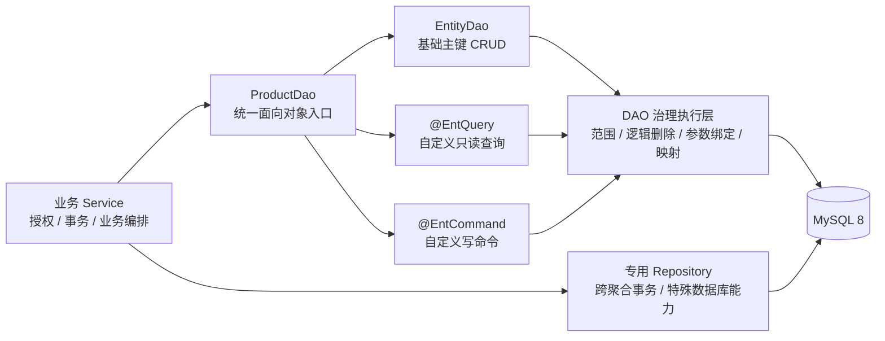
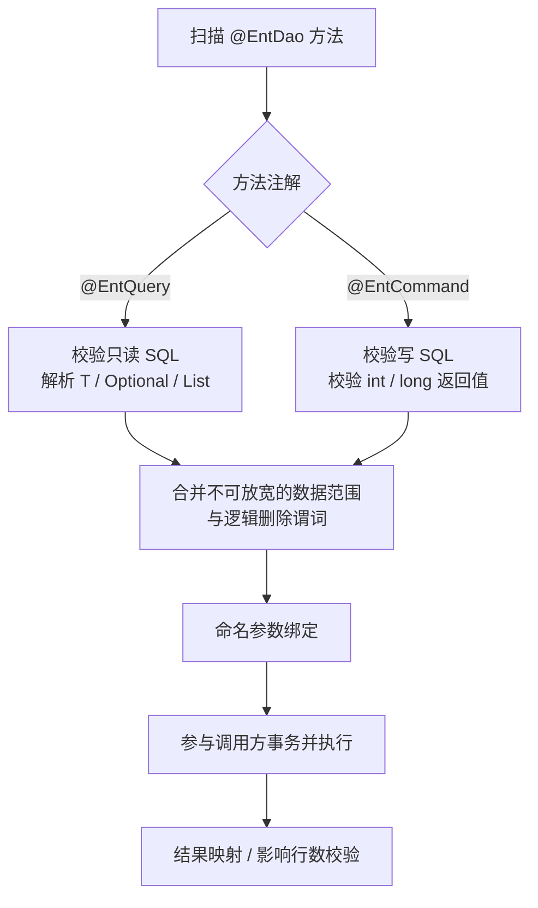

# 实体 DAO 自定义方法

> 状态：Proposal<br>
> 决策日期：2026-09-18<br>
> 关联文档：[实体 DAO](./实体DAO.md)

## 目标

`@EntDao` 不只提供主键 CRUD，还应允许业务以面向对象的方法扩展单实体 DAO。业务 Service 只依赖一个 DAO 接口；框架统一处理 SQL 参数绑定、返回值映射、逻辑删除和数据范围。分页暂不属于首期闭环。

```java
@EntDao
public interface ProductDao extends EntityDao<Product, Long> {

@EntQuery("""
        select *
        from product
        where category_id = :categoryId
          and status = 'AVAILABLE'
        order by id desc
        """)
    List<Product> findAvailableByCategory(Long categoryId);

    @EntCommand("""
        update product
        set price = :price
        where id = :id
        """)
    int updatePrice(Long id, BigDecimal price);
}
```

## 能力边界



- `EntityDao<T, ID>`：保留标准主键 CRUD。
- `@EntQuery`：只允许读取，首期支持单对象、可选对象、列表和 DTO。
- `@EntCommand`：统一承载自定义更新、删除；插入待范围归属规则明确后再加入。
- 专用 Repository：只承载跨聚合事务、复杂批量编排或数据库特有能力，不作为普通自定义查询的默认去处。
- 不提供方法名推导 SQL，查询和命令必须显式表达 SQL。

## 返回类型

结果类型以 DAO 方法的泛型返回类型为唯一来源，不在注解中重复声明 `result = Product.class`。框架在启动期读取 `Method#getGenericReturnType()` 并完成校验。

| 返回类型 | 语义 |
|---|---|
| `T` | 必须返回一条记录 |
| `Optional<T>` | 返回零或一条记录 |
| `List<T>` | 返回多条记录 |
| `int` / `long` | 写命令影响行数 |

`T` 可以是实体或明确的 DTO。首期不支持原始容器、方法级动态泛型和复杂嵌套泛型，例如原始 `List`、`<T> List<T>`、`Map<String, List<T>>`；声明不合法时启动失败。

首期不定义 `Page<T>`、`PageRequest` 或自动 count SQL 合同。

## 查询与命令



两类注解必须拆分，因为读写在允许的 SQL、返回类型、事务提示和影响行数语义上不同：

| 规则 | `@EntQuery` | `@EntCommand` |
|---|---|---|
| 允许 SQL | `SELECT` | `UPDATE`、`DELETE` |
| 实体或 DTO 映射 | 支持 | 不支持 |
| 分页 | 首期不支持 | 不支持 |
| 影响行数 | 不适用 | `int` / `long` |
| 只读事务提示 | 可应用 | 不应用 |

首期不增加 `@EntInsert`、`@EntUpdate`、`@EntDelete`。框架根据 SQL 语句类型校验 `@EntCommand`；出现必须显式区分命令类型的真实需求后，再考虑增加枚举属性。

## 治理规则

自定义方法必须继承 `EntityDao` 的安全边界，不能成为绕过范围治理的旁路：

- SQL 值只能通过命名参数绑定，禁止拼接外部输入。
- 查询、更新和删除默认自动合并已解析的数据范围与逻辑删除谓词；调用参数只能继续收窄，不能覆盖或关闭治理约束。
- SQL 必须通过结构化解析后再改写，禁止通过字符串查找拼接治理条件。首期要求能够确定唯一治理实体、写入目标和安全追加位置；无法证明时启动失败。
- 普通业务方法不提供 `scope = NONE` 一类的逃生参数；确需全量维护时使用职责明确的专用 Repository。
- `@EntQuery` 中出现写语句、`@EntCommand` 中出现读语句或返回类型不匹配时，应用启动失败。
- DAO 自动参与调用方事务，但动作授权和跨聚合事务仍由 Service 负责。

自定义方法与基础 CRUD 使用同一条代理执行链：

```text
@EntDao 代理
  -> 从 DAO 泛型或显式 entity 得到 EntityType
  -> 每次调用解析 EntityAccessScope
  -> 结构化解析并校验 SQL
  -> 追加 RowConstraint 与逻辑删除谓词
  -> 绑定用户参数和框架参数
  -> 通过 GuardedSqlExecutor 参与调用方事务执行
```

代理保持无请求状态，不能缓存请求级范围；自定义方法不得绕过 `EntityDaoFactory.scoped(...)` 或现有受治理 JDBC 执行器。

### 实体推断与 SQL 子集

- 默认从 `@EntDao` 接口的 `EntityDao<T, ID>` 泛型推断治理实体；无法解析确定实体、一个 DAO 涉及多个实体，或 SQL 表无法与实体元数据确认对应时，才要求 `entity = ...` 显式声明。
- 首期支持能够通过结构化解析确定唯一治理实体的单表 SQL，允许普通表别名、`AND/OR` 条件、参数、常量、`IN`、常用函数、投影和 `ORDER BY`。
- 首期拒绝 `JOIN`、子查询、CTE、`UNION`、多表写入、复杂聚合、窗口函数及其他无法确定治理锚点或安全改写位置的语句。
- 别名不是安全边界；治理条件必须追加到已确认的实体表别名上。用户参数禁止使用 `__ent_` 前缀，框架生成参数统一使用该保留前缀。

## 实施范围

采用较小闭环：首期先支持静态显式 SQL、命名参数、实体/DTO/列表/可选对象返回、可确定唯一治理实体的单表查询与更新删除、范围治理和 JDBC 执行。分页、插入范围策略和复杂 SQL 改写暂缓；方法名推导、XML Mapper、任意动态 SQL、ORM Session、脏检查、懒加载和自动关系导航不在首期实现。

框架尚未发布，该能力直接按目标合同重构：删除被替代的“自定义抽象方法一律失败”路径及测试，不保留旧代理、适配层、兼容开关或新旧双轨。

## 实施清单

### 首期闭环

- [ ] 定义 `@EntDao` 自定义方法扫描与启动期校验流程。
- [ ] 支持 `@EntQuery` 静态显式 SQL、命名参数和单表 `SELECT`。
- [ ] 支持 `@EntCommand` 静态显式 SQL、命名参数和单表 `UPDATE` / `DELETE`。
- [ ] 首期限制为可确定唯一治理实体的单表 SQL；遇到 JOIN、子查询、CTE、复杂聚合等无法安全改写的语句时启动失败，并提示改用专用 Repository。
- [ ] 支持实体、明确 DTO、`List<T>`、`Optional<T>` 返回类型。
- [ ] 支持 `int` / `long` 写命令影响行数返回；自定义命令默认返回驱动报告的影响行数，单行成功/未命中语义另按方法合同声明。
- [ ] 实现命名参数绑定、结果映射和基础异常处理。
- [ ] 将查询、更新、删除统一纳入已解析的数据范围与逻辑删除治理。
- [ ] 校验调用参数只能收窄数据范围，不能关闭或覆盖治理条件。
- [ ] 统一参与调用方事务；授权和跨聚合事务继续由 Service 负责。
- [ ] 对 SQL 类型、返回类型、参数绑定和治理改写失败执行启动期校验。
- [ ] 补充单表查询、更新、删除、范围治理和非法声明的最小验证用例。

### 首期边界确认

- [ ] 明确专用 Repository 的使用条件：跨聚合事务、复杂批量或数据库特有能力。
- [ ] 明确 SQL 解析失败、返回类型不匹配和治理无法证明安全时的错误信息。
- [ ] 用至少一个真实业务 DAO 样例验证接口合同、事务行为和治理结果。

### 暂缓项目

- [ ] 暂缓 `INSERT` 自定义命令及新增数据的自动范围字段策略，待范围归属规则明确后再实现。
- [ ] 暂缓 `Page<T>`、自动总数查询和复杂分页 SQL，待分页合同与 count SQL 规则稳定后再实现。
- [ ] 暂缓 JOIN、子查询、CTE、复杂聚合等复杂 SQL 的结构化改写支持。
- [ ] 暂缓方法名推导 SQL、XML Mapper 和任意动态 SQL。
- [ ] 暂缓 `@EntInsert`、`@EntUpdate`、`@EntDelete` 等更细粒度注解。
- [ ] 暂缓 ORM Session、脏检查、懒加载和自动关系导航。
- [ ] 暂缓原始容器、方法级动态泛型和复杂嵌套泛型返回值。
