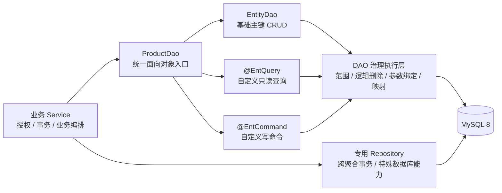
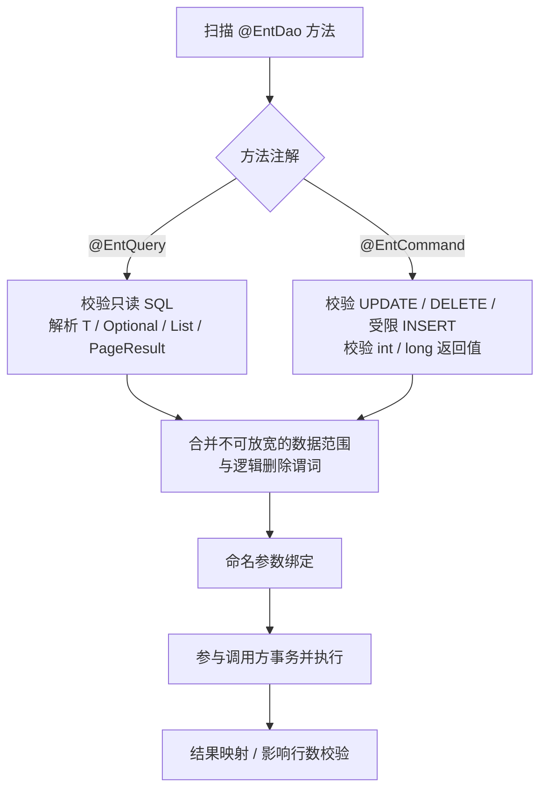

# 实体 DAO 自定义方法

> 状态：Current（单表自定义 SQL、安全修复、页码分页、JavaBean 对象参数路径、受限单行 INSERT、构造器/record 投影与 Starter 真实代理验收已实现）<br />
> 决策日期：2026-09-18<br />
> 最近核验：2026-09-21<br />
> 关联文档：[实体 DAO](./实体DAO.md)

## 目标

`@EntDao` 不只提供主键 CRUD，还应允许业务以面向对象的方法扩展单实体 DAO。业务 Service 只依赖一个 DAO 接口；框架统一处理 SQL 参数绑定、返回值映射、逻辑删除、数据范围和单表页码分页。分页实现与边界见[统一读写与分页设计第 8 节](./实体DAO统一读写与分页设计.md#8-entquery-页码分页实施方案)。

```java
@EntDao
public interface ProductDao extends EntityDao<Product, Long> {

@EntQuery("""
        select *
        from product
        where category_id = :categoryId
          and status = 'AVAILABLE'
        order by id desc
        """)
    List<Product> findAvailableByCategory(Long categoryId);

    @EntCommand("""
        update product
        set price = :price
        where id = :id
        """)
    int updatePrice(Long id, BigDecimal price);
}
```

## 当前复核结论

首期基础能力与本轮安全修复已经完成；当前实现仍严格限制在下述 SQL 子集内，超出边界的声明继续在启动期拒绝：

- 原始 `WHERE` 含 `OR` 时，治理条件必须与完整业务条件组合为 `(业务条件) AND (治理条件)`，不能直接在原字符串末尾追加 `AND`。
- SQL 注释必须在启动期拒绝，至少拒绝 `--`、`#` 和 `/* */`，避免治理条件被注释吞掉。
- 顶层逗号多表、别名后的第二张表和多表写入必须拒绝；只识别第一张表不足以证明治理安全。
- `T` / `Optional<T>` 查询必须限制最多读取两行，不能先把无界结果集全部加载到内存再判断基数。
- 标注自定义注解的方法必须始终参与启动期校验；不能通过重写 `EntityDao` 基础方法或声明 `default` 方法绕过校验。
- 用户参数绑定必须沿用实体字段的 JDBC 类型规范化策略；无法可靠推断参数字段类型时，首期应拒绝声明。

上述问题属于实现约束，不改变业务接口目标；无法证明安全的 SQL 统一判定为不支持，并提示改用专用 Repository。

## 能力边界



- `EntityDao<T, ID>`：保留标准主键 CRUD。
- `@EntQuery`：只允许读取，首期支持单对象、可选对象、列表和 DTO。
- `@EntCommand`：统一承载自定义更新、删除和受限单行 INSERT；复杂写入继续交给专用 Repository。
- 专用 Repository：只承载跨聚合事务、复杂批量编排或数据库特有能力，不作为普通自定义查询的默认去处。
- 不提供方法名推导 SQL，查询和命令必须显式表达 SQL。

## 返回类型

结果类型以 DAO 方法的泛型返回类型为唯一来源，不在注解中重复声明 `result = Product.class`。框架在启动期读取 `Method#getGenericReturnType()` 并完成校验。

| 返回类型 | 语义 |
|---|---|
| `T` | 必须返回一条记录 |
| `Optional<T>` | 返回零或一条记录 |
| `List<T>` | 返回多条记录 |
| `PageResult<T>` | 返回单表分页记录与 `hasNext` / 可选 `total` |
| `int` / `long` | 写命令影响行数 |

`T` 可以是实体或明确的 DTO。DTO 支持无参 JavaBean、参数名可见的不可变构造器和 record；结果列标签按字段/组件名匹配，支持 `camelCase` 与 `snake_case`。record/构造器的必需列缺失或基本类型接收 SQL `NULL` 时失败，未知列忽略，重复列标签不纳入合同。首期不支持原始容器、方法级动态泛型和复杂嵌套泛型，例如原始 `List`、`<T> List<T>`、`Map<String, List<T>>`；声明不合法时启动失败。

分页查询使用 `PageQuery` 与 `PageResult<T>`。方法必须声明唯一 `PageQuery` 参数；默认 `CountMode.NONE` 通过多取一条返回 `hasNext`，`CountMode.ALWAYS` 返回精确 `total`。分页只支持单表实体或明确 DTO，业务 SQL 不得自带 `LIMIT/OFFSET`。

## 查询与命令



两类注解必须拆分，因为读写在允许的 SQL、返回类型、事务提示和影响行数语义上不同：

| 规则 | `@EntQuery` | `@EntCommand` |
|---|---|---|
| 允许 SQL | `SELECT` | `UPDATE`、`DELETE`、受限单行 `INSERT` |
| 实体或 DTO 映射 | 支持 | 不支持 |
| 分页 | 支持单表页码分页与可选计数 | 不支持 |
| 影响行数 | 不适用 | `int` / `long` |
| 只读事务提示 | 可应用 | 不应用 |

`@EntCommand` 中的 `INSERT` 只支持单表、显式列、单行 `VALUES`，每个值必须是命名参数；只支持 `EntityIdPolicy.EXPLICIT`，主键必须显式绑定且不能为空。范围字段必须显式列出并通过可信范围注入或校验，逻辑删除字段必须绑定未删除初值；常量、函数、批量 `VALUES`、`INSERT SELECT`、upsert、生成主键和联合主键均拒绝。INSERT 返回影响行数，且必须恰好影响一行。

首期不增加 `@EntInsert`、`@EntUpdate`、`@EntDelete`。框架根据 SQL 语句类型校验 `@EntCommand`；出现必须显式区分命令类型的真实需求后，再考虑增加枚举属性。INSERT 的范围校验独立于 UPDATE/DELETE 的 WHERE 追加，不能用 SQL 条件替代新增归属校验。

## 当前参数绑定合同

- 普通 SQL 值按方法参数名绑定，例如 `:id` 对应 `Long id`，编译时须保留 `-parameters`。
- 支持显式 JavaBean 对象属性路径，例如 `:customer.id`、`:filter.customer.id`；根参数不会自动展开为 `:id`、`:name`。路径在启动期校验可读属性，调用期根对象或中间节点为 `null` 时失败，叶子 `null` 沿用现有 JDBC 绑定规则。
- 当前对象路径入参只支持 JavaBean 可读属性；Map、record 入参、方法调用表达式、SpEL、数组下标及任意反射表达式暂不支持。record 仅作为查询结果投影支持。
- 集合只允许用于 IN 参数位置，值统一按 SQL 对应实体字段进行 JDBC 类型规范化。
- `PageQuery` 是专用分页控制参数，不作为普通 SQL 值引用。

## 治理规则

自定义方法必须继承 `EntityDao` 的安全边界，不能成为绕过范围治理的旁路：

- SQL 值只能通过命名参数绑定，禁止拼接外部输入。
- 查询、更新和删除默认自动合并已解析的数据范围与逻辑删除谓词；调用参数只能继续收窄，不能覆盖或关闭治理约束。
- SQL 必须先解析为受限 SQL 结构，再生成治理条件和最终 SQL；分页数据片段与计数片段在解析阶段固定，执行期不得对已绑定 SQL 重新查找、截取子句。首期要求能够确定唯一治理实体、写入目标和安全追加位置；无法证明时启动失败。
- 普通业务方法不提供 `scope = NONE` 一类的逃生参数；确需全量维护时使用职责明确的专用 Repository。
- `@EntQuery` 中出现写语句、`@EntCommand` 中出现读语句或返回类型不匹配时，应用启动失败。
- DAO 自动参与调用方事务，但动作授权和跨聚合事务仍由 Service 负责。

自定义方法与基础 CRUD 使用同一条代理执行链：

```text
@EntDao 代理
  -> 从 DAO 泛型或显式 entity 得到 EntityType
  -> 每次调用解析 EntityAccessScope
  -> 结构化解析并校验 SQL
  -> 追加 RowConstraint 与逻辑删除谓词
  -> 绑定用户参数和框架参数
  -> 通过 GuardedSqlExecutor 参与调用方事务执行
```

代理保持无请求状态，不能缓存请求级范围；自定义方法不得绕过 `EntityDaoFactory.scoped(...)` 或现有受治理 JDBC 执行器。

### 实体推断与 SQL 子集

- 默认从 `@EntDao` 接口的 `EntityDao<T, ID>` 泛型推断治理实体；无法解析确定实体、一个 DAO 涉及多个实体，或 SQL 表无法与实体元数据确认对应时，才要求 `entity = ...` 显式声明。
- 首期支持能够通过受限 AST 确定唯一治理实体的单表 SQL，允许普通表别名、带括号的 `AND/OR` 条件、命名参数、常量、`IN`、白名单函数、投影和 `ORDER BY`。
- 首期禁止 SQL 注释、顶层逗号多表、`JOIN`、子查询、CTE、`UNION`、多表写入、复杂聚合、窗口函数、任意动态 SQL 及其他无法确定治理锚点或安全改写位置的语句。
- 白名单函数仅用于字段表达式；未列入白名单的函数、`FOR UPDATE` 以及 `UPDATE/DELETE` 的排序或分页子句在启动期拒绝，避免改写后语义变化。
- `T` / `Optional<T>` 首期不接受业务侧 `LIMIT/OFFSET`，由框架按方言追加最多两行的限制；`List<T>` 仍不提供分页合同。
- 别名不是安全边界；治理条件必须追加到已确认的实体表别名上。用户参数禁止使用 `__ent_` 前缀，框架生成参数统一使用该保留前缀。

## 实施范围

采用较小闭环：首期支持静态显式 SQL、命名参数、JavaBean 对象属性路径、实体/DTO/列表/可选对象/分页返回、可确定唯一治理实体的单表查询、更新删除和受限单行 INSERT、构造器/record 投影、范围治理和 JDBC 执行。生成主键、批量 INSERT、upsert、Map 投影、Map/record 参数和复杂 SQL 改写继续暂缓；方法名推导、XML Mapper、任意动态 SQL、ORM Session、脏检查、懒加载和自动关系导航不在首期实现。

首期不追求通用 SQL 兼容性。若暂不引入成熟 SQL Parser，则只实现能够覆盖上述语法子集的受限词法和 AST；解析失败、语法超出白名单或治理位置不明确时，启动失败，不继续增加字符串解析特例。

框架尚未发布，该能力直接按目标合同重构：删除被替代的“自定义抽象方法一律失败”路径及测试，不保留旧代理、适配层、兼容开关或新旧双轨。

## 实现与验证入口

- `JdbcEntityDaoCustomMethodExecutor`：受限 SQL 解析、参数绑定、治理与执行。
- `JdbcEntityDaoCustomMethodExecutorTest`：查询与 DTO、写命令、受限 INSERT、构造器/record 投影、OR 治理、安全拒绝、单对象基数、枚举时间及集合、分页与可选计数。
- `JdbcReflectiveMapperTest`：JavaBean、不可变 DTO、record、列别名和 null 映射合同。
- `EntDaoTest`：Starter 扫描、声明校验及代理执行。
- `EntDaoPaginationIntegrationTest`：Spring DAO 分页集成验证。
- `EntDaoCustomMethodIntegrationTest`：Starter 真实代理的 JavaBean 对象参数、record 投影、自定义命令和外层事务回滚验证。

这些为源码及现存测试入口；对象参数、INSERT 和投影阶段的实现与验证记录维护在[实体 DAO 自定义 SQL 一期实施清单](../../../evolution/roadmap/crud/实体DAO自定义SQL一期实施清单.md)。分页实施与既有验收记录继续维护在[统一读写与分页设计第 8 节](./实体DAO统一读写与分页设计.md#8-entquery-页码分页实施方案)。

## 后续实施入口

新增能力、依赖顺序、待办与验收标准统一维护在[实体 DAO 自定义 SQL 一期实施清单](../../../evolution/roadmap/crud/实体DAO自定义SQL一期实施清单.md)。Map/record 参数与 Map 投影仍暂缓；生成主键、批量 INSERT、upsert、JOIN、子查询及复杂 SQL 继续遵守本文限制。
