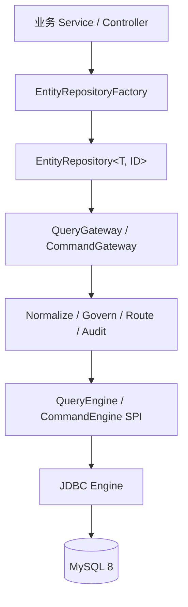
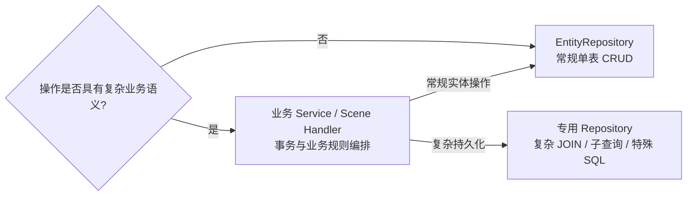
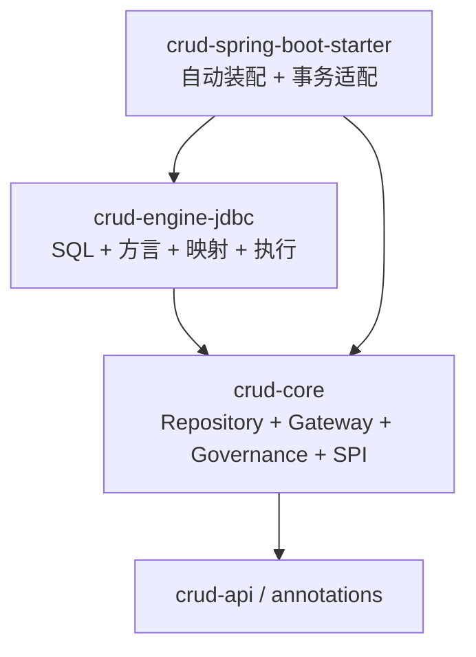

# 实体仓储

> 状态：Current<br>
> 最近核验：2026-09-15

## 定位

`EntityRepository<T, ID>` 面向简单项目和复杂项目中的常规单表操作，提供强类型、低认知成本的实体访问入口。它用于消除无业务语义的 CRUD Service 和重复 Mapper，不替代领域 Service、复杂 SQL Repository 或完整 ORM。

Repository 不是 JDBC 的快捷旁路。所有操作继续经过 Query/Command Gateway，保留权限、数据范围、场景路由、审计和幂等治理。



## 方法闭环

```java
public interface EntityRepository<T, ID> {
    Optional<T> findById(ID id);
    T getRequired(ID id);
    List<T> findAll(EntityQuery<T> query);
    PageResult<T> findPage(EntityQuery<T> query);
    boolean existsById(ID id);
    long count(EntityQuery<T> query);

    ID insert(T entity);
    int updateById(ID id, EntityPatch<T> patch);
    int deleteById(ID id);

    List<ID> insertBatch(List<T> entities);
    int updateBatch(List<EntityUpdate<T, ID>> updates);
    int deleteBatchByIds(Collection<ID> ids);

    T save(T entity);
    List<T> saveBatch(List<T> entities);
    int delete(EntityQuery<T> query);
    int update(EntityQuery<T> query, EntityPatch<T> patch);
}
```

## 核心语义

| 能力 | 当前约定 |
|---|---|
| `findById` | 允许不存在，返回 `Optional.empty()`；多条命中报错 |
| `getRequired` | 记录必须存在，不存在报错 |
| `findPage` | 未指定分页时默认第 1 页、每页 10 条 |
| `count` | 复用精确计数分页链，只返回总数 |
| `insert` | 返回显式主键或数据库生成主键 |
| `updateById` | 使用显式 `EntityPatch`，支持将字段更新为 `null` |
| `deleteById` | 有逻辑删除元数据时逻辑删除，否则物理删除 |
| 批量写 | 使用 `SINGLE_TRANSACTION`，全部成功或全部回滚；无事务管理器时快速失败 |
| `save` | 无主键或主键不存在时新增，主键存在时更新；写入后按主键回查实体 |
| `saveBatch` | 批量保存或更新，事务内按结果主键回查实体 |
| 条件更新/删除 | 必须至少提供一个 `EQ` 或 `IN` 条件，禁止无条件全表写入 |

## 主键策略与启动校验

实体可以显式声明主键写入策略：

```java
@EntCrudEntity(idPolicy = CrudIdPolicy.GENERATED)
class Product {
    private Long id;
}
```

`UNSET` 保持兼容，并按主键字段上的明确持久化注解推断数据库生成策略，包括 JPA `@GeneratedValue(strategy = IDENTITY)`、MyBatis-Plus `@TableId(type = AUTO)` 和 DDL `@EntDbField(generationStrategy = AUTO_INCREMENT/IDENTITY)`。JPA `AUTO`、`SEQUENCE`、`TABLE` 不自动视为数据库生成主键，需要显式配置；没有生成提示时按 `EXPLICIT` 处理。应用生成和联合主键需要显式声明，默认 JDBC 写入链暂不执行联合主键。

Runtime Metadata 注册表在启动阶段校验实体、表、字段、列名、主键、数据库生成主键类型和逻辑删除字段类型。配置错误会在启动期失败，不延迟到第一次 Repository 调用。

## 使用方式

```java
EntityRepository<Product, Long> products =
    repositoryFactory.repository(Product.class, Long.class);

Product saved = products.save(product);

PageResult<Product> page = products.findPage(
    EntityQuery.<Product>builder()
        .eq("status", ProductStatus.ENABLED)
        .like("name", "手机")
        .orderByDesc("createdAt")
        .page(1, 20)
        .build()
);

products.update(
    EntityQuery.<Product>builder().eq("status", ProductStatus.DISABLED).build(),
    EntityPatch.<Product>builder().set("visible", false).build()
);
```

## 适用边界



当前闭环限定为单实体、单表、默认 JDBC 和小批量事务写入。暂不包含级联持久化、脏检查、延迟加载、通用 JOIN、无条件全表更新/删除和强制物理删除。

## 模块边界



当前不新增占位 Maven 模块。先通过 `repository` 包与依赖守卫稳定合同；出现第二种持久化引擎或独立调用者后，再评估提取 `crud-persistence-contract`。

## 实施要点：第一阶段小闭环

以下合同已由当前 Repository 实现落实。面向开发者沿用常见仓储 API 习惯，同时保留 CRUD Gateway 的治理边界。

1. **明确 `save` 的便利方法定位**
   - 保留 `save` / `saveBatch`，按主键先判断新增或更新；不承诺数据库原子 upsert，也不自动保证并发更新不丢失。
   - `save` 更新时提交实体中的可写字段，`null` 会作为明确的新值；主键、只读、不可变和范围字段不会进入更新字段集合。写入后按主键回查，回查失败直接抛出异常。
   - 逻辑删除记录默认不参与存在性判断，因此 `save` 不提供恢复语义；若数据库仍保留同一主键，新增路径会由数据库约束明确失败。恢复需使用后续专用能力。
   - 对并发敏感的业务使用显式新增，或带版本/业务前置条件的更新，并检查影响行数；单纯换成 `updateById` 不构成并发保护。

2. **补齐批量操作合同**
   - 空输入返回空列表或 `0`，不执行数据库写入；非法元素在写入前校验。
   - `insertBatch` 返回主键、`saveBatch` 返回实体均与输入顺序一一对应；数据库生成主键也保持映射，结果缺失时明确失败。
   - 批量更新/删除返回累计影响行数；单项未命中由现有写入未命中分类器抛出，不与数据库执行异常混淆。
   - 非空批量写保持单事务语义，执行或必要回查失败时整体回滚，不返回部分成功结果；不承诺调用方无条件重试安全。

3. **完善条件写入防护**
   - 条件更新/删除至少包含一个 `EQ` / `IN` 条件；`IN` 必须是非空集合，避免空集合扩大写入范围。
   - 条件过滤作为 `targetFilters` 传入 Gateway，治理范围仍由 Gateway 叠加；租户、权限过滤不能替代调用方的写入范围约束。
   - 防护用于拦截误操作，不保证影响行数较少；按状态批量更新等合法操作继续允许，当前不强制影响行数上限或大范围写入开关。

4. **明确删除策略**
   - 保持“有逻辑删除元数据则逻辑删除，否则物理删除”的当前约定，并统一用于按主键、批量和条件删除。
   - 默认查询通过现有 JDBC Query 链排除逻辑删除记录；重复删除通常返回 `0` 并由写入未命中分类器处理。删除审计字段不由 Repository 私自填充。
   - 对配置逻辑删除的实体，强制物理删除不纳入当前闭环；恢复能力暂缓。

5. **统一影响行数与异常说明**
   - 保留 `int` 返回值；`0` 可能表示未命中、治理过滤或数据库更新计数差异，不据此推断唯一业务原因。
   - 复用现有异常体系处理参数非法、记录不存在、结果不唯一、约束冲突、事务能力缺失和数据库执行失败，不新增通用 Result 包装。
   - 当前测试覆盖空批量、主键顺序、条件写保护、批量事务委托、`save` 回查，以及 H2 真实 JDBC 下的自增主键、逻辑删除、影响行数和事务回滚；MySQL 方言差异仍需单独验收。

## 暂缓事项

| 事项 | 暂缓范围与后续触发条件 |
|---|---|
| 字段类型安全 | 暂不新增完整字段 DSL；当前类型安全主要覆盖实体与主键，字段名仍需元数据校验。出现明确易用性需求后再增强。 |
| 模块与 SPI 拆分 | 维持现有包和依赖边界，出现第二种引擎或独立调用者后再评估拆分。 |
| Gateway 上下文文档完善 | 后续补充操作者、租户、场景和幂等信息的传递及异步边界；当前继续复用已有治理链，若核验发现治理丢失则及时修复。 |
| 分页与计数细化 | 后续补充分页上限、稳定排序、`count` 对分页和排序的处理；深分页优化按实际性能需求推进。 |
| 批量规模与分片 | 后续确定批量大小限制和分片策略；当前保持小批量单事务，分片不得隐式改变原子性。 |
| 高级写入保护 | 影响行数上限、大范围写入显式开关、统一乐观锁及原子 upsert 按业务需求引入。 |
| 事务抽象与删除扩展 | 暂不为无事务环境新增执行策略，也不新增恢复或强制物理删除 API。 |
