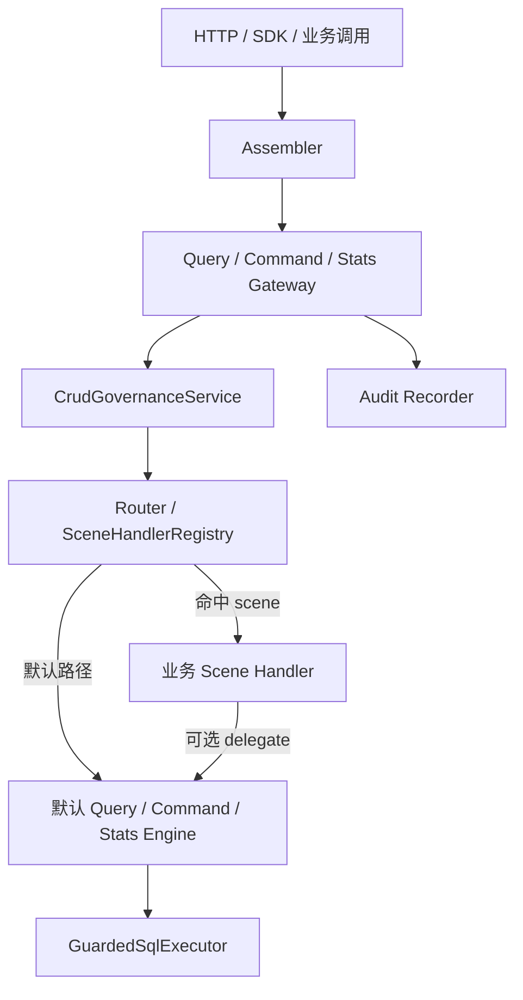

# CRUD 运行时架构

> 状态：Current
> 最近核验：2026-08-21

CRUD 运行时由统一 Gateway、治理主链、Scene 路由和默认 Engine 组成。

## 运行规则

- Assembler 只负责把外部 DTO 转为不可变 Spec。
- Gateway 固定执行治理、路由/执行与审计，不允许 Handler 绕过治理。
- 治理在资源识别后、Permission 前执行 Scene Policy；`ACTION`、`IMPORT`、`EXPORT` 未匹配
  `accessEntry + resource + operationKey + scene` 时 fail-closed。
- Scene Policy 注册表在 Spring 启动期收集业务 `ScenePolicy` Bean 后冻结；重复 key 直接拒绝启动。
- HTTP 入口由 Controller 注入可信 `portal=http`；SDK 入口通过服务端
  `CrudInvocationContext` 提供 portal，Spec attributes 中的同名客户端值会被剔除。
- Policy 匹配得到的 `accessEntry`、`portal`、`capability`、`policyMatched` 和
  `policyRejectionReason` 会进入治理审计日志与 JDBC 审计表。
- 非空 scene 未命中 Handler 时失败；空 scene 可进入默认 Engine。
- `ACTION` 没有默认执行路径，必须由业务 Handler 处理。
- 默认 JDBC Engine 只消费治理后的 Spec 和唯一 Runtime Model。
- 直接调用底层 Engine 不自动获得 Gateway 的主体、权限、范围和审计保证。

Query/Command 的 Spec 与路由合同见 [协议与路由](查询命令协议.md)，治理阶段见
[治理 Pipeline](../../core/governance/治理流水线.md)，SQL 编译规则见 [Default Engine](默认引擎.md)。

## Spring 装配

`CrudAutoConfiguration` 导入 Core 与 Web 配置。Core 按公共能力、幂等、安全、Stats、Query、Command
和 Gateway 的依赖顺序装配；Web Controller 默认关闭。

Starter 的配置、自动配置、模块配置和事务适配入口统一位于 `com.entloom.crud.starter.*`；旧的
`com.entloom.crud.spring.config` 包不再作为实现或公开入口。

主要替换点：

| SPI | 默认实现 |
|---|---|
| `EntityMetaRegistry` | `CrudRuntimeModelBackedEntityMetaRegistry` |
| `CrudSubjectResolver` | `FailClosedCrudSubjectResolver` |
| `CrudPermissionService` | `RuleBasedCrudPermissionService` |
| `CrudDataScopeResolver` | `DefaultCrudDataScopeResolver` |
| `QueryEngine` | `JdbcQueryEngine` |
| `CommandEngine` | `RegistryBackedCommandEngine` |
| `StatsQueryExecutor` | `JdbcStatsQueryExecutor` |

业务必须提供真实主体来源，并按业务需要替换权限、范围和审计实现。Runtime Model 由
`ResourceCatalogAdapter` 汇聚，在启动期校验、构建并冻结。

业务 ACTION 还必须显式提供 `ScenePolicy` Bean。普通空 scene CRUD 不要求 Policy；这保证新增
高风险场景默认不可进入，同时不改变基础 CRUD 的请求与结果合同。
