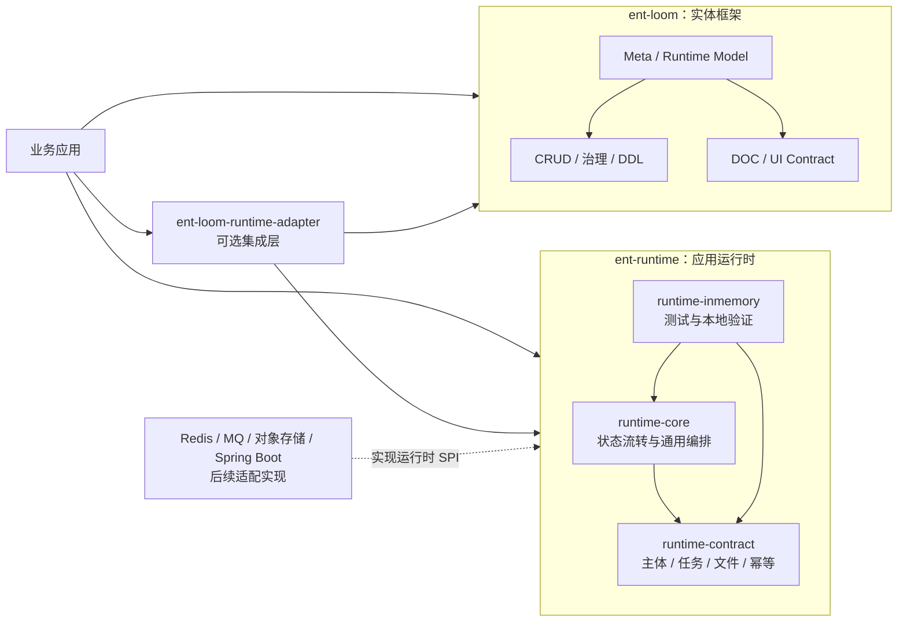

# baoyi-cloud 与 ent-loom 能力边界

> 状态：Current
> 最近核验：2026-09-02
> 性质：跨仓库架构边界

本文将 `baoyi-cloud` 的非业务能力盘点，映射为 `ent-loom` 与独立应用运行时的职责边界。`baoyi-cloud` 仅作为能力来源和对照样本；当前事实以 `ent-loom`、`ent-runtime` 的代码与文档为准。

分层取舍见[应用运行时与实体框架分层决策](../../evolution/decisions/core/应用运行时与实体框架分层决策.md)。

## 核心结论

`ent-loom` 面向实体编程，负责“实体如何被描述、治理和操作”；`ent-runtime` 面向应用运行时，负责“请求如何被认证、任务如何执行、文件如何存储、数据如何缓存、消息如何传递”。两者不应通过实体字段或业务模型形成直接耦合。



依赖方向固定为：

```text
业务应用 -> ent-loom
业务应用 -> ent-runtime
ent-loom-runtime-adapter -> ent-loom + ent-runtime
ent-runtime -X-> ent-loom
ent-loom 核心 -X-> ent-runtime
```

适配层属于 `ent-loom` 一侧的可选集成模块，因为它需要理解实体 CRUD、治理和任务文件语义；它不应反向进入 `ent-runtime`。

## 能力盘点映射

| 能力块 | `baoyi-cloud` 对照位置 | 归属建议 | `ent-loom` 当前事实 |
|---|---|---|---|
| 实体建模与实体操作 | `CommonDataService`、多表查询、基础 CRUD | `ent-loom` | 已有 Meta、CRUD Query/Command/Stats/Import/Export、治理和 JDBC 执行主链，不重复搬运旧服务抽象 |
| DDL、文档和 UI 描述 | `framework-*` 中的生成和平台描述能力 | `ent-loom` | 已有 DDL、DOC 和 UI Contract；UI Meta Adapter 仍按现有路线管理 |
| 认证主体与上下文 | `parent-module-jwt`、`parent-module-login`、`parent-service-dependence/auth` | 独立运行时；实体授权由适配层接入 | 已有 `SubjectContext`、权限和数据范围 SPI，没有 JWT、登录、用户表和完整主体传播实现 |
| 缓存、分布式锁与幂等 | `framework-cache`、`framework-lock`，以及 CRUD 幂等代码 | 独立运行时 | CRUD 已有 JDBC 幂等能力；Redis/Caffeine、多级缓存、广播失效和 Redisson 锁不属于当前 Core |
| 异步任务、游标和 Worker | `parent-module-cursor-sync`、`BaseExecuteJob`、`BaseSqlExecuteJob` | 独立运行时 | 已有任务模型、幂等和本地任务文件，但没有持久化游标、可恢复批处理、调度器和统一 Worker |
| 对象存储与文件生命周期 | `parent-module-file-storage`、`parent-service-dependence/upload` | 独立运行时 | 已有本地/内存小文件抽象和下载预检；对象存储、流式读写、预签名 URL、清理 Worker 尚未实现 |
| 消息传输与通知中心 | `framework-message`、`framework-mq-rabbit`、`parent-module-user-msg` | 独立运行时 | 尚无 RabbitMQ、跨服务消息、邮件、短信、站内信和 WebSocket 通知中心 |
| 灰度路由 | `parent-starters/gray-routing` | 应用平台运行时 | 不属于 `ent-loom` 实体核心，按真实网关/服务治理消费者单独建设 |
| 通用应用运行时 | `parent-common-service`、`parent-service-dependence/config` | 独立 Starter 或平台层 | JSON 规范、XSS、国际化错误、Feign 重试、统一线程池和请求监控不属于当前实体框架核心 |
| 代码生成与开发工具 | `framework-generator` | 独立工具或实体侧可选扩展 | 已有 Runtime Model 和 DDL/DOC/UI Contract，尚无完整的 Entity/Service/Controller/UI/权限代码生成器 |
| MyBatis-Plus 适配 | `framework-mybatis-plus` | 独立持久化适配 | 当前默认是 JDBC Engine；MyBatis-Plus BaseService、Wrapper、枚举处理器和自动填充另行评估 |
| 枚举入库与字典初始化 | `framework-enums` | 实体侧可选扩展 | 已有元数据枚举语义，没有自动初始化数据库配置数据的完整实现 |

## 当前已覆盖的主线

`ent-loom` 当前已经覆盖实体框架的主要能力，不应因盘点 `baoyi-cloud` 而重新引入一套通用 CRUD：

- Meta 解析、来源裁决、诊断和组件 Runtime Model；
- CRUD 的 Query、Command、Stats、Import、Export；
- 主体、资源、权限、数据范围和审计治理；
- DDL 结构模型、MySQL 8 执行和受控差异；
- DOC、UI Contract 以及跨模块静态投影；
- CRUD 范围内的本地/内存任务文件和 JDBC 幂等。

`ent-runtime` 当前只验证最小运行时闭环：

```text
SubjectContext -> Idempotency -> Task -> FileRef
```

它还没有把 JWT、Redis、MQ、对象存储和持久化 Worker 写成已支持能力。详细范围见独立仓库的[运行时基础设施边界](https://github.com/ent-loom/ent-runtime/blob/main/docs/architecture/%E8%BF%90%E8%A1%8C%E6%97%B6%E8%BE%B9%E7%95%8C.md)。

## 不应下沉到框架核心的内容

支付、余额/额度、用户文件目录、用户任务步骤、国家货币、商品同步等属于通用平台业务或具体领域业务。它们可以使用 `ent-loom` 和 `ent-runtime`，但不应进入任一核心 Contract；消息载荷也应使用独立 DTO 或事件信封，不直接传递数据库实体。

## 推荐优先级

横切运行时需要尽早确定 Contract，但实现仍按一个可验收的纵向闭环推进：

1. 主体上下文，以及主体在请求、线程、任务和消息间的传播语义。
2. 幂等、缓存和分布式锁的键空间、作用域、租约与失败语义。
3. 任务状态、重试、取消、进度、游标和 Worker 执行语义。
4. 文件引用、归属、过期、访问控制、对象存储和清理语义。
5. 消息信封、事件 ID、版本、重复消费、重试和通知渠道。

首个推荐验证场景是异步导出：

```text
SubjectContext
  -> CRUD 查询与实体治理
  -> 幂等
  -> Task 创建、进度与失败
  -> FileRef 保存结果
  -> 下载与权限校验
```

上图是目标验证路径，不表示当前已经具备真正的异步线程池、分布式 Worker、对象存储或消息通知。
