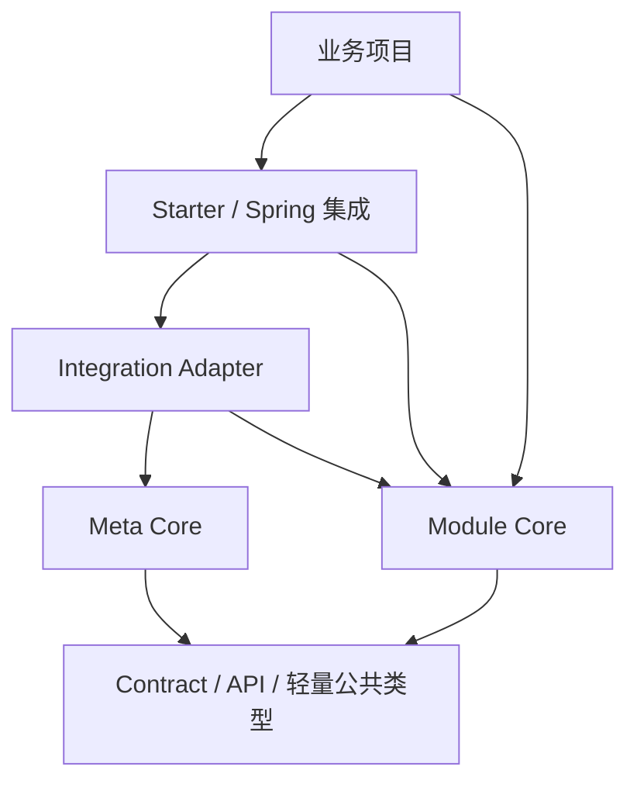

# 组件边界与依赖规则

> 性质：Core Contract
> 状态：Current
> 最近核验：2026-08-20

本文定义 ent-loom 中 Contract、Annotations、Core、Adapter、Starter 和业务项目之间的稳定依赖方向。具体模块清单以根 Maven Reactor 为准。

## 分层

箭头表示允许的主要依赖方向。Adapter 是 Meta 与组件模型之间的桥，不把两个 Core 合并成同一个运行时。

## 不变量

1. Module Core 不依赖 Spring Boot Starter、Servlet 或业务项目。
2. CRUD、DDL、DOC、UI Core 不依赖 `ent-loom-meta-core` 才能运行。
3. 通用 Meta 投影放在 `ent-loom-integrations`，不放进目标 Module Core。
4. Starter 只负责装配、配置和框架适配，不定义领域合同。
5. annotations 模块保持轻量，不依赖 Starter 或执行引擎。
6. 业务项目可以提供 Convention、Handler 和治理实现，但不能反向成为框架 Core 的依赖。

## 模型所有权

| 模型 | 所有者 | 其他模块如何使用 |
|---|---|---|
| Meta Descriptor | `ent-loom-meta-contract/core` | Adapter 读取并投影 |
| CRUD Runtime Model | `ent-loom-crud-core` | CRUD Registry、Gateway 和 Engine 消费 |
| DDL Runtime Model | `ent-loom-ddl-core` | DDL 方言和迁移执行消费 |
| Doc Runtime Model | `ent-loom-doc-core` | 文档查询和输出消费 |
| UI Contract | `ent-loom-ui-core` | UI Adapter 或渲染端消费 |

不存在跨模块共享的万能 `EntityMeta`。共享的是来源、贡献、诊断等裁决契约，以及可投影的通用语义。

## Adapter 规则

- 输入是来源明确的 Meta Descriptor 和目标组件原生模型片段。
- 输出是目标组件拥有的 Runtime Model。
- Adapter 不执行查询、写入、建表、渲染或权限判断。
- Adapter 不依赖 Bean 加载顺序决定同级冲突。
- 没有 Adapter 时，目标组件的 Native Parser 仍能独立工作。

## Starter 规则

- 收集配置和扩展 Bean，构造冻结后的运行时对象。
- 条件装配必须可测试，缺少可选模块时不创建半成品 Bean。
- 自动配置包名、配置 Key 和公开 Bean 是外部契约，变更前需要回归门禁。
- Spring 事务、HTTP 和 JDBC 适配留在集成层，不反向污染 Core。

## 变更门禁

修改依赖方向、模型所有权或公开装配入口时，至少同步检查：

1. Maven 依赖树和循环依赖。
2. ArchUnit 或等价架构守卫。
3. Native-only 与 Meta-enabled 两条路径。
4. Starter 条件装配和最小启动测试。
5. 对应 Component Architecture 和 Evolution Decision。
