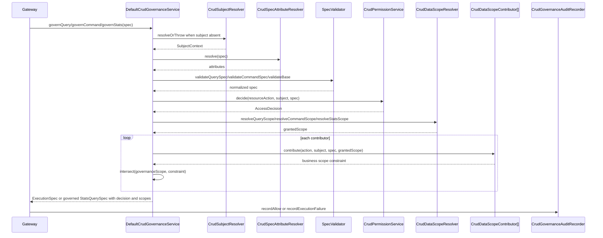
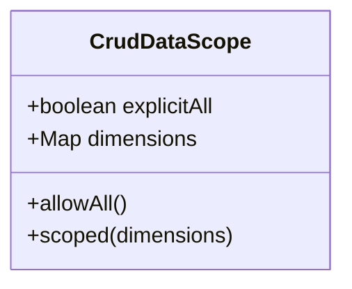
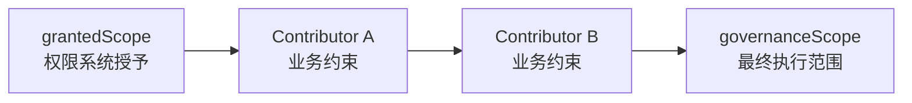

# 权限治理 Core 架构

`DefaultCrudGovernanceService` 是 Query、Command、Stats 的共同治理主链。它不执行 SQL，也不做业务路由，只负责把请求 Spec 转成可执行 Spec，并在成功、拒绝、执行失败时记录审计。

## 主链顺序



## 主体规范化

`CrudSubjectNormalizer` 会复制并 trim `SubjectContext`。当前核心规则是 fail closed：

- `subject` 最终不能为空。
- `subject.subjectId` 必须有值。
- `tenantId`、`orgId` 允许为空，但默认数据范围解析会优先使用 `orgId`，其次使用 `tenantId`。

如果业务没有覆盖 `CrudSubjectResolver`，默认 `FailClosedCrudSubjectResolver` 会使请求无法通过。

## 权限判定

`CrudResourceAction` 的构造规则：

```text
resource = EntityMetaRegistry.getResourceDescriptor(rootType).resourceCode
action   = QueryOperation、CommandOperation 或 STATS 名称
scene    = spec.scene
```

默认 `RuleBasedCrudPermissionService` 按配置规则顺序匹配：

- `resource/action/scene` 支持 `*` 通配。
- `subjectIds/tenantIds/orgIds` 为空表示不限制。
- 无匹配规则会抛 `PermissionDeniedException`。
- 返回 `DENY` 会抛 `PermissionDeniedException`；`ALLOW/FILTER/MASK` 可通过，当前执行器主要消费数据范围。

## 数据范围模型



默认 `DefaultCrudDataScopeResolver` 解析顺序：

1. `attributes["crudDataScope"]` 是 `CrudDataScope` 时直接使用。
2. `attributes["crudExplicitAll"] == Boolean.TRUE` 时使用 `allowAll()`。
3. `attributes["crudDataScopeDimensions"]` 是非空 Map 时使用 `scoped(map)`。
4. 否则用 `subject.orgId` 生成 `orgId` 维度。
5. 再否则用 `subject.tenantId` 生成 `tenantId` 维度。
6. 仍为空则返回 null，治理链会拒绝。

## 范围交集



交集规则：

- 业务约束为 null 或 `allowAll` 时不收窄。
- 原治理范围为 `allowAll` 时，直接采用业务约束。
- 同一维度同时存在时取集合交集。
- 交集为空、约束值为空、最终维度为空都会抛 `DataScopeDeniedException`。

## 属性贡献与保留键

框架保留键：

- `crudDataScope`
- `crudDataScopeDimensions`
- `crudExplicitAll`

`DefaultCrudSpecAttributeResolver` 会先从请求属性中移除保留键，再合并 `CrudSpecAttributeContributor` 的返回值。这样调用方不能直接通过 HTTP options 或普通 spec attributes 绕过治理；业务贡献器仍可显式贡献受控范围。

business v2 的 `BusinessAccessEntrySpecAttributeContributor` 通过 `CrudRequestContextHolder` 读取 Controller 注入的 accessEntry，并写入业务保留属性。

## 审计语义

| 时机 | outcome | reason |
|---|---|---|
| 治理阶段拒绝 | `GOVERNANCE_DENIED` | 由 `CrudErrorCode` 映射 |
| 执行成功 | `SUCCESS` | `NONE` |
| 执行阶段异常 | `EXECUTION_FAILED` | `CrudException.errorCode` 或 `EXECUTION_FAILED` |

`Gateway` 负责在执行成功后调用 `recordAllow`，在执行异常时调用 `recordExecutionFailure`。治理服务内部只在治理阶段异常时记录 deny。
