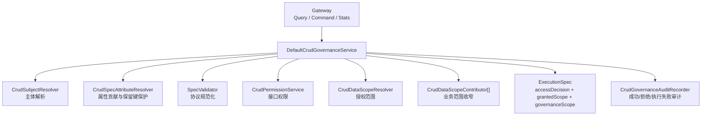

# 权限治理架构索引

治理链是框架的强约束边界：所有 Query、Command、Stats 都必须先经过 `CrudGovernanceService`，再进入路由或执行器。默认治理实现已经形成闭环，但具体主体、权限、范围通常由业务覆盖。

## 治理层级

## 默认与业务覆盖

| SPI | 框架默认实现 | business v2 当前实现 |
|---|---|---|
| `CrudSubjectResolver` | `FailClosedCrudSubjectResolver` | `BusinessV2CrudSubjectResolver` 读取登录主体、学校上下文和访问范围 |
| `CrudPermissionService` | `RuleBasedCrudPermissionService` | `BusinessV2CrudPermissionService` 基于 `ResourcePolicy`、角色和访问入口判断 |
| `CrudDataScopeResolver` | `DefaultCrudDataScopeResolver` | `BusinessV2CrudDataScopeResolver` 转为 school/class/student/grade 维度 |
| `CrudGovernanceAuditRecorder` | `LoggingCrudGovernanceAuditRecorder` + optional JDBC | `BusinessV2CrudGovernanceAuditRecorder` 输出业务审计日志 |
| `CrudSpecAttributeContributor` | 无默认业务贡献 | `BusinessAccessEntrySpecAttributeContributor` 注入 accessEntry |
| `EntityMetaRegistry` | `CrudRuntimeModelBackedEntityMetaRegistry` | `ResourceCatalogAdapter` 输出 `CrudRuntimeModel` 后统一冻结 |

## 推荐阅读

- 核心链路、错误语义和数据范围交集：见 [权限治理 Core 架构](core-architecture.md)。
- 默认 SQL 如何应用 `governanceScope`：见 [Default Engine 当前实现](../../components/crud/default-engine.md)。
- business v2 如何桥接现有资源策略：见 [业务接入模板](../../../guides/crud/integration-template.md)。
