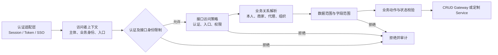
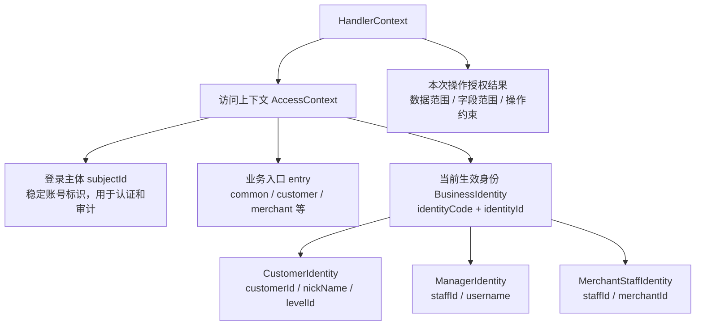
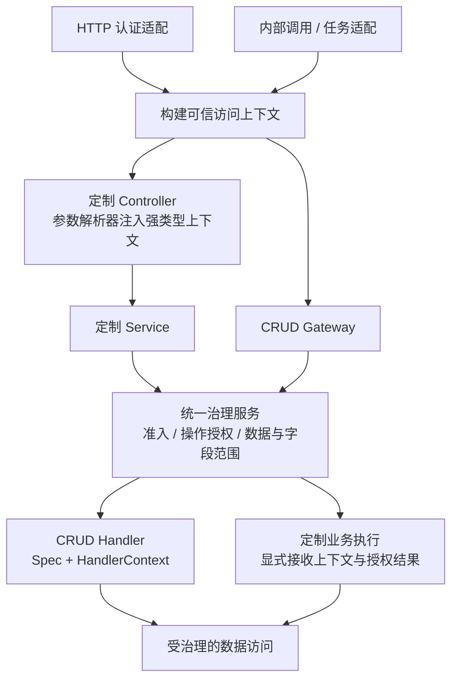
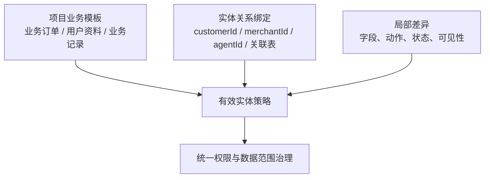
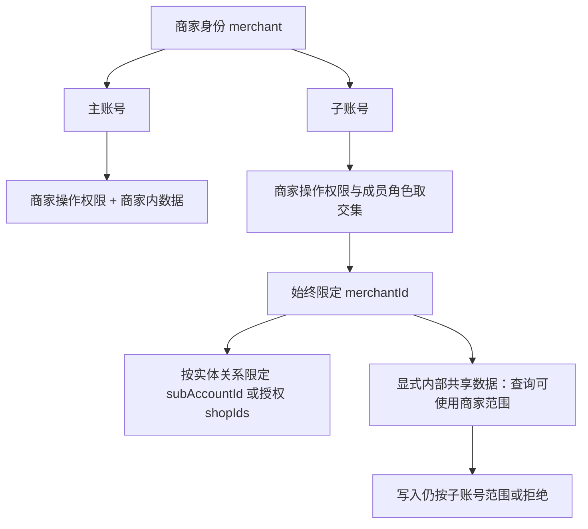
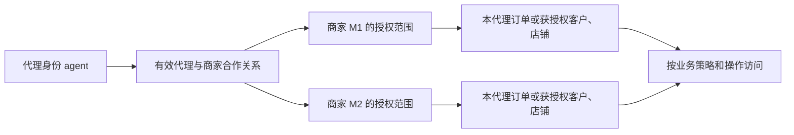
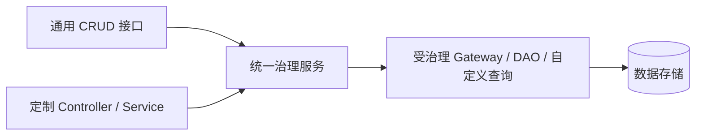

# 业务实体访问治理设计

> 状态：Proposal；本文为设计约定，框架实现覆盖度须另行核验。
> 目的：在保持完整治理能力的前提下，让项目内大部分实体通过少量业务归纳即可获得清晰、可解释的默认规则。

## 核心结论

- **登录主体**标识实际账号，**业务身份**表示“以谁的资格办事”；**入口**只组织路由，业务策略统一授权，专属接口可追加身份限制。
- 项目身份统一为 `customer / merchant / agent / platform`；`common` 是共用入口，不是身份，也不代表匿名访问。
- 业务接口默认要求已认证主体。匿名访问、可选认证是少量能力的显式例外；无效凭证不能静默降级为游客。
- 实体授权按“业务类别 + 业务关系 + 操作”归纳。普通实体选择项目模板并绑定归属关系，特殊实体仍可完整声明规则。
- CRUD 是默认接入方，不是治理边界。定制业务和独立编排应能直接调用同一套治理服务、关系解析和数据范围能力。
- 简化来自项目约定和模板复用，不删减权限、数据范围、字段、状态、审计等架构能力。

## 统一判断模型



## 身份与入口

- 身份类型由项目 Java 枚举注册，框架不固化业务身份；岗位角色可动态配置。
- 不单独维护 `entries.allow`，不在普通实体策略中重复声明入口。接口必须绑定业务策略和操作；入口名称来自服务端路由元数据，不产生授权。
- 客户调用商家路径下的 `order.view`，若接口未追加商家身份限制，则按客户策略访问自己的订单；需要商家专用时，在接口显式限制身份。
- 默认要求登录。公开能力显式声明 `anonymous`；需要匿名与登录差异的能力使用 `optional`。进入 `common` 保留当前身份与范围，不合并权限。

## 强类型访问上下文

以下为拟议契约，尚不表示现有 API 已实现。采用“统一上下文内核 + 项目强类型身份 + 调用链显式传递”。



- 一个请求使用一个当前生效身份；账号可拥有多个身份或成员关系，切换时由服务端验证。进入 `common` 保留当前身份及归属，不合并其他身份权限。
- 框架定义身份基础接口；项目定义具体身份类及身份 code，类型优先使用项目枚举。业务字段保留自身语义，不统一成大量可空字段或字符串属性 Map。
- `nickName`、`username` 分别属于具体身份；需要统一展示时可增加 `displayName`。`isDemo` 按实际含义归属账号、租户或会话，避免混淆。
- 身份对象是不可变快照，可携带常用冗余信息。一次请求统一加载并复用，不直接暴露持久化实体，也不要求全部写入 Token。
- 缓存需有刷新、失效机制；等级影响价格或权益、演示标记限制写入等关键规则，应在对应业务或治理环节验证，不能仅凭过期快照放行。

### 公开接口与登录身份

允许匿名且需要利用登录身份的 `common` 接口声明 `authentication: optional`：无凭证时提供匿名访问上下文；有效凭证时提供完整当前身份；无效或过期凭证认证失败，不静默降级。已认证请求仍校验接口身份限制和业务授权。

匿名和多身份接口使用 `VisitorContext`，通过 `findIdentity(CustomerIdentity.class)` 等类型化方法返回 `Optional`；必须登录且固定身份的接口使用 `AccessContext<CustomerIdentity>`。`anonymous` 表示公共能力，其已有凭证解析语义需在实现前明确；上述个性化公开场景统一使用 `optional`。

### Controller 与 CRUD Handler 共用



| 接入位置 | 建议形式 | 说明 |
| --- | --- | --- |
| 专属 Controller | `@CurrentAccess AccessContext<CustomerIdentity>` | 参数解析器读取泛型，校验当前身份后注入 |
| 公共 Controller | `@CurrentAccess VisitorContext` | 显式处理匿名与多种当前身份 |
| 通用 CommandHandler / QueryHandler | `方法(Spec, HandlerContext)` | 使用 `context.getAccess().requireIdentity(CustomerIdentity.class)` 取得强类型身份 |
| 专属身份 Handler，可选扩展 | `IdentityCommandHandler<P, R, I>` 等 | 显式声明 `identityType()`，框架校验后提供类型化上下文 |

- Controller 按需声明上下文参数；所有接口仍统一执行准入。泛型表达类型要求，运行时必须校验，不能自动切换身份。
- `Spec` 表达业务请求；`HandlerContext` 表达可信执行信息。身份与授权结果由服务端构建，不能被请求参数覆盖。
- 上下文契约保持框架无关；Service、Handler 显式接收上下文或所需身份，不将请求身份存入单例成员字段。异步任务显式传递必要快照，延后执行的敏感操作重新授权。
- 身份匹配不等于操作获准；Controller 和 Handler 都必须遵守本次操作的数据、字段与动作约束。
- 优先落地统一身份快照、Controller 参数注入、Handler 显式上下文及 `requireIdentity(Class<I>)`；专属 Handler 泛型作为后续便利扩展，不传播到所有 Spec、路由和引擎。

## 实体策略归纳

项目可按自身定位定义模板，例如公共配置类、用户资料类、业务记录类、业务订单类、平台内部类。模板只提供默认规律；实体绑定字段或关系解析器，缺少模板要求的关系时应在启动或编译阶段报错。



## 策略归类与缺省约定

优先复用业务类别策略，不为每个实体重复定义权限。旧项目 `auth` 目录使用的是分类接口，并非注解；未来可以由接口或注解选择策略，无须同时维护 YAML 绑定。

| 旧项目分类 | 对应策略含义 |
| --- | --- |
| `IOpenConfigClass` | 开放配置：各身份查询，平台维护 |
| `IAdminClass` | 平台专用 |
| `IUserDataClass` | 用户数据：按归属维护 |
| `IUserRecordClass` | 业务记录：对外查询，受控业务逻辑新增 |
| `IUserOrderClass` | 订单：按身份与动作授权 |
| `IOpenConfigMainClass` | 沿用开放配置策略，补充启用、排序字段契约 |
| `IOpenSubUserQuery / Change` | 子账号数据范围的补充规则，不自动成为独立身份或完整策略 |

- `OrderMain` 默认实体标识为 `orderMain`；显式实体元数据优先。同名策略免绑定，复用异名策略时声明 `policy: order`。
- 简单归属默认按身份名匹配双方的 `customerId / merchantId / agentId`；复杂关系显式指定解析器。缺少所需策略、字段或解析器时启动报错，不退化为全量访问。
- 创建时服务端填充当前身份对应的归属；其他归属按业务规则验证，更新不得绕过授权转移归属。

## 商家主账号与子账号

主账号、子账号统一使用 `merchant` 身份。`merchantId` 是商家边界，`subAccountId` 和授权 `shopIds` 表达内部数据范围；只有具备独立租户语义时才另建二级租户模型。



- 子账号约 95% 的接口能力通过复用商家策略、叠加成员角色限制实现，不复制整套策略，也不默认允许未知操作。
- 子账号归属与店铺授权按实体语义选用；若两者均为约束则取交集，不能全局固定为 AND 或 OR。授权集合为空即无数据权限。
- 内部共享是显式、按操作的范围例外：查询可放宽到同商家，写入不随之放宽；缺少 `subAccountId` 不能作为共享依据。
- 商家协助客户的常用操作可覆盖客户能力，但按业务逐项授权、限定本商家相关数据，保留实际操作者与代办对象审计；不全局继承客户所有权限。

## 代理与商家合作关系

代理统一为独立 `agent` 身份，合作关系记录 `agentId + merchantId`。模型支持多商家，当前业务可先限制一个；普通操作明确当前商家，跨商家汇总单独授权。



合作不等于授权访问商家全部订单。典型范围：

```text
本代理订单：有效合作商家包含 order.merchantId AND order.agentId = 当前 agentId
授权店铺：(merchantId = M1 AND shopId 属于 M1 授权店铺)
       OR (merchantId = M2 AND shopId 属于 M2 授权店铺)
```

保留商家与店铺的配对关系；合作或授权失效后及时刷新范围，敏感操作重新校验。跨商家能力不能通过关闭租户隔离实现，应使用明确的授权查询路径。

## 订单策略示例

以下 YAML 为拟议结构，不表示已有配置 API。范围解析器由项目注册；`merchantOrders` 同时落实主子账号范围，`agentOrders` 同时落实合作关系与代理业务归属。

```yaml
policies:
  order:
    customer:
      actions: [view, place, cancel, confirm-receipt]
      scope: own
    merchant:
      actions: [view, place, cancel, ship, close]
      scope: merchantOrders
    agent:
      actions: [view-summary]
      scope: agentOrders
      fields: [id, orderNo, status, totalAmount, createdAt]
    platform:
      actions: [view, close]
      scope: platformOrders

entities:
  orderMain:
    policy: order
```

`order` 是可复用策略名，内层直接使用身份名，不另引入 `buyer / seller / distributor`。商家代客户下单时校验目标客户与商家的业务关系，不将操作者改成客户。平台范围由明确授权确定，不默认全量。

未声明的查询、普通增删改和动作默认拒绝。订单状态、库存、金额等规则由业务 Handler 继续校验；摘要字段约束查询、排序、关联展开和输出。查询、更新、删除、批量操作和自定义 SQL 均须落实有效数据范围。

## CRUD 与定制业务



治理服务应提供面向业务操作的授权结果，而不是要求定制接口模拟 CRUD 请求。授权结果至少包含主体可访问的数据范围、允许字段和操作上下文。自定义 SQL 或聚合查询无法自动套用范围时，必须实现明确适配器；业务 Controller 不得因绕过 CRUD 而获得全量 DAO 权限。

## 默认与例外

| 维度 | 默认 | 显式例外 |
| --- | --- | --- |
| 认证 | `required` | `anonymous`、`optional` |
| 入口 | 仅组织路由，不产生权限 | 专属接口追加身份限制 |
| 权限 | 未匹配即拒绝 | 模板或局部规则授权 |
| 数据范围 | 按主体、租户、组织及业务关系限制 | 明确的授权范围解析器 |
| 字段 | 契约允许字段 | 摘要、脱敏或岗位字段策略 |
| 动作 | 业务动作白名单 | 项目注册的新动作 |

最终目标是：**实体开发者主要选择模板并绑定关系；项目架构集中定义参与者和规律；框架统一执行授权、范围、字段、状态和审计；复杂业务仍可表达，不被 CRUD 形状限制。**
