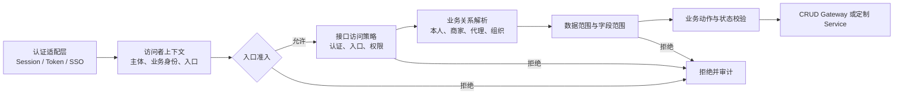
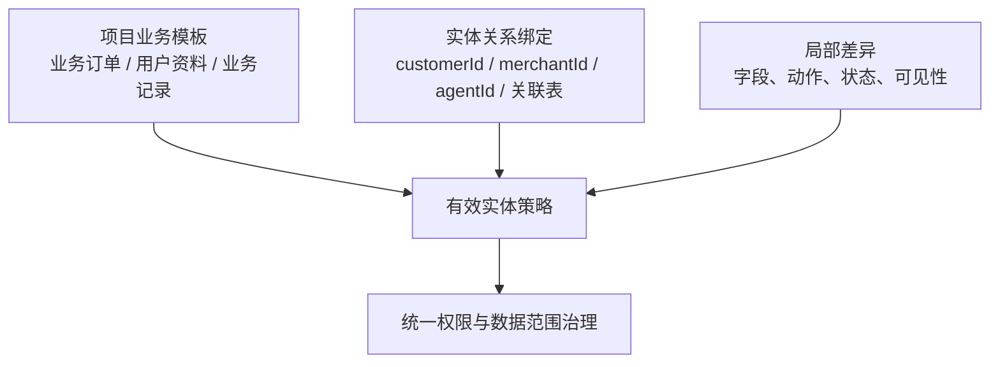
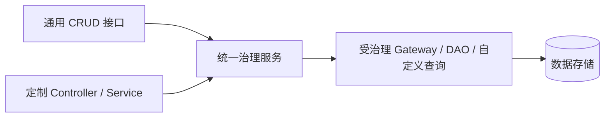

# 业务实体访问治理设计

> 状态：Proposal
> 目的：在保持完整治理能力的前提下，让项目内大部分实体通过少量业务归纳即可获得清晰、可解释的默认规则。

## 核心结论

- **登录主体**表示“以谁的资格办事”；**业务入口**表示“进入哪个业务场景”。两者独立，通过入口准入规则关联。
- `consumer`、`merchant`、`agent`、`management` 是端内业务入口；`common` 是多端复用的业务入口，不代表新的身份，也不代表公开访问。
- 业务接口默认要求已认证主体。匿名访问、可选认证是少量能力的显式例外；无效凭证不能静默降级为游客。
- 实体授权按“业务类别 + 业务关系 + 操作”归纳。普通实体选择项目模板并绑定归属关系，特殊实体仍可完整声明规则。
- CRUD 是默认接入方，不是治理边界。定制业务和独立编排应能直接调用同一套治理服务、关系解析和数据范围能力。
- 简化来自项目约定和模板复用，不删减权限、数据范围、字段、状态、审计等架构能力。

## 统一判断模型



## 身份与入口

项目统一定义入口接受的业务身份；业务实体不重复配置登录细节。

```yaml
entries:
  common:
    identities: [customer, merchant-staff, agent-staff, platform-staff]
  consumer:
    identities: [customer]
  merchant:
    identities: [merchant-staff]
  agent:
    identities: [agent-staff]
  management:
    identities: [platform-staff]

defaults:
  authentication: required
```

`common` 只表示能力共用。公开能力必须显式声明 `anonymous`；同一能力允许匿名、登录后产生差异时才使用 `optional`。登录主体仍保留原身份、成员关系和数据范围，不切换成“common 身份”。

## 实体策略归纳

项目可按自身定位定义模板，例如公共配置类、用户资料类、业务记录类、业务订单类、平台内部类。模板只提供默认规律；实体绑定字段或关系解析器，缺少模板要求的关系时应在启动或编译阶段报错。



## 订单示例

下面是面向业务开发者的清晰配置。`commerce-order` 是项目模板；具体订单只需绑定关系。

```yaml
policies:
  commerce-order:
    category: business-order
    participants:
      buyer:
        identity: customer
        entry: consumer
        relation: customerId
        actions: [place, cancel]
      merchant:
        identity: merchant-staff
        entry: merchant
        relation: merchantId
        actions: [ship, confirm-receipt, close]
      agent:
        identity: agent-staff
        entry: agent
        relation: agentId
        queries:
          summary:
            fields: [id, orderNo, status, totalAmount, createdAt]

entities:
  order:
    policy: commerce-order
    # 若关系来自成员表、店铺授权或组织树，改用项目注册的 relation resolver。
    relations:
      buyer: customerId
      merchant: merchantId
      agent: agentId
```

未声明的查询、普通增删改和动作默认拒绝。`place` 是创建动作：服务端从当前客户身份写入购买者归属，不能信任客户端提交的归属 ID。订单状态、库存、金额等规则由业务 Handler 继续校验。摘要查询的字段范围同时约束查询、排序、关联展开和输出。

## CRUD 与定制业务



治理服务应提供面向业务操作的授权结果，而不是要求定制接口模拟 CRUD 请求。授权结果至少包含主体可访问的数据范围、允许字段和操作上下文。自定义 SQL 或聚合查询无法自动套用范围时，必须实现明确适配器；业务 Controller 不得因绕过 CRUD 而获得全量 DAO 权限。

## 默认与例外

| 维度 | 默认 | 显式例外 |
| --- | --- | --- |
| 认证 | `required` | `anonymous`、`optional` |
| 入口 | 由可信服务端上下文确定 | 指定入口或 `common` |
| 权限 | 未匹配即拒绝 | 模板或局部规则授权 |
| 数据范围 | 按主体、租户、组织及业务关系限制 | 明确的授权范围解析器 |
| 字段 | 契约允许字段 | 摘要、脱敏或岗位字段策略 |
| 动作 | 业务动作白名单 | 项目注册的新动作 |

最终目标是：**实体开发者主要选择模板并绑定关系；项目架构集中定义参与者和规律；框架统一执行授权、范围、字段、状态和审计；复杂业务仍可表达，不被 CRUD 形状限制。**
