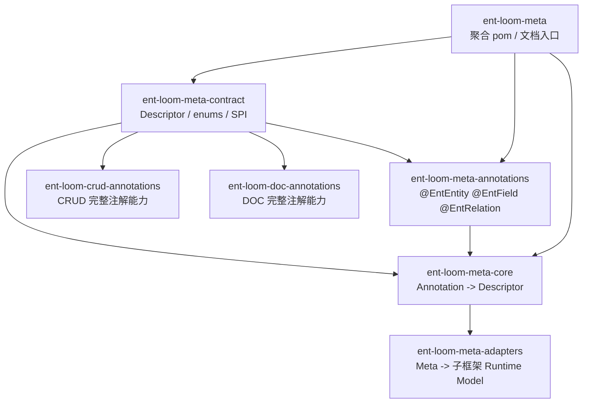
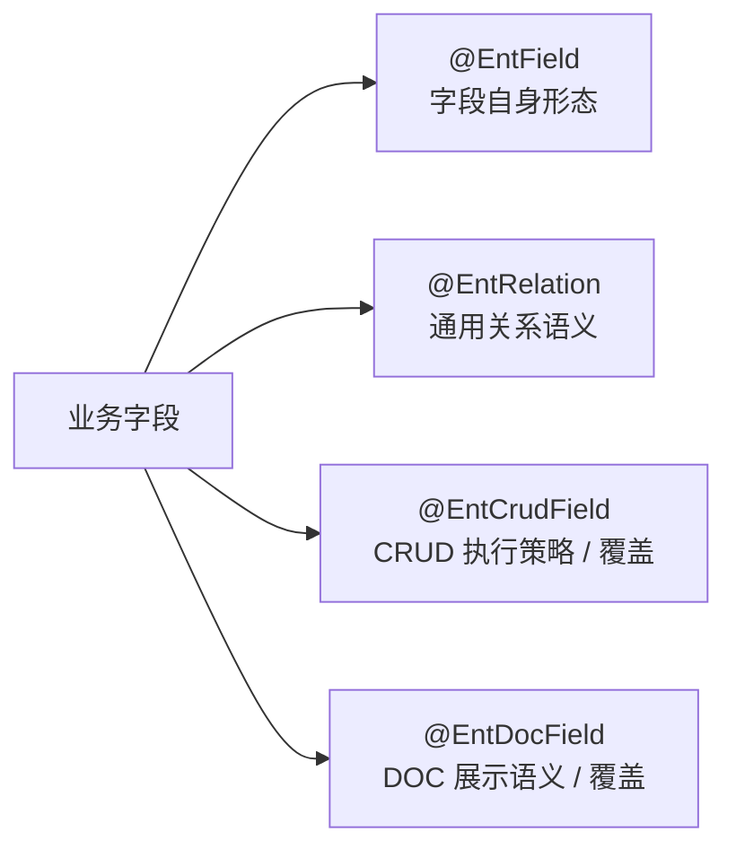
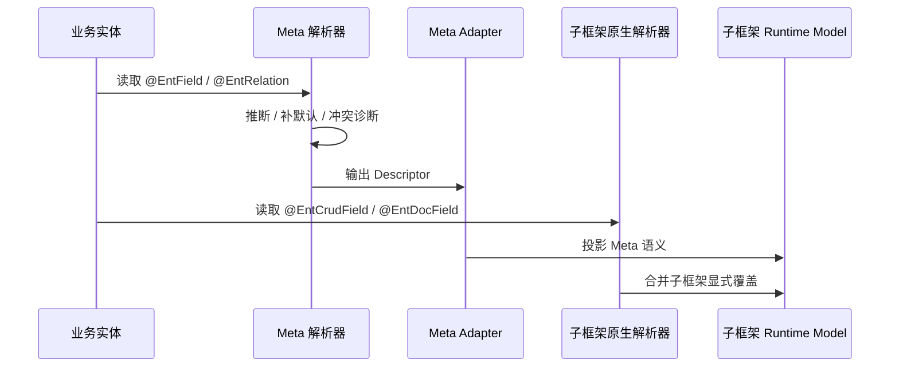

# Ent Loom Meta 注解架构设计概要

## 1. 核心定位

`ent-loom-meta` 不再作为业务代码依赖入口，而是聚合模块和文档入口。真正参与代码依赖的是三层：

- `ent-loom-meta-contract`：跨模块共享的 Descriptor、枚举和后续 SPI。
- `ent-loom-meta-annotations`：轻薄母框架注解，表达跨 CRUD / DOC / DDL / UI / API 都成立的通用语义。
- `ent-loom-meta-core`：读取 Meta 注解并归一为 Descriptor。

一句话：

`Contract 统一语义，Annotations 提供输入，Core 负责解析归一，Adapter 负责投影；聚合模块不参与运行时依赖。`

## 2. 模块边界



依赖规则：

| 场景 | 推荐依赖 |
|---|---|
| 只需要 Descriptor / 枚举 / SPI | `ent-loom-meta-contract` |
| 业务实体使用通用 Meta 注解 | `ent-loom-meta-annotations` |
| 解析 Meta 注解为 Descriptor | `ent-loom-meta-core` |
| 子框架注解要复用通用枚举或接口语义 | `ent-loom-meta-contract` |
| 子框架读取 Meta Descriptor 并投影 | `ent-loom-meta-core` + 子框架 core |
| Maven 聚合或查看文档 | `ent-loom-meta` |

不建议：

- 业务代码依赖 `ent-loom-meta` 聚合模块。
- 子框架 annotations 依赖 `ent-loom-meta-annotations`。
- 子框架 core 把 Meta 注解作为硬前置。
- 通过注解继承解决统一问题。Java 注解不能继承注解，统一应落到 contract descriptor 和解析归一层。

## 3. 注解分工

`@EntField` 只表达字段自身的基础形态，不承载关系目标：

- 字段类型
- label / description / examples
- required / readOnly
- create default value

`@EntRelation` 表达跨模块通用的字段级关系：

- `targetService`
- `targetEntity`
- `sourceField`
- `targetField`
- `cardinality`

`@EntCrudField` 表达 CRUD-only 完整关系声明，或 Meta-first 模式下的 CRUD 覆盖：

- 通用关系语义：与 `EntRelation` 对齐。
- CRUD 专属语义：`targetClass`、`scope`、`joinType`。

`@EntDocField` 表达 DOC-only 完整字段文档声明，或 Meta-first 模式下的 DOC 覆盖：

- 通用关系语义：与 `EntRelation` 对齐。
- DOC 专属语义：`targetEntityLabel`、`relationRemark` 等展示补充。

业务运行期个性化展示不继续扩张 `@EntField` / `@EntDocField`。示例、备注、分组、隐藏字段和可见性这类可按租户、角色或产品版本变化的策略，通过 `DocOverrideProvider` 覆盖 `DocEntityModel` / `DocFieldModel`，来源为 `BUSINESS_EXPLICIT_OVERRIDE`。



## 4. 关系字段统一命名

通用关系语义统一使用 `target*` 命名，不再使用 `ref*` 或 `relationEntityEn` 作为运行时关系字段。

| 语义 | Meta | CRUD | DOC | Contract |
|---|---|---|---|---|
| 目标服务 | `targetService` | `targetService` | `targetService` | `EntRelationDescriptor#targetService()` |
| 目标实体 | `targetEntity` | `targetEntity` | `targetEntity` | `EntRelationDescriptor#targetEntity()` |
| 当前字段 | `sourceField` | `sourceField` | `sourceField` | `EntRelationDescriptor#sourceField()` |
| 目标字段 | `targetField` | `targetField` | `targetField` | `EntRelationDescriptor#targetField()` |
| 关系基数 | `cardinality` | `cardinality` | `cardinality` | `EntRelationDescriptor#cardinality()` |
| 目标 Class | 无 | `targetClass` | 无 | 子框架专属 |
| 目标展示名 | 无 | 无 | `targetEntityLabel` | 子框架专属 |
| 关系备注 | 无 | 无 | `relationRemark` | 子框架专属 |

Javadoc 推荐写法：

```java
/**
 * 目标实体所属服务。
 *
 * @see EntRelationDescriptor#targetService()
 */
String targetService() default "";
```

这样能避免子框架 annotation 模块依赖 `ent-loom-meta-annotations`，同时保留 IDE 跳转到 contract 的能力。

## 5. 使用模式

Meta-first 适合一个实体同时服务 CRUD / DOC / DDL / UI / API：

```java
@EntField(EntFieldKind.REF_ID)
@EntRelation(targetEntity = "student")
private Long studentId;
```

有模块专属策略时只写覆盖项：

```java
@EntField(EntFieldKind.REF_ID)
@EntRelation(targetEntity = "student")
@EntCrudField(scope = RelationScope.REMOTE_SERVICE)
@EntDocField(name = "学生", targetEntityLabel = "学生")
private Long studentId;
```

CRUD-only 场景不要求引入 `ent-loom-meta-annotations`：

```java
@EntCrudField(
    targetClass = Student.class,
    targetEntity = "student",
    targetField = "id"
)
private Long studentId;
```

DOC-only 场景也能完整描述文档关系：

```java
@EntDocField(
    name = "学生",
    targetEntity = "student",
    targetEntityLabel = "学生",
    relationRemark = "按 studentId 关联学生主键"
)
private Long studentId;
```

## 6. 解析优先级

所有子框架建议采用同一套裁决顺序：

```text
子框架显式注解
> Meta 显式注解
> 业务配置 / Registry / SPI
> 命名约定推断
> 框架默认值
```

关键点：

- 优先级只比较显式声明，不让注解默认值无意覆盖上层语义。
- Meta-first 模式下，`@EntRelation` 是关系语义主入口，子框架注解只写专属策略或覆盖项。
- CRUD-only / DOC-only 模式下，子框架注解是完整入口。
- 原始注解不是最终契约，最终契约应是解析后的 Descriptor / Runtime Model。

## 7. 落地模型

通用归一层建议面向 contract descriptor：

- `EntEntityDescriptor`
- `EntFieldDescriptor`
- `EntRelationDescriptor`
- `EntIndexDescriptor`

子框架运行时继续消费自己的模型：

- `CrudEntityMeta`
- `RelationEdge`
- `DocEntityModel`
- `DdlEntityModel`

Adapter 负责从通用 Meta 投影到子框架模型，starter 可根据 classpath 条件启用 adapter。



## 8. 本轮定稿

- 新增 `ent-loom-meta-contract`，沉淀 `RelationCardinality` 和 Descriptor。
- 新增 `ent-loom-meta-annotations`，承载通用 Meta 注解。
- `ent-loom-meta` 改为聚合模块和文档入口。
- `EntRelation` 统一为 `targetService / targetEntity / sourceField / targetField / cardinality`。
- `EntCrudField` 保留完整 CRUD-only 能力，并按“通用关系语义 / CRUD 专属关系选项”分组。
- `EntDocField` 保留完整 DOC-only 能力，并按“DOC 基础展示 / 通用关系语义 / DOC 专属关系展示”分组。
- `RelationCardinality` 从 CRUD 枚举迁移到 `ent-loom-meta-contract`。
