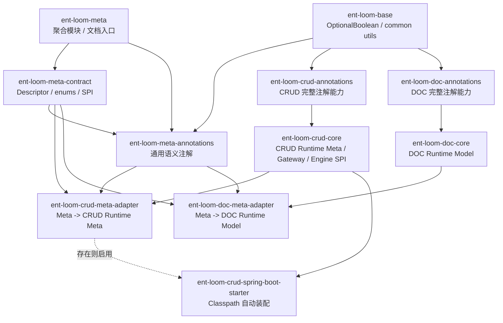
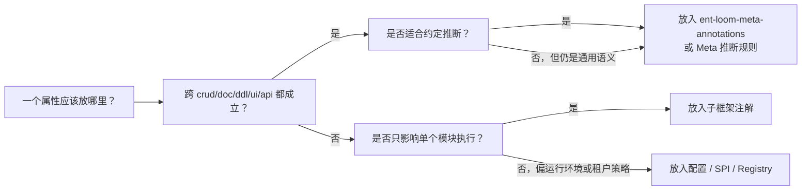
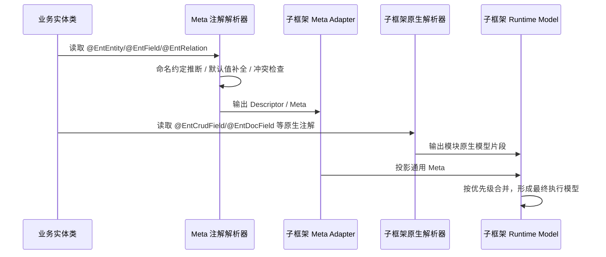
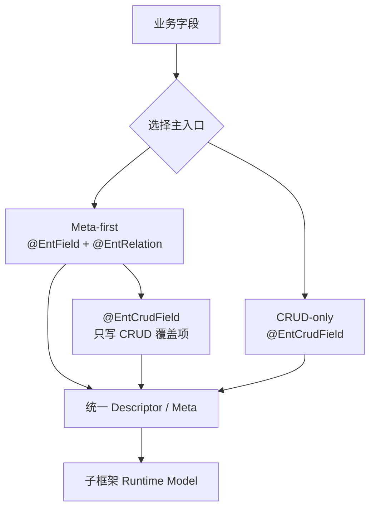
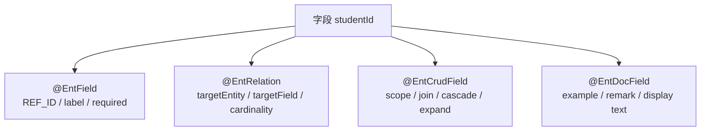

# Ent Loom 注解分层与适配提要

## 1. 核心结论

`ent-loom-meta` 不应成为所有子框架的硬前置注解体系。更稳的架构是：

- `ent-loom-meta-contract` 提供跨模块共享的 Descriptor 接口、枚举和语义契约。
- `ent-loom-meta-annotations` 提供跨模块成立的轻薄母框架注解。
- `ent-loom-meta` 作为聚合模块和文档入口，不作为业务代码依赖入口。
- `crud/doc/ddl/ui/api` 等子框架保留完整、自洽、可独立使用的注解能力。
- 子框架运行时最终消费自己的标准模型，而不是直接把任意注解当最终契约。
- `meta adapter` 负责把通用 Meta 投影到子框架模型，存在则增强，不存在也不阻塞子框架原生用法。

一句话：

`Contract 统一语义，Annotations 提供输入，Adapter 负责投影；聚合模块不参与运行时依赖。`

## 2. 目标边界

### 2.1 Meta 层目标

Meta annotations 层适合表达大部分约定清楚、跨模块都成立的业务语义：

- 实体是什么：`@EntEntity`
- 字段是什么：`@EntField`
- 字段角色是什么：`@EntMetaId`、`@EntMetaText`、`@EntMetaEnum`、`@EntRelation`
- 关系指向谁：`targetService`、`targetEntity`、`targetField`、`cardinality`
- 索引、标签、说明、默认展示字段等基础语义

Meta annotations 层不适合表达具体模块执行细节：

- CRUD 的 join、scope、cascade、expand、command 策略
- DOC 的文档示例、展示备注、文案覆盖
- DDL 的方言细节、物理列实现、迁移策略
- UI 的控件、布局、交互和展示优先级
- API 的 DTO 可见性、序列化形态和输入输出约束

### 2.2 子框架注解目标

子框架注解必须是完整能力入口，而不是只能补充 Meta 的少量字段。

例如 CRUD 即使没有引入 `ent-loom-meta-annotations`，也应能通过自己的注解完整描述运行所需信息：

```java
@EntCrudField(
    targetClass = Student.class,
    targetField = "id",
    cardinality = RelationCardinality.MANY_TO_ONE,
    scope = RelationScope.LOCAL_DB
)
private Long studentId;
```

而当业务愿意使用 Meta 层时，也可以写成更宽泛、更低成本的形式：

```java
@EntField(EntFieldKind.REF_ID)
@EntRelation(targetEntity = "student", targetField = "id")
private Long studentId;
```

CRUD adapter 再把它投影成 CRUD 运行时关系模型。

### 2.3 本轮定稿后的模块形态

当前按“不保兼容”的方向拆分：

```text
ent-loom-meta
  聚合 pom + 文档入口
  不作为业务代码依赖入口

ent-loom-meta-contract
  Descriptor 接口
  跨模块共享枚举
  后续解析 SPI

ent-loom-meta-annotations
  @EntEntity
  @EntField
  @EntRelation
  @EntIndex
  @EntMeta*

ent-loom-meta-core
  Annotation -> Descriptor

ent-loom-meta-adapters
  ent-loom-meta-adapter-crud
  ent-loom-meta-adapter-ddl
  ent-loom-meta-adapter-doc
  后续可扩展 ent-loom-meta-adapter-ui
```

依赖选择：

| 场景 | 应依赖模块 |
|---|---|
| 只需要统一 Descriptor / 枚举 / SPI | `ent-loom-meta-contract` |
| 业务实体要使用通用 Meta 注解 | `ent-loom-meta-annotations` |
| 解析 Meta 注解为 Descriptor | `ent-loom-meta-core` |
| 子框架 adapter 要读取 Meta Descriptor 并输出运行时模型 | `ent-loom-meta-core` + 子框架 core |
| 查看 Meta 体系文档或作为 Maven 聚合入口 | `ent-loom-meta` |

禁止事项：

- 业务代码不依赖 `ent-loom-meta` 聚合模块。
- 子框架 annotations 不依赖 `ent-loom-meta-annotations`，除非它本身就是 Meta 注解扩展模块。
- 子框架 core 不把 Meta 注解作为硬前置；需要 Meta 投影时放到 adapter 模块。

## 3. 推荐模块依赖



依赖原则：

- `ent-loom-meta` 是聚合模块，不作为依赖入口。
- `annotations` 模块尽量轻，不强依赖其他子框架。
- `contract` 模块只放 Descriptor、共享枚举和 SPI，不放具体注解。
- `core` 消费本框架的注解和运行时模型。
- `adapter` 同时依赖 `ent-loom-meta-annotations`、`ent-loom-meta-contract` 与目标子框架，负责跨层转换。
- `starter` 可根据 classpath 自动启用 adapter。

## 4. 注解归属规则



判断标准：

| 类型 | 推荐位置 | 示例 |
|---|---|---|
| 字段基础语义 | `ent-loom-meta-annotations` | 字段类型、label、description、required |
| 字段角色 | `ent-loom-meta-annotations` | ID、租户、状态、金额、创建时间 |
| 关系语义 | `ent-loom-meta-annotations` + `ent-loom-meta-contract` | 目标实体、目标字段、关系基数 |
| CRUD 执行策略 | `ent-loom-crud-annotations` | scope、join、cascade、expand |
| 文档展示 | `ent-loom-doc-annotations` | example、remark、展示文案 |
| DDL 物理实现 | `ent-loom-ddl-annotations` | column type、dialect、migration hint |
| UI 交互 | `ent-loom-ui-annotations` | widget、layout、display priority |

## 5. 运行时归一流程



中间统一契约应是 Descriptor / Meta 容器，例如：

- `EntEntityDescriptor`
- `EntFieldDescriptor`
- `EntRelationDescriptor`
- `EntIndexDescriptor`

最终执行契约应是子框架运行时模型，例如：

- `CrudEntityMeta`
- `CrudFieldMeta`
- `CrudRelationMeta`
- `DocEntityModel`
- `DdlEntityModel`

原始注解只是输入之一。

## 6. 优先级规则

建议所有子框架统一采用这个裁决顺序：

```text
子框架显式注解
> Meta 显式注解
> 业务配置 / Registry / SPI
> 命名约定推断
> 框架默认值
```

关键约束：

- 优先级只比较“显式声明”的属性，不应让注解默认值无意覆盖上层语义。
- Meta-first 项目中，`@EntRelation` 是关系语义主入口，`@EntCrudField` 只写 CRUD 专属策略或必要覆盖。
- CRUD-only 项目中，`@EntCrudField` 是完整入口，不要求引入 `ent-loom-meta-annotations`。
- 同一个字段不要重复声明同一层关系语义；如果重复声明，子框架显式值胜出，并应在解析层可诊断。

示例：

```java
@EntField(EntFieldKind.REF_ID)
@EntRelation(targetEntity = "student", targetField = "id")
@EntCrudField(scope = RelationScope.REMOTE_SERVICE)
private Long studentId;
```

解释结果：

- `studentId -> student.id` 来自 Meta 关系语义。
- `REMOTE_SERVICE` 来自 CRUD 专属注解。
- 如果 `@EntCrudField` 也显式声明了目标实体，则以 CRUD 显式声明为准。

### 6.1 双入口使用模式

业务侧不要追求两套注解并排同构，而是选择一条主线。

Meta-first 适合同时使用 CRUD、DOC、DDL、UI 等多子框架能力的业务：

```java
@EntField(EntFieldKind.REF_ID)
@EntRelation(targetEntity = "student")
private Long studentId;
```

只有 CRUD 有特殊执行策略时，才添加局部覆盖：

```java
@EntField(EntFieldKind.REF_ID)
@EntRelation(targetEntity = "student")
@EntCrudField(scope = RelationScope.REMOTE_SERVICE)
private Long studentId;
```

CRUD-only 适合只使用 CRUD 原子能力的业务：

```java
@EntCrudField(
    targetClass = Student.class,
    targetEntity = "student",
    targetField = "id"
)
private Long studentId;
```



### 6.2 `EntRelation` 与 `EntCrudField` 属性关系

| 语义 | `EntRelation` | `EntCrudField` | 归属 |
|---|---|---|---|
| 目标服务 | `targetService` | `targetService` | 通用关系语义，CRUD 可覆盖 |
| 目标实体名 | `targetEntity` | `targetEntity` | 通用关系语义，CRUD 可覆盖 |
| 目标实体类型 | 无 | `targetClass` | CRUD 类型安全快捷入口 |
| 目标字段 | `targetField` | `targetField` | 通用关系语义，CRUD 可覆盖 |
| 关系基数 | `cardinality` | `cardinality` | 通用关系语义，CRUD 可覆盖 |
| 来源字段 | `sourceField` | `sourceField` | 通用关系语义，空表示被注解字段 |
| 关系作用域 | 无 | `scope` | CRUD 执行策略 |
| JOIN 类型 | 无 | `joinType` | CRUD 执行策略 |

`EntDocField` 也采用同一组通用关系语义，但只把文档展示相关内容留作 DOC 专属字段：

| 语义 | `EntRelation` | `EntDocField` | 归属 |
|---|---|---|---|
| 目标服务 | `targetService` | `targetService` | 通用关系语义，DOC 可覆盖 |
| 目标实体名 | `targetEntity` | `targetEntity` | 通用关系语义，DOC 可覆盖 |
| 来源字段 | `sourceField` | `sourceField` | 通用关系语义，空表示被注解字段 |
| 目标字段 | `targetField` | `targetField` | 通用关系语义，DOC 可覆盖 |
| 关系基数 | `cardinality` | `cardinality` | 通用关系语义，DOC 可覆盖 |
| 目标展示名 | 无 | `targetEntityLabel` | DOC 展示语义 |
| 关系备注 | 无 | `relationRemark` | DOC 展示语义 |

`EntCrudField` 的属性声明建议按两组轻量分隔：

```java
// 通用关系语义：与 EntRelation 对齐。

String targetService() default "";
String targetEntity() default "";
String sourceField() default "";
String targetField() default "id";
RelationCardinality cardinality() default RelationCardinality.MANY_TO_ONE;

// CRUD 专属关系选项。

Class<?> targetClass() default Void.class;
RelationScope scope() default RelationScope.LOCAL_DB;
JoinType joinType() default JoinType.LEFT;
```

实践约束：

- 分组注释保持轻量，不使用沉重的 START/END 模板。
- 通用关系语义的顺序尽量与 `EntRelation` 保持一致。
- 通用关系字段的 Javadoc 只保留 `@see EntRelationDescriptor#xxx()`；与 `EntRelation` 的对齐由分组注释说明。
- CRUD 专属字段只说明是 CRUD 执行策略或类型安全快捷入口。
- 真正的一致性约束依赖 `ent-loom-meta-contract`、解析归一规则和必要的反射测试，不依赖注释本身。

## 7. `EntRelation` 定位

`EntRelation` 可以作为字段级关系语义的核心入口。

它表达的是通用关系，不再只是“引用 ID hint”。不保兼容后采用统一 target 命名：

```java
public @interface EntRelation {
    RefIdRole role() default RefIdRole.UNSET;

    String targetService() default "";
    String targetEntity() default "";
    String sourceField() default "";
    String targetField() default "id";

    RelationCardinality cardinality() default RelationCardinality.MANY_TO_ONE;
}
```

命名规则：

| 旧命名 | 新命名 | 原因 |
|---|---|---|
| `value` | `role` | `value` 对业务角色不够直观 |
| `refService` | `targetService` | 和关系图、Descriptor、adapter 术语统一 |
| `refEntity` | `targetEntity` | 明确表示关系目标实体 |
| `refField` | `targetField` | 明确表示关系目标字段 |

推荐语义：

- `@EntField` 表达字段自身形态。
- `@EntRelation` 表达字段参与的关系。
- `@EntCrudField` 表达 CRUD 如何执行这个关系。
- `@EntDocField` 表达文档如何展示这个关系。



## 8. 推荐落地路线

1. 维持 `ent-loom-meta` 为聚合 pom 和文档入口。
2. 维持 `ent-loom-meta-contract` 为 Descriptor / enums / SPI 的唯一通用契约层。
3. 维持 `ent-loom-meta-annotations` 为轻薄母框架注解层。
4. 保留并强化 Meta 解析层的约定推断能力，后续可落到 `ent-loom-meta-core`。
5. 将 `EntRelation` 明确定义为通用字段关系入口，使用 `target*` 命名并补齐 `cardinality`。
6. 子框架注解继续保持完整表达能力，不要求业务必须引入 Meta annotations。
7. 新增或整理 `xxx-meta-adapter`，让通用 Meta 能投影到子框架运行时模型。
8. 子框架 starter 使用 classpath 条件启用 adapter。
9. 文档中明确所有字段的优先级裁决规则，避免同一语义多处声明后结果不确定。

## 9. 不建议的方向

- 不建议把所有 CRUD/DOC/DDL/UI/API 字段塞进 `@EntField`。
- 不建议业务代码依赖 `ent-loom-meta` 聚合模块。
- 不建议让 `crud-annotations` 等子框架注解硬依赖 `ent-loom-meta-annotations`。
- 不建议让各子框架重复实现同一套通用命名推断。
- 不建议把注解本身当最终契约，后续能力应面向归一后的运行时模型。
