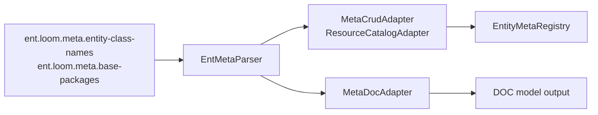

# Meta Runtime Adapters 当前实现

> Status: Current
> Verified: 2026-05-04
> Scope: `ent-loom-meta`、`ent-loom-meta-adapters`

本文记录 Meta -> CRUD / DOC 的当前闭环。历史推进清单已归档到 [Meta -> CRUD / DOC -> 业务层闭环待实现清单](../../../archive/meta/meta-business-todo-plan.md)。

## 当前结论

Meta 体系当前已经形成静态运行时闭环：

- `ReflectiveEntMetaParser` 解析 `@EntEntity`、`@EntField`、`@EntRelation` 等母框架注解。
- `MetaCrudAdapter` 将 Meta Descriptor 和 CRUD 原生注解合并为 CRUD `EntityMeta` / `RelationEdge`。
- `MetaDocAdapter` 将 Meta Descriptor 和 DOC 原生注解合并为 DOC `DocEntityModel`。
- `EntLoomMetaAutoConfiguration` 在 Spring Boot 下按配置注册 CRUD / DOC adapter。
- 诊断策略支持 fail-fast / lenient，冲突在 registry 或 adapter 边界暴露。

## Spring 装配

`EntLoomMetaAutoConfiguration` 的装配条件：

- `ent.loom.meta.enabled=true` 或未显式关闭。
- `ent.loom.meta.entity-class-names` 或 `ent.loom.meta.base-packages` 任一非空时才注册适配器。
- `ent.loom.meta.crud.enabled=true` 或未显式关闭时注册 `MetaCrudAdapter`。
- `ent.loom.meta.doc.enabled=true` 或未显式关闭时注册 `MetaDocAdapter`。
- 自动配置在 CRUD auto-configuration 之前执行。
- 配置了实体类或扫描包但未解析到实体时启动失败，避免配置错误静默跳过。

## Meta -> CRUD

`MetaCrudAdapter` 当前执行：

1. 对带 `@EntEntity` 的类解析 Meta Descriptor。
2. 同时解析 CRUD 原生注解，形成 native model。
3. 通过 `CrudRuntimeModelMerger` 合并两侧模型。
4. 输出 CRUD `EntityMeta`，包含 resource、table、id、logicDelete、字段元数据。
5. 输出 `RelationEdge`，用于 CRUD 关系查询。
6. 对目标实体、sourceField、targetField 等关系错误收集诊断。

它实现 `ResourceCatalogAdapter`，因此能与业务自定义 adapter 一起进入 CRUD registry。测试覆盖自定义业务 adapter 与 Meta adapter 并存，以及重复资源编码在 registry 边界 fail-fast。

## Meta -> DOC

`MetaDocAdapter` 当前执行：

1. 解析 Meta Descriptor。
2. 解析 DOC 原生注解。
3. 通过 `DocRuntimeModelMerger` 合并文档模型。
4. 通过 `DocRuntimeModelOverrideApplier` 应用业务 `DocOverrideProvider`。
5. 输出 `DocEntityModel`，并通过 `EntityDocCoreService` 生成兼容 map。
6. 校验关系目标和字段，诊断配置错误。

`EntLoomMetaAutoConfiguration` 默认提供 `DefaultDocEntityMetaResolver`，并可接收业务提供的 `DocOverrideProvider`。

## 已验证路径

测试 `EntLoomMetaAutoConfigurationTest` 覆盖：

- Meta 实体自动装配 CRUD registry 与 DOC adapter。
- CRUD-only 与 DOC-only 路径相互独立。
- base package 扫描可自动装配 CRUD registry 与 DOC adapter。
- 类名错误或扫描结果为空时 fail-fast。
- disabled 或空 entity class list 不接管 CRUD fallback。
- 业务 `ResourceCatalogAdapter` 与 Meta adapter 并存。
- `DocOverrideProvider` 能覆盖实体名、分组和字段可见性。
- 重复 adapter 输出在 registry 边界 fail-fast。

测试 `MetaCrudAdapter当前版本AcceptanceTest`、`MetaDocAdapter当前版本AcceptanceTest`、`MetaCrudAdapterRelationDirectionTest` 覆盖静态 fixture、关系方向和 当前版本 验收。

## 当前限制

- 当前闭环是启动期静态装配，不是运行期动态实体发现。
- 配置入口支持类名列表和包扫描；包扫描是启动期静态扫描，不支持运行期动态发现。
- DDL / UI / API 后续接入仍不属于当前闭环。
- CRUD Query/Command 的完整业务治理仍由 CRUD 自身主链负责，Meta adapter 只输出运行时元数据。
