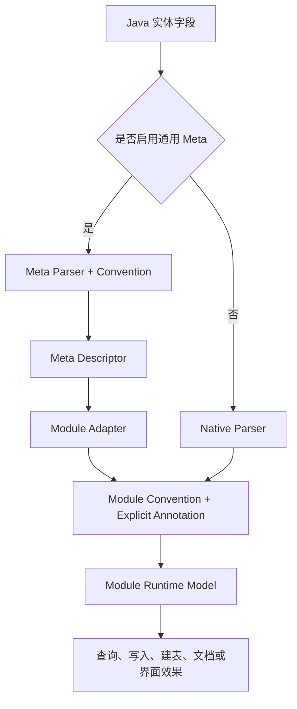

# 元数据约定与裁决机制

> 状态：目标架构
> 范围：`ent-loom-meta`、`ent-loom-crud`、`ent-loom-ddl`、`ent-loom-doc`、`ent-loom-ui`
> 当前进度：`ent-loom-crud`、`ent-loom-doc` 已具备部分 Explicit Annotation 合并能力，Project Convention 体系尚未完整实现。

## 1. 目标

同一字段允许从注解、项目约定、框架约定和基础推断获得属性，最终按属性独立裁决并形成唯一运行时结果。

该机制同时支持：

- Meta-first：项目统一定义通用语义，再投影到多个 Module。
- Module 独立使用：只依赖 `ent-loom-crud`、`ent-loom-ddl`、`ent-loom-doc` 或 `ent-loom-ui`，也能使用本 Module Convention。
- 少量例外覆盖：字段显式注解始终可以覆盖项目约定。

## 2. 属性优先级

```text
Module Explicit Annotation
> Meta Explicit Annotation
> Module Project Convention
> Meta Project Convention
> Module Built-in Convention
> Meta / Java Inference
> Framework Default
```

优先级按单个属性裁决，不按整个注解、规则或模型覆盖。高优先级没有贡献的属性继续采用低优先级结果。


图中是实际构建顺序：从低优先级开始，高优先级逐属性覆盖。

## 3. 两种运行模式



Module 不得依赖 `ent-loom-meta-core` 才能运行。启用 Meta 时通过 Adapter 增强；未启用时由 Native Parser 和 Module Convention 独立完成建模。

## 4. 规则分类

| 规则 | 定义位置 | 示例 |
|---|---|---|
| Meta Project Convention | 业务项目 | `createTime` 识别为创建时间、只读 |
| Module Project Convention | 业务项目 | `ent-loom-crud` 创建填充、导出格式、默认排序 |
| Module Built-in Convention | 对应 Module Core | 驼峰转下划线、`id` 作为主键候选 |
| Meta / Java Inference | `ent-loom-meta-core` 或对应 Module Core | `Date` 推断为时间类型 |

Built-in Convention 必须保守，不应未经项目确认就启用租户隔离、逻辑删除、自动写值等高影响行为。

## 5. 裁决约束

1. 注解默认值不视为显式声明，应使用 `UNSET`、`AUTO`、`-1` 或空值表达“未设置”。
2. 每项结果保留 `value`、`source`、`ruleId`，便于诊断和追踪。
3. 同优先级规则对同一属性贡献不同值时必须诊断，不能依赖加载顺序。
4. 名称规则应同时校验 Java 类型；名称匹配但类型不符时产生诊断。
5. 结构性冲突可 fail-fast，普通覆盖冲突可按策略警告。
6. Convention 只贡献属性，不直接修改已冻结的 Descriptor 或 Runtime Model。

## 6. 配置到效果

元数据只有被运行时消费者使用才算闭环。

| 属性或角色 | 消费模块 | 预期效果 |
|---|---|---|
| `DATETIME.CREATED_TIME` | `ent-loom-crud` | 创建填充、禁止更新、默认排序候选 |
| `DATETIME.CREATED_TIME` | `ent-loom-ddl` | 时间列映射及可选默认表达式 |
| `readOnly=true` | `ent-loom-crud` / `ent-loom-ui` | 拒绝写入或表单只读 |
| `label=创建时间` | `ent-loom-doc` / `ent-loom-ui` | 文档名称或字段标签 |
| `exportFormat` | `ent-loom-crud` Export | 统一导出格式 |
| `component=DATE_TIME` | `ent-loom-ui` | 日期时间控件 |

每个可配置属性必须明确：产生者、目标模型、消费者，以及消费者不支持时采用忽略、警告还是启动失败。

## 7. 模块职责

```text
ent-loom-meta-contract              公共 Source、Contribution 和 Diagnostic 契约
ent-loom-meta-core                  Meta Inference、Meta Project Convention 和 Descriptor 裁决
ent-loom-crud/ddl/doc/ui Core       Module Project/Built-in Convention 和 Runtime Model
ent-loom-integrations              Meta Descriptor 到 Module Runtime Model 的投影
各 Module Spring Boot Starter       收集 Convention Bean、排序、开关和 Diagnostic Policy
业务项目                            定义 Meta 或 Module Project Convention
```

## 8. 示例

业务项目统一规定：名称为 `createTime`、`createdAt`，且类型为 `Date`、`Instant` 或 `LocalDateTime` 的字段，属于创建时间。

```java
private LocalDateTime createTime;
```

Meta Project Convention 贡献角色、只读和展示名称；CRUD Project Convention 贡献创建填充与默认排序；某个字段如有例外，再通过 Explicit Annotation 覆盖对应属性。
