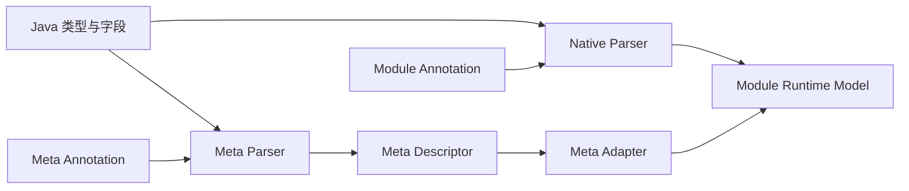

# Meta 分层与运行模型

> 状态：Current
> 最近核验：2026-08-20
> 上游契约：[元数据约定与裁决契约](../元数据约定与裁决契约.md)

本文只描述 Meta 相关模块当前如何组织。属性优先级、Contribution、诊断和消费者闭环由上游 Contract 定义，不在这里重复。

## 模块分层

```text
ent-loom-meta                    聚合 POM，不作为业务运行时依赖入口
ent-loom-meta-enums              跨模块共享枚举
ent-loom-meta-contract           Descriptor 与诊断契约
ent-loom-meta-annotations        通用业务语义注解
ent-loom-meta-core               Annotation -> Descriptor
ent-loom-integrations            Meta Descriptor -> Module Runtime Model
```

业务项目按需要依赖叶子模块。仅使用 CRUD、DDL、DOC 或 UI 时，不要求依赖 Meta 注解或 Meta Core。

## 语义归属

| 语义 | 所属层 | 示例 |
|---|---|---|
| 跨模块都成立的业务事实 | Meta Annotation / Descriptor | label、description、字段角色、关系目标 |
| 某组件的执行策略 | Module Annotation / Runtime Model | CRUD scope、DDL 方言类型、DOC example、UI widget |
| 项目级默认规则 | Project Convention | `createTime` 识别、项目命名规范 |
| 环境和装配策略 | Starter 配置或 Bean | 扫描范围、开关、诊断策略 |
| 运行期业务例外 | 业务 SPI | DOC override、业务 Handler、权限服务 |

判断一个属性是否属于 Meta 的标准不是“多个模块可能用到”，而是它是否在脱离具体执行模块后仍然成立。

## 输入与输出



Meta Descriptor 是通用语义结果，不是 CRUD、DDL、DOC 或 UI 的执行模型。每个组件最终只消费自己拥有的 Runtime Model。

## 通用注解边界

Meta 注解适合表达：

- 实体、字段、索引和关系等通用事实。
- 字段 label、description、required 等跨模块语义。
- ID、状态、金额、创建时间等稳定字段角色。
- 与具体数据库方言、页面布局或执行策略无关的关系信息。

Meta 注解不表达：

- CRUD join、scope、cascade、command 策略。
- DDL 方言、物理列类型和迁移策略。
- DOC 示例、展示备注和动态文案覆盖。
- UI widget、布局和交互优先级。
- 角色、当前用户、数据范围等运行时治理规则。

## 两种使用方式

### Module-only

业务只使用组件原生注解。Native Parser 生成完整 Module Runtime Model，组件可以独立运行。

### Meta-first

业务使用通用 Meta 注解描述共享语义，同时允许组件原生注解补充或覆盖执行属性。Adapter 将 Descriptor 投影到组件模型，再与原生模型逐属性裁决。

两种方式必须汇聚到相同的 Registry 和执行主链，不能形成 Meta Registry 与 Native Registry 两套运行入口。

## 当前实现

- `ReflectiveEntMetaParser` 读取 Meta 注解并生成 Descriptor 和诊断。
- CRUD Native Parser 可独立生成 `CrudRuntimeModel`。
- Meta -> CRUD Adapter 合并 Meta 与 CRUD Native 输入。
- Meta -> DOC Adapter 生成 `DocEntityModel`，并保留 `DocOverrideProvider` 业务覆盖边界。
- Meta Starter 根据 classpath 和配置条件装配 CRUD/DOC Adapter。
- DDL Adapter 仍为空实现模块；UI 尚无 Meta Adapter。

解析细节见 [Meta 解析引擎](元数据解析引擎.md)，装配和已验证路径见 [Runtime Adapters](运行时适配器.md)。尚未完成的统一裁决能力见 [Meta 路线图](../../../evolution/roadmap/meta/index.md)。

## 禁止事项

1. 子框架 Core 直接读取 Meta 注解作为唯一输入。
2. Adapter 创建与目标组件并行的运行时模型或 Registry。
3. 用注解默认值冒充显式声明。
4. 用 Bean 顺序解决同级冲突。
5. 为展示或执行便利反向污染通用 Meta 语义。
