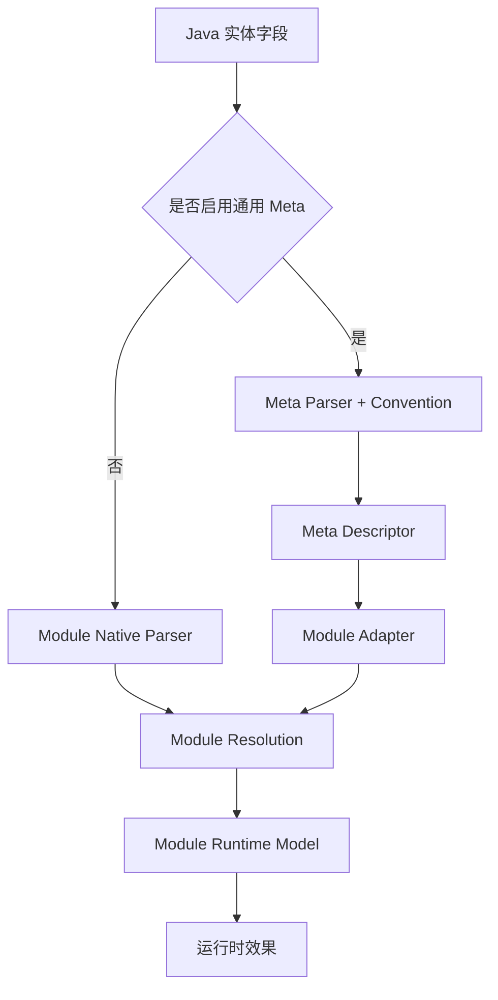

# 元数据约定与裁决契约

> 性质：Core Contract
> 状态：Current，分阶段落地
> 优先级：P0
> 范围：Meta、CRUD、DDL、DOC、UI 的建模主链
> 最近核验：2026-08-21

本文定义 ent-loom 建模平面的最高层契约：多个来源如何贡献属性、如何逐属性裁决、如何诊断冲突，以及如何形成各组件唯一的运行时模型。组件架构可以细化模型和消费者，但不能改变本文优先级与边界。

本文不定义治理、HTTP、事务、路由和执行算法；这些由其他 Core Contract 与组件架构负责。

## 1. 核心目标

同一实体或字段可以从显式注解、项目约定、框架约定和基础推断获得属性。系统必须保留来源，按单个属性独立裁决，并为每个组件形成唯一 Runtime Model。

```text
Inputs
  -> Contributions
  -> Property Resolution
  -> Diagnostics
  -> Module Runtime Model
  -> Runtime Consumer
```

元数据只有产生可观察的查询、写入、建表、文档或界面效果，才算形成闭环。

## 2. 架构不变量

1. **逐属性裁决**：不允许整份注解、Descriptor 或模型覆盖。
2. **来源可追踪**：裁决结果至少保留 `value / source / ruleId`。
3. **同级冲突可诊断**：不能依赖扫描顺序或 Bean 加载顺序。
4. **组件独立运行**：Module Core 不依赖 Meta Core 才能生成自己的 Runtime Model。
5. **Adapter 只做投影**：不承载业务行为，也不成为新的模型所有者。
6. **运行时只消费组件模型**：注解和 Convention 不能直接进入执行器。
7. **显式例外优先**：业务可以针对少量字段覆盖项目和内置约定。
8. **高影响行为默认关闭**：租户隔离、逻辑删除、自动写值等不能由宽松名称推断静默开启。

## 3. 属性优先级

```text
Module Explicit Annotation
> Meta Explicit Annotation
> Module Project Convention
> Meta Project Convention
> Module Built-in Convention
> Meta / Java Inference
> Framework Default
```

实际构建从低优先级开始，高优先级只覆盖自己明确贡献的属性：


注解默认值不视为显式贡献。布尔值、枚举和数字属性应使用 `UNSET`、`AUTO`、`OptionalBoolean` 或等价三态表达未设置。

## 4. 两种运行模式



Meta-first 与 Module-only 最终必须生成同一种组件模型。启用 Meta 是增强输入，不得产生第二套并行 Registry 或执行语义。

## 5. Contribution 契约

每条贡献至少包含：

| 字段 | 含义 |
|---|---|
| target | 实体、字段及目标属性 |
| value | 候选值 |
| source | Annotation、Project Convention、Built-in、Inference 或 Default |
| ruleId | 稳定规则标识 |
| priority | 所属优先级 |

Convention 只产生 Contribution，不直接修改已冻结 Descriptor 或 Runtime Model。规则应可排序、可关闭、可测试；同优先级不是“最后加载者胜出”。

当前公共实现位于 `com.entloom.meta.contract.contribution`：`Contribution` 保存目标、值、来源、`RuleId` 和 `Priority`；`RuleId` 作为同级冲突的稳定排序键。`ent-loom-meta-core` 的 `PropertyContributionResolver` 逐属性分组裁决，不依赖输入或 Bean 加载顺序。

## 6. 诊断契约

以下情况必须产生结构化诊断：

- 同优先级规则对同一属性贡献不同值。
- 名称规则匹配，但 Java 类型不符合要求。
- 关系目标、资源标识或结构性引用不存在。
- Adapter 无法投影必要属性。
- 消费者不支持一个声明为强约束的属性。

诊断应包含实体、字段、属性、双方来源、规则标识和建议处理。Contribution 的结构错误和类型错误固定为 ERROR；同级值冲突由 `MetaConflictPolicy` 选择 `FAIL`、`WARN` 或 `IGNORE`，但候选选择始终按优先级和 RuleId 稳定排序。

## 7. 模块职责

| 层级 | 职责 |
|---|---|
| `ent-loom-meta-contract` | Source、Contribution、Priority、Diagnostic 等公共契约 |
| `ent-loom-meta-core` | Meta Inference、Meta Project Convention 和 Descriptor 裁决 |
| Module Core | 本模块 Project/Built-in Convention、Native Parser 和 Runtime Model |
| `ent-loom-integrations` | Meta Descriptor 到 Module Runtime Model 的投影 |
| Module Starter | 收集 Convention Bean、开关和 Diagnostic Policy |
| 业务项目 | 定义项目约定与显式例外 |

详细依赖方向见 [组件边界与依赖规则](组件边界与依赖规则.md)。

## 8. 配置到效果

| 属性或角色 | 目标模型/消费者 | 预期效果 |
|---|---|---|
| `DATETIME.CREATED_TIME` | CRUD | 创建填充、禁止更新或默认排序候选 |
| `DATETIME.CREATED_TIME` | DDL | 时间列映射和可选默认表达式 |
| `readOnly=true` | CRUD / UI | 拒绝写入或表单只读 |
| `label=创建时间` | DOC / UI | 文档名称或字段标签 |
| `exportFormat` | CRUD Export | 统一导出格式 |
| `component=DATE_TIME` | UI | 日期时间控件 |

每个属性都必须明确产生者、目标模型、消费者和不支持策略。只进入 Descriptor、没有消费者验证的属性不算完成。

## 9. 最小验收场景

以无字段注解的属性为例：

```java
private LocalDateTime createTime;
```

核心闭环必须证明：

1. 无项目规则时只产生保守的 Java 类型推断。
2. Meta Project Convention 可以贡献创建时间角色、只读和标签。
3. CRUD-only 项目不依赖 Meta Core，也能贡献 CRUD 专属效果。
4. 显式注解只覆盖声明的属性，其他属性继续继承约定。
5. 同级冲突与类型错误包含可定位诊断。
6. 关闭规则后恢复到下一优先级结果。
7. 结果最终改变至少一个运行时消费者行为。

## 10. 当前落地边界

当前已具备：

- Meta annotation parser 和带来源 Descriptor。
- CRUD Native Parser 与唯一 `CrudRuntimeModel`。
- Meta -> CRUD / DOC Adapter 及显式属性合并。
- Native-only、Meta-only、Meta + Module 的测试基础。
- 公共 `Contribution`、`RuleId`、`Priority`、冲突策略和逐属性 Resolver；同级冲突、类型错误、结构错误和来源追踪已有回归。

当前尚未完整具备：

- Meta 与 CRUD Project Convention 的完整注册和消费闭环。
- DDL、UI Adapter。
- 所有组件统一的冲突策略与来源诊断。

实施顺序只在 [Meta 当前实施计划](../../evolution/roadmap/meta/元数据裁决实施计划.md) 维护。

## 11. 变更规则

修改优先级、模型所有权或模块独立运行原则属于 Core Contract 变更，必须同时提供：

1. 明确的 Evolution Decision。
2. Native-only 和 Meta-enabled 回归测试。
3. 至少一个消费者闭环测试。
4. 迁移影响和被替代文档清单。

具体类名、包名和阶段任务不进入本文，避免顶层契约随实现重构频繁变化。
