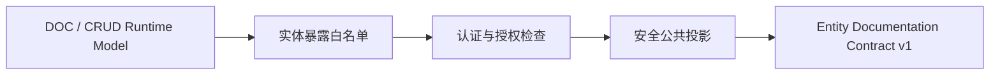

# 实体文档契约

> 性质：Core Contract
> 状态：Target
> 版本：1.0.0
> 范围：实体目录、字段说明、枚举、关系和索引的安全公共投影
> 最近核验：2026-09-11

本文定义 ent-loom 面向工具和开发者的实体文档 JSON 结构。它描述项目已经声明并允许公开的静态实体能力，不描述某个请求主体的实时权限、数据范围或 CRUD HTTP 请求响应。

当前仓库的 `MetaDocAdapter.buildOne/buildAll` 仍是内部适配能力，`EntityDocCoreService` 返回的兼容 Map 还包含实现细节。本文和 [JSON Schema](https://github.com/ent-loom/ent-loom/blob/main/docs/contracts/entity-documentation-v1.schema.json) 是 D3 的目标公共合同；Meta Spring Boot Starter 已提供默认关闭且要求显式暴露策略的契约服务装配入口，但当前尚未提供实体文档 HTTP Endpoint 或 Workbench 接口，不能据此宣称运行时接口已经可用。

## 1. 边界与所有权

实体文档契约只拥有“如何安全描述实体”的公共字段。它不拥有以下内容：

- CRUD 的路径、命令、过滤器、分页、错误响应和治理阶段；这些由 [CRUD HTTP 契约](../components/crud/HTTP契约.md) 维护。
- Meta 来源、优先级、裁决和诊断；这些由 [元数据约定与裁决契约](元数据约定与裁决契约.md) 维护。
- 当前主体是否能读取某条数据、某个字段或某个关系；这些由治理流水线和业务项目授权策略决定。
- 数据库表、列、物理索引、Java 完整类名和创建默认值等实现信息。

公共投影的职责链如下：



实体文档生产者必须在投影前完成实体暴露和授权检查。`visibleFor` 只能作为内部治理输入，不能原样复制为公共授权结果；未通过当前治理检查的实体和字段必须从结果中省略。

## 2. D3 事实矩阵

| 内部来源 | 已核验字段 | 公共投影 | 处理规则 |
|---|---|---|---|
| `DocEntityModel` | `resourceCode`、`entityName`、`description`、`group`、`remark`、字段、关系、索引 | `resourceCode`、`name`、`description`、`group`、`remark`、`fields`、`relations`、`indexes` | `hidden=true` 的实体整体省略；缺少展示文字时省略可选文字字段 |
| `DocFieldModel` | `property`、`javaType`、`name`、`description`、`example(s)`、`required`、`readOnly`、长度、`fieldKind`、`role`、约束 | `property`、`type`、`label`、`description`、`examples`、约束、可安全表达的字段能力 | `hidden=true` 的字段省略；不输出 `column`、完整 Java 类型或 `createDefaultValue` |
| `CrudRuntimeEntityModel` | 资源编码、表、主键、逻辑删除字段、字段能力 | 资源编码及字段的 `nullable`、关系、过滤、排序、写入等静态能力（可用时） | 表、主键策略、逻辑删除列和内部注册信息不直接公开 |
| `CrudRuntimeRelationModel` / `DocRelationModel` | 关系字段、目标实体、源/目标属性、基数、拥有侧、解析状态 | `relations` 中的稳定资源编码、属性名、基数、拥有侧和解析状态 | 目标类名解析为资源编码；无法安全解析时不拼接类名，无稳定资源编码则省略关系 |
| `DocIndexModel` | 索引字段和唯一性 | `indexes[].fields`、`indexes[].unique` | 不输出物理索引名、DDL 表达式或数据库实现细节 |

`javaType` 只用于内部投影到稳定的逻辑 `type`。公共合同不绑定 Java 包名；实现可以把 `LocalDateTime` 映射为 `date-time`，把枚举映射为 `enum`，把未识别类型映射为 `unknown`。

## 3. 文档结构

根对象必须包含 `contractVersion` 和 `entities`。实体数组、字段数组、关系数组、索引数组始终存在，没有项目内容时使用空数组，不使用 `null`。

```json
{
  "contractVersion": "1.0.0",
  "entities": [
    {
      "resourceCode": "customerProfile",
      "name": "客户档案",
      "description": "客户基础资料",
      "fields": [
        {
          "property": "displayName",
          "type": "string",
          "kind": "TEXT",
          "label": "显示名称",
          "required": true,
          "nullable": false,
          "readOnly": false,
          "relation": false,
          "filterable": true,
          "sortable": true,
          "writable": true,
          "maxLength": 80
        },
        {
          "property": "status",
          "type": "enum",
          "kind": "ENUM",
          "label": "状态",
          "enumValues": [
            {"name": "ACTIVE", "label": "有效"},
            {"name": "DISABLED", "label": "停用"}
          ]
        }
      ],
      "relations": [],
      "indexes": [
        {"fields": ["displayName"], "unique": false}
      ]
    }
  ]
}
```

### 实体字段

| 字段 | 必填 | 语义 |
|---|---:|---|
| `resourceCode` | 是 | 稳定资源身份；不能使用类名、表名或一次性别名 |
| `name` | 否 | 面向开发者的实体名称；未知时省略 |
| `description`、`group`、`remark` | 否 | 已声明的说明文字；没有可信来源时省略 |
| `fields` | 是 | 已通过暴露和敏感字段过滤的字段列表 |
| `relations` | 是 | 已解析或明确标记解析状态的关系列表 |
| `indexes` | 是 | 仅包含字段组合和唯一性 |

实体数组按 `resourceCode` 的 Unicode 字典序排序。生产者不得通过反射扫描顺序表达优先级。

### 字段属性

| 字段 | 必填 | 语义 |
|---|---:|---|
| `property` | 是 | 实体属性名，不是数据库列名 |
| `type` | 是 | 稳定逻辑类型，如 `string`、`integer`、`number`、`boolean`、`date`、`date-time`、`enum`、`object`、`array`、`binary` 或 `unknown` |
| `kind` | 否 | 可识别时使用 `EntFieldKind` 名称；消费者必须容忍新增值 |
| `label`、`description`、`role` | 否 | 展示名称、说明和业务角色提示 |
| `examples` | 否 | 仅允许合成示例；敏感字段不得填写真实数据 |
| `required`、`nullable`、`readOnly` | 否 | 分别表示输入要求、空值能力和静态只读能力；未知时省略，不以 `false` 冒充已确认 |
| `relation`、`filterable`、`sortable`、`writable` | 否 | CRUD Runtime Model 可确认的静态能力；不代表当前主体一定获准执行 |
| `minLength`、`maxLength` | 否 | 已确认的长度约束，必须为非负整数 |
| `constraints` | 否 | 结构化文档约束，每项包含 `name` 和 `value` |
| `enumValues` | 否 | 枚举项的稳定名称和可选展示标签；不输出数据库编码以外的秘密信息 |

字段数组按 `property` 的 Unicode 字典序排序。可选字段缺失表示“未知或该模块未承接”，不是 `null`，也不是默认放行。

### 关系字段

关系项包含 `relationField`、`targetResourceCode`、`sourceField`、`targetField`、`cardinality`、`ownerSide`、`resolutionStatus` 和 `sourceFieldInferred`；`targetService` 与 `remark` 可选。

- `cardinality` 的已知值为 `ONE_TO_ONE`、`ONE_TO_MANY`、`MANY_TO_ONE`、`MANY_TO_MANY`。
- `ownerSide` 的已知值为 `DECLARING_ENTITY`、`TARGET_ENTITY`、`JOIN_TABLE`、`UNKNOWN`。
- `resolutionStatus` 的已知值为 `RESOLVED`、`PARTIALLY_RESOLVED`、`INVALID`。
- 关系数组按 `relationField`、`targetResourceCode`、`sourceField` 的组合键排序。
- 关系解析失败不能回退为输出 Java 完整类名；只有能提供稳定 `targetResourceCode` 时才保留关系项，否则省略整项。

### 索引字段

索引项只包含 `fields` 和 `unique`。`fields` 按索引声明的列对应属性顺序保留，索引项按字段组合和 `unique` 值排序。索引名称可能暴露数据库命名、租户结构或迁移细节，因此不属于 v1 公共字段。

## 4. 空值与兼容规则

1. 字符串未知或空白时省略对应可选字段；必填身份字段为空属于生产错误。
2. 列表永远使用数组；无值使用 `[]`。数组顺序按本文定义的稳定键生成。
3. 布尔、数字和枚举未知时省略；不使用 `-1`、空字符串或 `false` 作为未知哨兵。
4. `contractVersion` 使用三段版本号。相同主版本内只能新增可选字段或新增枚举值；删除字段、改变必填性、改变既有字段含义或改变安全边界必须提升主版本。
5. 消费者必须忽略未知的 `x-` 扩展和未来新增可选字段；遇到未知枚举值应保留原字符串并按未知值展示。生产者只能通过 `x-<组织或模块>-<名称>` 增加扩展。
6. v1 不允许把内部 `SourcedValue.source`、`ruleId` 和诊断细节作为公共字段；需要来源审计时另建受保护的维护者接口。

机器校验以 [entity-documentation-v1.schema.json](https://github.com/ent-loom/ent-loom/blob/main/docs/contracts/entity-documentation-v1.schema.json) 为准。Schema 对标准字段保持封闭，并为 `x-` 前缀扩展保留兼容空间；业务消费者仍应采用忽略未知字段的解析策略。

## 5. 安全门禁

公共实体文档接口必须同时满足以下条件：

- 默认关闭，启用时明确绑定开发环境或受保护环境配置。
- 先通过实体暴露白名单，再执行认证和授权；不因实体类被扫描到就自动公开。
- `hidden` 实体和字段直接省略，不能通过空名称、`hidden=true` 或兼容 Map 变相泄露。
- 不输出 `entityClass`、完整 Java 类型、`tableName`、`column`、`createDefaultValue`、物理索引名、内部别名或 `visibleFor`。
- 示例值只能来自显式的合成文档配置；默认值和生产数据不进入投影。
- 契约只表达静态支持能力，不返回当前主体的权限结论，也不绕过数据范围、审计和 Gateway 主链。

## 6. 与 API Contract 的关系

实体文档契约回答“项目有哪些可公开描述的实体和静态字段能力”。CRUD HTTP 契约回答“请求如何路由、校验、执行和返回”。HTTP 接口如需描述实体字段，应引用本契约或通过标准 OpenAPI `$ref` 组合，不在 Guide、Workbench 和 Java DTO 中复制第二份字段定义。

只有 OpenAPI 无法表达的实体来源、关系解析状态或静态能力，才可在有版本的扩展字段中补充；扩展必须遵守 `x-` 命名规则。

## 7. 当前落地状态与验收出口

当前已完成 D3 前置事实盘点、v1 契约草案、`ent-loom-doc-core` 内部的 `EntityDocumentationProjector` 安全字段投影，以及 `MetaDocAdapter.buildDocumentationContract` 的显式策略门槛和回归。证据来自 `DocEntityModel`、`CrudRuntimeModel`、Meta Descriptor、现有 DOC Adapter 回归和投影器测试。当前仍缺少：

- 将适配层策略绑定到真实认证授权，并提供默认关闭的 HTTP Endpoint；
- 实体暴露、授权、隐藏字段和敏感信息不泄露的安全回归；
- 结构快照、未知字段和未知枚举值兼容回归；
- 真实项目调用公共实体文档接口的证据。

因此本文保持 `Target` 状态。D3 只有在公共投影和上述回归测试落地后，才能变更为 `Current`；D4 Workbench 的启动条件仍是“D3 稳定且真实新项目证明动态浏览有价值”。
