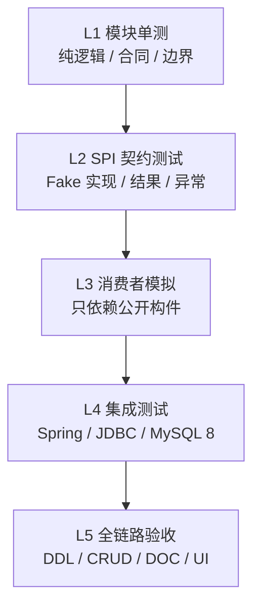
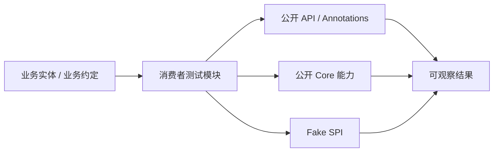
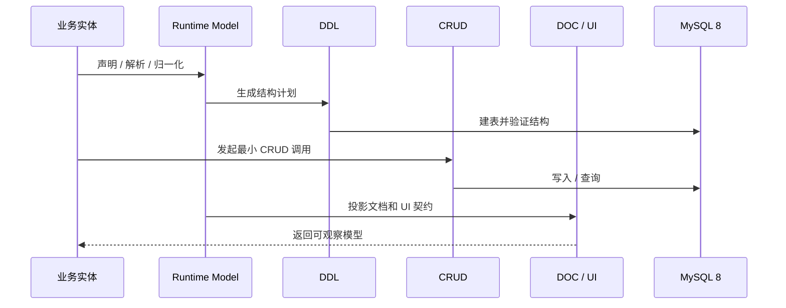
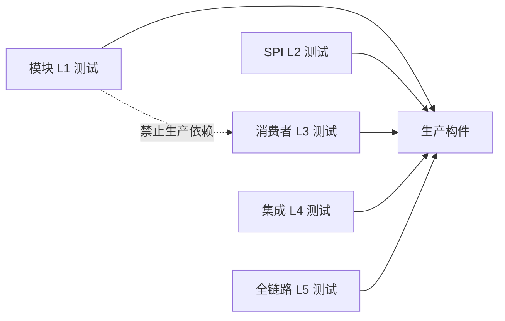
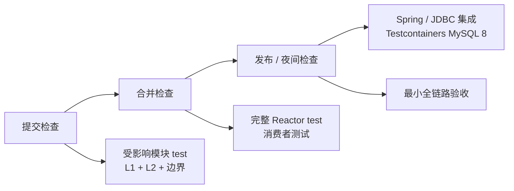
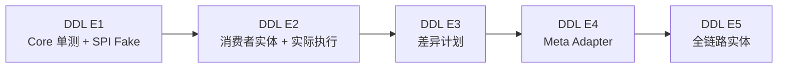

# 测试策略与验收分层

> 性质：Core Contract
> 状态：Current
> 最近核验：2026-08-25

本文定义 ent-loom 的全局测试分层、模块责任和验收门禁。它解决两个问题：模块本身如何保持稳定，以及业务项目如何确认可以接入框架。具体模块的测试类、命令和阶段证据仍以对应模块路线图为准。

## 核心原则

1. 模块测试保证“自己正确”，消费者测试保证“别人能接入”，集成测试保证“能连接真实基础设施”，全链路测试只验证最小主路径。
2. 测试依赖和测试装配不能进入 Core 的运行时依赖；业务模拟不能反向成为框架模块的生产依赖。
3. 可拔插能力必须在成功、空输入、异常、重复调用和不可变结果这几个共同维度上验证；具体 SPI 再增加自己的领域语义。
4. 测试层级从低到高逐步扩大环境和组合范围。低层失败时，不用高层测试掩盖合同问题。
5. 一个测试只验证一个主要边界。跨模块测试验证组合关系，不重复覆盖每个模块内部算法。

## 测试分层



### L1：模块内单测与边界测试

位置：各模块自己的 `src/test`。

覆盖模块内部的纯 Java 逻辑、Runtime Model、状态转换、SQL 生成、默认值、校验、异常和不可变集合。Core 模块同时使用 ArchUnit 或等价检查，验证禁止依赖没有从 POM 或字节码边界回流。

典型覆盖：

- `annotations`：注解默认值、组合声明和编译期可用性。
- `api`：构造参数、空输入、枚举边界、不可变结果和兼容性。
- `core`：纯业务算法、稳定顺序、状态矩阵、异常分类和模块边界。
- `bootstrap`：显式类列表到 Runtime Model 的解析。
- `spring`：包扫描、Spring Bean 和配置装配。
- `starter`：自动配置开关、缺省 Bean 和禁用时不执行。
- `adapter`：来源映射、优先级、冲突和目标 Runtime Model。

L1 是每次提交的最小反馈闭环，不要求启动 Spring 或数据库。

### L2：SPI 契约测试

位置：优先放在 SPI 所属模块；多实现共享的公共断言可放在独立测试支持目录，但不发布为生产 API。

每个可拔插接口至少验证以下矩阵：

| 场景 | 验证重点 |
|---|---|
| 正常输入 | 调用顺序、结果字段和成功状态 |
| 空输入 | 是否无副作用、是否返回空集合或明确结果 |
| 非法输入 | fail-fast 位置、异常类型和诊断信息 |
| 执行异常 | generated、executed、errors 或等价结果的区分 |
| 重复调用 | 幂等性、冻结状态和是否重复注册 / 执行 |
| Fake 实现 | 消费者可以替换实现，不依赖具体框架或数据库 |

Fake 只模拟可观察的 SPI 行为，不复制生产实现的内部算法。例如 DDL 使用 fake `QueryStrategy` 和 `SqlExecutor` 验证编排；不在 fake 中模拟 MySQL 方言解析。

### L3：独立消费者模拟

位置：建议建立独立的 `ent-loom-tests` 聚合，按场景拆分消费者测试模块：

```text
ent-loom-tests/
├── ent-loom-ddl-consumer-test
├── ent-loom-cross-module-test
└── ent-loom-e2e-test
```

消费者模块模拟真实业务项目，只依赖公开构件和公开接口：



消费者测试必须遵守：

- 不引用 `core` 的包内实现、测试类或内部工具。
- 不把 Spring、Servlet、Starter 作为 Core 消费合同的隐含前提。
- 不直接访问测试目录中的 fixture；业务 fixture 应放在消费者模块内部。
- 至少验证一次“只使用公开构件即可编译并完成最小调用”。
- 跨模块测试只验证 Adapter 和公开 Runtime Model 的组合，不替代各模块 L1。

独立消费者模块不是生产模块，也不是万能 Demo；它的职责是尽早发现公共 API 漂移和不真实的接入假设。

### L4：基础设施集成测试

位置：Spring、JDBC 和数据库相关模块，使用独立 Maven profile 或专用测试模块。

分层验证真实基础设施：

- Spring：上下文启动、条件装配、配置绑定和关闭开关。
- JDBC：事务、查询、执行异常和资源释放。
- MySQL 8：建库、建表、字段类型、默认值、索引和实际执行结果。
- Testcontainers：提供可重复的 MySQL 8 环境，测试结束后销毁容器。

H2 可以作为快速辅助数据库，但不能替代 MySQL 8。凡是涉及 MySQL 方言、DDL 默认值、索引或标识符语义的测试，最终必须有 MySQL 8 证据。

L4 不应成为每次提交的默认阻塞项，除非变更直接触及对应集成层；它至少应在合并、发布或夜间门禁中执行。

### L5：最小全链路验收

只选择一个简单实体，验证最短主链：



L5 只证明跨领域组合成立，不承担所有异常矩阵、所有数据库类型和所有业务权限场景。复杂关系、批量操作、权限和迁移风险应留在对应模块或集成层测试。

## 模块与能力测试责任

| 能力 | L1 重点 | L2 / L3 重点 | L4 / L5 重点 |
|---|---|---|---|
| DDL | 元数据合同、MySQL SQL、执行结果和 Core 边界 | Fake 查询 / 执行器、消费者实体接入 | MySQL 8 实际建表和 E2E 主链 |
| CRUD | Spec、合法矩阵、Engine、治理和结果 | Fake Repository / Handler、公开 API 接入 | Spring JDBC、HTTP 和事务 |
| Meta | Descriptor、Resolver、诊断和冻结模型 | Native-only、Meta-only、Meta + Module | Starter 收集与跨模块投影 |
| Adapter | 来源、优先级、冲突和目标模型 | Meta -> DDL / CRUD / DOC / UI 消费者 | 组合装配和完整实体投影 |
| Spring / Starter | 配置对象和条件分支 | 缺省 Bean、替换 Bean、关闭开关 | 真实应用上下文启动 |
| DOC / UI | Runtime Model 和输出合同 | 业务字段展示 / 编辑接入 | 与实体、CRUD、Meta 组合验收 |

## 测试模块边界



约束如下：

1. 生产模块不得依赖任何测试模块。
2. L1/L2 测试可以依赖测试框架和 ArchUnit，但这些依赖必须是 `test` scope。
3. L3 消费者测试只依赖发布视角的公开 artifact；可以依赖 fake，但 fake 不进入生产类路径。
4. L4 可以依赖 Spring、JDBC、Testcontainers 和数据库驱动，但必须与 Core 测试入口隔离。
5. L5 可以依赖多个公开模块，但不能通过反射访问内部实现来“拼接”结果。

只有在出现真实消费者、稳定测试边界和可观察收益后，才新增独立测试 artifact；不存在真实边界时优先增加模块内测试和测试 fixture，避免创建空泛的测试占位模块。

## CI 门禁



- 提交检查：固定 JDK 21、Maven Wrapper、受影响模块测试和架构边界测试。
- 合并检查：完整 Maven Reactor 测试、独立消费者测试和跨模块 Adapter 测试。
- 发布 / 夜间检查：Spring 上下文、JDBC、Testcontainers MySQL 8 和最小全链路验收。
- 测试失败必须保留命令、测试类、环境和失败结果；不能只记录“构建失败”。

## 当前落地顺序



当前采用“先较小闭环，再扩大环境”的顺序：

1. 先在各 Core 完成 L1 和边界守卫。
2. 再为每个 SPI 增加 fake 实现及 L2 结果合同。
3. 出现稳定公开 API 后，新增对应消费者模拟模块完成 L3。
4. DDL E2、Spring/JDBC 能力稳定后，再启用 MySQL 8 集成测试。
5. 最后用一个简单实体完成 DDL、CRUD、DOC、UI 的 L5 验收。

当前 DDL 的具体测试命令和证据见 [DDL 实施清单](../../evolution/roadmap/ddl/DDL实施清单.md)。
