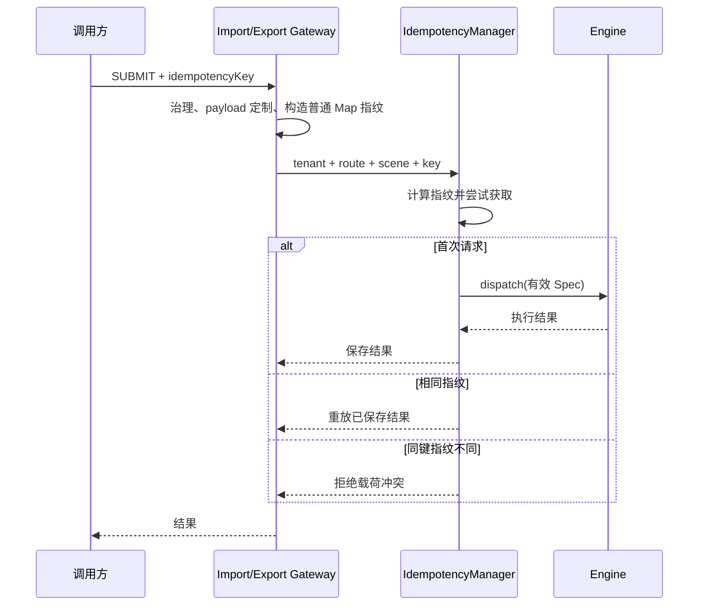

# 运行时上下文与幂等策略

> 状态：Current（CRUD 导入导出最小策略）
> 最近核验：2026-09-03
> 范围：`ent-loom-crud-core` 与 `ent-loom-runtime-adapter`

本文补充[运行时适配最小闭环](运行时适配最小闭环.md)，记录当前已经落地的上下文属性编码和导入导出幂等策略。它不把 CRUD 语义提升为 `ent-runtime` 的公共模型。

## 依赖与执行边界


| 边界 | 当前职责 | 当前不负责 |
|---|---|---|
| `ent-loom-crud-core` | 识别 `SUBMIT`、构造 CRUD 语义指纹、执行幂等重放/冲突判断 | Redis、分布式锁、跨服务幂等和持久化重放结果 |
| `ent-loom-runtime-adapter` | 将任务上下文属性编码为 runtime 字符串，并恢复为 CRUD 类型 | 认证、授权、线程上下文传播和实体语义解释 |
| `ent-runtime` | 保存不透明字符串属性，提供通用任务/文件契约 | 不认识 `Class<?>`、scene、CRUD operation 或 `CrudDataScope` |

## 上下文属性编码

runtime 扩展属性使用 `v1:<type>:<payload>` 协议；没有 `v1:` 前缀的历史值仍按字符串读取。

| CRUD 值 | runtime 值 | 说明 |
|---|---|---|
| `null` | `v1:null:` | 保留显式空值，不与缺少属性混淆 |
| `String` / `Character` | `v1:string:` / `v1:char:` + Base64URL | 避免分隔符和编码问题 |
| 基础数字、布尔值 | 带类型标记的值 | 恢复原始 Java 基础包装类型 |
| 枚举 | 枚举类名 + 枚举名 | 通过调用方 ClassLoader 恢复 |
| 常见 Java 时间类型 | 类型名 + `toString()` | 当前支持 `Instant`、`LocalDate`、`LocalDateTime`、`LocalTime`、Offset/Zoned 时间、`Year`、`YearMonth` |
| `List`、数组 | 长度分隔的递归元素 | 保留顺序和组件类型 |

任务的实体类型只保存稳定类名；operation、scene、scope、audit 和业务上下文保存于 `entloom.crud.*` 命名空间。无法双向恢复的时间类型在编码端直接拒绝，避免写入不可读数据。

## 导入导出幂等

只有 `ImportSpec` 和 `ExportSpec` 显式提供 `idempotencyKey` 且操作为 `SUBMIT` 时，Gateway 才启用幂等。未提供幂等管理器时保持原有直接执行兼容行为；`VALIDATE`、`PREVIEW`、`COMMIT`、查询任务和下载不复用该策略。



指纹只接收可稳定规范化的普通结构，不把完整 Spec、`Class<?>`、JDK Bean 或运行时对象直接交给通用 `StablePayloadCanonicalizer`。当前包含以下请求语义：

- operation、scene、rootType、entityClasses；
- subject 的 `subjectId`、`tenantId`、`orgId`，以及治理后的数据范围；
- format、mode、fileName、taskId、filters、sorts、page、limit；
- import 的 `sourceFile.fileId`；
- payload、attributes、async、batchSize、transactionPolicy 等执行选项。

幂等结果的当前语义固定为：首次执行保存结果；相同键和相同指纹重放；相同键和不同指纹抛出载荷冲突；已有请求执行中抛出处理中。真正跨进程使用前仍需增加可持久化的结果编码、租约和存储实现。

## 当前证据与非目标

```text
CRUD Core: JDK 21 下 ./mvnw -pl ent-loom-modules/ent-loom-crud/ent-loom-crud-core -am test
Adapter:    JDK 21 下 ent-loom-integrations/ent-loom-runtime-adapter/../../mvnw test
```

当前测试证明的是指纹、类型往返和 Task/File Adapter 合同；尚未证明真实异步 Worker、消息投递、跨服务重放或生产级分布式幂等已经完成。
