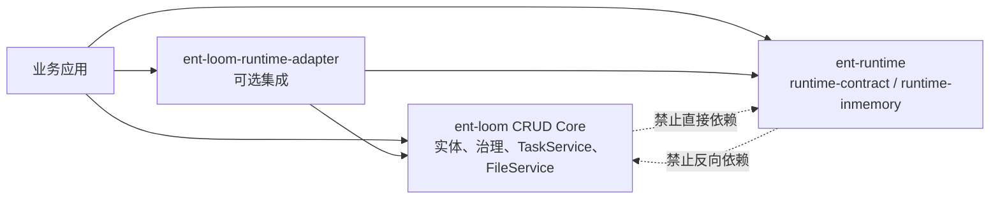
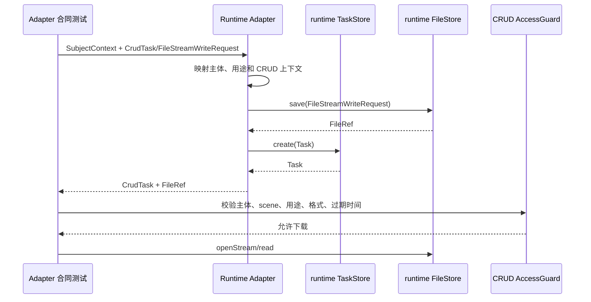

# 运行时适配最小闭环

> 状态：Current（Adapter 合同验证）
> 最近核验：2026-09-03
> 范围：`ent-loom` CRUD 与 `ent-runtime` 的首个可选集成

本文记录已经落地的最小闭环；详细实施取舍见[运行时适配最小闭环实施计划](../../evolution/roadmap/core/运行时适配最小闭环实施计划.md)。

## 依赖边界



适配器不进入 `ent-loom` 默认 Reactor，先作为可单独构建的可选 Maven 模块；两个仓库的 Contract 稳定后再评估是否纳入统一构建或发布清单。

## 已实现类型

| 位置 | 类型 | 职责 |
|---|---|---|
| `ent-runtime/runtime-contract` | `FileStreamWriteRequest`、`FileStore.save(...)` | 提供带主体、用途、过期时间和扩展属性的流式文件契约 |
| `ent-runtime/runtime-inmemory` | `InMemoryFileStore` | 消费并关闭输入流，保留文件安全元数据 |
| `ent-loom/ent-loom-crud-core` | `CrudTaskType`、`CrudFilePurpose` | 收敛 Import/Export 语义值 |
| `ent-loom/ent-loom-runtime-adapter` | `RuntimeSubjectContextMapper` | 映射 subjectId、tenantId、orgId，补充默认 subjectType |
| `ent-loom/ent-loom-runtime-adapter` | `CrudRuntimeTaskMapper` | 映射任务状态和 CRUD 上下文命名空间属性 |
| `ent-loom/ent-loom-runtime-adapter` | `CrudRuntimeFileMapper` | 映射文件流、引用、用途、主体和存储类型 |
| `ent-loom/ent-loom-runtime-adapter` | `RuntimeTaskServiceAdapter`、`RuntimeFileServiceAdapter` | 以 runtime Store 实现 CRUD 两个 SPI |
| `ent-loom/ent-loom-crud-core` | `CrudIdempotencyFingerprint` | 将治理后的 Import/Export 请求收敛为普通 Map 指纹 |
| `ent-loom/ent-loom-runtime-adapter` | `RuntimeAttributeCodec` | 对任务上下文扩展属性做版本化类型编码和兼容读取 |

## 当前验证路径



任务的 `errorFile` 以 `entloom.crud.errorFileId` 保存于 runtime 扩展属性；实体 `Class<?>`、`CrudOperationKey`、`CrudDataScope` 不进入 runtime 公共字段，只由适配器命名空间编码。

上下文编码和导入导出幂等的独立契约见[运行时上下文与幂等策略](运行时上下文与幂等策略.md)。当前幂等只对显式提供 key 的 `SUBMIT` 生效，且指纹在治理和 payload 定制之后构造。

## 验收证据

```text
ent-runtime: ./mvnw clean test
ent-loom CRUD Core: JDK 21 下 ./mvnw -pl ent-loom-modules/ent-loom-crud/ent-loom-crud-core -am test
Adapter: JDK 21 下 ../../mvnw test
```

适配器测试覆盖主体往返、文件流和元数据、任务状态和上下文、错误文件引用，以及使用内存 Store 的任务文件下载守卫。该测试手工构造 `CrudTask` 和文件引用，未经过 `ExportGateway -> QueryEngine -> ExportEngine`，因此不代表真实异步导出或生产 Worker 已完成。

## 边界

本闭环不代表已经提供线程池、调度器、持久化 Worker、Redis、MQ、对象存储、JWT 或生产级异步执行。`CrudTaskStatus.EXPIRED` 也不强行映射到 runtime 任务状态；文件过期仍由文件引用和下载守卫分别处理。
