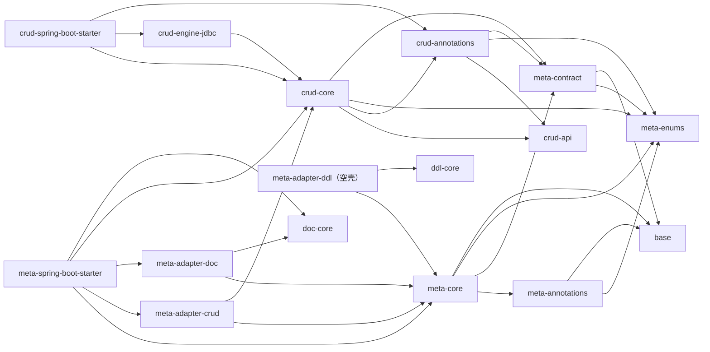
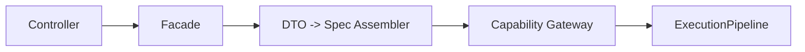
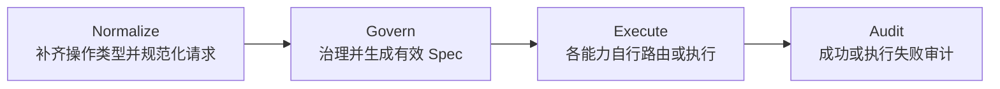
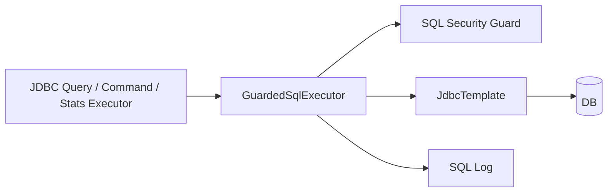
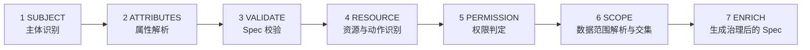
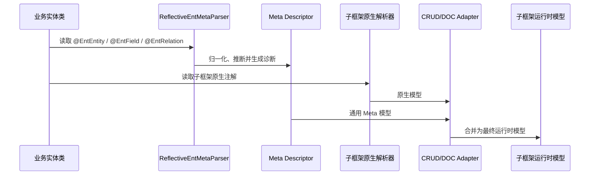

# ent-loom 架构概览

本文描述当前仓库中已经存在的模块和默认实现。规划中的能力会明确标注，不把扩展点等同于已落地能力。

`ent-loom` 由通用 Meta、CRUD、DDL、DOC、UI 契约以及 Meta Adapter 组成。当前 Meta 已能投影到 CRUD 和 DOC；DDL Adapter 仍为空壳，UI 尚无 Meta Adapter。

## 1. Maven 模块

根聚合模块包含四个一级模块：

```text
ent-loom
├── ent-loom-base
├── ent-loom-meta
│   ├── ent-loom-meta-enums
│   ├── ent-loom-meta-contract
│   ├── ent-loom-meta-annotations
│   └── ent-loom-meta-core
├── ent-loom-components
│   ├── ent-loom-crud
│   │   ├── ent-loom-crud-api
│   │   ├── ent-loom-crud-annotations
│   │   ├── ent-loom-crud-core
│   │   ├── ent-loom-crud-engine-jdbc
│   │   ├── ent-loom-crud-import-export-excel
│   │   └── ent-loom-crud-spring-boot-starter
│   ├── ent-loom-ddl
│   │   ├── ent-loom-ddl-api
│   │   ├── ent-loom-ddl-annotations
│   │   ├── ent-loom-ddl-core
│   │   ├── ent-loom-ddl-bootstrap
│   │   ├── ent-loom-ddl-spring
│   │   └── ent-loom-ddl-spring-boot-starter
│   ├── ent-loom-doc
│   │   ├── ent-loom-doc-annotations
│   │   └── ent-loom-doc-core
│   └── ent-loom-ui
│       └── ent-loom-ui-core
└── ent-loom-meta-adapters
    ├── ent-loom-meta-adapter-crud
    ├── ent-loom-meta-adapter-ddl
    ├── ent-loom-meta-adapter-doc
    └── ent-loom-meta-spring-boot-starter
```

模块职责：

| 模块组 | 当前职责 |
| :--- | :--- |
| `base` | `OptionalBoolean`、`TypedValue` 等公共类型 |
| `meta` | 通用枚举、Descriptor/诊断契约、Meta 注解及反射解析 |
| `crud` | Query、Command、Stats、Import、Export 的契约、治理、路由及默认实现 |
| `ddl` | DDL 注解、模型、方言、迁移执行及 Spring 集成 |
| `doc` | 文档注解、文档运行时模型及扩展 SPI |
| `ui` | `UiEntityContract`、`UiFieldContract`、`UiSchemaProvider` 三个 UI 契约 |
| `meta-adapters` | Meta 到 CRUD/DOC 运行时模型的适配，以及相应自动装配 |

## 2. 主要依赖方向

下图中 `A --> B` 表示 **A 直接依赖 B**。图中只保留主要内部依赖，未列测试依赖和第三方依赖。



CRUD、DDL、DOC 子框架不依赖 `ent-loom-meta-annotations`。因此它们可以使用自己的注解或运行时模型独立工作；引入 Meta Adapter 后，才增加通用 Meta 投影能力。

## 3. CRUD 公共执行管线

HTTP 是一种入口，不是使用 Gateway 的前提。内置 HTTP 入口的典型调用关系如下：



Query、Command、Stats、Import、Export 的内置 Gateway 都使用 `ExecutionPipeline`。公共管线是：



公共管线只统一阶段和治理边界，不强制所有能力采用同一种路由或存储引擎。准确的执行分支是：

| 能力/操作 | 治理后的默认执行路径 |
| :--- | :--- |
| Query | `QueryRouter` 解析路由，调用场景处理器或默认 `QueryEngine` |
| Command | `CommandRouter` 解析路由，调用场景处理器或默认 `CommandEngine`；`ACTION` 必须命中动作场景 |
| Stats | 场景处理器存在时优先，否则调用 `StatsQueryEngine` |
| Import `VALIDATE/SUBMIT/COMMIT` | 场景处理器存在时优先，否则调用 `ImportEngine` |
| Export `SUBMIT/PREVIEW` | 场景处理器存在时优先，否则调用 `ExportEngine` |
| Import/Export 任务操作 | 治理后直接调用 `TaskService`、`TaskFileAccessGuard`，不经过场景路由和 SQL 执行器 |

场景路由键 `CrudRouteKey` 由以下三部分组成：

```text
(有序 entityTypeNames, operationKey, 归一化后的 scene)
```

其中 `operationKey` 同时包含操作域和具体操作；`scene` 会执行 `trim` 并转为小写。多实体路由要求首元素等于 `rootType`。

### 3.1 JDBC 边界

`ent-loom-crud-engine-jdbc` 提供 Query 和 Command 的 JDBC 实现；Stats 的默认引擎通过 `StatsQueryExecutor` 执行，Starter 可装配 JDBC Executor。只有这些 JDBC 路径最终进入 `GuardedSqlExecutor`：



Import/Export 是独立 Engine SPI，任务状态、取消和文件下载也不是 JDBC SQL 链的一部分。

## 4. 治理七阶段

`DefaultCrudGovernanceService` 对五类能力执行相同的七阶段编排：



治理成功后返回 `CrudGovernanceResult`，其中包含：

- 规范化主体；
- 资源动作；
- 访问决策；
- 授权范围和最终治理范围；
- 有效 Spec；
- 治理开始时间，用于审计耗时。

`AccessDecision.DENY` 会立即抛出 `PermissionDeniedException`，不会作为正常的 `CrudGovernanceResult` 返回。`MASK`、`FILTER` 当前是预留决策值。

默认 `FailClosedCrudSubjectResolver` 会拒绝缺少真实主体解析器的调用。业务接入时必须提供基于实际登录态的 `CrudSubjectResolver`。这里的“不可绕过治理”特指通过内置 Gateway 执行的路径；直接调用底层 Engine 不具备该保证。

审计时点如下：

- 治理阶段失败：`DefaultCrudGovernanceService` 记录治理失败；
- 执行成功：`ExecutionPipeline` 调用 `recordAllow`；
- 执行失败：`ExecutionPipeline` 调用 `recordExecutionFailure`。

## 5. Meta 解析与 Adapter

当前可用的 Meta 主链是：



不能为所有 Adapter 声明一条完全相同的优先级规则。当前实现分别是：

- CRUD/DOC 合并器在同一属性上优先选择子框架原生显式值，其次选择 Meta 显式值，再使用推断值或默认值；显式值冲突会生成诊断。
- DOC 在合并完成后还允许 `DocOverrideProvider` 做业务显式覆盖，因此该覆盖高于原生注解和 Meta 注解。
- Registry、SPI 和配置的作用点各不相同，不能笼统排在一条全局优先级链中。

`ent-loom-meta-spring-boot-starter` 当前自动装配 Meta Parser、CRUD Adapter 和 DOC Adapter。CRUD/DOC Adapter 还要求配置的实体类列表非空，并可分别通过配置关闭。

## 6. CRUD 能力与操作

操作以代码中的枚举为准：

| 能力 | 操作 |
| :--- | :--- |
| Query | `PAGE`、`LIST`、`FIND_ONE`、`DETAIL` |
| Command | `CREATE`、`UPDATE`、`DELETE`、`SAVE_OR_UPDATE`、`CREATE_BATCH`、`UPDATE_BATCH`、`DELETE_BATCH`、`SAVE_OR_UPDATE_BATCH`、`ACTION` |
| Stats | `QUERY`、`PREVIEW` |
| Import | `VALIDATE`、`SUBMIT`、`COMMIT`、`CANCEL`、`STATUS`、`DOWNLOAD_ERROR` |
| Export | `SUBMIT`、`DOWNLOAD`、`STATUS`、`CANCEL`、`PREVIEW` |

JDBC Query 当前只支持 `ROOT_FIRST` 策略。执行过程是先查询根实体，再根据请求展开的 `RelationEdge` 补充关系数据：

- `LOCAL_DB` 关系使用 `IN (...)` 批量查询；
- 非本地关系委托匹配的 `RelationLoader`；
- 查询结果在 Java 内存中分组并回填到对象树。

因此“避免复杂 JOIN”只描述当前 `ROOT_FIRST` 的关系展开实现，不代表框架禁止自定义 SceneHandler 或 Engine 使用 JOIN。

## 7. 当前实现边界

- `ent-loom-meta-adapter-crud`：已有解析、合并和运行时模型实现。
- `ent-loom-meta-adapter-doc`：已有合并、业务覆盖和文档模型实现。
- `ent-loom-meta-adapter-ddl`：仅有 Maven 模块及依赖，`src` 下没有实现代码。
- UI：当前只有三个核心契约，没有 Meta Adapter，也没有默认 UI 渲染实现。
- `ent-loom-meta-components/`、`ent-loom-crud-relation-query/`、`ent-loom-crud-spring/`、`ent-loom-crud-stats-core/`、`ent-loom-crud-stats-engine-jdbc/`、`ent-loom-crud-demo/` 没有有效 `pom.xml` 或源码，未被当前 Maven 聚合构建引用。
- `ent-loom-meta` 是 `pom` 类型的聚合模块。业务模块应按需依赖具体叶子模块，而不是依赖该聚合模块。
