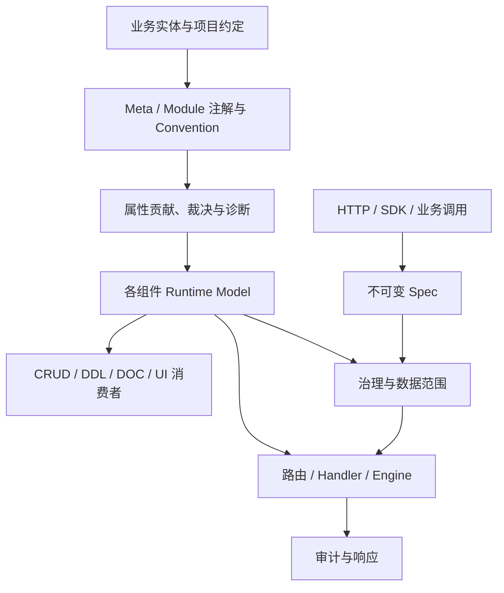

# ent-loom 系统架构总览

> 状态：Current
> 最近核验：2026-08-20
> 范围：当前 Maven Reactor 中的有效模块

ent-loom 将“业务模型如何被解释”和“请求如何被安全执行”拆成两条独立主链。Meta、CRUD、DDL、DOC、UI 可以共享通用语义，但每个组件仍拥有自己的运行时模型并可独立使用。

## 架构地图



建模主链以 [元数据约定与裁决契约](core/元数据约定与裁决契约.md) 为权威来源；执行主链以 [治理 Pipeline](core/governance/治理流水线.md) 和各组件架构为权威来源。两者通过组件 Runtime Model 连接，但不合并成一个万能模型。

## 模块角色

| 模块组 | 角色 | 主要输出 |
|---|---|---|
| `ent-loom-base` | 公共轻量类型 | 无框架依赖的基础值类型 |
| `ent-loom-meta-*` | 通用语义、Descriptor、解析与诊断 | Meta Descriptor |
| `ent-loom-modules/ent-loom-crud` | 数据操作契约、治理、路由和默认执行 | CRUD Runtime Model、Spec、Result |
| `ent-loom-modules/ent-loom-ddl` | 数据库结构模型与迁移 | DDL Runtime Model |
| `ent-loom-modules/ent-loom-doc` | 文档运行时模型 | Doc Runtime Model |
| `ent-loom-modules/ent-loom-ui` | UI Schema 契约 | UI Contract |
| `ent-loom-integrations` | 跨模块投影 | Meta -> Module Adapter |
| Spring Boot Starter | 装配、配置与框架集成 | Bean、配置入口、HTTP 入口 |

## 三条长期不变量

### 1. 模块可以独立运行

组件 Core 不依赖 `ent-loom-meta-core` 才能工作。只使用 CRUD、DDL、DOC 或 UI 时，组件原生注解与 Parser 必须能独立生成自己的 Runtime Model；引入 Meta 后由 Adapter 增强。

### 2. 运行时只消费组件模型

注解、配置和 Convention 都是输入，不是运行时执行合同。所有输入先归一为组件 Runtime Model，再由 Query、Command、DDL、DOC 或 UI 消费者使用。

### 3. 治理与执行不可混为建模

元数据说明资源和字段是什么；治理决定当前主体是否能操作；Handler 或 Engine 决定如何执行。任何一层都不能通过增加属性绕过另一层职责。

## 当前主链

CRUD 当前提供 Query、Command、Stats、Import、Export 五个操作域。通过内置 Gateway 的请求遵循：

```text
Normalize -> Govern -> Route/Execute -> Audit
```

Query、Command 和 Stats 可进入 Scene Handler 或默认 Engine；Import/Export 使用独立 Engine 与 Task/File 能力。JDBC 只是默认执行实现，不是 Core Contract。

详细内容见 [CRUD 架构文档入口](components/crud/index.md)。

## 目标与当前事实

顶层 Contract 可以处于 `Target` 状态，但组件架构只能描述已经存在的能力。尚未完成的 Project Convention、DDL/UI Adapter、Starter 收集机制和兼容线迁移统一在 [演进路线图](../evolution/roadmap/index.md) 跟踪。
