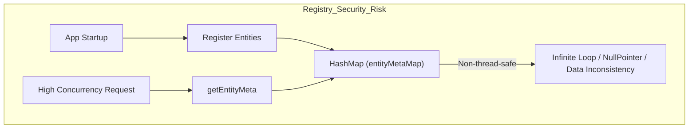
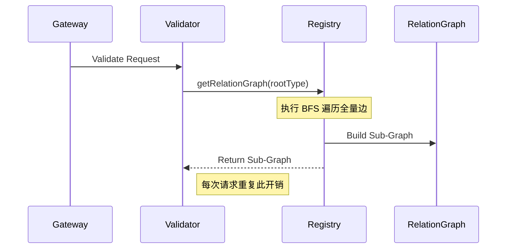
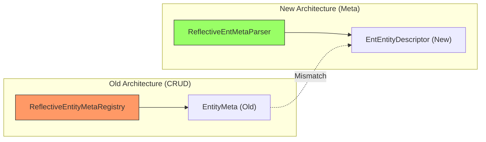
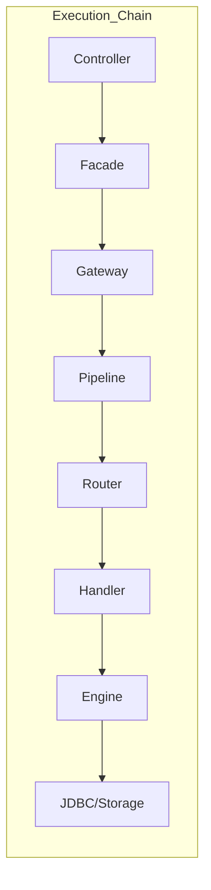

# ent-loom 框架架构审计报告 (2026-05-04)

## 1. 核心审计结论
当前 `ent-loom` 框架处于**从“碎片化原型”向“工程化产品”过渡**的关键重构期。虽然元数据驱动的设计理念具备前瞻性，但在并发安全、运行时性能、以及模块收敛进度上存在显著风险。

---

## 2. 核心问题清单

### 2.1 运行时并发安全漏洞 (Critical)
`ReflectiveEntityMetaRegistry` 使用非线程安全的 `HashMap` 存储核心元数据。

*   **修复建议**：将 `HashMap` 替换为 `ConcurrentHashMap`，或确保元数据在启动阶段完成静态冻结（Frozen）。

### 2.2 性能瓶颈：冗余的关系图遍历
`getRelationGraph` 在每次请求校验时都会动态执行 BFS。

*   **修复建议**：在实体注册阶段预计算关系图，并按 `rootType` 缓存结果。

### 2.3 架构分裂：新老元数据模型并存
`ent-loom-meta` (新) 与 `ent-loom-crud` (旧) 的解析逻辑尚未闭环。

*   **主要冲突**：同一个类被反射解析两次，产生两套不完全对等的描述对象。

### 2.4 过度工程化与链路追踪困难
模块层级极深，导致问题排查链路过长。

*   **审计观察**：对于当前单项目规模，20+ 模块导致了严重的“依赖地狱”倾向，修改一个基础字段注解可能涉及 3-4 个模块的重新编译。

---

## 3. 后续待办事项 (TODO)
- [ ] **并发加固**：重构 `ReflectiveEntityMetaRegistry` 的并发控制。
- [ ] **性能优化**：实现 `RelationGraph` 的预计算缓存。
- [ ] **模块收敛**：按《改造方案》执行 Phase 1-4，合并 `stats` 与 `relation-query`。
- [ ] **契约对齐**：统一 `EntityMeta` (Old) 与 `EntEntityDescriptor` (New) 的数据映射。
