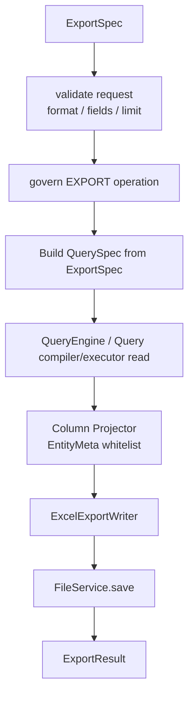

# Export MVP 最佳实践

本文只描述 `ent-loom-crud` 导出能力的 P0 实现细节。跨导入导出的共同约束见 [Import / Export MVP 统筹设计](import-export-plan.md)。

## 1. P0 目标

导出 P0 闭环：

```text
EXPORT/PREVIEW -> EXPORT/SUBMIT -> EXPORT/DOWNLOAD -> 权限拒绝审计
```

P0 只支持：

- 单实体导出。
- `excel-xlsx`。
- 小文件同步生成。
- 按 `EXPORT/*` 独立授权后的读取。
- 字段白名单、数据范围、limit、稳定排序、公式注入转义。

P0 不做：

- 多 sheet 报表。
- 图表和复杂样式。
- 多文件 zip。
- 订阅报表。
- 流式大文件导出。
- 分片下载。

### 1.1 待实现方案的 P0 补齐清单

导出待实现方案如果只有 `ExportSpec / ExportGateway / ExportEngine` 等协议壳，还不能算较小 MVP。P0 必须补齐以下七个闭环缺口。

待实现基线：

- 已有 `ExportOperation / CrudOperationDomain.EXPORT / ExportSpec / ExportResult / ExportGateway / ExportEngine / ExportFormatDescriptor`。
- 已有 Query 读取能力、`ExecutionPipeline`、治理审计主链和 `FileService / TaskService` 抽象，可作为导出实现的基础。
- 待实现方案必须补齐 `ExportGatewayImpl`、`governExport`、`ExportFormatRegistry`、默认 `DefaultExportEngine`、导出 HTTP DTO/Controller/Facade/Assembler、Excel writer、默认 File/Task 小文件实现和端到端 fixture。
- 因此本节判断完成度时，只把真实执行路径和自动化验收算作完成；接口类、空 AutoConfiguration、TODO 或只测 Spec 复制都只能算架构占位。

每个缺口都按同一口径判断是否完成：

- 有可运行代码路径，而不是只有接口、TODO 或空实现。
- 有自动化测试或端到端 fixture 证明行为。
- 失败语义稳定，能返回统一错误结构。
- 治理、审计、Task/File 和 HTTP 脱敏不能后补成旁路能力。

#### 1.1.1 Export 主链闭环

必须新增 `ExportGatewayImpl`，并让所有公开导出操作先进入框架主链：

```text
ExportGatewayImpl
  -> ExecutionPipeline
  -> governExport
  -> ExportHandler 或 DefaultExportEngine
  -> audit success/failure
```

MVP 行为：

- `preview / submit / status / download` 必须全部由 Gateway 承接。
- Gateway 负责复制和规范化 `ExportSpec`，不能把 HTTP DTO 或可变 Map 直接传到 Engine。
- Gateway 必须固定执行顺序：normalize、request validation、format validation、govern、route、execute、audit、response adaptation。
- 空 scene 可以进入 `DefaultExportEngine`；非空 scene 未命中 `ExportHandler` 必须返回 `SCENE_NOT_FOUND`。
- `cancel` P0 可以不开放 HTTP；如果 core 保留方法，默认返回 `UNSUPPORTED_OPERATION`，不能静默成功。
- 所有失败都要进入统一错误结构；权限失败和系统失败都要审计。

不算完成：

- Controller 或 Facade 直接调用 QueryGateway、QueryEngine、ExportEngine 或 FileService。
- `STATUS / DOWNLOAD` 直接读 Task/File，绕过 Gateway 和治理。
- scene miss 自动退回默认 engine。
- 只新增 `ExportGateway` 接口或默认 Bean 名称，但没有可观察的 Pipeline 执行路径。

验收：端到端测试必须能证明请求经过 Controller、Facade、Assembler、Gateway、Pipeline，再到 Engine 或 Handler；非空 scene miss 返回 `SCENE_NOT_FOUND`；P0 未开放 operation 返回 `UNSUPPORTED_OPERATION`。

#### 1.1.2 独立治理和审计

导出是高风险 operation domain，不能继承普通查询权限。MVP 必须补：

- `CrudGovernanceService.governExport(ExportSpec)`。
- `CrudDataScopeResolver.resolveExportScope(...)` 或等价桥接实现。
- `EXPORT/PREVIEW`、`EXPORT/SUBMIT`、`EXPORT/STATUS`、`EXPORT/DOWNLOAD` 的独立授权。
- 导出审计上下文，至少包含 requestId、operation、scene、subject、tenant、org、format、fields、filtersHash、taskId、fileId、rowCount、decision、failureCode。

MVP 可以复用 Query 的数据范围计算实现，但 operationKey 必须保持 `EXPORT/*`。`allowed=false` 时必须立即拒绝，不得读取业务数据、生成文件或打开下载流。

不算完成：

- 只检查 `QUERY/LIST` 或 `QUERY/PAGE` 权限。
- 直接调用 `QueryGateway`，导致重新走 Query 授权和 Query 审计。
- 先查询数据或打开文件流再做权限判断。
- 审计只记成功，不记拒绝和系统失败。

验收：无 Query 权限但有 Export 权限的主体可以导出；有 Query 权限但无 Export 权限的主体必须被拒绝，并产生审计；拒绝路径不得调用 QueryEngine、Excel writer 或 FileService.read。

#### 1.1.3 HTTP/API 合同

需要在 `ent-loom-crud-api` 和 starter 中补齐稳定 HTTP 合同：

- `CrudExportHttpRequest`：`requestId / format / fileName / async / fields / filters / sorts / time / page / limit / taskId / fileId / options / attributes`。
- `CrudExportData`：`accepted / async / task / file / totalRows / previewRows`。
- `CrudTaskData`、`CrudFileData`。
- `EntCrudExportController`、`EntCrudExportFacade`、`CrudExportSpecAssembler`、`CrudExportResponseAssembler`。

硬规则：

- `operation` 只能由 path/facade 固定，不能出现在请求 DTO 中。
- `attributes` 必须过滤保留字段，客户端不能覆盖 subject、tenant、org、operation、dataScope。
- `CrudTaskData` 不返回 `contextSnapshot`；`CrudFileData` 不返回 storageKey、本地路径、OSS key 或 checksum 原文。
- `DOWNLOAD` 成功返回二进制；失败返回统一错误结构，不能半个文件流半个 JSON。

不算完成：

- 直接把 `ExportResult / CrudTask / FileRef` 序列化给客户端。
- 下载接口在已经开始写二进制后再尝试返回 JSON 错误。
- 请求 DTO 接收 operation、tenant、org、dataScope 等框架保留字段并直接信任。
- DTO 仍放在 starter 私有包中，导致外部契约无法稳定复用或版本化。

验收：HTTP 返回的是外部 DTO，不直接暴露 `ExportResult / CrudTask / FileRef` 作为长期 JSON 合同；保留字段注入测试不能改变服务端 operation、subject、tenant、org、dataScope。

#### 1.1.4 FormatRegistry 与 Excel 注册

core 必须提供不依赖 Excel 实现的格式注册表：

```text
ExportFormatRegistry
  getRequired(format)
  supports(format)
  descriptors()
```

MVP 行为：

- `format` 为空时由 Assembler 填充默认值 `excel-xlsx`。
- 未注册格式返回 `UNSUPPORTED_FORMAT`。
- 同一 format 重复注册时启动失败。
- `ent-loom-crud-import-export-excel` 自己注册 `excel-xlsx` writer，不注册 `xls`。
- core/starter 禁止 import POI/EasyExcel 类型。

不算完成：

- core 或 starter 直接 import `org.apache.poi.*`、EasyExcel 或具体 workbook 类型。
- 未注册格式被当成默认 Excel 继续处理。
- 同一个 format 后注册覆盖前注册。
- Excel 模块只有空 AutoConfiguration，但没有注册 writer 和 format descriptor。

验收：无 Excel 模块时应用可启动，请求 `excel-xlsx` 返回格式不支持；引入 Excel 模块后自动注册 writer；依赖扫描能证明 core/starter 不依赖 Excel 实现包。

#### 1.1.5 默认导出引擎

`DefaultExportEngine` 负责单实体、小文件、同步导出，不负责复杂业务报表。P0 最小阶段：

```text
request validation
  -> field whitelist validation
  -> build governed QuerySpec
  -> QueryEngine read
  -> column projection
  -> ExcelExportWriter
  -> FileService.save
  -> ExportResult / terminal task
```

必须实现：

- `PREVIEW` 查询小样本并返回 JSON，不生成文件。
- `SUBMIT` 生成 `FileRef` 和终态 `CrudTask`。
- 字段必须经过 readable/exportable 白名单，未知字段和不可导出字段拒绝。
- `filters / sorts / time / page / limit` 复用 Query 语义，但必须合并 Export 治理范围。
- 默认稳定排序：优先主键，其次元数据稳定排序字段；缺失时拒绝分页导出或超过阈值导出。
- worker 未启用且超过同步阈值时返回 `SYNC_LIMIT_EXCEEDED`，不创建 `PENDING` task。

不算完成：

- 直接调用 `QueryGateway.list/page`，导致导出权限退化成 Query 权限。
- 字段非法时静默剔除后继续导出。
- 没有稳定排序却允许分页或大批量导出。
- 只返回内存中的 `ExportResult`，没有生成可下载文件、终态 task 和文件元数据。

验收：preview 和 submit 都按 Export 权限、字段白名单、limit、dataScope 生效；submit 生成的文件可下载，task 终态可查询；超同步阈值且 worker 未启用时明确失败。

#### 1.1.6 Task/File 小文件闭环

P0 可以只做受限默认 `FileService / TaskService`，但必须足够支撑自动化验收：

- `fileId` 高熵、不可枚举、不可覆盖。
- 保存导出文件时记录 owner、tenant、org、purpose=`EXPORT_RESULT`、format、contentType、size、expiresAt、checksum、taskId。
- 读取前校验授权、过期、purpose、format、contentType、size 和元数据完整性。
- `EXPORT/SUBMIT` 同步完成后创建终态 task，记录 resultFile、summary 和导出参数摘要。
- `STATUS` 返回脱敏 task，不返回 contextSnapshot、物理路径、SQL、原始异常栈。
- worker 未启用且超过同步阈值时直接返回 `SYNC_LIMIT_EXCEEDED`，不创建 `PENDING` 任务。

不算完成：

- 使用自增 ID 或可猜测路径作为 `fileId`。
- HTTP 返回 storageKey、本地路径、OSS key、checksum 原文或 contextSnapshot。
- 超阈值时创建无人消费的 `PENDING` task。
- `FileService.getRequired` 只按 id 返回 `FileRef`，但读取前没有 owner、tenant、org、purpose、format、过期和 size 校验。

验收：导出文件下载必须重新授权；过期、purpose 不匹配、元数据缺失、未完成 task 下载都返回稳定错误；`STATUS` 只能看到当前主体可见且脱敏后的 task。

#### 1.1.7 端到端 fixture 验收

P0 交付必须包含端到端 fixture，而不是只测 Engine：

1. 预置 `Student` 数据，至少覆盖正常文本、公式注入文本、不同租户或组织的数据。
2. 通过 HTTP 或 Facade 调用 `EXPORT/PREVIEW`，断言字段白名单、limit、数据范围和列顺序。
3. 通过 HTTP 或 Facade 调用 `EXPORT/SUBMIT`，断言生成文件、终态 task 和文件元数据。
4. 通过 HTTP 或 Facade 调用 `EXPORT/DOWNLOAD`，断言响应头、文件名、contentType、列顺序和公式注入转义。
5. 用无 Export 权限主体调用 `PREVIEW / SUBMIT / DOWNLOAD`，断言拒绝和审计。
6. 设置超过同步阈值且 `worker-enabled=false`，断言明确失败且无 `PENDING` task。

fixture 守卫：闭环测试必须经过 Controller -> Facade -> Assembler -> Gateway -> Pipeline；Excel writer 单测不能替代闭环验收。

不算完成：

- 只测 writer 或 QueryEngine 的单元测试。
- 只断言 HTTP 200，不断言审计、task、file、响应头和文件内容。
- fixture 直接调用 Engine，绕过 Gateway 和治理。

### 1.2 导出较小 MVP 收敛方案

导出 P0 可以分三段落地，每段都必须保持 Gateway、治理、审计和错误语义完整：

| 阶段 | 目标 | 可验收结果 |
| --- | --- | --- |
| A. fail-closed 主链 | DTO、错误码、RouteKey、`governExport`、`ExportGatewayImpl`、FormatRegistry、scene miss、unsupported operation | `PREVIEW / SUBMIT / STATUS / DOWNLOAD` 都能经过 Gateway，并对无权限、未注册格式、非空 scene miss 稳定失败并审计 |
| B. preview 读取闭环 | 字段白名单、limit、Export scope 与客户端 filter 取交集、稳定排序、QueryEngine 读取桥接 | previewRows 字段顺序、limit、数据范围和排序稳定，且不触发 QueryGateway 的 Query 授权 |
| C. submit/download 文件闭环 | Excel writer、默认 File/Task、文件名清洗、公式注入转义、二进制下载预检 | submit 生成终态 task 和 resultFile，download 响应头、contentType、列顺序和安全文本正确 |

这三段可以按顺序交付，但 A 阶段不能省略。没有 fail-closed 主链时，直接用 QueryGateway 或临时 Controller 做导出，会把 `EXPORT/*` 权限退化成 `QUERY/*` 权限，后续很难补审计语义。

### 1.3 导出特有的补齐硬点

| 硬点 | MVP 设计 | 验收信号 |
| --- | --- | --- |
| 读取入口 | 默认 engine 可以复用 QuerySpec/QueryEngine/QueryCompiler，但不能调用 QueryGateway；治理结果必须来自 `governExport` 并显式传入读取层 | 无 Query 权限但有 Export 权限可导出；有 Query 权限但无 Export 权限被拒绝 |
| scope 取交集 | Export governance scope 与客户端 filter 只能取交集；无法表达交集时拒绝，不允许只使用客户端 filter | 客户端 filter 不能放宽租户、组织或业务范围 |
| 字段白名单 | 导出字段必须同时满足 readable 与 exportable；缺少 exportable 元数据时只能按 readable 收窄，不能放宽 | 不可导出字段返回明确错误，不静默剔除 |
| 稳定排序 | 客户端排序字段必须可读且 sortable；无排序时按主键或元数据稳定字段补齐；仍无稳定字段时拒绝分页或超过阈值导出 | 同一请求多次导出列顺序和行顺序稳定 |
| 同步行数判定 | P0 可通过 `limit + 1`、配置上限或 QueryEngine 支持的 count/peek 能力判断是否超过同步阈值；worker 未启用时直接失败 | 超阈值返回 `SYNC_LIMIT_EXCEEDED` 且无 `PENDING` task |
| 下载预检 | `DOWNLOAD` 先授权 task/file，再校验 task 完成、purpose、format、contentType、size、expiresAt，最后才打开流 | 下载失败返回统一错误结构，不出现半文件半 JSON |
| Excel 安全 | 文本以 `= + - @ tab CR` 开头时转义；文件名禁止路径片段和控制字符；超长单元格 P0 默认拒绝 | 下载文件中公式注入文本不可执行，响应头文件名安全 |

## 2. HTTP 合同

| Method | Path | Operation | 说明 |
| --- | --- | --- | --- |
| `POST` | `/{entity}/export/preview` | `EXPORT/PREVIEW` | 预览默认导出数据 |
| `POST` | `/{entity}/export/preview/{scene:.+}` | `EXPORT/PREVIEW` | 预览场景导出数据 |
| `POST` | `/{entity}/export/submit` | `EXPORT/SUBMIT` | 提交默认导出 |
| `POST` | `/{entity}/export/submit/{scene:.+}` | `EXPORT/SUBMIT` | 提交场景导出 |
| `POST` | `/{entity}/export/status` | `EXPORT/STATUS` | 查询导出任务 |
| `POST` | `/{entity}/export/download` | `EXPORT/DOWNLOAD` | 下载导出结果 |

P0 可不开放 `cancel`。若提前开放，必须完整接入 Gateway 或返回稳定 `UNSUPPORTED_OPERATION`。

请求示例：

```json
{
  "requestId": "req-002",
  "format": "excel-xlsx",
  "fileName": "students.xlsx",
  "async": false,
  "fields": ["code", "name", "className"],
  "filters": [
    {"field": "status", "operator": "EQ", "value": "ACTIVE"}
  ],
  "sorts": [
    {"field": "createdAt", "direction": "DESC"}
  ],
  "time": {
    "field": "createdAt",
    "start": "2026-04-01",
    "end": "2026-04-30",
    "timezone": "Asia/Shanghai"
  },
  "limit": 5000,
  "attributes": {
    "accessEntry": "base"
  }
}
```

响应 data：

| DTO | 字段 |
| --- | --- |
| `CrudExportData` | `accepted`、`async`、`task`、`file`、`totalRows`、`previewRows` |
| `CrudTaskData` | `taskId`、`status`、`progress`、`message`、`createdAt`、`updatedAt`、`finishedAt`、`resultFile` |
| `CrudFileData` | `fileId`、`fileName`、`contentType`、`size`、`expiresAt` |

下载成功返回二进制，不包 `CrudResponse`；下载失败返回统一错误结构。

## 3. ExportSpec 映射

| HTTP 字段 | `ExportSpec` 字段 | 规则 |
| --- | --- | --- |
| `entity` | `rootType / entityClasses` | 通过 `CrudRequestSupport` 解析，必须暴露在 registry |
| `scene` | `scene` | 归一化；非空 scene fail-closed |
| path operation | `operation` | 由 Facade 固定传入 |
| `format` | `format` | 默认 `excel-xlsx`，必须命中 `ExportFormatRegistry` |
| `fileName` | `fileName` | 服务端清洗，禁止路径片段 |
| `fields` | `fields` | 必须落在 EntityMeta 可导出字段白名单内 |
| `filters / sorts / time / page` | 同名字段 | 复用 Query 规则，只能收窄数据范围 |
| `limit` | `limit` | 受配置上限约束 |
| `async` | `async` | P0 默认只支持同步；超过阈值且 worker 未启用时直接失败 |
| `taskId / fileId` | `taskId / payload.fileId` | 只用于 `STATUS / DOWNLOAD` |
| `options` | `payload` | 格式参数，例如 sheetName |
| `attributes` | `attributes` | 经 Assembler 过滤后进入治理上下文 |

硬规则：

- 请求体中的 operation 必须忽略。
- `SUBMIT` 中传入的 `taskId / fileId` 必须忽略或拒绝。
- `DOWNLOAD` 必须传 `taskId` 或 `fileId`，并重新授权。
- `fields` 中出现不可读或不可导出的字段，P0 固定拒绝并返回字段名，不做静默剔除。
- `fileName` 只作为展示名建议；服务端必须清洗并可追加安全后缀。

## 4. Gateway 与路由

`ExportGatewayImpl` 是导出唯一执行入口：

```text
preview(ExportSpec)
submit(ExportSpec)
download(ExportSpec)
status(ExportSpec)
cancel(ExportSpec)
```

P0 决策：

- Gateway 负责 format 校验、治理、路由、默认 engine fallback、成功/失败审计。
- 空 scene 可走 `DefaultExportEngine`。
- 非空 scene 未命中 `ExportHandler` 必须 fail-fast。
- `PREVIEW / SUBMIT / DOWNLOAD / STATUS` 全部进入 `governExport`。
- `DOWNLOAD / STATUS` 不能因为只读任务或文件而跳过授权。

默认路由：

| Operation | 默认行为 |
| --- | --- |
| `EXPORT/PREVIEW` | 查询小样本并返回 JSON |
| `EXPORT/SUBMIT` | 小文件同步生成 `FileRef` 和终态 task；超阈值按异步边界处理 |
| `EXPORT/DOWNLOAD` | 下载 result file |
| `EXPORT/STATUS` | 查询任务并授权 |

## 5. 治理与读取

默认导出应复用 Query 的读取规则，但不能绕过 Export 自身授权，也不能直接调用 `QueryGateway.list` 触发 Query 授权。



读取规则：

1. `filters / sorts / time / page / limit` 语义与 Query 保持一致。
2. 数据范围由 `EXPORT` 治理阶段下发，客户端 filter 只能收窄，不能放宽。
3. 构造给读取层的 QuerySpec 必须已经携带 Export governance scope。
4. 导出字段来自 EntityMeta 可读/可导出字段，再与请求 `fields` 取交集。
5. 默认补稳定排序：优先主键；无主键时使用元数据可稳定排序字段；仍无稳定字段时限制分页导出或拒绝。
6. `limit` 受配置上限约束；超过同步阈值时，worker 未启用则明确失败。

治理传递规则：

- `governExport` 的结果必须显式传入读取层，读取层不能重新走 `QueryGateway.list` 触发 Query 权限。
- 治理下发的数据范围与客户端 filter 取交集；如果无法表达交集，必须拒绝而不是只使用客户端 filter。
- 排序字段必须可读且允许排序；客户端未传排序时按稳定排序规则补齐。
- `totalRows` 可以是实际导出行数；P0 不要求额外执行 count 查询，避免双倍读放大。

验收口径：

- 无 Query 权限但有 Export 权限的主体可以导出。
- 有 Query 权限但无 Export 权限的主体不能导出。
- 客户端 filter 不能放宽治理范围。

## 6. PREVIEW

`PREVIEW` 规则：

- 不生成文件。
- 返回前 `previewLimit` 行，默认 20，上限 100。
- 返回字段同正式导出。
- 仍按 `EXPORT/PREVIEW` 独立授权。
- previewRows 中字段顺序应与最终导出列顺序一致。

失败语义：

| 场景 | 行为 |
| --- | --- |
| 未注册格式 | 稳定 `UNSUPPORTED_FORMAT` 或等价错误 |
| 字段不在白名单 | 拒绝并返回字段名 |
| limit 超上限 | 拒绝并返回明确错误 |
| 非空 scene miss | fail-fast |

## 7. SUBMIT

`SUBMIT` 规则：

- 小文件同步生成 `FileRef` 和终态 `CrudTask`。
- 文件名由请求 `fileName` 加服务端后缀清洗得到。
- 文件名禁止包含 `/`、`\`、`..`、控制字符。
- `FileService.save` 必须写入 owner、tenant、org、format、taskId、expiresAt、contentType、size。
- 大文件创建任务或在 worker 未启用时明确失败。

同步边界：

```text
maxSyncRows = entloom.crud.import-export.sync.max-export-rows
maxRows = entloom.crud.import-export.export.max-rows
maxColumns = entloom.crud.import-export.export.max-columns
```

worker 未启用时，超过同步阈值直接失败，不创建 `PENDING` 任务。

同步结果语义：

- 成功时 `CrudExportData.accepted=true`、`async=false`、`task.status=SUCCEEDED`，同时返回脱敏后的 `file`。
- 预检失败、权限拒绝、字段非法、超阈值且 worker 未启用时返回错误响应，不创建成功 task。
- 文件生成中发生异常时 task 可为 `FAILED`，但不得返回可下载 `file`。

## 8. DOWNLOAD / STATUS

`DOWNLOAD` 规则：

- 请求中传 `taskId` 或 `fileId`。
- 先根据 task/file 构造治理上下文并授权。
- 再校验任务已完成、文件属于当前主体可访问范围、purpose=`EXPORT_RESULT`。
- 再校验文件存在、未过期、contentType/size/format 元数据完整。
- 所有校验通过后才允许打开底层输入流，并通过 `FileService.read(FileRef)` 输出二进制。
- 响应头使用安全 `Content-Type`、`Content-Disposition`、`Content-Length`。
- `Content-Disposition` 使用清洗后的文件名，同时兼容 `filename` 和 `filename*`。
- 失败时返回统一错误结构；一旦开始写二进制响应，就不能再改写成 JSON 错误。

`STATUS` 规则：

- 基于当前主体重新授权。
- 返回 `CrudTaskData`，不返回 `contextSnapshot`。
- 文件引用只返回脱敏后的 `CrudFileData`。

## 9. Excel Writer 与安全

Excel module 提供：

```text
ExportFormatDescriptor(format = "excel-xlsx")
ExcelExportWriter
```

安全规则：

- 导出字段必须经过 EntityMeta 可读/可导出白名单。
- 防 Excel formula injection：以 `=`, `+`, `-`, `@`, tab, carriage return 开头的文本需要转义。
- 限制最大导出行数、最大列数、单元格长度和文件大小。
- 输出 contentType 固定为 xlsx MIME。
- core/starter 不 import POI/EasyExcel 包。

P0 不做复杂样式。只要求首行列名、稳定列顺序、基础单元格类型和安全文本。超长单元格按配置拒绝或截断必须固定；P0 默认拒绝，避免静默损坏数据。

## 10. 测试验收

自动化测试：

| 测试 | 目标 |
| --- | --- |
| ExportSpecTest | filters/sorts/time/page/fields 复制和 operationKey |
| Export Route 测试 | 空 scene 默认、非空 scene miss fail-fast |
| Export Governance 测试 | Export 权限独立于 Query 权限 |
| Export Preview 测试 | 字段白名单、limit、数据范围 |
| Export Submit 测试 | 文件生成、元数据、公式注入转义 |
| Export Download 测试 | 下载权限、过期文件拒绝、响应头 |
| Export Scope 测试 | Export scope 与客户端 filter 取交集，不能被放宽 |
| FormatRegistry 测试 | 未注册格式返回稳定错误 |
| AutoConfiguration 测试 | 无 Excel 模块可启动，有 Excel 模块自动注册格式 |

fixture：

```text
Student
  id
  code
  name
  className
  status
  createdAt
```

端到端断言：

1. `u_allowed` 调用 `EXPORT/PREVIEW`，字段白名单、limit、数据范围生效。
2. `u_allowed` 调用 `EXPORT/SUBMIT`，生成 `student-export.xlsx`。
3. `u_allowed` 调用 `EXPORT/DOWNLOAD`，文件名、contentType、列顺序、公式转义正确。
4. `u_denied` 调用 `EXPORT/PREVIEW / SUBMIT / DOWNLOAD` 全部拒绝并产生审计。
5. 超过同步阈值且 `worker-enabled=false`，返回明确错误且没有创建 `PENDING` 任务。
6. 请求不可导出字段、非法文件名、过期文件、未完成 task 下载时返回稳定错误。

### 10.1 与导入 P0 的联动验收

导出 P0 虽然不负责导入写入，但它是 Import / Export 总闭环的前半段。为了避免导出先按 Query 旁路实现、后续导入再补治理导致语义不一致，导出实现必须和导入共享以下 MVP 约束：

| 约束 | 导出侧要求 | 与导入侧的关系 |
| --- | --- | --- |
| 独立 operation domain | `EXPORT/*` 不继承 `QUERY` 权限，必须走 `governExport` | 与 `IMPORT/*` 不继承 `CREATE / UPDATE` 对称 |
| Gateway 主入口 | `PREVIEW / SUBMIT / STATUS / DOWNLOAD` 全部进入 `ExportGatewayImpl` 和主链 | 与 `ImportGatewayImpl` 保持相同执行模型 |
| FormatRegistry | 只通过 `ExportFormatRegistry` 查找 `excel-xlsx` writer | 与 `ImportFormatRegistry` 共享同一格式边界和 Excel 模块隔离原则 |
| File/Task 脱敏 | 下载前重新授权，HTTP 不暴露 storageKey、物理路径、contextSnapshot | 与导入错误文件下载规则一致 |
| 字段白名单 | 导出字段必须经过 readable/exportable 白名单 | 与导入 writable/importable 白名单对称 |
| 同步阈值 | worker 未启用且超过同步阈值时直接失败，不创建无人消费任务 | 与导入超阈值失败规则一致 |

总体验收中，导出生成的 `student-export.xlsx` 应能作为导入 fixture 的数据来源之一，但这不是要求导出文件天然可回灌全部字段。MVP 只要求导出列名稳定、字段顺序稳定、文本安全、基础类型可被导入 parser 正确识别；是否包含主键、审计字段、只读字段由 `fields` 和 EntityMeta 白名单决定。

联动 fixture 建议：

1. `EXPORT/SUBMIT` 导出 `code / name / className / status`。
2. 下载后作为导入源文件保存为新的 `sourceFileId`。
3. 调用 `IMPORT/VALIDATE`，断言表头可识别且只读字段不会被静默写入。
4. 修改其中一行 `name` 后调用 `IMPORT/SUBMIT UPSERT`，断言按 `code` 更新。
5. 使用无 Export 权限或无 Import 权限主体分别验证两侧独立拒绝，审计中的 operationDomain 必须分别为 `EXPORT` 和 `IMPORT`。
