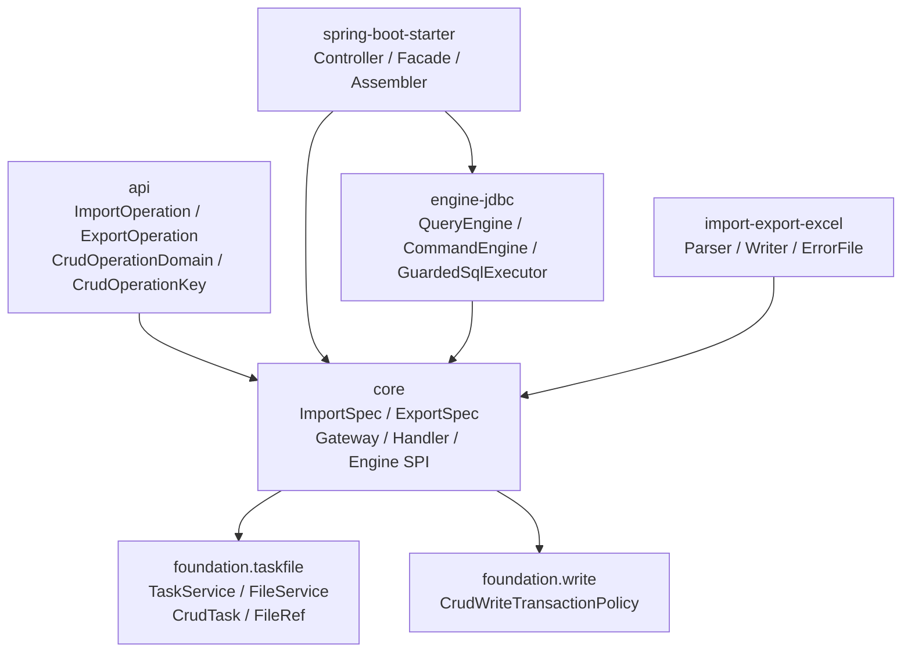
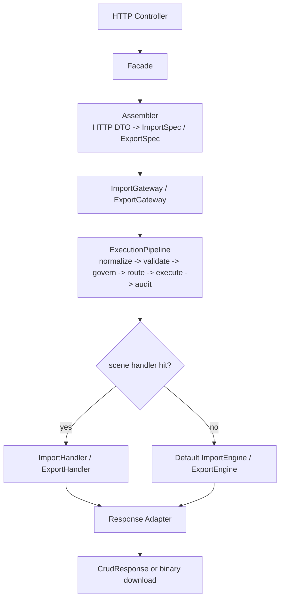

# Import / Export MVP 统筹设计

本文是 `ent-loom-crud` 导入导出能力的统筹文档，只放跨导入和导出的共同决策。导出与导入的实现细节分别见：

- [Export MVP 最佳实践](export-plan.md)
- [Import MVP 最佳实践](import-plan.md)

目标不是一次性做完整数据交换平台，而是在现有 `Query / Command / Stats / Governance / TaskFile / Excel` 脉络下，落出一条可实现、可审计、可扩展的较小能力闭环。

## 1. P0 结论

Import / Export 作为独立高风险 operation domain 接入框架主链：

- `IMPORT` 不继承 `CREATE / UPDATE` 权限。
- `EXPORT` 不继承 `QUERY` 权限。
- 不绕过 Governance / Route / Audit。
- Excel 模块只负责格式能力，不承担 HTTP、权限、任务和数据库写入。
- P0 只做单实体、小文件、`excel-xlsx`、同步闭环。

P0 完成后必须跑通：

```text
导出预览 -> 导出生成 -> 下载 -> 导入校验 -> 导入提交 -> 权限拒绝审计
```

## 2. 文档边界

| 文档 | 负责内容 | 不负责内容 |
| --- | --- | --- |
| `import-export-mvp-overview.md` | P0 边界、主链、治理、路由、DTO 总原则、File/Task、FormatRegistry、配置、实施顺序、总体验收 | 导入行级校验细节、导出读取细节 |
| `export-mvp-best-practices.md` | `PREVIEW / SUBMIT / DOWNLOAD / STATUS`、ExportSpec 映射、读取、字段投影、文件生成、下载安全、导出测试 | 导入解析、行错误、写入事务 |
| `import-mvp-best-practices.md` | `VALIDATE / SUBMIT / STATUS / DOWNLOAD_ERROR`、ImportSpec 映射、Excel 解析、行错误、写入策略、错误文件、导入测试 | 导出读取、字段投影、下载结果文件 |

共同约束只写在统筹文档。导出和导入文档只补各自特有的实现规则，避免复制后漂移。

## 3. MVP 边界

| 能力 | P0 要做 | P0 不做 |
| --- | --- | --- |
| 导入格式 | `excel-xlsx`、单 sheet、首行表头、字段名/标题映射 | 多 sheet、复杂模板、公式计算导入 |
| 导入链路 | JSON `sourceFileId` 引用文件，`VALIDATE` 只校验，`SUBMIT` 校验后写入 | multipart 直传、多阶段审批、数据修复工作台 |
| 导入写入 | 单实体 `INSERT / UPDATE / UPSERT`，按主键或业务键定位，批事务 | 跨表级联、跨服务写、跨任务回滚 |
| 导出格式 | `excel-xlsx`，按 Export 授权后的 Query 语义读取 | 多文件压缩包、图表、复杂样式报表 |
| 导出链路 | `PREVIEW` 返回小样本，`SUBMIT` 生成文件，`DOWNLOAD` 下载文件 | 报表订阅、长期归档、分片下载 |
| 治理 | Import / Export 独立授权、数据范围、审计，默认 fail-closed | 用 Query/Command 权限隐式放行 |
| 任务文件 | 复用 `FileService / TaskService / CrudTask / FileRef` | core 绑定本地磁盘、OSS、调度器或 POI 类型 |
| 异步 | 定义任务合同和阈值；worker 未启用时超阈值明确失败 | worker 调度、抢占锁、重试恢复 |

## 4. 当前框架锚点



落地时保持以下约束：

- `Spec` 是不可变值对象，HTTP DTO 只能经 Assembler 转成 `ImportSpec / ExportSpec`。
- Gateway 是执行主入口，负责进入 `ExecutionPipeline`。
- `RouteKey` 以 `entityTypeNames + operationKey + scene` 表达。
- `Task / File` 是 core 抽象，HTTP 和 Excel 模块不能暴露物理路径、OSS key 或 POI 类型。
- 业务复杂场景通过 `ImportHandler / ExportHandler` 扩展，不新增旁路 Controller。

## 5. 主链

Import / Export 主链与 Query / Command / Stats 同构：



分层职责：

| 层 | 职责 |
| --- | --- |
| Controller | 绑定 JSON、path variable；下载时返回二进制响应 |
| Facade | 固定 operationKey、绑定 requestId、调用 Assembler/Gateway、适配响应 |
| Assembler | 解析 entity、scene、format、FileRef、字段和过滤条件，构造 Spec |
| Gateway | 复制 Spec、进入治理、路由 Handler 或默认 Engine、审计成功失败 |
| Handler | 承载复杂业务场景，例如跨表导入或业务校验 |
| Engine | 默认单实体、小文件导入导出能力 |
| Excel module | 文件格式解析、生成、错误文件 |

## 6. Operation 与路由

合法 operation：

```text
IMPORT: VALIDATE / SUBMIT / COMMIT / CANCEL / STATUS / DOWNLOAD_ERROR
EXPORT: PREVIEW / SUBMIT / DOWNLOAD / STATUS / CANCEL
```

`RouteKeyFactory` 必须补齐：

```text
buildImportRoute(ImportSpec) -> CrudRouteKey(entityTypeNames, CrudOperationKey.of(importOperation), scene)
buildExportRoute(ExportSpec) -> CrudRouteKey(entityTypeNames, CrudOperationKey.of(exportOperation), scene)
```

共同路由规则：

- 空 scene 可以走默认 engine。
- 非空 scene 未命中 handler 必须 fail-fast。
- `DOWNLOAD / STATUS / CANCEL` 也要走治理，不能因为只操作任务或文件就跳过权限。
- route key 仍由 `entityTypeNames + operationKey + normalizedScene` 组成，不能只按 operation 或只按 entity 路由。
- Import / Export handler registry 可以复用通用 `SceneHandlerRegistry`，但注册类型必须强类型化。

## 7. HTTP 与 API 合同

默认 base path：

```text
${entloom.crud.controller.base-path:/api/ent-crud}
```

P0 固定最小 HTTP 面：

```text
Import:
  POST /{entity}/import/validate
  POST /{entity}/import/submit
  POST /{entity}/import/status
  POST /{entity}/import/error

Export:
  POST /{entity}/export/preview
  POST /{entity}/export/submit
  POST /{entity}/export/status
  POST /{entity}/export/download
```

`commit / cancel / multipart` 可以保留 core 合同，但 P0 HTTP 可不开放。若提前开放，必须完整接入 Gateway 或返回稳定 `UNSUPPORTED_OPERATION`。

`sourceFileId` 取舍：

- P0 不新增公开上传 endpoint，不做 multipart 直传。
- 导入请求里的 `sourceFileId` 来自业务已有上传服务，或测试夹具直接调用 `FileService.save(FileWriteRequest)` 预置。
- 默认 starter 的文件能力只保证小文件闭环和自动化验收，不承诺成为通用文件中心。
- 如果应用没有业务上传服务，也没有启用默认 `FileService`，导入 HTTP 可以装配，但 `VALIDATE / SUBMIT` 必须返回明确 `FILE_SERVICE_UNAVAILABLE` 或等价错误。

API DTO 放在 `ent-loom-crud-api`：

| DTO | 用途 |
| --- | --- |
| `CrudImportHttpRequest` | 导入请求 |
| `CrudExportHttpRequest` | 导出请求 |
| `CrudImportData` | 导入响应 data |
| `CrudExportData` | 导出响应 data |
| `CrudImportSummaryData` | 导入汇总 |
| `CrudTaskData` | 对外任务摘要 |
| `CrudFileData` | 对外文件摘要 |
| `CrudRowErrorData` | 行错误 |

DTO 硬规则：

- `operation` 不进入请求 DTO，只能由 path/facade 固定。
- `attributes` 必须经过 Assembler 过滤，客户端不得覆盖框架保留字段。
- `CrudFileData` 不返回 `storageType / storageKey / 本地路径 / OSS key / checksum 原文`。
- `CrudTaskData` 不返回 `contextSnapshot`。
- `ImportResult / ExportResult / CrudTask / FileRef` 不直接作为长期 HTTP JSON 合同。
- 下载成功返回二进制；下载失败返回统一错误结构，不返回半个文件流。

响应语义：

- 同步 `VALIDATE / SUBMIT` 也创建终态 `CrudTask`，便于 `STATUS`、下载和审计统一；`PREVIEW` 不创建任务。
- 业务校验失败不是系统失败。导入存在行错误时，任务状态仍可为 `SUCCEEDED`，通过 `summary.failedRows`、`rowErrors` 和 `errorFile` 表达业务错误。
- 系统错误、权限拒绝、文件读取失败、写入异常才使用 `FAILED` 或直接返回错误响应。
- `accepted=true` 表示请求已被框架接收并完成同步处理或创建异步任务；P0 worker 未启用时，超过同步阈值必须直接失败，不能返回 `accepted=true` 的 `PENDING` 任务。

P0 稳定错误码建议：

| code | 场景 |
| --- | --- |
| `UNSUPPORTED_FORMAT` | format 未注册或不支持 |
| `UNSUPPORTED_OPERATION` | P0 未开放的 operation |
| `SCENE_NOT_FOUND` | 非空 scene 未命中 handler |
| `FORBIDDEN` | 授权拒绝 |
| `FILE_SERVICE_UNAVAILABLE` | 无可用 FileService |
| `FILE_NOT_FOUND` | 文件引用不存在 |
| `FILE_EXPIRED` | 文件已过期 |
| `FILE_METADATA_INVALID` | contentType、size、format 等元数据缺失或不一致 |
| `VALIDATION_FAILED` | 请求级校验失败，例如字段、limit、batchSize 不合法 |
| `ROW_VALIDATION_FAILED` | 导入行级校验存在错误 |
| `SYNC_LIMIT_EXCEEDED` | 超过同步阈值且 worker 未启用 |
| `TASK_NOT_FOUND` | 任务引用不存在或不可见 |
| `DOWNLOAD_NOT_READY` | 任务未完成或没有可下载文件 |

## 8. 治理与审计

`CrudGovernanceService` 增加：

```text
governImport(ImportSpec)
governExport(ExportSpec)
```

`CrudDataScopeResolver` 增加：

```text
resolveImportScope(...)
resolveExportScope(...)
```

P0 可以默认桥接到 command/query 的范围计算，但 action 必须保持 `IMPORT/*` 和 `EXPORT/*`，不能退化成 `COMMAND/CREATE` 或 `QUERY/LIST` 权限。

治理返回合同：

```text
CrudGovernanceDecision
  allowed
  operationKey
  subject
  tenantId
  orgId
  dataScope
  rowWritePolicy
  auditContext
```

P0 不要求新增复杂策略引擎，但 Gateway 进入 Engine 前必须拿到可传递的治理结果：

- `allowed=false` 时立即拒绝并审计，不能继续解析、读取或写入业务数据。
- 导出读取必须把 `dataScope` 合并进读取层 `QuerySpec`，客户端 filter 只能继续收窄。
- 导入写入必须把 `tenantId / orgId / dataScope / rowWritePolicy` 传入 `ImportWritePlan`，用于新增字段填充和更新条件约束。
- 下载和状态查询必须基于 task/file 的 owner、tenant、org 与当前主体重新构造治理上下文。
- `attributes` 只能补充非保留审计上下文，不能覆盖 subject、tenant、org、operation、dataScope。

治理要求：

| 场景 | 要求 |
| --- | --- |
| `IMPORT/VALIDATE` | 也要授权，因为会读取上传文件并暴露校验信息 |
| `IMPORT/SUBMIT` | 必须授权，且要审计总行数、成功/失败行数 |
| `EXPORT/PREVIEW` | 必须授权，不能复用 Query 权限静默放行 |
| `EXPORT/SUBMIT` | 必须授权，审计 filter、fields、limit、format |
| `DOWNLOAD` | 必须基于 task/file 重新授权 |
| `STATUS` | 必须基于 task 重新授权 |
| `CANCEL` | 只能取消本人或有管理权限的任务；P0 HTTP 可不开放 |

审计字段：

```text
requestId
traceId
operationDomain
operation
scene
resource
subjectId
tenantId
orgId
accessEntry
format
taskId
fileId
sourceFileId
resultFileId
errorFileId
rowCount
successCount
failureCount
fields
filtersHash
decision
failureCode
failureMessage
```

验收口径：

- 无 Query 权限但有 Export 权限的主体可以导出。
- 有 Query 权限但无 Export 权限的主体不能导出。
- Import 不能继承 Create/Update 权限。
- 权限拒绝必须产生审计。

## 9. Task / File

任务字段：

| 字段 | 用法 |
| --- | --- |
| `taskId` | 对外任务引用，不暴露数据库主键 |
| `status` | `PENDING / RUNNING / SUCCEEDED / FAILED / CANCELED / EXPIRED` |
| `contextSnapshot` | 异步恢复治理链所需上下文，不返回 HTTP |
| `sourceFile` | 导入源文件 |
| `resultFile` | 导出结果文件 |
| `errorFile` | 导入错误文件 |
| `progress` | 0-100，未知时可为空 |
| `message` | 终态说明或当前阶段摘要 |
| `createdAt / updatedAt / finishedAt` | 审计和清理依据 |

文件字段：

| 字段 | 用法 |
| --- | --- |
| `fileId` | 外部引用 |
| `fileName` | 展示和下载名，必须清洗 |
| `contentType` | 实际响应媒体类型 |
| `size` | 文件大小 |
| `storageType` | 内部存储类型，不直接返回 |
| `storageKey` | 内部定位，不直接返回 |
| `expiresAt` | 临时文件过期时间 |
| `attributes` | owner、checksum、format、taskId 等扩展 |

保留策略：

```text
import source file retention: 24h
error file retention: 48h
export result retention: 48h
task retention: 7d
```

P0 默认实现：

- starter 可提供受限默认 `FileService / TaskService`，只为小文件闭环和测试验收服务，可被业务 Bean 覆盖。
- 默认 `FileService` 必须校验 fileId 存在、未过期、size/contentType/format 元数据完整。
- `FileService.read(FileRef)` 只服务小文件，受 `max-file-size` 和总容量限制；P1 再新增 stream/channel。
- 创建异步任务前必须检查 `worker-enabled`。worker 未启用且超过同步阈值时直接失败，不创建 `PENDING` 任务。

同步 task 规则：

- `IMPORT/VALIDATE`：解析完成后创建终态 task，记录 `sourceFile`、`errorFile`、summary 和审计计数。
- `IMPORT/SUBMIT`：写入完成后创建终态 task，记录 `sourceFile`、`errorFile`、summary 和写入计数。
- `EXPORT/SUBMIT`：文件生成后创建终态 task，记录 `resultFile`、rowCount 和导出参数摘要。
- `STATUS` 只返回脱敏后的 task 摘要，不返回 `contextSnapshot`、物理路径、SQL、原始异常堆栈。

默认 `FileService` 最小合同：

- `fileId` 必须不可枚举，至少使用随机高熵 ID。
- 文件保存后不可变；同一 `fileId` 不允许覆盖内容。
- 保存时记录 owner、tenant、org、format、contentType、size、expiresAt、checksum、purpose。
- 读取前必须完成授权、过期、元数据、purpose 校验；校验通过后才允许打开底层输入流。
- 默认存储只允许落在应用配置的临时目录，不能接受客户端传入物理路径。
- 默认实现必须限制单文件大小和总容量；清理可以懒执行，但过期文件不能被读取。
- checksum 原文不返回 HTTP；如需对外展示只能返回脱敏摘要或不返回。

EntityMeta 前置能力：

| 能力 | P0 用途 | 缺失时行为 |
| --- | --- | --- |
| 字段名和展示名 | Excel 表头映射、导出列名 | 缺失展示名时使用字段名 |
| Java/数据库类型 | 单元格转换、导出基础类型 | 缺失类型直接拒绝该字段 |
| readable / writable | 导出读取、导入写入白名单 | 缺失按 false 处理 |
| importable / exportable | Import/Export 独立白名单 | 缺失按 readable/writable 收窄，不放宽 |
| required / length / enum | 基础行校验 | 缺失只跳过对应校验 |
| primary key / business key | UPSERT/UPDATE 定位、稳定排序 | 写入定位缺失则拒绝；导出排序缺失则拒绝分页导出 |
| tenant / org / audit 字段 | 治理写入和审计字段填充 | 缺失时不能自动填充，只能依赖 DB/业务 handler |

## 10. FormatRegistry 与 Excel 边界

`FormatRegistry` 是 core 的格式能力目录，不持有 POI/EasyExcel 类型，也不负责 HTTP 或权限。

建议 core 定义：

```text
ImportFormatRegistry
  ImportFormatDescriptor getRequired(String format)
  boolean supports(String format)
  Collection<ImportFormatDescriptor> descriptors()

ExportFormatRegistry
  ExportFormatDescriptor getRequired(String format)
  boolean supports(String format)
  Collection<ExportFormatDescriptor> descriptors()
```

P0 规则：

- `format` 为空时由 Assembler 填充 `entloom.crud.import-export.default-format`，默认 `excel-xlsx`。
- 未注册格式返回稳定错误，建议错误码为 `UNSUPPORTED_FORMAT`；若暂不新增错误码，可映射到 `UNSUPPORTED_OPERATION`。
- 同一 format 只能注册一个 descriptor，重复注册启动失败。
- Excel 模块注册 `excel-xlsx`，不注册 `xls`。
- core 和 starter 不依赖 POI/EasyExcel 包；只有 `ent-loom-crud-import-export-excel` 引入具体 Excel 实现依赖。

Excel module 只注册格式 support：

```text
ExcelImportExportAutoConfiguration
  ImportFormatDescriptor(format = "excel-xlsx")
  ExportFormatDescriptor(format = "excel-xlsx")
  ExcelImportParser
  ExcelExportWriter
  ExcelColumnMapper
  ExcelErrorFileWriter
```

## 11. 配置

```yaml
entloom:
  crud:
    import-export:
      enabled: true
      default-format: excel-xlsx
      # 未显式传 fields 时，按 EntFieldKind 默认隐藏的字段类型。
      # 字段级 @EntCrudExportField(defaultVisible = true/false) 优先级更高。
      default-hidden-field-kinds:
        - REF_ID
      # 未显式声明字段导出策略时，关系边外键是否默认隐藏。
      hide-relation-foreign-key-by-default: true
      sync:
        max-import-rows: 5000
        max-export-rows: 10000
      import:
        max-file-size: 20MB
        max-rows: 50000
        max-columns: 200
        max-cell-length: 2000
        default-batch-size: 500
        default-transaction-policy: PER_BATCH
        max-error-rows-in-response: 100
      export:
        max-rows: 100000
        max-columns: 200
        preview-limit: 20
        max-preview-limit: 100
        formula-injection-escape: true
      file:
        default-enabled: true
        storage-dir: ${java.io.tmpdir}/entloom-crud-files
        source-retention-hours: 24
        result-retention-hours: 48
        error-retention-hours: 48
        max-total-size: 200MB
      task:
        default-enabled: true
        retention-days: 7
        worker-enabled: false
```

默认行为：

- 没有 `FileService` 且默认文件实现未启用时，Import / Export HTTP 入口不应启动，或者请求返回明确错误。
- 没有 Excel 模块时，请求 `excel-xlsx` 返回格式不支持。
- `worker-enabled=false` 时，超过同步阈值的异步请求返回明确错误。

导出默认字段策略：

- 字段级 `@EntCrudExportField(defaultVisible = true/false)` 显式声明最高优先级。
- `default-hidden-field-kinds` 和 `hide-relation-foreign-key-by-default` 只控制未显式声明时的框架默认。
- `default-hidden-field-kinds` 使用 `EntFieldKind` 名称，默认包含 `REF_ID`。
- 最佳实践是默认隐藏 `REF_ID` 和关系外键，导出 `studentName`、`teacherName` 等同表展示字段；确实需要把某个 ID 作为报表字段时，在字段旁显式声明 `@EntCrudExportField(defaultVisible = true)`。

## 12. 实施顺序


模块清单：

| 模块 | P0 工作 |
| --- | --- |
| api | 外部 DTO、稳定错误码和错误结构 |
| core | GatewayImpl、FormatRegistry、RouteKey、governImport/export、Default Engine、EntityMeta 能力合同、写侧 SPI |
| starter | Controller、Facade、Assembler、ResponseAssembler、Properties、默认 File/Task 装配 |
| engine-jdbc | 导出读取桥接、导入写入 executor、业务键解析 |
| import-export-excel | xlsx parser/writer/error writer、格式注册、安全限制 |

### 12.0 待实现方案基线与补齐口径

Import / Export 的待实现基线可以从 operation、Spec、Result、Gateway/Engine SPI 和 Task/File 模型占位开始；这只是方案起点。本文补齐的是较小 MVP 在动手实现前必须固定的合同、边界和验收口径。

完成度判断必须以“端到端路径能跑通并能被测试证明”为准，不能以接口类存在为准。较小 MVP 允许能力窄，但不允许主链、治理、审计、Task/File 授权和 HTTP 脱敏缺位。

| 基线基础 | 基线状态 | 离 P0 还差什么 |
| --- | --- | --- |
| Operation domain | `IMPORT / EXPORT` 已进入 `CrudOperationDomain` 和合法 operation matrix | 需要把 `RouteKeyFactory`、治理、审计和错误码全部补到 Import / Export |
| Spec / Result | 已有 `ImportSpec / ExportSpec / ImportResult / ExportResult` | 需要 Gateway 规范化复制、稳定默认值、HTTP DTO 映射和响应脱敏 |
| Gateway / Engine SPI | 已有 `ImportGateway / ExportGateway / ImportEngine / ExportEngine` 接口 | 需要 `ImportGatewayImpl / ExportGatewayImpl` 和默认同步 engine 的真实执行路径 |
| Governance pipeline | 已有 Query / Command / Stats 主链 | 需要 `governImport / governExport`，且不能桥成 Query/Command 权限 |
| Task/File model | 已有 `FileService / TaskService / FileRef / CrudTask` 抽象 | 需要默认小文件实现、owner/tenant/org/purpose/format/过期校验和 HTTP 脱敏 DTO |
| Excel 模块 | 已有独立模块和空 AutoConfiguration | 需要注册 `excel-xlsx` descriptor、parser、writer、column mapper、error writer |
| JDBC engine | 已有 Query / Command / Stats JDBC 能力 | 需要导出读取桥接和导入 `ImportWritePlan -> JdbcImportWriteExecutor` 写入链 |
| Starter HTTP | 已有 Query / Command / Stats Controller/Facade/Assembler | 需要 Import / Export Controller、Facade、Assembler、ResponseAssembler 和二进制下载错误处理 |
| 测试 | 已有 Spec 复制和少量 TaskFile contract 测试 | 需要经过 Controller -> Facade -> Assembler -> Gateway -> Pipeline 的导入导出 fixture |

P0 最小可交付不是“Excel 能读写文件”，而是以下闭环同时成立：

```text
EXPORT/PREVIEW
  -> EXPORT/SUBMIT
  -> EXPORT/DOWNLOAD
  -> IMPORT/VALIDATE
  -> IMPORT/SUBMIT
  -> IMPORT/DOWNLOAD_ERROR
  -> permission denied audit
```

任一公开入口如果绕过 Gateway、治理、Task/File 授权或 HTTP 脱敏，都不能算入 P0。

#### 12.0.1 较小 MVP 的三道门

为了避免一开始就把导入导出做成完整平台，P0 按三道门收敛：

| 门槛 | 必须成立 | 不要求 |
| --- | --- | --- |
| 合同门 | operation、DTO、错误码、RouteKey、FormatRegistry、Gateway 方法、下载响应语义稳定 | Excel/JDBC 先全部可用 |
| 安全门 | Import/Export 独立授权，拒绝路径先于文件读取、数据查询和业务写入，拒绝也审计 | 复杂策略引擎、审批流 |
| 验收门 | HTTP 或 Facade 端到端 fixture 证明导出、导入、下载、权限拒绝、超同步阈值 | 大文件异步 worker、断点续跑 |

实现时可以先交付“能稳定失败”的主链，再交付导出闭环，再交付导入校验闭环，最后交付导入写入闭环。但不能先绕过 Gateway 写一个临时 Excel Controller，因为后续会推翻权限、审计、Task/File 和 HTTP 合同。

#### 12.0.2 跨导入导出的补齐硬点

| 硬点 | MVP 补齐方式 | 说明 |
| --- | --- | --- |
| Operation domain 一等公民 | `IMPORT/*`、`EXPORT/*` 进入 RouteKey、权限、数据范围、审计和错误上下文 | 不能把导出伪装成 Query，把导入伪装成 Command |
| fail-closed 默认行为 | 未注册格式、未启用 FileService、非空 scene miss、未开放 operation 都返回稳定错误 | 在 Excel/JDBC 未完成前也能做自动化合同测试 |
| EntityMeta 能力合同 | 补字段展示名、类型、readable/writable、importable/exportable、required、length、enum、主键/业务键、tenant/org/audit 字段描述 | 缺失时默认收窄，不靠字段名猜测放权 |
| 二进制下载预检 | 下载前完成 task/file 授权、状态、purpose、过期、元数据校验，再打开文件流 | 一旦写出二进制，就不能再切 JSON 错误 |
| Task/File 安全引用 | `fileId/taskId` 高熵不可枚举；HTTP 只返回脱敏 DTO；`storageKey/path/checksum/contextSnapshot` 不外泄 | 默认实现只服务小文件和测试闭环，可被业务覆盖 |
| 同步阈值 | worker 未启用且超过同步阈值直接 `SYNC_LIMIT_EXCEEDED`，不创建无人消费的 `PENDING` task | P0 不做假异步 |
| 依赖边界 | core/starter 只依赖格式 SPI；POI/EasyExcel 只能在 Excel 模块 | 无 Excel 模块时应用可启动，请求返回格式不支持 |

### 12.1 导入 P0 缺口补齐标准

导入待实现方案必须按以下八个缺口补齐后，才算达到较小 MVP。每一项都要能通过自动化测试或端到端 fixture 证明，不以“类或接口已经存在”作为完成标准。

完成判断统一按四条硬线：

- 有真实执行路径，不是接口壳、空实现或 TODO。
- 所有公开入口都进 Gateway / Pipeline，不新增旁路 Controller、旁路 Engine 或旁路 File/Task 访问。
- 成功、业务失败、权限拒绝、系统失败都有稳定响应语义和审计语义。
- 验收要能覆盖 HTTP/Facade、治理、Task/File、Excel、JDBC 写入和错误下载的最短闭环。

| 缺口 | MVP 最小实现 | 不能接受的实现 | 主要落点 | 验收信号 |
| --- | --- | --- | --- | --- |
| Import 主链没有闭环 | `ImportGatewayImpl` 进入 `ExecutionPipeline`，固定执行 normalize、validate、format check、govern、route、execute、audit；空 scene 走默认 engine，非空 scene miss 返回 `SCENE_NOT_FOUND` | Controller/Facade 直接调 Engine；`STATUS / DOWNLOAD_ERROR` 绕过 Gateway；scene miss 自动降级默认 engine | core | `IMPORT/VALIDATE`、`IMPORT/SUBMIT`、`IMPORT/STATUS`、`IMPORT/DOWNLOAD_ERROR` 都经过 Gateway 和 Pipeline |
| 独立治理和审计缺口 | 增加 `governImport(ImportSpec)` 和导入数据范围解析；`IMPORT/*` 不继承 `CREATE / UPDATE`；拒绝时立即审计且不读取文件、不写业务表 | 只查 Command 权限；先读文件后授权；只审计成功不审计拒绝和失败 | core / governance | 只有 Create/Update 权限但无 Import 权限的主体被拒绝，并产生审计；拒绝路径不触发 FileService.read 和写入 executor |
| HTTP/API 合同缺口 | `api` 提供稳定 DTO；starter 提供 Controller、Facade、Assembler、Response Adapter；请求体不能覆盖 operation、subject、tenant、org、dataScope；下载成功二进制、失败统一错误 | 直接暴露 `ImportResult / CrudTask / FileRef`；请求 DTO 接收并信任框架保留字段；二进制响应中途改 JSON | api / starter | HTTP 入口返回脱敏 `CrudImportData`；保留字段注入不能改变服务端上下文 |
| FormatRegistry 与 Excel 能力缺口 | core 提供 `ImportFormatRegistry`；Excel 模块注册唯一 `excel-xlsx` descriptor；没有 Excel 模块时返回 `UNSUPPORTED_FORMAT`；core/starter 不 import POI/EasyExcel | core/starter 依赖 Excel 实现包；未注册格式按默认 Excel 处理；重复 format 后注册覆盖前注册 | core / import-export-excel | 无 Excel 模块可启动；请求 `excel-xlsx` 返回格式不支持；引入 Excel 模块后自动注册格式 |
| 默认导入引擎缺口 | 默认 engine 支持单实体、小文件、单 sheet、首行表头、字段名/标题/别名映射、类型转换、基础校验、行错误和错误文件；`VALIDATE` 与 `SUBMIT` 复用同一套校验 | `VALIDATE` 和 `SUBMIT` 校验不一致；未知/不可写字段被静默忽略；公式按缓存值导入 | core / import-export-excel | invalid fixture 触发 `REQUIRED / DUPLICATE_KEY / TYPE_MISMATCH` 等结构化行错误，且可下载错误文件 |
| JDBC 写入链缺口 | 增加 `ImportWritePlan / ImportWriteRow / ImportWriteExecutor` 和 JDBC executor；支持 `INSERT / UPDATE / UPSERT`；更新定位必须合并 tenant/org/dataScope；唯一冲突转行错误 | Excel 或 HTTP 层直接写库；`UPSERT` 只按业务键全局更新；裸 SQL 异常透出 HTTP | foundation.write / engine-jdbc | valid fixture `UPSERT` 返回 inserted=1、updated=1；跨租户或越权更新被拒绝；唯一冲突返回 `DUPLICATE_KEY` 行错误 |
| Task/File 小文件闭环缺口 | starter 提供可覆盖的默认 `FileService / TaskService`；fileId 高熵不可枚举；保存和读取校验 owner、tenant、org、purpose、format、contentType、size、expiresAt；同步操作也创建终态 task | 自增或路径型 fileId；HTTP 暴露 storageKey、物理路径、contextSnapshot；超阈值创建无人消费 `PENDING` task | starter / foundation.taskfile | `STATUS` 返回脱敏 task；过期、purpose 不匹配、元数据缺失的文件不可读；错误文件下载重新授权 |
| 端到端验收缺口 | fixture 必须经过 Controller -> Facade -> Assembler -> Gateway -> Pipeline -> Engine，不允许直接调 Engine 代替闭环验收；覆盖 invalid validate、valid submit、权限拒绝、文件安全、同步阈值、scene 路由 | 只测 parser、mapper 或 JDBC executor；只断言 HTTP 200；fixture 绕过 Gateway 和治理 | test | 导入校验、导入提交、错误文件下载、权限拒绝审计、超同步阈值失败全部通过 |

这些缺口的实现顺序应保持依赖递进：先补主链、治理、DTO 和格式注册，再补默认 engine、Task/File、Excel parser/error writer，最后补 JDBC 写入和端到端 fixture。反向先写 Excel 或 JDBC 会让权限、审计和任务语义后补，风险更高。

### 12.2 导出 P0 缺口补齐标准

导出待实现方案必须按以下七个缺口补齐后，才算达到较小 MVP。每一项都要能通过自动化测试或端到端 fixture 证明，不以“类或接口已经存在”作为完成标准。

完成判断统一按四条硬线：

- 有真实执行路径，不是接口壳、空实现或 TODO。
- 所有公开入口都进 Gateway / Pipeline，不新增旁路 Controller、旁路 QueryGateway 或旁路 File/Task 访问。
- 成功、权限拒绝、系统失败都有稳定响应语义和审计语义。
- 验收要能覆盖 HTTP/Facade、治理、Task/File、Excel、读取范围和下载的最短闭环。

| 缺口 | MVP 最小实现 | 不能接受的实现 | 主要落点 | 验收信号 |
| --- | --- | --- | --- | --- |
| Export 主链没有闭环 | `ExportGatewayImpl` 进入 `ExecutionPipeline`，固定执行 normalize、validate、format check、govern、route、execute、audit；空 scene 走默认 engine，非空 scene miss 返回 `SCENE_NOT_FOUND` | Controller/Facade 直接调 QueryGateway、Engine 或 FileService；`STATUS / DOWNLOAD` 绕过 Gateway；scene miss 自动降级默认 engine | core | `EXPORT/PREVIEW`、`EXPORT/SUBMIT`、`EXPORT/STATUS`、`EXPORT/DOWNLOAD` 都经过 Gateway 和 Pipeline |
| 独立治理和审计缺口 | 增加 `governExport(ExportSpec)` 和导出数据范围解析；`EXPORT/*` 不继承 `QUERY`；拒绝时立即审计且不查询数据、不生成文件、不打开下载流 | 只查 Query 权限；调用 `QueryGateway` 导致走 Query 审计；先查询或打开文件后授权；只审计成功 | core / governance | 无 Query 权限但有 Export 权限可导出；有 Query 权限但无 Export 权限被拒绝并审计；拒绝路径不触发 QueryEngine、Excel writer 或 FileService.read |
| HTTP/API 合同缺口 | `api` 提供稳定 DTO；starter 提供 Controller、Facade、Assembler、Response Adapter；请求体不能覆盖 operation、subject、tenant、org、dataScope；下载成功二进制、失败统一错误 | 直接暴露 `ExportResult / CrudTask / FileRef`；请求 DTO 接收并信任框架保留字段；二进制响应中途改 JSON | api / starter | HTTP 入口返回脱敏 `CrudExportData`；保留字段注入不能改变服务端上下文；下载失败不产生半文件响应 |
| FormatRegistry 与 Excel 能力缺口 | core 提供 `ExportFormatRegistry`；Excel 模块注册唯一 `excel-xlsx` writer；没有 Excel 模块时返回 `UNSUPPORTED_FORMAT`；core/starter 不 import POI/EasyExcel | core/starter 依赖 Excel 实现包；未注册格式按默认 Excel 处理；重复 format 后注册覆盖前注册 | core / import-export-excel | 无 Excel 模块可启动；请求 `excel-xlsx` 返回格式不支持；引入 Excel 模块后自动注册 writer |
| 默认导出引擎缺口 | 默认 engine 支持单实体、小文件、字段白名单、Export scope 与客户端 filter 取交集、稳定排序、preview、submit 生成文件和终态 task、公式注入转义 | 直接调用 QueryGateway；字段非法静默剔除；无稳定排序仍分页导出；只返回内存结果不生成文件和 task | core / engine-jdbc / import-export-excel | preview 字段、limit、dataScope 生效；submit 生成 xlsx 和 task；下载文件列顺序和公式转义正确 |
| Task/File 小文件闭环缺口 | starter 提供可覆盖的默认 `FileService / TaskService`；fileId 高熵不可枚举；保存和读取校验 owner、tenant、org、purpose、format、contentType、size、expiresAt；同步导出创建终态 task | 自增或路径型 fileId；HTTP 暴露 storageKey、物理路径、contextSnapshot；超阈值创建无人消费 `PENDING` task | starter / foundation.taskfile | `STATUS` 返回脱敏 task；过期、purpose 不匹配、元数据缺失、未完成 task 下载都有稳定错误；下载重新授权 |
| 端到端验收缺口 | fixture 必须经过 Controller -> Facade -> Assembler -> Gateway -> Pipeline -> Engine；覆盖 preview、submit、download、权限拒绝、文件安全、同步阈值、scene 路由 | 只测 writer 或 QueryEngine；只断言 HTTP 200；fixture 绕过 Gateway 和治理 | test | 导出预览、导出生成、文件下载、权限拒绝审计、超同步阈值失败全部通过 |

这些缺口的实现顺序应保持依赖递进：先补主链、治理、DTO 和格式注册，再补默认 engine、Task/File、读取桥接和 Excel writer，最后补端到端 fixture。反向先写 writer 或直接复用 QueryGateway 会让权限和审计语义后补，风险更高。

### 12.3 MVP 补齐优先级

为了让较小 MVP 尽快可验证，补齐顺序按“先关主链风险，再补格式能力”执行：

| 优先级 | 工作 | 完成信号 |
| --- | --- | --- |
| P0-A | API DTO、错误码、RouteKey、`governImport / governExport`、FormatRegistry、EntityMeta 能力合同 | 请求能稳定失败，未注册格式、无权限、scene miss、字段能力缺失都有确定错误和审计 |
| P0-B | `ImportGatewayImpl / ExportGatewayImpl`、starter Controller/Facade/Assembler、默认 File/Task | 所有公开入口都经过 Gateway / Pipeline，状态和下载不绕过治理 |
| P0-C | 默认 Export engine、Excel writer、导出读取桥接 | `PREVIEW / SUBMIT / DOWNLOAD` 小文件闭环通过，字段白名单、scope、公式转义生效 |
| P0-D | 默认 Import validate engine、Excel parser/mapper/error writer | `VALIDATE` 能产生结构化行错误、错误文件和终态 task，且不写业务表 |
| P0-E | JDBC import write executor、业务键解析、事务策略 | `SUBMIT UPSERT` 能新增和更新，越权更新被拒绝，唯一冲突转行错误 |
| P0-F | 端到端 fixture 和依赖边界测试 | 总体验收闭环通过，core/starter 无 POI/EasyExcel 依赖，无 Excel 模块可启动 |

## 13. 总体验收

P0 不以“接口类存在”作为完成标准，只以端到端 fixture 通过作为完成标准。

测试实体建议：

```text
Student
  id
  code        business key, writable, exportable
  name        required, writable, exportable
  className   writable, exportable
  status      writable, exportable
  createdAt   readable, sortable
```

端到端流程：

1. 预置有权限主体 `u_allowed` 和无权限主体 `u_denied`。
2. 使用 `u_allowed` 调用 `EXPORT/PREVIEW`，断言字段白名单、limit、数据范围生效。
3. 使用 `u_allowed` 调用 `EXPORT/SUBMIT` 和 `EXPORT/DOWNLOAD`，断言文件元数据和内容。
4. 将 `student-import-invalid.xlsx` 保存为 `FileRef`，调用 `IMPORT/VALIDATE`，断言行错误和错误文件。
5. 将 `student-import-valid.xlsx` 保存为 `FileRef`，调用 `IMPORT/SUBMIT`，断言写入计数和数据库结果。
6. 使用 `u_denied` 调用 `IMPORT/VALIDATE`、`IMPORT/SUBMIT`、`EXPORT/PREVIEW`、`EXPORT/DOWNLOAD`，断言全部拒绝并产生审计。
7. 设置超过同步阈值且 `worker-enabled=false`，断言返回明确错误且没有创建 `PENDING` 任务。

fixture 守卫：

- 端到端测试必须经过 Controller -> Facade -> Assembler -> Gateway -> Pipeline，不能直接调用 Engine。
- Excel 模块测试可以直接调用 parser/writer，但闭环验收必须通过 HTTP 或 Facade 层进入主链。
- core/starter 测试不得 import POI/EasyExcel 包。

## 14. P1/P2 演进边界

MVP 稳定后再考虑：

- multipart 上传入口。
- 模板下载 endpoint。
- 多 sheet 和主子表导入。
- 断点续跑、重试、任务恢复。
- worker 调度、抢占锁、进度持久化、取消协作。
- 大文件流式上传、流式导出、分片下载。
- 导入预览与人工确认工作流。
- 导出压缩包、多文件、多 sheet 报表。
- 文件存储对接 OSS/MinIO 和独立清理任务。
