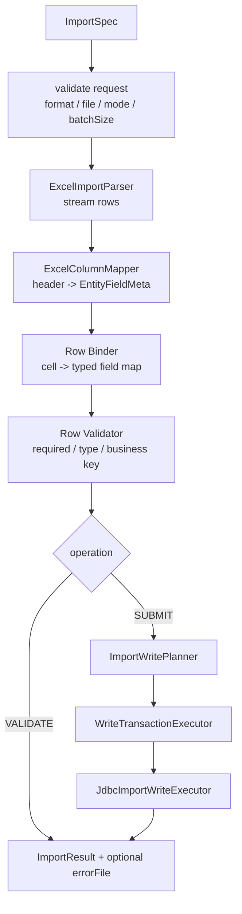

# Import MVP 最佳实践

本文只描述 `ent-loom-crud` 导入能力的 P0 实现细节。跨导入导出的共同约束见 [Import / Export MVP 统筹设计](import-export-plan.md)。

## 1. P0 目标

导入 P0 闭环：

```text
IMPORT/VALIDATE -> IMPORT/SUBMIT -> IMPORT/DOWNLOAD_ERROR -> 权限拒绝审计
```

P0 只支持：

- JSON `sourceFileId` 引用文件。
- `excel-xlsx`。
- 单 sheet、首行表头。
- 单实体导入。
- `VALIDATE` 只校验。
- `SUBMIT` 校验后按 `INSERT / UPDATE / UPSERT` 写入。
- 行级错误和错误文件。
- 小文件同步执行。

P0 不做：

- multipart 直传。
- 多 sheet 和主子表导入。
- 模板下载。
- 人工确认工作流。
- 跨服务写入和跨任务回滚。
- 断点续跑和 worker 恢复。

### 1.1 待实现方案的 P0 补齐清单

导入待实现方案如果只有 `ImportSpec / ImportGateway / ImportEngine` 等协议壳，还不能算较小 MVP。P0 必须补齐以下八个闭环缺口。

待实现基线：

- 已有 `ImportOperation / CrudOperationDomain.IMPORT / ImportSpec / ImportResult / ImportGateway / ImportEngine / ImportFormatDescriptor`。
- 已有 `FileService / TaskService / FileRef / CrudTask` 抽象，但还只是 SPI 和模型。
- 待实现方案必须补齐 `ImportGatewayImpl`、`governImport`、`ImportFormatRegistry`、默认 `DefaultImportEngine`、导入 HTTP DTO/Controller/Facade/Assembler、Excel parser/error writer、JDBC import write executor 和端到端 fixture。
- 因此本节判断完成度时，只把真实执行路径和自动化验收算作完成；接口类、空 AutoConfiguration、TODO 或只测 Spec 复制都只能算架构占位。

每个缺口都按同一口径判断是否完成：

- 有可运行代码路径，而不是只有接口、TODO 或空实现。
- 有自动化测试或端到端 fixture 证明行为。
- 失败语义稳定，能返回统一错误结构或结构化行错误。
- 治理、审计、Task/File 和 HTTP 脱敏不能后补成旁路能力。

#### 1.1.1 Import 主链闭环

必须新增 `ImportGatewayImpl`，并让所有公开导入操作先进入框架主链：

```text
ImportGatewayImpl
  -> ExecutionPipeline
  -> governImport
  -> ImportHandler 或 DefaultImportEngine
  -> audit success/failure
```

MVP 行为：

- `validate / submit / status / downloadError` 必须全部由 Gateway 承接。
- Gateway 负责复制和规范化 `ImportSpec`，不能把 HTTP DTO 或可变 Map 直接传到 Engine。
- Gateway 必须固定执行顺序：normalize、request validation、format validation、govern、route、execute、audit、response adaptation。
- `ImportSpec` 进入 Gateway 后视为不可变；任何默认值、scene 归一化、batchSize 修正都生成新的规范化对象。
- 空 scene 可以进入 `DefaultImportEngine`；非空 scene 未命中 `ImportHandler` 必须返回 `SCENE_NOT_FOUND`。
- `commit / cancel` P0 可以不开放 HTTP；如果 core 保留方法，默认返回 `UNSUPPORTED_OPERATION`，不能静默成功。
- 所有失败都要进入统一错误结构；权限失败和系统失败都要审计。

不算完成：

- Controller 或 Facade 直接调用 Engine。
- `STATUS / DOWNLOAD_ERROR` 直接读 Task/File，绕过 Gateway 和治理。
- scene miss 自动退回默认 engine。
- 只新增 `ImportGateway` 接口或默认 Bean 名称，但没有可观察的 Pipeline 执行路径。

验收：端到端测试必须能证明请求经过 Controller、Facade、Assembler、Gateway、Pipeline，再到 Engine 或 Handler；非空 scene miss 返回 `SCENE_NOT_FOUND`；P0 未开放 operation 返回 `UNSUPPORTED_OPERATION`。

#### 1.1.2 独立治理和审计

导入是高风险 operation domain，不能继承普通写权限。MVP 必须补：

- `CrudGovernanceService.governImport(ImportSpec)`。
- `CrudDataScopeResolver.resolveImportScope(...)` 或等价桥接实现。
- `IMPORT/VALIDATE`、`IMPORT/SUBMIT`、`IMPORT/STATUS`、`IMPORT/DOWNLOAD_ERROR` 的独立授权。
- 导入审计上下文，至少包含 requestId、operation、scene、subject、tenant、org、sourceFileId、errorFileId、rowCount、successCount、failureCount、decision、failureCode。

MVP 可以复用 Command 的数据范围计算实现，但 operationKey 必须保持 `IMPORT/*`。`allowed=false` 时必须立即拒绝，不得读取源文件、解析 Excel 或写业务表。

MVP 最小实现：

- `governImport` 输出 `allowed / operationKey / subject / tenantId / orgId / dataScope / rowWritePolicy / auditContext`。
- `IMPORT/VALIDATE` 也要授权，因为它会读取上传文件并暴露行级错误。
- `IMPORT/STATUS` 和 `IMPORT/DOWNLOAD_ERROR` 基于 task/file owner、tenant、org 重新授权。
- 审计记录必须区分 `decision=ALLOW / DENY / ERROR`，并记录失败码。

不算完成：

- 只检查 `CREATE / UPDATE` 权限。
- 先读取文件再做权限判断。
- 审计只记成功，不记拒绝和系统失败。
- 把导入请求转换成 `CommandSpec` 后走 `governCommand`，导致审计 action 变成 `COMMAND/CREATE` 或 `COMMAND/UPDATE`。

验收：有 `CREATE / UPDATE` 权限但无 `IMPORT/*` 权限的用户调用导入必须被拒绝，并产生审计；拒绝路径不得调用 `FileService.read`、Excel parser 或写入 executor。

#### 1.1.3 HTTP/API 合同

需要在 `ent-loom-crud-api` 和 starter 中补齐稳定 HTTP 合同：

- `CrudImportHttpRequest`：`requestId / format / sourceFileId / mode / async / batchSize / transactionPolicy / taskId / options / attributes`。
- `CrudImportData`：`accepted / async / task / summary / errorFile / rowErrors`。
- `CrudImportSummaryData`：`totalRows / validRows / failedRows / insertedRows / updatedRows`。
- `CrudRowErrorData`、`CrudTaskData`、`CrudFileData`。
- `EntCrudImportController`、`EntCrudImportFacade`、`CrudImportSpecAssembler`、`CrudImportResponseAssembler`。

硬规则：

- `operation` 只能由 path/facade 固定，不能出现在请求 DTO 中。
- `attributes` 必须过滤保留字段，客户端不能覆盖 subject、tenant、org、operation、dataScope。
- `CrudTaskData` 不返回 `contextSnapshot`；`CrudFileData` 不返回 storageKey、本地路径、OSS key 或 checksum 原文。
- `DOWNLOAD_ERROR` 成功返回二进制；失败返回统一错误结构，不能半个文件流半个 JSON。

MVP 最小实现：

- Controller 只负责 HTTP 绑定和二进制响应，不拼装业务结果。
- Facade 固定 operationKey，并负责 requestId、subject、tenant、org 等上下文绑定。
- Assembler 负责实体解析、默认 format、batchSize、transactionPolicy、sourceFileId 引用转换和 attributes 过滤。
- ResponseAssembler 只输出 `CrudImportData / CrudTaskData / CrudFileData / CrudRowErrorData`。
- `rowErrors` 响应按 `max-error-rows-in-response` 截断，完整错误通过 error file 下载。

不算完成：

- 直接把 `ImportResult / CrudTask / FileRef` 序列化给客户端。
- 下载接口在已经开始写二进制后再尝试返回 JSON 错误。
- 请求 DTO 接收 operation、tenant、org、dataScope 等框架保留字段并直接信任。
- DTO 仍放在 starter 私有包中，导致外部契约无法稳定复用或版本化。

验收：HTTP 返回的是外部 DTO，不直接暴露 `ImportResult / CrudTask / FileRef` 作为长期 JSON 合同；保留字段注入测试不能改变服务端 operation、subject、tenant、org、dataScope。

#### 1.1.4 FormatRegistry 与 Excel 注册

core 必须提供不依赖 Excel 实现的格式注册表：

```text
ImportFormatRegistry
  getRequired(format)
  supports(format)
  descriptors()
```

MVP 行为：

- `format` 为空时由 Assembler 填充默认值 `excel-xlsx`。
- 未注册格式返回 `UNSUPPORTED_FORMAT`。
- 同一 format 重复注册时启动失败。
- `ent-loom-crud-import-export-excel` 自己注册 `excel-xlsx`，不注册 `xls`。
- core/starter 禁止 import POI/EasyExcel 类型。

MVP 最小实现：

- descriptor 只暴露 format、contentType、extension、parser/writer 能力引用，不暴露 POI/EasyExcel 类型。
- `ImportFormatRegistry.getRequired(format)` 统一抛出稳定异常，由 Gateway 转换为统一错误结构。
- Excel 自动配置只在 Excel 模块内装配 parser、column mapper、error writer。
- starter 的自动配置不得因为缺少 Excel 模块而启动失败。

不算完成：

- core 或 starter 直接 import `org.apache.poi.*`、EasyExcel 或具体 workbook 类型。
- 未注册格式被当成默认 Excel 继续处理。
- 同一个 format 后注册覆盖前注册。
- Excel 模块只有空 AutoConfiguration，但没有注册 parser、column mapper 和 error writer。

验收：无 Excel 模块时应用可启动，请求 `excel-xlsx` 返回格式不支持；引入 Excel 模块后自动注册 parser、column mapper 和 error writer；依赖扫描能证明 core/starter 不依赖 Excel 实现包。

#### 1.1.5 默认导入引擎

`DefaultImportEngine` 负责单实体、小文件、同步导入，不负责复杂业务场景。P0 最小阶段：

```text
request validation
  -> source file metadata validation
  -> ExcelImportParser
  -> ExcelColumnMapper
  -> Row Binder
  -> Row Validator
  -> ImportResult / errorFile
  -> SUBMIT 时进入 ImportWritePlanner
```

必须实现：

- 单 sheet、首行表头、字段名/展示名/别名映射。
- 字段可写/importable 白名单。
- 类型转换、必填、长度、枚举、业务键、文件内重复键校验。
- 公式单元格默认拒绝。
- 完全空行忽略，非空行缺业务键按行错误处理。
- `VALIDATE` 不写业务表；`SUBMIT` 复用同一套校验，基础阻断错误存在时不写业务表。

MVP 最小实现：

- 执行前先检查同步阈值；超阈值且 worker 未启用时返回 `SYNC_LIMIT_EXCEEDED`。
- 表头匹配结果要形成确定的字段映射，未知表头和重复映射都报结构化错误。
- binder 保留原始行号，错误文件和 `rowErrors` 都使用 Excel 原始行号。
- 基础校验错误分为阻断写入错误和可写入阶段错误；有阻断错误时 `SUBMIT` 不进入写入 executor。
- 错误文件由 Excel 模块生成安全文本，再交给 `FileService.save`。

不算完成：

- `VALIDATE` 和 `SUBMIT` 使用两套不一致校验逻辑。
- 忽略未知字段或不可写字段后继续静默写入。
- 公式单元格按缓存值导入。
- 只实现 Excel parser 单测，但没有通过 `DefaultImportEngine` 生成 `ImportResult / CrudTask / errorFile`。

验收：invalid fixture 能生成结构化行错误和可下载错误文件；`VALIDATE` 不产生业务表写入；同一 invalid fixture 调 `SUBMIT` 时不进入 JDBC 写入。

#### 1.1.6 JDBC 写入链

导入写入必须通过统一写侧计划，不能由 Excel 模块或 HTTP 层直接写数据库。MVP 需要：

- `ImportWritePlan`：携带 entity、mode、rows、batchSize、transactionPolicy、tenant、org、dataScope、rowWritePolicy。
- `ImportWriteRow`：保存原始行号、字段值、定位键和行级上下文。
- `ImportWriteExecutor`：通用写入 SPI。
- `JdbcImportWriteExecutor`：默认 JDBC 实现。
- `JdbcImportBusinessKeyResolver`：主键/业务键定位。

写入规则：

- `INSERT` 命中已有主键或业务键时报行错误，不降级为更新。
- `UPDATE` 找不到目标时报 `TARGET_NOT_FOUND` 或 `REFERENCE_NOT_FOUND`，不降级为新增。
- `UPSERT` 先按显式主键、`options.businessKey`、EntityMeta business key 定位。
- `UPDATE / UPSERT` 定位条件必须合并 tenant、org 和 dataScope，不能只按业务键全局更新。
- 数据库唯一约束冲突能归因到行时转成 `DUPLICATE_KEY` 行错误，不能返回裸 SQL 异常。

MVP 最小实现：

- `ImportWritePlan` 是写入层唯一入参，不能让 Excel parser 或 HTTP DTO 直接参与 SQL 拼装。
- `JdbcImportBusinessKeyResolver` 负责把主键、`options.businessKey`、EntityMeta business key 解析成稳定定位条件。
- 新增行由写入层填充 tenant/org/audit 字段；元数据缺失时不猜测字段名。
- 每批写入必须返回 inserted、updated、failed 计数，并能把可归因错误绑定到原始行号。
- 事务由 `WriteTransactionExecutor` 统一处理，默认 `PER_BATCH`。

不算完成：

- Excel 模块直接写数据库。
- `UPSERT` 只按业务键全局查找，不合并 tenant/org/dataScope。
- 唯一约束或 SQL 异常直接透出给 HTTP。
- 复用现有 `CommandEngine` 的具体实现类拼批量写入，导致导入行号、错误文件和事务策略丢失。

验收：valid fixture 覆盖新增、按业务键更新；越权更新和跨租户更新被拒绝或不可见；唯一冲突能转成 `DUPLICATE_KEY` 行错误。

#### 1.1.7 Task/File 小文件闭环

P0 可以只做受限默认 `FileService / TaskService`，但必须足够支撑自动化验收：

- `fileId` 高熵、不可枚举、不可覆盖。
- 保存文件时记录 owner、tenant、org、purpose、format、contentType、size、expiresAt、checksum、taskId。
- 读取前校验授权、过期、purpose、format、contentType、size 和元数据完整性。
- `VALIDATE / SUBMIT` 同步完成后创建终态 task，记录 sourceFile、errorFile、summary 和计数。
- `STATUS` 返回脱敏 task，不返回 contextSnapshot、物理路径、SQL、原始异常栈。
- worker 未启用且超过同步阈值时直接返回 `SYNC_LIMIT_EXCEEDED`，不创建 `PENDING` 任务。

MVP 最小实现：

- 默认实现只承诺小文件和测试闭环，可被业务 Bean 覆盖。
- `sourceFile` 的 purpose 应为 `IMPORT_SOURCE`，错误文件的 purpose 应为 `IMPORT_ERROR`。
- 同步 `VALIDATE / SUBMIT` 完成后也创建终态 task，便于 `STATUS`、下载、审计统一。
- 读取文件前完成 task/file 授权、过期、purpose、format、contentType、size 校验。
- 过期文件可以懒清理，但不可读取。

不算完成：

- 使用自增 ID 或可猜测路径作为 `fileId`。
- HTTP 返回 storageKey、本地路径、OSS key、checksum 原文或 contextSnapshot。
- 超阈值时创建无人消费的 `PENDING` task。
- `FileService.getRequired` 只按 id 返回 `FileRef`，但读取前没有 owner、tenant、org、purpose、format、过期和 size 校验。

验收：sourceFileId 不存在、过期、purpose 不匹配、元数据缺失时返回稳定错误；错误文件下载必须重新授权；`STATUS` 只能看到当前主体可见且脱敏后的 task。

#### 1.1.8 端到端 fixture 验收

P0 交付必须包含端到端 fixture，而不是只测 Engine：

1. 预置 `student-import-invalid.xlsx`：缺必填、业务键重复、正常行。
2. 预置 `student-import-valid.xlsx`：一行新增、一行按 `code` 更新。
3. 通过 `FileService.save` 得到 `sourceFileId`。
4. 通过 HTTP 或 Facade 调用 `IMPORT/VALIDATE`，断言行错误和错误文件。
5. 通过 HTTP 或 Facade 调用 `IMPORT/SUBMIT`，断言 inserted、updated 和数据库结果。
6. 用无 Import 权限主体调用 `VALIDATE / SUBMIT / DOWNLOAD_ERROR`，断言拒绝和审计。
7. 设置超过同步阈值且 `worker-enabled=false`，断言明确失败且无 `PENDING` task。

fixture 守卫：闭环测试必须经过 Controller -> Facade -> Assembler -> Gateway -> Pipeline；Excel parser 单测不能替代闭环验收。

MVP 最小验收矩阵：

| 场景 | 入口 | 必须断言 |
| --- | --- | --- |
| invalid validate | HTTP 或 Facade `IMPORT/VALIDATE` | 结构化行错误、错误文件、task 终态、无业务写入 |
| valid submit | HTTP 或 Facade `IMPORT/SUBMIT` | inserted=1、updated=1、数据库结果、task 终态 |
| 权限拒绝 | `VALIDATE / SUBMIT / DOWNLOAD_ERROR` | 返回 `FORBIDDEN`、产生审计、不读取文件、不写库 |
| 文件安全 | `VALIDATE / SUBMIT / DOWNLOAD_ERROR` | 不存在、过期、purpose 不匹配、元数据缺失都有稳定错误 |
| 同步阈值 | `VALIDATE / SUBMIT` | worker 未启用时返回 `SYNC_LIMIT_EXCEEDED`，无 `PENDING` task |
| scene 路由 | 带非空 scene 的请求 | miss 返回 `SCENE_NOT_FOUND`，hit 进入 handler |

不算完成：

- 只测 parser、mapper 或 JDBC executor 的单元测试。
- 只断言 HTTP 200，不断言审计、task、file、数据库结果。
- fixture 直接调用 Engine，绕过 Gateway 和治理。

### 1.2 导入较小 MVP 收敛方案

导入 P0 可以分三段落地，每段都必须保持 Gateway、治理、审计和错误语义完整：

| 阶段 | 目标 | 可验收结果 |
| --- | --- | --- |
| A. fail-closed 主链 | DTO、错误码、RouteKey、`governImport`、`ImportGatewayImpl`、FormatRegistry、scene miss、unsupported operation | `VALIDATE / SUBMIT / STATUS / DOWNLOAD_ERROR` 都能经过 Gateway，并对无权限、未注册格式、非空 scene miss 稳定失败并审计 |
| B. validate-only 闭环 | 默认 File/Task、小文件 metadata 校验、Excel parser/mapper、Row Binder/Validator、错误文件 | invalid fixture 生成结构化行错误、终态 task、可下载错误文件，且不会触发业务写入 |
| C. submit 写入闭环 | `ImportWritePlan`、JDBC executor、业务键定位、批事务、写入错误归因 | valid fixture `UPSERT` 返回 inserted/updated，跨租户或越权更新不可见，唯一冲突转行错误 |

这三段可以按顺序交付，但 A 阶段不能省略。没有 fail-closed 主链时，后续 parser 或 JDBC executor 即使可用，也只是局部能力，不能作为框架 MVP 对外开放。

### 1.3 导入特有的补齐硬点

| 硬点 | MVP 设计 | 验收信号 |
| --- | --- | --- |
| `sourceFileId` 解析时机 | Assembler 只把 `sourceFileId` 转成轻量 `FileRef(fileId)` 或等价引用；完整 metadata 校验和 `read` 必须在 Gateway 治理通过后执行 | 无 Import 权限时不调用 `FileService.read`、Excel parser 或写入 executor |
| 行错误分层 | 请求级错误走统一错误响应；表头/类型/必填/重复键是行错误；能归因的数据库冲突转行错误；不能归因的批失败或系统失败走任务失败/错误响应 | `VALIDATE` 行错误不算系统失败，`SUBMIT` 基础阻断错误不写库 |
| 字段白名单 | 导入字段必须同时满足 writable 与 importable；缺少 importable 元数据时只能按 writable 收窄，不能放宽 | 未知表头、重复表头、不可写字段均返回结构化错误 |
| 业务键定位 | `UPDATE / UPSERT` 定位顺序固定为主键、请求 businessKey、EntityMeta business key；缺定位键时拒绝 | 不允许按全表业务键跨租户更新 |
| 校验复用 | `VALIDATE` 和 `SUBMIT` 共享同一套 parse/map/bind/validate 结果模型；`SUBMIT` 只在无基础阻断错误后进入写入计划 | 同一 invalid fixture 在 `VALIDATE` 与 `SUBMIT` 得到一致行错误 |
| 错误文件安全 | 错误文件只写安全文本，不写公式；由 Excel 模块生成内容，由 FileService 保存并标记 `purpose=IMPORT_ERROR` | 错误文件下载重新授权，HTTP 不暴露 storageKey/path/checksum |
| 事务可解释 | P0 默认 `PER_BATCH`；`SINGLE_TRANSACTION` 失败整体回滚；批失败必须能反映到 summary 和 rowErrors/batchErrors | inserted/updated/failed 计数与数据库结果一致 |

## 2. HTTP 合同

| Method | Path | Operation | 说明 |
| --- | --- | --- | --- |
| `POST` | `/{entity}/import/validate` | `IMPORT/VALIDATE` | 默认导入校验 |
| `POST` | `/{entity}/import/validate/{scene:.+}` | `IMPORT/VALIDATE` | 场景导入校验 |
| `POST` | `/{entity}/import/submit` | `IMPORT/SUBMIT` | 默认导入提交 |
| `POST` | `/{entity}/import/submit/{scene:.+}` | `IMPORT/SUBMIT` | 场景导入提交 |
| `POST` | `/{entity}/import/status` | `IMPORT/STATUS` | 查询导入任务 |
| `POST` | `/{entity}/import/error` | `IMPORT/DOWNLOAD_ERROR` | 下载错误文件 |

P0 可不开放 `commit / cancel / multipart`。若提前开放，必须完整接入 Gateway 或返回稳定 `UNSUPPORTED_OPERATION`。

请求示例：

```json
{
  "requestId": "req-001",
  "format": "excel-xlsx",
  "sourceFileId": "file_123",
  "mode": "UPSERT",
  "async": false,
  "batchSize": 500,
  "transactionPolicy": "PER_BATCH",
  "taskId": null,
  "options": {
    "headerRowIndex": 0,
    "startRowIndex": 1,
    "businessKey": ["code"]
  },
  "attributes": {
    "accessEntry": "base"
  }
}
```

响应 data：

| DTO | 字段 |
| --- | --- |
| `CrudImportData` | `accepted`、`async`、`task`、`summary`、`errorFile`、`rowErrors` |
| `CrudImportSummaryData` | `totalRows`、`validRows`、`failedRows`、`insertedRows`、`updatedRows` |
| `CrudRowErrorData` | `rowNumber`、`field`、`code`、`message` |
| `CrudTaskData` | `taskId`、`status`、`progress`、`message`、`createdAt`、`updatedAt`、`finishedAt`、`sourceFile`、`errorFile` |
| `CrudFileData` | `fileId`、`fileName`、`contentType`、`size`、`expiresAt` |

`rowErrors` 响应最多返回 `max-error-rows-in-response` 条，完整错误通过 error file 下载。

## 3. ImportSpec 映射

| HTTP 字段 | `ImportSpec` 字段 | 规则 |
| --- | --- | --- |
| `entity` | `rootType / entityClasses` | 通过 `CrudRequestSupport` 解析，必须暴露在 registry |
| `scene` | `scene` | 归一化；非空 scene fail-closed |
| path operation | `operation` | 由 Facade 固定传入 |
| `format` | `format` | 默认 `excel-xlsx`，必须命中 `ImportFormatRegistry` |
| `sourceFileId` | `sourceFile` | Assembler 只构造带 `fileId` 的轻量引用；治理通过后再由 Engine/FileService 做完整 metadata 校验和读取 |
| `mode` | `mode` | 默认 `UPSERT`；`VALIDATE` 强制等价 `VALIDATE_ONLY` |
| `async` | `async` | P0 默认只支持同步；超过阈值且 worker 未启用时直接失败 |
| `batchSize` | `batchSize` | 空值使用配置默认值 |
| `transactionPolicy` | `transactionPolicy` | 默认 `PER_BATCH` |
| `taskId` | `taskId` | 只用于 `STATUS / DOWNLOAD_ERROR` |
| `options` | `payload` | 仅放格式和业务扩展参数 |
| `attributes` | `attributes` | 经 Assembler 过滤后进入治理上下文 |

硬规则：

- 请求体中的 operation 必须忽略。
- `VALIDATE` 不写业务表，即使请求传入 `mode=UPSERT`。
- `SUBMIT` 必须先执行同等校验，基础校验失败时不得产生部分业务写入。
- `sourceFileId` 必须存在、未过期、元数据完整，并可被当前主体引用。
- P0 不新增公开上传接口；`sourceFileId` 由业务已有上传服务或测试夹具预存得到。
- `VALIDATE / SUBMIT` 不接受客户端传入的 `errorFileId`、`resultFileId` 或物理文件路径。

## 4. Gateway 与路由

`ImportGatewayImpl` 是导入唯一执行入口：

```text
validate(ImportSpec)
submit(ImportSpec)
commit(ImportSpec)
status(ImportSpec)
cancel(ImportSpec)
downloadError(ImportSpec)
```

P0 决策：

- Gateway 负责 format 校验、治理、路由、默认 engine fallback、成功/失败审计。
- 空 scene 可走 `DefaultImportEngine`。
- 非空 scene 未命中 `ImportHandler` 必须 fail-fast。
- `VALIDATE / SUBMIT / STATUS / DOWNLOAD_ERROR` 全部进入 `governImport`。
- `STATUS / DOWNLOAD_ERROR` 不能因为只读任务或文件而跳过授权。

默认路由：

| Operation | 默认行为 |
| --- | --- |
| `IMPORT/VALIDATE` | 解析和校验，不写业务表，创建同步终态 task |
| `IMPORT/SUBMIT` | 小文件同步写，创建同步终态 task；超阈值按异步边界处理 |
| `IMPORT/STATUS` | 查询任务并授权 |
| `IMPORT/DOWNLOAD_ERROR` | 下载 error file |

同步结果语义：

- `VALIDATE` 有行错误时，HTTP 仍返回成功响应，`summary.failedRows > 0`，`rowErrors` 返回截断后的行错误，`errorFile` 可为空或存在；task 状态为 `SUCCEEDED`。
- `SUBMIT` 在基础校验有阻断错误时不写业务表，返回 `summary.failedRows > 0` 和 `errorFile`；task 状态为 `SUCCEEDED`。
- 写入阶段出现数据库约束冲突、批次失败时，能归因到行的必须转成行错误；不能归因到行的转成批错误或系统错误。
- 文件不可读、权限拒绝、format 不支持、worker 未启用且超阈值，返回错误响应，不创建成功 task。

## 5. 默认导入引擎

默认导入引擎阶段：



P0 规则：

- 只处理单实体。`entityClasses` 多实体或聚合结构如果没有 scene handler，直接拒绝。
- `VALIDATE` 只解析校验和生成错误，不写业务表。
- `SUBMIT` 使用与 `VALIDATE` 一致的校验规则。
- 行错误响应最多返回 `max-error-rows-in-response` 条；完整错误通过 error file 下载。
- 同步阈值在执行前判断。超过阈值且 worker 未启用时返回明确错误，不创建无人消费任务。

## 6. 校验顺序

校验顺序必须固定，避免写入阶段才发现基础问题：

1. 校验 `format` 已注册。
2. 校验 `sourceFile` 存在、未过期、归属当前主体或可被当前主体访问。
3. 校验文件大小、扩展名、媒体类型、压缩比和行列上限。
4. 读取首个 sheet 的表头，匹配 `EntityMeta` 字段。
5. 按字段类型做基础转换，例如数字、布尔、日期、枚举、字符串长度。
6. 校验必填字段、不可写字段、业务键字段。
7. 校验文件内业务键重复。
8. 生成 `ImportResult`；如有错误，由 Excel 模块写错误文件，再由 `FileService.save` 保存。
9. `SUBMIT` 在无基础校验阻断后进入写入计划。

行错误模型：

```text
rowNumber
field
code
message
```

常见错误码：

| code | 含义 |
| --- | --- |
| `HEADER_UNKNOWN` | 表头无法映射到字段 |
| `HEADER_DUPLICATED` | 多个表头映射到同一字段 |
| `REQUIRED` | 必填字段为空 |
| `TYPE_MISMATCH` | 单元格无法转为目标类型 |
| `TOO_LONG` | 超过字段长度 |
| `DUPLICATE_KEY` | 文件内业务键重复 |
| `NOT_WRITABLE` | 字段不允许导入写入 |
| `REFERENCE_NOT_FOUND` | 引用数据不存在 |
| `TARGET_NOT_FOUND` | `UPDATE` 找不到目标行 |
| `FORMULA_NOT_ALLOWED` | 导入公式单元格被拒绝 |

表头和单元格 P0 规则：

- 表头按字段名、展示名、配置别名匹配；匹配时先做 trim，大小写是否忽略由配置固定，默认区分大小写。
- 空表头列忽略；未知表头默认报 `HEADER_UNKNOWN`，不能静默导入到未知字段。
- 重复表头如果映射到同一字段，报 `HEADER_DUPLICATED`。
- 完全空行忽略，不计入 `totalRows`；业务键为空的非空行按行错误处理。
- 公式单元格默认拒绝，不读取公式结果缓存。
- 日期按请求或系统默认 timezone 转换；导入结果和错误文件使用原始行号。
- 数字转字符串不得使用科学计数法破坏业务编码；超出目标数值范围报 `TYPE_MISMATCH`。
- 枚举按配置的 code/name 映射；无法映射时报 `TYPE_MISMATCH`。
- 合并单元格、隐藏行列在 P0 不解释业务语义；出现合并单元格时默认拒绝，隐藏行列按普通行列处理。

## 7. 写入策略

写入模式：

| `ImportMode` | 行为 |
| --- | --- |
| `VALIDATE_ONLY` | 不写入 |
| `INSERT` | 只新增；命中已有主键或业务键时报错 |
| `UPDATE` | 只更新；找不到目标时报错 |
| `UPSERT` | 先按主键或业务键定位，存在则更新，不存在则新增 |

`UPSERT / UPDATE` 定位顺序：

1. 显式主键。
2. `options.businessKey`。
3. EntityMeta 标记业务键。

没有可用定位键时：

- `UPSERT` 拒绝。
- `UPDATE` 拒绝。
- `INSERT` 可以继续，但仍要检查主键或唯一约束冲突。

写侧 SPI：

```text
foundation.write
  ImportWritePlan
  ImportWriteRow
  ImportWriteExecutor
  WriteTransactionExecutor

engine.jdbc.importing
  JdbcImportWriteExecutor
  JdbcImportBusinessKeyResolver
```

文件内业务键重复先作为行错误处理，不进入数据库写入阶段。

写入冲突和治理规则：

- `ImportWritePlan` 必须携带治理结果中的 tenant、org、dataScope 和 rowWritePolicy。
- 新增行由写入层填充 tenant/org/audit 字段；如果 EntityMeta 无对应字段，则不能自动填充，需依赖业务 handler 或数据库默认值。
- `UPDATE / UPSERT` 的定位条件必须包含租户/组织约束和数据范围约束，不能只按业务键更新全局数据。
- 软删除数据是否可被定位必须由 EntityMeta 或配置固定；P0 默认软删除数据不参与 `UPSERT / UPDATE` 定位。
- 数据库唯一约束冲突能映射到业务键或主键时，转成 `DUPLICATE_KEY` 行错误；无法定位到行时，转成批错误。
- `INSERT` 命中已有主键、业务键或唯一约束时，该行失败，不降级为更新。
- `UPDATE` 找不到目标时，该行报 `REFERENCE_NOT_FOUND` 或 `TARGET_NOT_FOUND`，不降级为新增。
- 乐观锁字段 P0 默认不参与导入；存在强制乐观锁策略时交给 scene handler。

## 8. 事务策略

| `CrudWriteTransactionPolicy` | MVP 行为 | 适用场景 |
| --- | --- | --- |
| `NONE` | 框架不主动包事务 | 业务 Handler 自管事务 |
| `SINGLE_TRANSACTION` | 全文件一个事务，任一写入失败整体回滚 | 小文件、强一致导入 |
| `PER_BATCH` | 每批独立事务，失败批次记录错误，已成功批次保留 | 较大文件、可部分成功导入 |

默认值：

```text
batchSize = 500
transactionPolicy = PER_BATCH
maxSyncRows = 5000
maxErrorRowsInResponse = 100
```

P0 约束：

- 默认 engine 不主动使用 `NONE`，`NONE` 主要给业务 handler 或外部事务使用。
- `SINGLE_TRANSACTION` 下任一写入失败整体回滚。
- `PER_BATCH` 下批次失败只记录该批失败，已成功批保留。
- 批次失败必须转成结构化行错误或批错误，不返回裸 SQL 异常。

## 9. 错误文件与下载

错误文件规则：

- 有行错误时可以生成 error file。
- error file 由 Excel module 生成 `FileWriteRequest`，再由 `FileService.save` 保存。
- 错误文件只包含安全文本和错误信息。
- 不写入可执行公式。
- 不暴露内部字段、storageKey、本地路径或 OSS key。

`DOWNLOAD_ERROR` 规则：

- 请求中传 `taskId` 或可定位错误文件的引用。
- 先根据 task/errorFile 构造治理上下文并授权。
- 再校验文件存在、未过期、purpose=`IMPORT_ERROR`、contentType/size/format 元数据完整。
- 所有校验通过后才允许打开底层输入流。
- 下载成功返回二进制。
- 下载失败返回统一错误结构；一旦开始写二进制响应，就不能再改写成 JSON 错误。

## 10. Excel Parser 与安全

Excel module 提供：

```text
ImportFormatDescriptor(format = "excel-xlsx")
ExcelImportParser
ExcelColumnMapper
ExcelErrorFileWriter
```

安全规则：

- 限制文件大小、扩展名、媒体类型、sheet 数、行数、列数、单元格长度。
- P0 至少保留 zip bomb 检测配置口；深度检测可 P1。
- 不执行 Excel 公式。
- 导入公式单元格默认拒绝。
- `INSERT / UPDATE / UPSERT` 字段必须经过 EntityMeta 可写白名单。
- core/starter 不 import POI/EasyExcel 包。

P0 只支持单 sheet。发现多个 sheet 时默认拒绝并返回请求级校验错误；业务需要多 sheet 语义时应通过 scene handler 扩展到 P1。

## 11. 测试验收

自动化测试：

| 测试 | 目标 |
| --- | --- |
| ImportSpecTest | operationKey、默认值、不可变复制 |
| Import Route 测试 | 空 scene 默认、非空 scene miss fail-fast |
| Import Governance 测试 | Import 权限独立于 Create/Update 权限 |
| Import Validate 测试 | 表头错误、类型错误、必填错误、错误文件生成 |
| Import Write 测试 | INSERT/UPDATE/UPSERT、租户约束、唯一冲突、事务策略、部分失败 |
| Import Error Download 测试 | 错误文件下载权限、过期文件拒绝、响应头 |
| FormatRegistry 测试 | 未注册格式返回稳定错误 |
| AutoConfiguration 测试 | 无 Excel 模块可启动，有 Excel 模块自动注册格式 |

fixture：

```text
Student
  id
  code        business key, writable
  name        required, writable
  className   writable
  status      writable
  createdAt   readable
```

Excel fixture：

| 文件 | 内容 | 预期 |
| --- | --- | --- |
| `student-import-invalid.xlsx` | 1 行缺少 `name`，1 行 `code` 重复，1 行正常 | `VALIDATE` 返回 2 条行错误，生成错误文件 |
| `student-import-valid.xlsx` | 1 行新增，1 行按 `code` 更新 | `SUBMIT UPSERT` 返回 inserted=1、updated=1 |

端到端断言：

1. 将 `student-import-invalid.xlsx` 保存为 `FileRef`，调用 `IMPORT/VALIDATE`，断言行错误和错误文件。
2. 将 `student-import-valid.xlsx` 保存为 `FileRef`，调用 `IMPORT/SUBMIT`，断言 inserted=1、updated=1 和数据库结果。
3. 使用 `u_denied` 调用 `IMPORT/VALIDATE / SUBMIT / DOWNLOAD_ERROR` 全部拒绝并产生审计。
4. `UPSERT` fixture 覆盖新增、按业务键更新、重复业务键、找不到 UPDATE 目标。
5. 超过同步阈值且 `worker-enabled=false`，返回明确错误且没有创建 `PENDING` 任务。
6. `sourceFileId` 不存在、过期、purpose 不匹配、元数据缺失时返回稳定错误。
