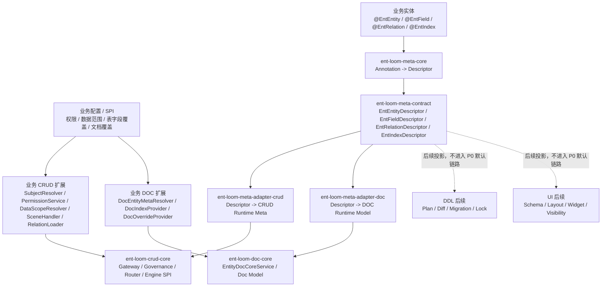
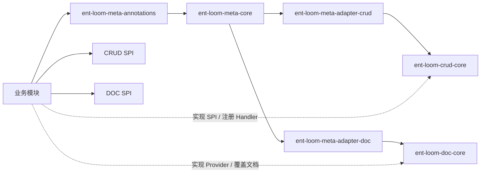
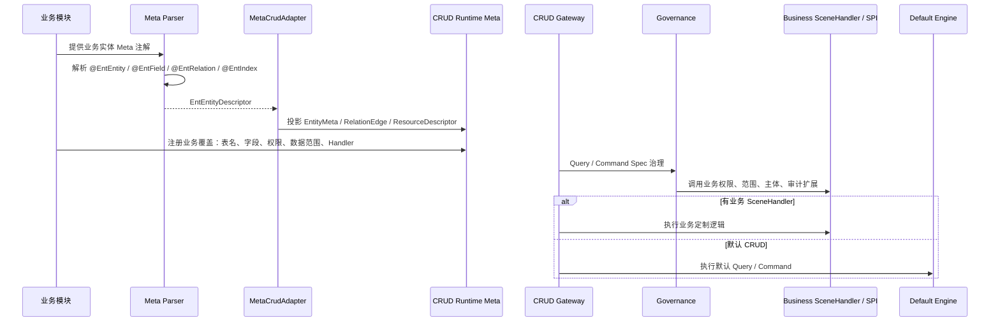
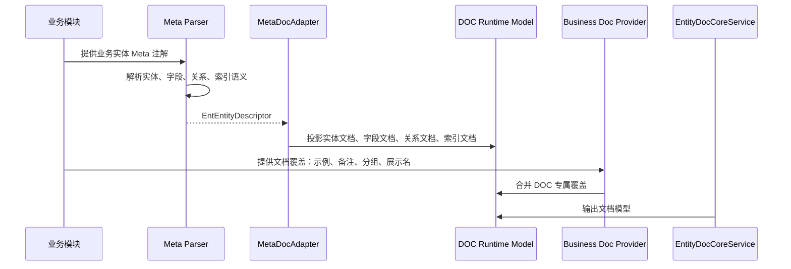

# Meta -> CRUD / DOC -> 业务层闭环待实现清单

## 1. 核心结论

推荐先把 `Meta -> CRUD -> 业务层` 和 `Meta -> DOC -> 业务层` 跑通并架构清楚，再继续 DDL 和 UI。

原因：

1. CRUD 和 DOC 都主要消费业务语义，最适合先验证 Meta-first 模型。
2. DDL 涉及数据库方言、diff、迁移历史、执行锁和线上风险策略，不应过早反向影响 Meta。
3. UI 涉及产品形态、布局、控件、显隐和交互策略，不应过早塞进通用 Meta。
4. 先跑通 CRUD/DOC 能验证字段、关系、索引、展示名、必填、只读等基础语义是否稳定。

一句话：

`Meta 描述业务事实；CRUD / DOC Adapter 投影通用语义；业务层通过 SPI / Handler / Provider 补充专属策略；DDL / UI 暂缓，不反向污染 Meta。`

## 1.1 当前最佳实践偏差评估

整体判断：

| 层面 | 偏差程度 | 结论 |
|---|---:|---|
| 架构方向 | 低，约 10%-20% | Meta-first、子框架覆盖、业务层 SPI 接入、DDL/UI 暂缓的方向基本正确 |
| 文档完整性 | 中，约 30%-40% | 已列出关键缺口，但还需要补明确执行顺序、风险分级和验收切片 |
| 当前实现 | 中高，约 50%-60% | 已有 parser 和基础 adapter，但缺少来源追踪、合并器、诊断模型、稳定 DOC Runtime Model 和关系加载契约 |

不是推倒重来型偏差。当前主要问题是：

1. 设计方向接近最佳实践，但工程护栏还没有形成闭环。
2. Adapter 已能做基础投影，但还承担了过多职责。
3. 原生 CRUD/DOC 注解与 Meta 的合并规则尚未落到代码。
4. 默认值、推断值、业务配置和显式覆盖之间缺少可验证的来源链路。
5. 启动期诊断缺失，导致关系目标缺失、字段不存在、显式冲突等问题可能被静默跳过。

当前最重要的判断：

`先补显式性 / 来源 / 诊断，再补合并器和 Runtime Model，最后补 CRUD/DOC fixture。不要先扩 DDL/UI，也不要先把 adapter 做厚。`

## 2. P0 范围

### 2.1 纳入 P0

| 主链 | P0 目标 |
|---|---|
| `Meta -> CRUD` | 业务只写 Meta 注解时，CRUD 能注册实体、字段、ID、关系、索引和基础读写语义 |
| `CRUD -> 业务层` | 业务通过权限、数据范围、SceneHandler、关系加载、表字段覆盖等 SPI 接入 |
| `Meta -> DOC` | DOC 默认从 Meta 生成实体、字段、关系、索引文档 |
| `DOC -> 业务层` | 业务通过文档覆盖、示例、备注、分组、展示 Provider 接入 |
| 验收样例 | 一个小型业务 fixture 同时跑通 CRUD 和 DOC，不引入 DDL/UI 默认链路 |

### 2.2 暂不纳入 P0

| 能力 | 暂缓原因 | P0 处理方式 |
|---|---|---|
| `Meta -> DDL` | 执行风险高，涉及 migration / diff / lock / audit | 只保留 adapter 边界和后续设计入口 |
| `Meta -> UI` | 产品形态未稳定，容易污染 Meta | 只保留 schema contract 的扩展位置 |
| 自动多跳关系规划 | 属于 CRUD 执行增强，不是 Meta-first P0 | 保持现有 ROOT_FIRST 边界 |
| 跨服务自动补数 | 需要远程协议、缓存、失败语义 | 后续通过 RelationLoader SPI 扩展 |

## 3. 目标架构



## 4. 依赖边界

框架模块不能直接依赖业务层。正确方向是业务层提供实体和扩展实现，框架通过 SPI 调用。



约束：

1. `ent-loom-crud-core` 不 import 业务包。
2. `ent-loom-doc-core` 不 import 业务包。
3. `ent-loom-meta-core` 只输出 Descriptor，不知道 CRUD/DOC 业务策略。
4. `ent-loom-meta-adapters` 只做投影和合并，不承载业务规则。
5. 业务专属逻辑放在 SPI、Handler、Provider、配置或 registry。

## 5. 运行时主链

### 5.1 Meta -> CRUD -> 业务层



### 5.2 Meta -> DOC -> 业务层



## 6. 合并优先级定稿

CRUD 和 DOC 必须采用同一套合并原则。这里把“业务显式覆盖”和“业务默认配置 / SPI”拆开处理：

```text
业务显式 Registry / Provider 覆盖
> 子框架原生显式注解
> Meta 显式语义
> 业务默认配置 / SPI 补充
> 命名约定推断
> 框架默认值
```

关键规则：

1. 只比较显式声明，不让注解默认值覆盖 Meta 语义；无法判断显式性的注解属性必须先改成 `UNSET` / 空值默认。
2. Meta 只描述跨模块成立的业务事实。
3. CRUD 覆盖只描述执行策略，例如表名、scope、join、handler、权限策略。
4. DOC 覆盖只描述展示策略，例如示例、备注、文档分组、展示名称。
5. DDL/UI 的未来字段不能倒逼当前 Meta 膨胀。
6. 业务显式 Registry / Provider 是有意覆盖最终 runtime 的入口，优先级高于子框架注解。
7. 业务默认配置 / SPI 只补充未声明值，不能覆盖 Meta 或子框架显式语义。
8. 合并优先级只能在 merger 中实现，starter、adapter、registry 只能调用统一合并结果。

## 7. P0 实现缺口

当前文档已经明确了 Meta-first 的方向，但 P0 真正落地前还需要补齐以下工程化约束。

### 7.0 P0 落地顺序

P0 不建议按 CRUD、DOC 两条链各自推进，否则容易在两个 adapter 中重复实现合并、默认值和诊断逻辑。推荐按以下顺序落地：

| 顺序 | 切片 | 目标 | 原因 |
|---:|---|---|---|
| 1 | Contract 稳定化 | Descriptor 能表达基础语义、来源、显式性和诊断入口 | 后续 CRUD/DOC 合并都依赖同一套语义 |
| 2 | 诊断模型 | parser / adapter / merger 都能产出结构化诊断 | 先有错误边界，避免继续累积静默失败 |
| 3 | 注解显式性修正 | CRUD/DOC 原生注解的默认值改成可区分未设置的表达 | 否则 merger 无法恢复真实显式性 |
| 4 | P0 最小 RuntimeModelMerger | 只覆盖 Meta-only、默认值补全、显式冲突和关系错误 | 避免 P0 变成完整大版本 |
| 5 | CRUD 静态投影 | Descriptor + 合并结果生成 EntityMeta / RelationEdge，不要求完整 Query/Command | 先固定注册、字段和关系方向 |
| 6 | DOC 稳定输入模型 | DOC core 接收稳定 model / DTO，不再只靠裸 Map 或直接反射注解 | 便于 Meta-first 和 DOC-only 共享输出链 |
| 7 | 最小 fixture | 同一批实体跑通 Meta-only、override、diagnostics、DOC 输出和 CRUD 注册 | 证明 Meta-first 闭环可用 |

P0 最小闭环边界：

| 纳入 P0 | 推迟到 P1 |
|---|---|
| `MetaDiagnostic` / `MetaValueSource` / `SourcedValue` | 完整权限治理、数据范围治理和审计链 |
| Descriptor 来源、显式性、字段存在性和关系目标诊断 | 完整 create/update/delete/query 执行验收 |
| 子框架注解默认值策略修正 | 复杂 starter 自动装配矩阵 |
| Meta-only CRUD 注册和 `RelationEdge` 方向转换测试 | 关系自动展开、N+1 防护、循环图治理 |
| Meta-only DOC model 输出 | 业务 Doc Provider 的完整可见性和个性化策略 |
| 一个 `Customer / Order / OrderItem` fixture 覆盖冲突和 fail-fast | 跨服务远程 relation loader 和缓存失败语义 |

阶段性禁区：

1. 不在 P0 中引入 DDL 执行能力。
2. 不在 Meta 注解中提前加入 UI layout、widget、visibility 等专属字段。
3. 不让 adapter 静默吞掉关系目标不存在、字段不存在和显式冲突。
4. 不把 `@EntCrudField` / `@EntDocField` 的默认值直接当作显式覆盖。
5. 不以裸 `Map<String,Object>` 作为 DOC 内部长期 Runtime Model。

### 7.1 显式性与来源追踪

Java 注解默认值无法直接区分“用户显式写了默认值”和“用户没有写”。如果不补这一层，`@EntCrudField`、`@EntDocField` 的默认值会在合并时误覆盖 Meta。

待实现要求：

1. Descriptor 或中间解析结果需要记录每个属性的来源。
2. 来源至少区分 `BUSINESS_EXPLICIT_OVERRIDE`、`NATIVE_EXPLICIT`、`META_EXPLICIT`、`BUSINESS_DEFAULT_CONFIG`、`INFERRED`、`DEFAULT`。
3. 子框架注解的默认值不能直接进入最终 Runtime Model，必须先经过 merger 判断。
4. 对无法判断显式性的字段，优先改成 `UNSET` / 空值默认，再由合并器补默认值。
5. 不能依赖 reflection 在运行期判断“用户是否显式写了注解默认值”；Java 注解模型不提供这个信息。
6. 现有 `@EntCrudField.targetField = "id"`、`@EntCrudField.cardinality = MANY_TO_ONE`、`@EntDocField.required = false`、`@EntDocField.name()` 必填等属性都应纳入不兼容修正。
7. 如果短期不能改注解签名，native parser 只能把这些属性标记为 `DEFAULT_OR_EXPLICIT_UNKNOWN`，并禁止其覆盖 Meta 显式语义。

建议新增通用来源模型：

```java
public enum MetaValueSource {
    BUSINESS_EXPLICIT_OVERRIDE,
    META_EXPLICIT,
    NATIVE_EXPLICIT,
    BUSINESS_DEFAULT_CONFIG,
    INFERRED,
    DEFAULT,
    DEFAULT_OR_EXPLICIT_UNKNOWN
}
```

建议新增通用带来源值模型：

```java
public final class SourcedValue<T> {
    private final T value;
    private final MetaValueSource source;
    private final boolean explicit;
}
```

适用范围：

| 字段类型 | 是否必须记录来源 | 说明 |
|---|---|---|
| entity/service/label/description | 是 | DOC 和 CRUD 都会消费 |
| field kind / java type / label / required / readOnly | 是 | 默认值和覆盖风险最高 |
| relation targetService / targetEntity / sourceField / targetField / cardinality | 是 | 关系加载和文档都依赖 |
| index name / fields / unique | 建议 | 字段缺失、唯一性冲突需要诊断 |
| table / column / join / scope / handler | 是，但属于 CRUD runtime 来源 | 不应进入通用 Meta Descriptor |

### 7.2 Runtime Model 合并器

`MetaCrudAdapter` / `MetaDocAdapter` 不应长期承担“解析、投影、覆盖、诊断”所有职责。P0 需要明确合并层。

推荐流水线：

```text
MetaParser
-> MetaDescriptor
-> NativeAnnotationParser
-> BusinessExplicitOverride / BusinessDefaultConfig / SPI
-> RuntimeModelMerger
-> Diagnostics
-> RuntimeRegistry
```

合并器职责：

| 职责 | 说明 |
|---|---|
| 统一优先级 | 业务显式覆盖 > 子框架显式覆盖 > Meta 显式语义 > 业务默认配置 / SPI > 推断 > 默认值 |
| 保留来源 | Runtime Model 能追溯关键字段来自 Meta、子框架、配置还是推断 |
| 处理冲突 | 显式冲突要产生启动期诊断，不能静默吞掉 |
| 保护独立模式 | CRUD-only / DOC-only 不依赖 Meta 也能完整运行 |

建议拆分职责：

| 组件 | 能做 | 不能做 |
|---|---|---|
| `ReflectiveEntMetaParser` | 读取 Meta 注解，生成 Descriptor 和基础诊断 | 不读取 CRUD/DOC 注解 |
| `CrudNativeAnnotationParser` | 读取 `@EntCrudEntity` / `@EntCrudField`，生成 CRUD native 中间模型 | 不直接注册 EntityMeta |
| `DocNativeAnnotationParser` | 读取 `@EntDocEntity` / `@EntDocField`，生成 DOC native 中间模型 | 不直接输出文档 Map |
| `CrudRuntimeModelMerger` | 合并业务显式覆盖、CRUD native、Meta、业务默认配置、推断和默认值 | 不执行查询、不访问 DB |
| `DocRuntimeModelMerger` | 合并业务显式覆盖、DOC native、Meta、业务默认配置、推断和默认值 | 不关心 CRUD 表达式和权限策略 |
| `MetaCrudAdapter` | 将合并后的 CRUD model 投影到 `EntityMeta` / `RelationEdge` | 不承担显式性判断和冲突策略 |
| `MetaDocAdapter` | 将合并后的 DOC model 输出给 doc core | 不长期维护裸 Map 内部结构 |

合并伪流程：

```text
parseMeta(entityClass)
parseNative(entityClass)
loadBusinessOverrides(entityClass)
mergeWithSources(meta, native, business, inference, defaults)
collectDiagnostics()
failFastIfNeeded()
projectToRuntimeModel()
```

### 7.3 启动期诊断体系

P0 需要建立诊断模型，迁移和合并问题不能只靠日志或静默跳过。

最低诊断字段：

| 字段 | 说明 |
|---|---|
| `level` | `ERROR` / `WARN` / `INFO` |
| `entity` | 实体标识或 Class |
| `field` | 字段名，可为空 |
| `source` | BusinessExplicitOverride / CRUD / DOC / Meta / BusinessDefaultConfig / Inference / Default |
| `property` | 冲突或缺失的属性 |
| `message` | 可读问题说明 |

最低诊断规则：

| 场景 | 级别 | P0 行为 |
|---|---|---|
| 关系目标不存在 | `ERROR` | 默认 fail-fast，可配置降级 |
| 关系 source/target 字段不存在 | `ERROR` | fail-fast |
| Meta 与子框架显式值冲突 | `WARN` | 子框架显式值生效 |
| 通过命名约定推断 | `INFO` | 标记 inferred |
| 默认值参与补全 | `INFO` 或不输出 | 不得覆盖显式语义 |

建议诊断对象：

```java
public final class MetaDiagnostic {
    private final MetaDiagnosticLevel level;
    private final String entity;
    private final String field;
    private final String source;
    private final String property;
    private final String message;
}
```

默认 fail-fast 规则：

| 诊断级别 | 启动默认行为 | 可否配置降级 |
|---|---|---|
| `ERROR` | fail-fast | 可以，但必须显式配置并保留诊断 |
| `WARN` | 启动继续 | 不需要 |
| `INFO` | 启动继续 | 不需要 |

P0 至少要把以下静默行为改为诊断：

1. CRUD adapter 解析不到 `targetEntity` 对应 Class。
2. `sourceField` 不存在。
3. `targetField` 不存在。
4. `@EntRelation` 与 `@EntCrudField` / `@EntDocField` 显式冲突。
5. `@EntIndex.fields` 包含不存在字段。
6. 命名约定推断了表名、列名、关系字段或 target field。

### 7.4 关系加载执行契约

关系加载不能只停留在概念 SPI，需要补充 CRUD 执行契约。

P0 至少要定清楚：

1. `RelationEdge` 的 from/to 方向语义。
2. `MANY_TO_ONE`、`ONE_TO_MANY`、`MANY_TO_MANY` 的 source/target 字段映射规则。
3. `RelationLoader` 输入输出模型，包括批量 key、返回数据、回填字段。
4. 本地 DB、远程服务、自定义 loader 的选择规则。
5. N+1 防护、最大展开深度、循环关系处理。
6. 租户、权限、数据范围在 relation load 阶段的注入方式。
7. 关系目标无法解析时是 fail-fast、降级还是跳过，必须可配置且有诊断。

### 7.5 Descriptor 最小扩展边界

当前 P0 只需要 CRUD/DOC，但 Descriptor 不能薄到迫使后续 DDL/UI/API 重新复制语义。

建议 P0 先预留或固定以下字段语义：

| Descriptor | 建议补充 |
|---|---|
| `EntFieldDescriptor` | Java 类型、字段角色、typed default value、约束、来源 |
| `EntRelationDescriptor` | 关系来源、目标解析状态、推断标记 |
| `EntIndexDescriptor` | 索引来源、唯一性作用域、字段存在性校验 |
| `EntEntityDescriptor` | 实体来源、别名、版本或 since/deprecated 标记 |

注意：这些是通用业务语义或诊断语义，不应把 DDL 物理列、UI 控件、API DTO shape 提前塞进 Meta。

### 7.6 框架与边界定稿

以下边界应在实现 merger、starter 自动装配和集成 fixture 前先定稿。它们决定模块依赖、扩展点归属、冲突处理和破坏性重构范围。

#### 7.6.1 模块依赖边界

依赖方向必须单向、可测试、可用 ArchUnit 或 Maven Enforcer 固化。

| 模块 | 允许依赖 | 禁止依赖 | 说明 |
|---|---|---|---|
| `ent-loom-meta-contract` | `ent-loom-base` | CRUD / DOC / DDL / UI / starter / 业务包 | 只放 Descriptor、共享枚举、诊断基础模型 |
| `ent-loom-meta-annotations` | `ent-loom-meta-contract`、必要 base 类型 | CRUD / DOC / DDL / UI / starter / 业务包 | 只表达跨模块业务事实 |
| `ent-loom-meta-core` | `ent-loom-meta-annotations`、`ent-loom-meta-contract` | CRUD / DOC / DDL / UI / 业务包 | 只做 Meta 注解解析和归一 |
| `ent-loom-meta-adapter-crud` | `meta-core`、`meta-contract`、`crud-core`、`crud-annotations` | DOC / DDL / UI / 业务包 | 只负责 Meta 到 CRUD 的合并和投影 |
| `ent-loom-meta-adapter-doc` | `meta-core`、`meta-contract`、`doc-core`、`doc-annotations` | CRUD / DDL / UI / 业务包 | 只负责 Meta 到 DOC 的合并和投影 |
| `ent-loom-crud-core` | CRUD API / annotations / base / `meta-contract` 中的共享枚举 | meta-core / doc / ddl / ui / 业务包 | 原生 CRUD 模式必须不依赖 Meta parser 和 adapter；是否继续依赖 `meta-contract` 需在 P0 定稿 |
| `ent-loom-doc-core` | DOC annotations / base / `meta-contract` 中的共享枚举 | meta-core / crud / ddl / ui / 业务包 | 原生 DOC 模式必须不依赖 Meta parser 和 adapter；是否继续依赖 `meta-contract` 需在 P0 定稿 |
| starter | 对应 core、adapter、Spring | 业务实现包 | 只做条件装配、策略选择和启动期报告 |

定稿规则：

1. `crud-core` 和 `doc-core` 不能为了 Meta-first 反向依赖 `meta-core`。
2. `meta-contract` 如果继续承载 `RelationCardinality` 等共享枚举，应被视为低层公共契约，而不是 Meta-first runtime；此时 core 可以依赖 `meta-contract`，但不能依赖 `meta-core`。
3. 如果要求 CRUD/DOC 与 Meta 完全隔离，则共享枚举必须下沉到 `ent-loom-base` 或各子框架自有 contract，不能继续放在 `meta-contract`。
4. P0 定稿选择：短期接受 core 依赖 `meta-contract` 共享枚举，禁止 core 依赖 `meta-core` / adapter；P1 再评估是否把共享枚举下沉到 base。
5. adapter 是跨框架依赖的唯一合法位置。
6. 业务模块只能依赖 annotation、SPI、starter 或显式 adapter，不应被框架模块依赖。
7. 聚合 pom 只管理版本和模块顺序，不表达运行时依赖语义。

#### 7.6.2 Descriptor 与 Runtime Model 归属

必须把中间契约和执行契约分开：

| 模型 | 归属 | 表达什么 | 不表达什么 |
|---|---|---|---|
| `EntEntityDescriptor` / `EntFieldDescriptor` / `EntRelationDescriptor` / `EntIndexDescriptor` | Meta Contract | 跨 CRUD/DOC/DDL/UI/API 都成立的业务事实 | 表名、列名、join、权限、UI 控件、接口 DTO shape |
| `CrudEntityRuntimeModel` / `EntityMeta` / `RelationEdge` | CRUD Runtime | 表、字段、读写能力、关系执行、权限和数据范围入口 | DOC 展示分组、示例、文档备注 |
| `DocEntityModel` / `DocFieldModel` / `DocRelationModel` | DOC Runtime | 文档名称、说明、示例、分组、展示覆盖 | CRUD join、loader、事务、权限执行 |
| DDL / UI / API 后续模型 | 各自子框架 | 物理建模、交互展示、接口形态 | 不反向写入通用 Descriptor |

定稿规则：

1. Descriptor 是中间契约，不是最终执行模型。
2. Runtime Model 是子框架自己的最终契约。
3. adapter 只把 Descriptor 和 native override 合并后投影到 Runtime Model。
4. 子框架专属字段不进入通用 Meta Descriptor。

#### 7.6.3 Registry 冲突策略

同一资源、字段、关系或文档项来自多个注册源时，必须按统一优先级合并，不允许静默覆盖。

合并优先级与第 6 节保持一致：

```text
业务显式 Registry / Provider
> 子框架原生显式注解
> Meta 显式语义
> 业务默认配置 / SPI
> 命名约定推断
> 框架默认值
```

冲突处理：

| 冲突场景 | 级别 | 生效规则 |
|---|---|---|
| 同一 `resourceCode` 多来源注册且实体类型不同 | `ERROR` | fail-fast |
| 同一字段被多来源显式声明且语义冲突 | `WARN` 或 `ERROR` | 业务显式覆盖优先，其次子框架显式覆盖 Meta；破坏执行安全时升为 `ERROR` |
| 同一关系 source/target/cardinality 显式冲突 | `ERROR` | fail-fast |
| 业务 registry 覆盖表名、列名、handler | `INFO` | 业务 registry 生效并记录来源 |
| 推断值与显式值不同 | `INFO` | 显式值生效 |

定稿规则：

1. Registry 合并必须保留来源。
2. 后注册不能静默覆盖先注册；如确实需要覆盖，必须走显式 Registry / Provider 覆盖入口并记录来源。
3. 同一 route/resource 的歧义必须在启动期暴露。
4. 测试需要能断言最终值和来源。
5. 业务默认配置 / SPI 只能补空，不能覆盖任何显式来源。

#### 7.6.4 Starter 装配边界

starter 只负责装配和启动期策略，不承载合并业务规则。

推荐装配模式：

| 条件 | 装配结果 |
|---|---|
| 只有 CRUD / DOC 原生注解 | 原生 CRUD-only / DOC-only 路径运行 |
| 存在 `@EntEntity` 且引入对应 adapter | 启用 Meta-first adapter |
| Meta 与原生注解同时存在 | 启用 native parser + merger |
| 同一资源多来源注册 | 交给 Registry 冲突策略和诊断策略处理 |
| 存在 `ERROR` 诊断 | 默认 fail-fast，可由显式配置降级 |

starter 配置建议：

```properties
ent.loom.meta.enabled=true
ent.loom.meta.crud.enabled=true
ent.loom.meta.doc.enabled=true
ent.loom.meta.diagnostics.fail-fast=true
ent.loom.meta.entity-class-names=com.example.Customer,com.example.Order
```

定稿规则：

1. starter 不能要求业务必须接入 Meta-first。
2. starter 不能让 Meta-first 破坏原生 CRUD-only / DOC-only 路径。
3. fail-fast、扫描范围、诊断输出由 starter 配置控制。
4. 合并优先级不写在 starter 中，必须由 merger 统一实现。

#### 7.6.5 诊断生命周期

诊断要成为一等模型，而不是日志副产物。

推荐生命周期：

```text
Parser
-> Native Parser
-> Merger
-> Adapter Projection
-> DiagnosticCollector
-> DiagnosticPolicy
-> StartupReporter
```

职责边界：

| 组件 | 诊断职责 |
|---|---|
| Parser | 缺少必需 Meta、字段不存在、组合注解解析异常 |
| Native Parser | 原生注解默认值、显式性、非法枚举组合 |
| Merger | 显式冲突、来源优先级、默认值补全 |
| Adapter Projection | Runtime Model 无法投影、关系目标无法解析 |
| DiagnosticPolicy | 决定 fail-fast、降级和输出级别 |
| StartupReporter | 汇总输出启动期报告，供测试断言 |

定稿规则：

1. `ERROR` 默认 fail-fast。
2. 降级必须显式配置，且诊断仍保留。
3. 测试不能依赖日志文本，应直接断言诊断对象。
4. parser、merger、adapter 不直接决定进程是否失败，只产出诊断；是否失败交给 policy。

#### 7.6.6 关系执行边界

关系声明和关系执行必须分层：

| 层 | 负责什么 |
|---|---|
| Meta Descriptor | 声明 `targetService`、`targetEntity`、`sourceField`、`targetField`、`cardinality` |
| CRUD native override | 声明 `targetClass`、`scope`、`joinType`、展开策略、loader 策略 |
| RelationEdge | 表达 CRUD runtime 可执行的关系边 |
| RelationLoader | 批量加载本地 DB、远程服务或自定义来源 |
| RelationQueryPolicy | 控制最大深度、循环、N+1、租户、权限、数据范围 |

P0 定稿语义：

1. `sourceField` 永远表示注解声明方字段，`targetField` 永远表示目标实体字段。
2. `RelationEdge.fromEntity/toEntity` 在 P0 定义为“声明方实体 -> 目标实体”的语义边，不再随 `MANY_TO_ONE` 反转。
3. `RelationEdge.fromField/toField` 分别对应 `sourceField/targetField`，不再用 `from/to` 表达 SQL join 驱动方向。
4. `MANY_TO_ONE` 默认是声明方当前实体字段指向目标实体字段，例如 `Order.customerId -> Customer.id`。
5. `ONE_TO_MANY` 默认是声明方当前实体通过目标集合实体字段被引用，例如 `Customer.orders` 表达 `Order.customerId -> Customer.id`，执行映射必须显式保存 owner side。
6. `MANY_TO_MANY` P0 只定义语义，不默认执行自动多跳，除非显式提供中间表/loader。
7. 进入 relation load 执行阶段时必须注入租户、权限和数据范围策略；完整执行治理属于 P1。
8. 关系目标、sourceField、targetField 解析失败默认 `ERROR`。
9. 当前 `MetaCrudAdapter` 中 `MANY_TO_ONE` 反转 `fromEntity/toEntity` 的实现应视为待重构风险点，不能作为 P0 定稿语义。

为避免“关系语义方向”和“执行查询方向”混用，P0 推荐拆出更明确的模型：

| 模型字段 | 含义 |
|---|---|
| `declaringEntity` | 注解所在实体 |
| `targetEntity` | 关系目标实体 |
| `sourceField` | 注解声明方字段 |
| `targetField` | 目标实体字段 |
| `cardinality` | 从声明方看目标方的基数 |
| `ownerSide` | 真正持有外键或 loader key 的一侧 |

如果短期仍复用 `RelationEdge.fromEntity/toEntity`，必须在测试中固定为 `declaringEntity -> targetEntity`，不要再根据基数反转。

#### 7.6.7 DOC Core 输入契约

DOC 不能长期由 core 直接反射 `@EntDocEntity` / `@EntDocField` 并输出裸 `Map<String,Object>`。否则 Meta-first 和 DOC-only 会形成两套输出路径，覆盖、诊断和测试都无法复用。

P0 定稿方向：

| 层 | 职责 |
|---|---|
| `DocNativeAnnotationParser` | 读取 `@EntDocEntity` / `@EntDocField`，生成 DOC native 中间模型 |
| `DocRuntimeModelMerger` | 合并 Meta、DOC native、业务显式 Provider、业务默认 SPI、推断和默认值 |
| `DocEntityModel` / `DocFieldModel` / `DocRelationModel` | DOC core 的稳定输入模型 |
| `EntityDocCoreService` | 只负责把稳定 DOC model 投影成最终输出 DTO / Map / JSON |

定稿规则：

1. DOC core 不再直接决定注解解析、覆盖优先级和默认值策略。
2. DOC-only 路径也要先通过 native parser 生成 `DocEntityModel`，再进入同一输出链。
3. Meta-first 路径通过 `MetaDocAdapter` 生成同一类 `DocEntityModel`，不维护第二套裸 Map 结构。
4. `Map<String,Object>` 只能作为最终输出兼容层，不作为内部 Runtime Model。
5. DOC 关系文档必须独立建模为 `DocRelationModel`，不能混在字段 Map 拼装逻辑里。

#### 7.6.8 Business SPI 边界

业务层通过 SPI 补策略，不直接修改通用 Descriptor。

CRUD 扩展点归属：

| SPI | 职责 | 阶段 |
|---|---|---|
| `CrudResourceOverrideProvider` | 表名、字段、handler、scope 等 CRUD 专属覆盖 | P0 最小合并 |
| `CrudSubjectResolver` | 解析当前主体 | P1 执行治理 |
| `CrudPermissionService` | 判断资源、动作、scene 权限 | P1 执行治理 |
| `CrudDataScopeResolver` | 生成数据范围 | P1 执行治理 |
| `SceneHandler` / `SceneDelegate` | 承接非默认 scene 的业务执行 | P1 执行治理 |
| `RelationLoader` | 特殊本地或远程关系批量加载 | P1 关系执行 |

DOC 扩展点归属：

| SPI | 职责 | 阶段 |
|---|---|---|
| `DocOverrideProvider` | 覆盖展示名、备注、分组、隐藏字段 | P0 最小合并，P1 完整能力 |
| `DocEntityMetaResolver` | 解析表名、列名等已有文档基础信息 | P0 最小合并 |
| `DocExampleProvider` | 补充示例 | P1 完整能力 |
| `DocVisibilityProvider` | 控制文档可见性 | P1 完整能力 |

定稿规则：

1. 业务 SPI 不能写回 Meta Descriptor。
2. 业务 SPI 输出的是子框架 override 或 Runtime Model 补充项。
3. 权限、租户、数据范围属于 CRUD 执行治理，不属于 Meta。
4. DOC 示例、备注、分组属于 DOC 展示治理，不属于 Meta。

#### 7.6.9 命名不兼容重构边界

命名层面采用不兼容重构，不做旧字段兼容。原因是 Meta-first 仍处于边界收敛期，继续兼容旧命名会把历史歧义带进 Descriptor、merger 和 adapter，后续成本更高。

统一命名：

| 语义 | 定稿命名 | 禁止命名 |
|---|---|---|
| 目标服务 | `targetService` | `refService`、`relationService` |
| 目标实体 | `targetEntity` | `relationEntityEn`、`refEntity`、`relationEntity` |
| 目标实体展示名 | `targetEntityLabel` | `relationEntityName`、`refEntityName` |
| 声明方字段 | `sourceField` | `localField`、`fromField`、`relationField` |
| 目标字段 | `targetField` | `refField`、`toField` |
| 关系基数 | `cardinality` | `relationType` |
| 关系备注 | `relationRemark` | `remark` |

不兼容规则：

1. 新 Meta / CRUD / DOC 注解只保留定稿命名。
2. 新 parser、merger、adapter 不读取旧字段。
3. 旧字段不参与优先级合并，不提供 shadow mapping。
4. 如果旧字段仍存在于历史注解或桥接代码中，应在编译期删除；无法编译优先于运行期兼容。
5. P0 仓内不提供 legacy bridge，不为旧字段保留默认兼容入口。
6. 如外部历史模块自行维护独立迁移桥接，桥接输出也必须先转换成定稿命名后的 native model，才能进入 merger。
7. P0 验收不包含旧命名兼容场景。

迁移动作：

| 动作 | 要求 |
|---|---|
| 注解字段 | 直接改为定稿命名，删除旧字段 |
| 文档示例 | 全量替换为 `target*` / `sourceField` / `cardinality` |
| 测试 fixture | 只使用定稿命名 |
| 业务桥接 | P0 仓内不提供 legacy bridge；外部历史桥接必须先转成定稿模型 |
| 诊断 | 只诊断新命名缺失和冲突，不为旧命名提供兼容提示 |

## 8. 待实现清单

第 8 节按“阶段包”组织。每个阶段包应该能独立形成一个实现阶段或一组 PR；阶段包内部的事项可以再拆 issue，但不在总路线图里继续展开。

### P0：默认静态闭环

P0 只证明 Meta-first 的默认链路可用：Descriptor 契约稳定，CRUD 能完成静态注册，DOC 能输出稳定模型，诊断和合并规则可测试。P0 不纳入 CRUD Query/Command 执行治理、RelationLoader 完整治理、Starter 复杂装配矩阵、DDL/UI/API 接入。

| 状态 | 阶段包 | 前置 | 交付物 | 验收 | 不包含 |
|---|---|---|---|---|---|
| 已实现 | P0-1 Contract 与诊断基线 | 无 | Descriptor 最小契约、来源/显式性模型、统一诊断模型、关系语义、模块边界规则 | parser / adapter / merger 能产出结构化诊断；CRUD/DOC 不需要读取原始注解即可获得基础投影输入 | CRUD/DOC 完整合并器、执行治理、DDL/UI/API 专属字段 |
| 已实现 | P0-2 Meta -> CRUD 静态闭环 | P0-1 | CRUD native parser、CRUD 最小 merger、`MetaCrudAdapter` 静态投影、RelationEdge 方向规则、Registry 冲突策略 | `Order / OrderItem / Customer` 能完成 EntityMeta 注册、字段映射、关系边和诊断断言；`MANY_TO_ONE` 不再反转声明方向 | page/list/detail/create/update/delete、RelationLoader、权限/租户/数据范围治理 |
| 已实现 | P0-3 Meta -> DOC 静态闭环 | P0-1 | DOC Runtime Model、DOC core 稳定输入契约、DOC native parser、DOC 最小 merger、关系/索引文档投影 | 同一批实体能输出实体、字段、关系、索引文档；裸 `Map<String,Object>` 只作为最终兼容输出 | 完整 Doc Provider 个性化能力、Starter 装配矩阵、UI/API schema |
| 已实现 | P0-4 P0 收口验收 | P0-2、P0-3 | 最小验收 fixture、旧命名不兼容用例、P0 文档索引 | Meta-only、CRUD-only、DOC-only、Meta + override、冲突诊断、命名推断、旧命名不兼容都有自动化覆盖 | 外部历史 bridge、跨服务 loader、完整执行治理、完整业务 Provider 个性化能力 |

P0 代码现状风险点：

| 领域 | 风险点 | 当前表现 | 目标状态 |
|---|---|---|---|
| CRUD | adapter 过厚 | `MetaCrudAdapter` 同时解析、推断、投影关系边 | 合并和诊断移到 merger，adapter 只投影 |
| CRUD | 关系目标缺失静默跳过 | 解析不到 target class 时直接忽略 relation | 产生 `ERROR`，默认 fail-fast |
| CRUD | 关系方向与定稿语义不一致 | 当前 `MANY_TO_ONE` 会反转 from/to | P0 固定为声明方 -> 目标方，并用 ownerSide 表达执行方向 |
| CRUD | 原生注解未进入合并链 | `@EntCrudField` 与 Meta 缺少统一优先级处理 | native parser + merger 统一处理 |
| DOC | 内部模型不稳定 | `MetaDocAdapter` 输出裸 `Map<String,Object>` | 定义 `DocEntityModel` / `DocFieldModel` / `DocRelationModel` 或稳定 DTO |
| DOC | 原生注解缺少显式性 | `@EntDocField.required` 等 primitive 默认值无法区分未设置 | parser 记录 explicit，默认值不覆盖 Meta 显式语义 |
| DOC | 文档覆盖没有统一入口 | 示例、备注、分组、隐藏字段分散 | `DocOverrideProvider` / `DocModelMerger` 统一合并 |

### P1：运行闭环与集成治理

P1 在 P0 静态闭环稳定后推进运行能力，重点是集成样例、starter 装配、关系加载治理、CRUD 执行治理和 DOC Provider 完整能力。

| 状态 | 阶段包 | 前置 | 交付物 | 验收 | 不包含 |
|---|---|---|---|---|---|
| 已实现 | P1-1 集成样例与装配边界 | P0 完成 | `ent-loom-meta-spring-boot-starter`、integration-test fixture、ArchUnit 依赖边界、starter 条件装配、registry 冲突边界 | 同一批业务实体可装配 CRUD Registry 与 DOC Adapter；Meta-first、CRUD-only、DOC-only、disabled/empty class list 路径都能独立运行 | DDL/UI/API 接入、复杂部署矩阵、完整 CRUD Query/Command 执行治理、完整 DOC Provider |
| 已实现 | P1-2 关系加载与 CRUD 执行治理 | P0-2、P1-1 | RelationLoader / RelationQueryPolicy、Subject、Permission、DataScope、SceneHandler 最小治理链 | 本地 DB、外部 loader 显式放行、深度、循环、默认拒绝、反向集合关系推断、Gateway 治理链和默认 CRUD 路径都有测试 | 审计链、复杂审批流、完整缓存失败语义、跨服务协议实现 |
| 已实现 | P1-3 DOC Provider 与迁移收口 | P0-3、P1-1 | 示例、备注、分组、展示名、隐藏字段、可见性 Provider；旧命名删除；README / docs 索引更新 | Provider 覆盖来源和冲突诊断完整；旧命名不进入默认链路；文档能清楚找到 P0/P1 路线 | UI schema、API schema、外部历史 bridge 实现 |

P1-1 当前落地范围：

1. 新增 `ent-loom-meta-spring-boot-starter`，通过 `META-INF/spring.factories` 自动装配。
2. `EntLoomMetaAutoConfiguration` 只注册 `EntMetaParser`、默认 `DocEntityMetaResolver`、`MetaCrudAdapter` 和 `MetaDocAdapter`，不实现合并业务规则。
3. `ent.loom.meta.entity-class-names` 为空时不注册 adapter，避免抢占 CRUD 原生 reflective fallback。
4. `ent.loom.meta.enabled=false`、`ent.loom.meta.crud.enabled=false`、`ent.loom.meta.doc.enabled=false` 可关闭对应链路。
5. 集成测试覆盖 Meta-first 同批实体、CRUD-only、DOC-only、业务 `ResourceCatalogAdapter` 共存和重复 resource fail-fast。
6. ArchUnit 测试固定 `crud-core`、`doc-core`、`meta-core` 不反向依赖 starter / adapter / Spring auto-config。

P1-2 当前落地范围：

1. 新增 `RelationQueryPolicy`，默认限制关系展开深度、展开边数量、循环关系和外部 loader。
2. 新增 `RelationLoader` / `RelationLoadRequest` / `RelationLoaderRegistry`，外部关系必须同时满足策略放行和 loader 可解析。
3. `RelationQueryValidator` 统一校验本地 DB / 外部 loader、最大深度、最大展开边和循环图；深度按展开图最长路径计算，多个并列一跳不会误判成多跳。
4. `RootFirstQueryPlanner`、`RelationQueryCoordinator`、`JdbcQueryExecutor` 接入关系策略和 loader registry；默认 JDBC 关系仍走批量本地查询，非 `LOCAL_DB` 关系走显式 loader。
5. Spring Boot starter 暴露 `CrudProperties.relation.maxDepth`、`maxExpandEdges`、`allowCycles`、`allowExternalLoaders`，并自动收集业务 `RelationLoader` bean。
6. 修正根优先查询中 `Order -> OrderItem` 这类集合字段的反向边推断：即使 planner 没有 `EntityMetaRegistry`，也能从当前关系图中的 `OrderItem -> Order` 边推断本地批量展开。
7. 既有 `GatewayGovernanceTest`、`RuleBasedCrudPermissionServiceTest`、`DefaultCrudDataScopeResolverTest`、`DefaultSceneDispatchTest` 覆盖 Subject / Permission / DataScope / SceneHandler 最小治理链；新增关系契约测试覆盖 loader、深度、循环和反向集合关系推断。

P1-3 当前落地范围：

1. 新增 `DocOverrideProvider`、`DocEntityOverride`、`DocFieldOverride`，业务层可按实体提供展示名、描述、示例、分组、备注、隐藏字段和可见性覆盖。
2. `DocEntityModel` / `DocFieldModel` 增加 `group`、`remark`、`hidden`、`visibleFor`，保持旧构造器可用，DOC core 仍只消费稳定模型。
3. `DocRuntimeModelOverrideApplier` 在 Meta/native merge 后应用业务显式覆盖，来源标记为 `BUSINESS_EXPLICIT_OVERRIDE`；覆盖已有显式值时产生 `EXPLICIT_VALUE_CONFLICT` WARN。
4. `EntityDocCoreService` 输出 `group`、`remark`、`hidden`、`visibleFor`，并在最终文档中跳过 hidden entity / field。
5. `ent-loom-meta-spring-boot-starter` 自动接入业务 `DocOverrideProvider` bean；没有业务 provider 时使用 noop，不影响 Meta-only / DOC-only 路径。
6. 测试覆盖业务 Provider 覆盖展示名、示例、分组、备注、可见性、隐藏字段和 starter 自动装配。
7. 旧 DOC 关系命名已在 P0 验收中固定不进入默认链路；P1-3 不新增 legacy bridge。

### P2：DDL / UI / API 后续接入

P2 只在 P0/P1 的 Descriptor、诊断、合并和运行时边界稳定后再启动，避免 DDL/UI/API 专属语义反向污染 Meta。

| 状态 | 阶段包 | 前置 | 交付物 | 验收 |
|---|---|---|---|---|
| 暂缓 | P2-1 DDL 接入 | P0/P1 语义稳定，DDL 执行策略文档先定稿 | `Meta -> DDL` adapter、plan/diff/migration/lock/audit | DDL 只消费稳定 Descriptor，不反向扩展 Meta 基础注解 |
| 暂缓 | P2-2 UI 接入 | UI schema contract 和产品展示形态先定稿 | `Meta -> UI` adapter、layout/widget/visibility 独立模型 | UI 专属配置不进入 Meta 基础注解 |
| 暂缓 | P2-3 API 接入 | DTO 可见性、序列化形态、输入输出约束先独立设计 | `Meta -> API` adapter | API 语义独立建模，不复用 DOC/UI 展示字段替代 |

## 9. 最小验收样例

推荐使用一个小型业务域：

```text
Customer
Order
OrderItem
```

覆盖语义：

| 实体 | 验证点 |
|---|---|
| `Customer` | ID、名称、状态、创建时间 |
| `Order` | 客户关系、金额、状态、租户字段、索引 |
| `OrderItem` | 订单关系、商品名、数量、单价 |

验收路径：

1. 业务实体只写通用 Meta 注解。
2. CRUD adapter 注册资源、字段和关系边，关系方向固定为声明方 -> 目标方。
3. 缺失关系目标、缺失字段和显式冲突能产生结构化诊断。
4. DOC adapter / merger 输出稳定 `DocEntityModel`、`DocFieldModel`、`DocRelationModel`。
5. DOC core 从稳定 model 输出实体、字段、关系、索引文档。
6. 子框架默认值不覆盖 Meta 显式语义，业务显式 Provider / Registry 覆盖优先级最高。
7. DDL/UI 不参与默认验收。

## 10. 验收矩阵

P0 自动化测试至少覆盖以下组合。完整业务 Registry / Provider 个性化能力进入 P1；P0 只固定 merger 优先级边界和子框架 native override。

| 场景 | 验收 |
|---|---|
| Meta-only | CRUD/DOC 都能从 Meta 生成默认模型 |
| CRUD-only | 只写 CRUD 注解也能生成 CRUD native 中间模型，后续进入同一 merger |
| DOC-only | 只写 DOC 注解也能生成 `DocEntityModel`，后续进入同一输出链 |
| Meta + CRUD override | CRUD 显式覆盖生效，Meta 通用语义保留 |
| Meta + DOC override | DOC 显式覆盖生效，Meta 通用语义保留 |
| 默认值不覆盖 | 子框架注解默认值不会覆盖 Meta 显式语义 |
| 业务显式覆盖 | P0 保留来源枚举和优先级边界；完整 Registry / Provider 进入 P1 |
| 业务默认配置 | P0 保留来源枚举和优先级边界；完整默认配置 / SPI 进入 P1 |
| 显式冲突 | 产生 WARN 或 ERROR；P0 验证子框架显式值覆盖 Meta 显式值 |
| 命名推断 | 推断值生效并标记 inferred |
| 不兼容命名重构 | 新链路只接受 `target*` / `sourceField` / `cardinality` 等定稿命名 |
| 未解析关系目标 | 产生 ERROR，默认 fail-fast |
| 继承字段 | 父类字段可被解析、合并、投影 |
| 组合注解 | meta-annotation 能被 parser 识别 |
| 关系方向 | `MANY_TO_ONE`、`ONE_TO_MANY`、`MANY_TO_MANY` 的 `declaringEntity/sourceField -> targetEntity/targetField` 可断言 |
| DOC 输出模型 | DOC 内部不依赖裸 Map，最终输出 Map 只作为兼容层 |

## 11. 完成定义

满足以下条件后，才认为 P0 完成：

1. 同一批业务实体不重复维护业务事实。
2. CRUD 和 DOC 都能从 Meta Descriptor 获得默认模型。
3. CRUD/DOC 专属注解只作为覆盖项或独立模式入口。
4. 业务层通过 SPI/Handler/Provider 接入，框架不依赖业务实现。
5. 合并器能证明子框架显式覆盖、推断值和框架默认值的 P0 优先级正确；完整业务 Registry / Provider 优先级进入 P1。
6. 启动期诊断能覆盖冲突、缺失关系目标、字段不存在和命名推断。
7. 关系方向有明确转换契约，至少能证明 `RelationEdge` 不再按 `MANY_TO_ONE` 反转声明方向。
8. DOC core 有稳定输入模型，裸 `Map<String,Object>` 只存在于最终输出兼容层。
9. 有自动化测试证明 CRUD 静态注册、DOC 输出模型和覆盖优先级。
10. DDL/UI/API 只保留后续扩展边界，不进入 P0 默认链路。
11. 旧关系命名不进入 P0 默认链路；P0 仓内不提供 legacy bridge。
12. 完整权限、数据范围、RelationLoader 执行治理和 CRUD Query/Command 验收进入 P1，不作为 P0 完成条件。

## 12. 推荐优先级

从当前状态继续推进，推荐按阶段包收口：

1. P0-3 已完成：DOC Runtime Model、DOC core 输入契约、DOC native parser 和 DOC 最小 merger 已收敛。
2. P0-4 已完成：已用 P0 fixture 验证 Meta-only、CRUD-only、DOC-only、override、diagnostic、relation direction 和旧命名不兼容。
3. P1-1 已完成：已补 starter 条件装配、integration fixture、registry 冲突边界和 ArchUnit 边界测试。
4. P1-2 已完成：已补 RelationLoader、RelationQueryPolicy、Spring 装配属性、外部 loader 显式放行和反向集合关系推断；CRUD 既有 Gateway 治理测试继续覆盖权限、数据范围和 scene 主链。
5. P1-3 已完成：已补 DOC Provider 覆盖入口、隐藏字段、分组、备注、可见性输出、冲突诊断和 starter 自动装配。
6. 下一步进入 P2 设计准备：先定 DDL / UI / API 各自独立 contract，继续避免反向污染 Meta。

每一步都应保持已有 CRUD-only / DOC-only 路径可运行。Meta-first 是推荐路径，不是删除原生路径。
