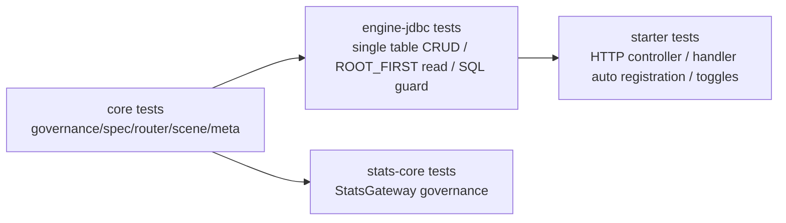

# 第 1 期已实现/未实现清单

本清单按当前代码实现记录，不代表目标态。

## 已实现

| 能力 | 入口/类 | 说明 |
|---|---|---|
| 不可变 Spec | `BaseSpec`、`QuerySpec`、`CommandSpec` | 所有 setter 抛异常，使用 builder 派生 |
| Query Gateway | `QueryGatewayImpl` | `PAGE/LIST/FIND_ONE/DETAIL` 先治理再路由 |
| Command Gateway | `CommandGatewayImpl` | 先治理，后路由，按策略接入幂等 |
| Stats Gateway | `StatsGatewayImpl` | 通过 `ExecutionPipeline -> governStats` 进入治理，`StatsQuerySpec` 不再继承 `QuerySpec` |
| 治理主链 | `DefaultCrudGovernanceService` | 主体、属性、校验、权限、范围、审计 |
| 默认单表 Query | `JdbcQueryEngine` + `JdbcQueryCompiler` + `JdbcQueryExecutor` | 根表 SQL + 可选 ROOT_FIRST 展开 |
| 默认单表 Command | `RegistryBackedCommandEngine` + `JdbcCrudCommandHandler` | create/update/delete/batch |
| SQL 安全 | `SqlSafetyGuard`、`SqlIdentifierAllowlistValidator`、`SqlParameterLimiter` | 编译前字段白名单和参数限制 |
| SQL 日志 | `SqlExecutionLogger` | SAFE/FULL、采样、慢 SQL |
| Scene Handler 注册 | `SceneHandlerRegistrar` | Query/Command/Stats/StatsPayloadCustomizer 自动注册 |
| Starter HTTP | `CrudWebAutoConfiguration` | 默认 Controller 与 Facade 可复用 |
| 单表 Stats | `JdbcStatsQueryExecutor` | scalar/list/page、groupBy、metrics、having、summary |
| JDBC 幂等存储 | `JdbcIdempotencyStore` | 处理、成功、重放、冲突、过期替换 |
| business v2 桥接 | `BusinessV2*` | 资源目录、主体、权限、范围、审计接入 |

## 部分实现

| 能力 | 当前边界 |
|---|---|
| 关系查询 | 支持 ROOT_FIRST 本地库展开；默认不支持关联过滤/排序 |
| 默认排序 | 支持全局候选时间字段 + id；业务资源自身默认排序未自动并入通用 Query |
| viewType | HTTP 可注册 viewType；默认业务 v2 当前注册器为空 |
| `AccessDecision.MASK/FILTER` | 枚举存在；默认 SQL 主要消费 `governanceScope`，未实现字段脱敏 |

## 未实现

| 能力 | 当前表现 |
|---|---|
| `EXISTS` / `JOIN` 查询策略 | 当前公开 `QueryStrategy` 不再暴露，保留在后续方案文档 |
| 默认多跳复杂规划 | 仅有限路径展开，不做通用多跳 SQL 规划 |
| 远程服务关系补数 | `RelationQueryValidator` 拒绝 `REMOTE_SERVICE` |
| 默认跨表写 | 必须由业务 `Command*SceneHandler` 自行编排 |
| 关联字段过滤/排序 | 默认 JDBC Query 编译器拒绝 |
| Stats 多表聚合 | 当前 Stats SQL 只基于根表 |

## 验证覆盖

当前测试入口主要包括：

- `GatewayGovernanceTest`
- `QueryDispatcherAdapterTest`
- `CommandDispatcherAdapterTest`
- `DefaultEngineSingleTableCrudTest`
- `DefaultEngineCrossTableReadTest`
- `JdbcCrudCommandHandlerTest`
- `BasicCrudControllerMvcTest`
- `AnnotatedHandlerAutoRegistrationTest`
- `StatsGatewayGovernanceTest`
