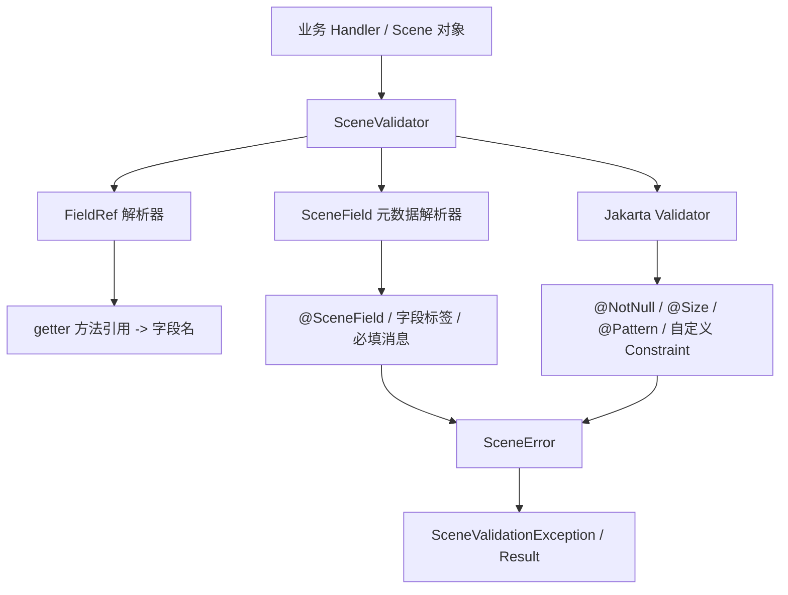
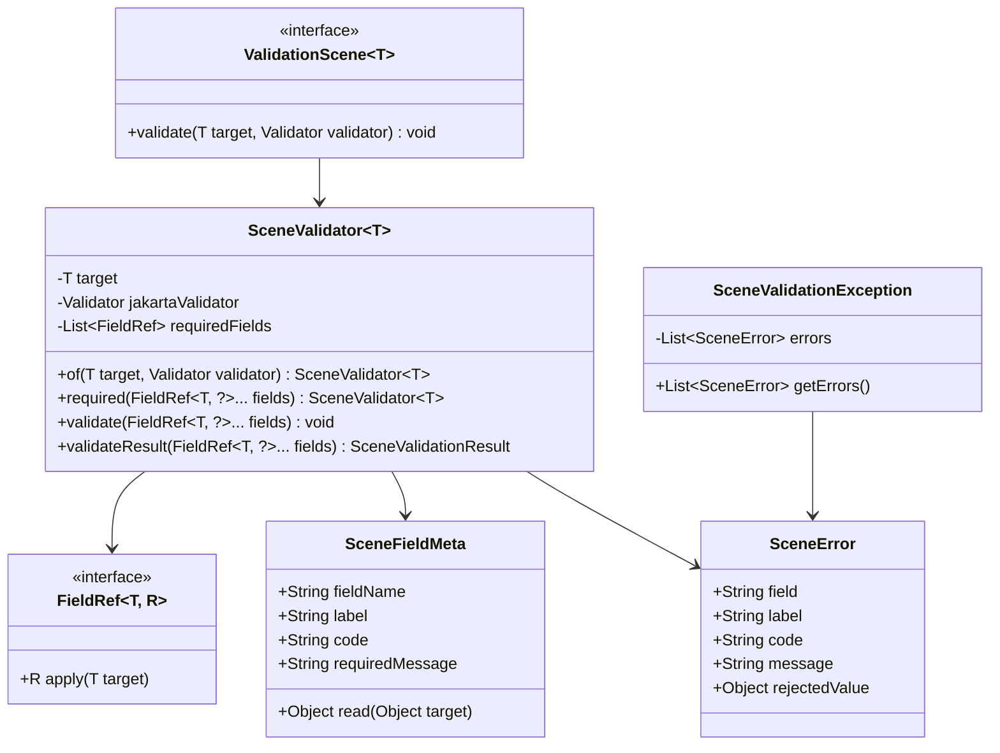
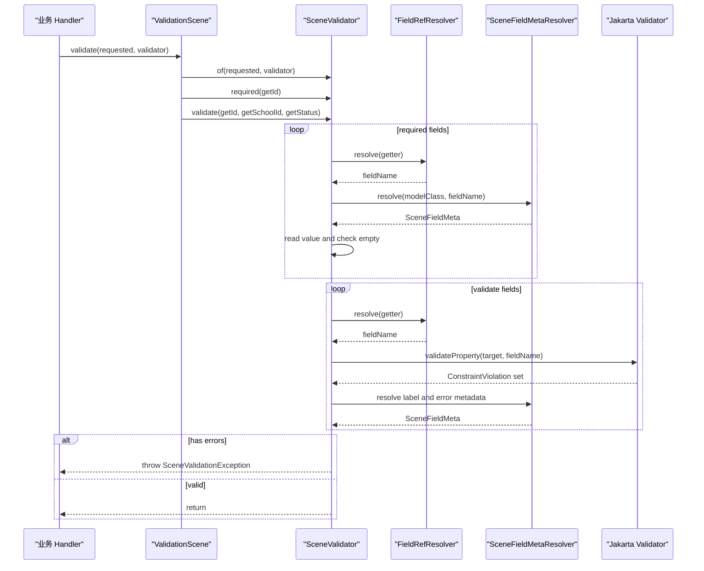
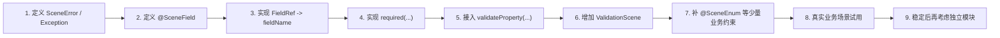

# SceneValidator 场景校验设计

本文定义一套轻量场景校验方案。它不是替代 Jakarta Bean Validation，也不是引入 YAVI 一类的规则 Builder，而是在字段注解规则之上提供“场景字段选择 + 必填语义 + 统一错误结构”的薄封装。

## 结论

在当前诉求下，推荐方案是：

```text
Jakarta Bean Validation / Hibernate Validator
+ SceneValidator 场景入口
+ 少量业务语义注解
+ 统一 SceneError 输出
```

这是当前约束下的最佳实践，而不是通用意义上唯一正确的校验框架。判断依据：

- 字段格式、长度、范围、错误信息继续沉淀在字段注解上。
- 场景不通过 `groups` 侵入实体，也不在业务代码里重复写规则。
- 调用点只声明“本次业务场景需要哪些字段、哪些字段本场景必填”。
- 底层复用成熟的 Jakarta Validation 生态，避免自研完整校验引擎。
- 能保持方法引用的类型安全，减少字符串字段名。

不推荐一开始独立 Maven 模块。第一版可以放在 `ent-loom-base` 或业务 common 包内；当多个组件稳定复用后，再抽成 `ent-loom-validation-core`。

## 目标 API

```java
SceneValidator.of(requested, jakartaValidator)
    .required(BusMoralPositionPermission::getId)
    .validate(
        BusMoralPositionPermission::getId,
        BusMoralPositionPermission::getSchoolId,
        BusMoralPositionPermission::getStatus
    );
```

语义：

- `of(requested, jakartaValidator)` 创建一次场景校验上下文。
- `required(...)` 声明当前场景额外必填字段。
- `validate(...)` 声明当前场景需要执行字段注解校验的字段集合。
- 字段格式、长度、枚举、错误消息由字段注解提供。
- 有错误时统一抛 `SceneValidationException` 或返回 `SceneValidationResult`。

## 分层职责



职责边界：

| 组件 | 职责 | 不负责 |
|---|---|---|
| `SceneValidator` | 场景字段选择、必填校验、错误聚合 | 自己实现完整格式校验引擎 |
| `FieldRef` | 方法引用转字段名 | 业务规则判断 |
| `@SceneField` | 字段展示名、业务错误文案补充 | 替代 `@NotNull`、`@Size` 等标准注解 |
| Jakarta Validator | 标准字段约束执行 | 场景字段选择 |
| `ValidationScene<T>` | 把一个业务场景对象化 | 持久化、权限、数据库唯一性 |

## 注解设计

第一版只保留少量注解。

### `@SceneModel`

```java
@Target(ElementType.TYPE)
@Retention(RetentionPolicy.RUNTIME)
public @interface SceneModel {
    String value() default "";
}
```

用途：

- 为模型提供人类可读名称。
- 可用于错误消息、日志、文档生成。

### `@SceneField`

```java
@Target({ElementType.FIELD, ElementType.METHOD})
@Retention(RetentionPolicy.RUNTIME)
public @interface SceneField {
    String label() default "";

    String code() default "";

    String requiredMessage() default "";

    boolean trimString() default true;
}
```

用途：

- `label`：字段中文名，例如“学校”“状态”。
- `code`：稳定错误码或业务字段码，可选。
- `requiredMessage`：场景必填失败时优先使用的文案。
- `trimString`：判断字符串空值时是否 trim。

### `@SceneEnum`

```java
@Target({ElementType.FIELD, ElementType.METHOD})
@Retention(RetentionPolicy.RUNTIME)
@Constraint(validatedBy = SceneEnumValidator.class)
public @interface SceneEnum {
    String[] values();

    String message() default "{field}不在允许范围内";

    Class<?>[] groups() default {};

    Class<? extends Payload>[] payload() default {};
}
```

用途：

- 补足业务枚举值校验。
- 作为 Jakarta Validation 自定义约束接入。

不建议第一版新增 `@SceneLength`、`@ScenePattern`、`@SceneEmail` 等注解，因为标准 Jakarta Validation 已经覆盖。

## 使用示例

```java
@SceneModel("德育岗位权限")
public class BusMoralPositionPermission {

    @SceneField(label = "记录ID", requiredMessage = "请选择记录")
    private Long id;

    @SceneField(label = "学校", requiredMessage = "请选择学校")
    @NotNull(message = "学校不能为空")
    private Long schoolId;

    @SceneField(label = "状态")
    @NotNull(message = "状态不能为空")
    @SceneEnum(values = {"0", "1"}, message = "状态值不合法")
    private Integer status;

    public Long getId() {
        return id;
    }

    public Long getSchoolId() {
        return schoolId;
    }

    public Integer getStatus() {
        return status;
    }
}
```

直接使用：

```java
SceneValidator.of(requested, jakartaValidator)
    .required(BusMoralPositionPermission::getId)
    .validate(
        BusMoralPositionPermission::getId,
        BusMoralPositionPermission::getSchoolId,
        BusMoralPositionPermission::getStatus
    );
```

更面向对象的使用方式：

```java
public final class MoralPositionPermissionUpdateScene
        implements ValidationScene<BusMoralPositionPermission> {

    @Override
    public void validate(BusMoralPositionPermission requested, Validator validator) {
        SceneValidator.of(requested, validator)
            .required(BusMoralPositionPermission::getId)
            .validate(
                BusMoralPositionPermission::getId,
                BusMoralPositionPermission::getSchoolId,
                BusMoralPositionPermission::getStatus
            );
    }
}
```

业务 Handler 中调用：

```java
moralPositionPermissionUpdateScene.validate(requested, validator);
```

## 核心类型



建议接口：

```java
@FunctionalInterface
public interface FieldRef<T, R> extends Function<T, R>, Serializable {
}
```

```java
public record SceneError(
    String field,
    String label,
    String code,
    String message,
    Object rejectedValue
) {
}
```

```java
public interface ValidationScene<T> {
    void validate(T target, Validator validator);
}
```

## 执行流程



## 错误输出

统一错误结构：

```json
{
  "field": "schoolId",
  "label": "学校",
  "code": "required",
  "message": "请选择学校",
  "rejectedValue": null
}
```

错误消息优先级：

| 场景 | 优先级 |
|---|---|
| `required(...)` 失败 | `@SceneField.requiredMessage` -> 默认“{label}不能为空” |
| Jakarta 约束失败 | `ConstraintViolation.getMessage()` |
| 自定义 `@SceneEnum` 失败 | 注解 `message` |
| 无 label | 使用字段名 |

## 与 Bean Validation Groups 的关系

不把本方案做成 `groups` 的简单包装。

`groups` 适合稳定、少量、跨系统一致的校验分组，例如 `Create`、`Update`。但当业务场景很多、字段组合变化频繁时，把每个场景都做成 group 会带来问题：

- 实体类上堆积大量场景接口。
- 字段注解与业务流程耦合过深。
- 同一字段在不同业务场景下的“是否参与校验”不够直观。
- 业务 Handler 读代码时看不到本场景到底校验了哪些字段。

本方案保留 `groups` 能力，但不把它作为主要场景表达方式。主要场景表达放在 `ValidationScene<T>` 或 `SceneValidator` 调用点。

## 模块边界

第一阶段建议放在 `ent-loom-base`：

```text
ent-loom-base
  scene-validation
    annotation
    core
    error
    resolver
```

稳定后再考虑拆分：

```text
ent-loom-validation-core
  annotation
  core
  error
  resolver

ent-loom-validation-spring
  Validator bean adapter
  MessageSource adapter
  Web error translator
```

拆模块的条件：

- 至少 3 个业务模块或框架组件复用。
- API 已经经过多个真实场景验证。
- 错误结构、字段解析、异常策略基本稳定。
- 出现不依赖 CRUD、DDL、UI 的独立复用需求。

## 非目标

第一版明确不做：

- 不做完整校验引擎。
- 不替代 Jakarta Validation。
- 不处理数据库唯一性、存在性、权限、跨聚合业务规则。
- 不做复杂条件规则编排。
- 不把所有业务场景都塞进注解 groups。
- 不强制所有调用点都使用链式 DSL。

这些逻辑应留在业务 Service、领域规则、权限治理或持久化层。

## 推荐落地顺序



## 设计准则

- 字段规则靠注解，场景选择靠代码。
- 标准格式规则用 Jakarta Validation，业务语义规则才加 `Scene` 注解。
- 场景对象优先于散落在 Handler 中的链式调用。
- 错误输出必须稳定，不能直接向外暴露 `ConstraintViolation`。
- 方法引用只用于字段定位，不承载复杂业务逻辑。
- 先小范围落地，API 稳定后再模块化。
