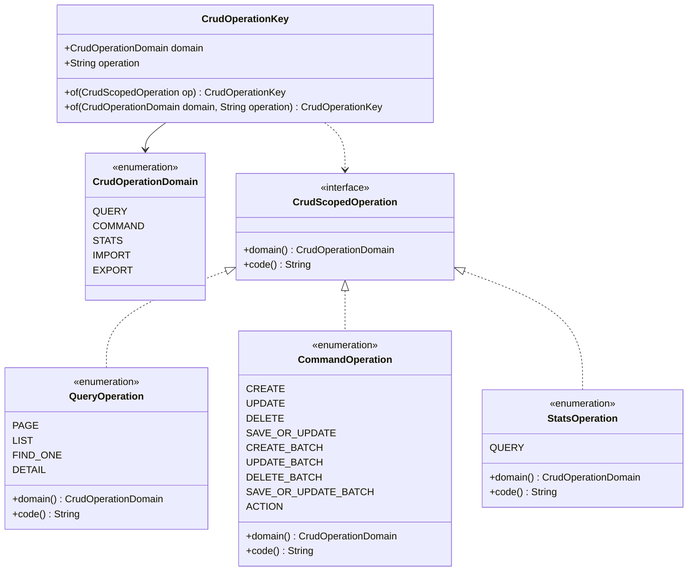
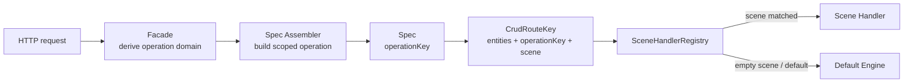
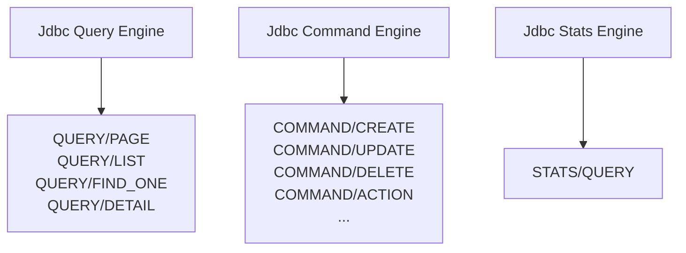
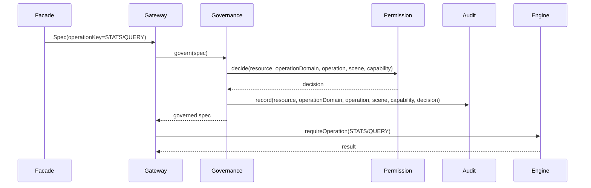
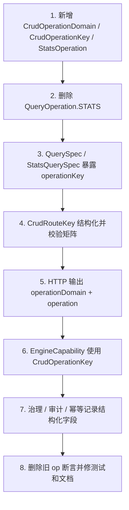

# Operation Domain / Operation 重构式设计方案

本文定义 `ent-loom-crud` 中框架操作语义的最终类型形态。最佳实践取舍后，框架内部不再使用 `capability` 表达 `QUERY / COMMAND / STATS` 这类操作分类；`capability` 保留给业务权限码和 ScenePolicy。框架权威模型统一为结构化的 `operationDomain + operation`。

本文口径是重构式方案：框架仍处在初步应用阶段，不做旧契约兼容，直接删除内部模型和 HTTP 响应里的旧 `op=STATS` 表达。验收目标是 CRUD 主链在新模型下跑通。

## 目标

当前 `QueryOperation` 仍包含 `STATS`，这会把聚合统计误表达为普通查询的一种 operation。重构后的目标是：

- `STATS` 是独立 `CrudOperationDomain`，不是 `QUERY` 下的 operation。
- 每个 operation 都必须绑定所属 operation domain。
- HTTP、Route、治理、审计、幂等和引擎能力声明使用同一套结构化操作语义。
- `capability` 只表示业务权限码，不再表示 `QUERY / COMMAND / STATS`。
- 删除 `QueryOperation.STATS`，避免新代码继续依赖错误模型。

## 舍取结论

| 问题 | 取舍 | 结论 |
|---|---|---|
| `capability` 命名冲突 | 不继续用 `CrudCapability` 表达框架操作分类 | 使用 `CrudOperationDomain`；业务权限码仍叫 `capability`。 |
| operation 合法性 | 不允许任意字符串自由组合 | `CrudOperationKey` 必须校验合法矩阵，禁止 `COMMAND/PAGE`、`QUERY/DELETE`。 |
| HTTP 破坏性变更 | 接受 breaking change | 新契约直接输出 `operationDomain + operation`；旧 `op` 字段删除，不做兼容期。 |
| Route / Engine / Governance | 保留统一结构化方向 | `CrudRouteKey`、`EngineCapability`、治理审计全部使用 `CrudOperationKey`。 |
| 权限 action | 不把派生 action 当内部权威模型 | 内部使用 `operationDomain + operation`；外部权限系统需要单字段时再派生。 |

## 核心结论

采用 `CrudOperationDomain + scoped operation enum + CrudOperationKey`。

```text
CrudOperationDomain = QUERY | COMMAND | STATS | IMPORT | EXPORT
QueryOperation = PAGE | LIST | FIND_ONE | DETAIL
StatsOperation = QUERY
CommandOperation = CREATE | UPDATE | DELETE | SAVE_OR_UPDATE | ... | ACTION
CrudOperationKey = operationDomain + operation
```

不采用全局字符串 operation，例如 `STATS_QUERY`。单字段字符串可以作为日志展示或外部权限系统的派生 action，但不能替代结构化字段。

## 实施收敛口径

第一阶段只落地当前已经存在、能跑通 CRUD 主链的三类 operation domain：

```text
QUERY
COMMAND
STATS
```

第一阶段只实现以下 operation key：

```text
QUERY/PAGE
QUERY/LIST
QUERY/FIND_ONE
QUERY/DETAIL

COMMAND/CREATE
COMMAND/UPDATE
COMMAND/DELETE
COMMAND/SAVE_OR_UPDATE
COMMAND/CREATE_BATCH
COMMAND/UPDATE_BATCH
COMMAND/DELETE_BATCH
COMMAND/SAVE_OR_UPDATE_BATCH
COMMAND/ACTION

STATS/QUERY
```

`IMPORT`、`EXPORT` 和 `STATS/PREVIEW` 暂时只作为文档上的后续方向，不进入第一阶段代码验收范围。代码中不要提前开放这些 route 注册、engine capability 或 HTTP 契约，避免出现类型已经声明但执行链路不完整的半成品能力。

本次重构完成后，内部语义以 `CrudOperationKey(operationDomain, operation)` 为唯一权威表达。Route、治理、审计、异常上下文、幂等 key 和引擎能力声明都从这个结构化 key 派生，不再以单字段 `op` 作为内部模型。

## 类型模型



建议代码形态：

```java
public enum CrudOperationDomain {
    QUERY,
    COMMAND,
    STATS,
    IMPORT,
    EXPORT
}
```

```java
public interface CrudScopedOperation {
    CrudOperationDomain domain();

    default String code() {
        if (!(this instanceof Enum<?>)) {
            throw new IllegalStateException("CrudScopedOperation code must be overridden by non-enum implementations");
        }
        return ((Enum<?>) this).name();
    }
}
```

```java
public enum QueryOperation implements CrudScopedOperation {
    PAGE,
    LIST,
    FIND_ONE,
    DETAIL;

    @Override
    public CrudOperationDomain domain() {
        return CrudOperationDomain.QUERY;
    }
}
```

```java
public enum StatsOperation implements CrudScopedOperation {
    QUERY;

    @Override
    public CrudOperationDomain domain() {
        return CrudOperationDomain.STATS;
    }
}
```

`CrudOperationKey` 必须是受校验的值对象。最佳实践是隐藏或收窄原始构造器，外部通过工厂方法创建：

```java
public final class CrudOperationKey {
    private final CrudOperationDomain domain;
    private final String operation;

    private CrudOperationKey(CrudOperationDomain domain, String operation) {
        this.domain = domain;
        this.operation = operation;
    }

    public static CrudOperationKey of(CrudScopedOperation operation) {
        if (operation == null) {
            throw new IllegalArgumentException("operation 不能为空");
        }
        return of(operation.domain(), operation.code());
    }

    public static CrudOperationKey of(CrudOperationDomain domain, String operation) {
        if (domain == null) {
            throw new IllegalArgumentException("operationDomain 不能为空");
        }
        String normalizedOperation = normalizeOperation(operation);
        if (!CrudOperationMatrix.isLegal(domain, normalizedOperation)) {
            throw new IllegalArgumentException("非法操作组合: " + domain + "/" + normalizedOperation);
        }
        return new CrudOperationKey(domain, normalizedOperation);
    }

    public CrudOperationDomain getDomain() {
        return domain;
    }

    public String getOperation() {
        return operation;
    }

    @Override
    public boolean equals(Object o) {
        if (this == o) {
            return true;
        }
        if (!(o instanceof CrudOperationKey)) {
            return false;
        }
        CrudOperationKey that = (CrudOperationKey) o;
        return domain == that.domain && operation.equals(that.operation);
    }

    @Override
    public int hashCode() {
        return 31 * domain.hashCode() + operation.hashCode();
    }

    @Override
    public String toString() {
        return domain.name() + "/" + operation;
    }

    private static String normalizeOperation(String operation) {
        if (operation == null || operation.trim().isEmpty()) {
            throw new IllegalArgumentException("operation 不能为空");
        }
        return operation.trim().toUpperCase(java.util.Locale.ROOT);
    }
}
```

## 合法矩阵

| Operation Domain | Operation | 说明 |
|---|---|---|
| `QUERY` | `PAGE / LIST / DETAIL / FIND_ONE` | 普通只读查询。不得包含 `STATS`。 |
| `COMMAND` | `CREATE / UPDATE / DELETE / SAVE_OR_UPDATE / CREATE_BATCH / UPDATE_BATCH / DELETE_BATCH / SAVE_OR_UPDATE_BATCH / ACTION` | 写入和业务动作。 |
| `STATS` | `QUERY` | 聚合统计能力。`QUERY` 表示执行统计查询，不等同于 `QueryOperation`。 |
| `IMPORT` | `VALIDATE / SUBMIT / COMMIT / CANCEL / STATUS / DOWNLOAD_ERROR` | 后续导入能力，第一阶段不落代码。 |
| `EXPORT` | `SUBMIT / DOWNLOAD / STATUS / CANCEL / PREVIEW` | 后续导出能力，第一阶段不落代码。 |

`STATS/PREVIEW` 暂缓进入合法矩阵。只有当 `StatsQuerySpec`、Facade、Engine、SceneHandler 注册和测试都补齐 preview 执行语义后，才允许开放该 operation。

`CrudOperationMatrix` 是框架边界校验点，至少应被以下入口复用：

- HTTP request 解析。
- `CrudRouteKey` 创建和 handler 注册。
- `EngineCapability` 声明。
- 治理上下文构建。
- 测试用例中的非法组合断言。

## HTTP 契约

重构后 HTTP 不再把单字段 `op=STATS` 作为统计的权威语义。新契约推荐在响应元信息中输出结构化字段：

```json
{
  "operationDomain": "STATS",
  "operation": "QUERY",
  "scene": "dashboard",
  "capability": "bus.order.STATS.dashboard"
}
```

普通分页查询：

```json
{
  "operationDomain": "QUERY",
  "operation": "PAGE",
  "scene": "default",
  "capability": "bus.order.QUERY.default"
}
```

其中：

- `operationDomain` 是框架操作域。
- `operation` 是域内操作。
- `capability` 是业务权限码，可为空或由 ScenePolicy / 业务治理推导，不参与 `CrudOperationKey` 等值判断。

如果接口路径本身已经能表达 operation domain，例如 `/crud/{entity}/stats`，请求体不要求客户端传 `operationDomain`，由 Facade 固定解析：

```text
POST /crud/order/stats
=> CrudOperationKey(STATS, QUERY)
```

外部 HTTP 契约直接切到新结构，不保留旧 `op` 字段。`CrudResponse` 顶层模型也要同步删除或停用 `op`，避免只是把新字段塞进 `meta`，顶层仍暴露旧模型。

响应、审计、权限上下文和异常上下文必须记录结构化字段：

```text
operationDomain=STATS
operation=QUERY
scene=<scene>
capability=<business capability code, optional>
```

## Route Key

重构式方案建议把 `CrudRouteKey` 从纯 operation 字符串升级为结构化 key。

推荐形态：

```java
public final class CrudRouteKey {
    private final List<String> entityTypeNames;
    private final CrudOperationKey operationKey;
    private final String scene;
}
```

保留 `entityTypeNames` 是必要的。不能把 route key 简化为 `OperationDomain + Operation + Scene`，否则不同实体或视图的同名 scene 会冲突。



注册期必须校验 route key 与 handler 类型一致：

- Query handler 只接受 `QUERY/*`。
- Command handler 只接受 `COMMAND/*`。
- Stats handler 只接受 `STATS/QUERY`。
- 非法组合必须启动失败，不能延迟到运行期随机失败。

## Spec 改造

`QuerySpec` 保留 `QueryOperation`，但 `QueryOperation` 不再包含 `STATS`。

```java
public final class QuerySpec<T> extends BaseSpec {
    private final QueryOperation operation;

    public CrudOperationKey getOperationKey() {
        return CrudOperationKey.of(operation);
    }
}
```

`StatsQuerySpec` 不再暴露 `QueryOperation getOp()`。

```java
public final class StatsQuerySpec extends BaseSpec {
    public StatsOperation getOperation() {
        return StatsOperation.QUERY;
    }

    public CrudOperationKey getOperationKey() {
        return CrudOperationKey.of(getOperation());
    }
}
```

如果后续存在统计预览，必须先补齐完整执行链路，再开放合法矩阵：

```java
// 后续新增
StatsOperation.PREVIEW
=> CrudOperationKey(STATS, PREVIEW)
```

## EngineCapability 改造

`EngineCapability` 应从多组 operation set 收敛为统一声明：

```java
public final class EngineCapability {
    private final Set<CrudOperationKey> operations;

    public boolean supportsOperation(CrudOperationKey key) {
        return key != null && operations.contains(key);
    }

    public void requireOperation(CrudOperationKey key) {
        if (!supportsOperation(key)) {
            throw new ValidationException(engineName + " 不支持操作: " + key);
        }
    }
}
```

默认 JDBC Query Engine 声明：

```text
QUERY/PAGE
QUERY/LIST
QUERY/FIND_ONE
QUERY/DETAIL
```

Stats JDBC Engine 声明：

```text
STATS/QUERY
```



## 治理、权限、审计和幂等

治理上下文必须记录结构化字段：

```text
resource
operationDomain
operation
scene
capability
subject
scope
decision
```

字段边界：

- `operationDomain + operation + scene` 是框架操作语义。
- `capability` 是业务权限码，可由 ScenePolicy 推导或显式覆盖。
- `action` 是给旧权限系统或外部日志使用的派生字段，不是框架内部权威模型。

权限系统如仍需要单字段 action，可从结构化字段派生：

```text
action = operationDomain + ":" + operation
```

示例：

```text
operationDomain=STATS
operation=QUERY
action=STATS:QUERY
capability=bus.order.STATS.dashboard
```

派生 action 只能用于外部系统适配或日志展示，不能反向污染内部模型。



## 改造步骤

### 1. API 层新增类型

- 新增 `CrudOperationDomain`。
- 新增 `CrudScopedOperation`。
- 新增受合法矩阵校验的 `CrudOperationKey`。
- 新增 `StatsOperation`。
- 修改 `QueryOperation`，删除 `STATS`。
- 修改 `CommandOperation`，实现 `CrudScopedOperation`。

### 2. Spec 层切换 operationKey

- `QuerySpec` 新增 `getOperationKey()`。
- `StatsQuerySpec` 删除 `getOp(): QueryOperation`。
- `StatsQuerySpec` 新增 `getOperation(): StatsOperation` 和 `getOperationKey()`。
- 所有内部判断禁止再使用 `QueryOperation.STATS`。

### 3. Route 层结构化

- `CrudRouteKey` 增加或替换为 `CrudOperationKey operationKey`。
- Query handler 注册校验 `QUERY/*`。
- Command handler 注册校验 `COMMAND/*`。
- Stats handler 注册校验 `STATS/QUERY`。
- route key 创建时复用合法矩阵校验。

### 4. HTTP 层切换新契约

- Query Facade 固定输出 `operationDomain=QUERY`。
- Command Facade 固定输出 `operationDomain=COMMAND`。
- Stats Facade 固定输出 `operationDomain=STATS, operation=QUERY`。
- 新增 `capability` 时必须表示业务权限码，不允许填 `QUERY / COMMAND / STATS`。
- `CrudResponse` 删除或停用旧 `op` 字段，HTTP 响应直接输出 `operationDomain + operation`。

### 5. EngineCapability 统一

- 新增 `Set<CrudOperationKey> operations`。
- 用 `requireOperation(CrudOperationKey)` 替代 `requireQueryOperation`、`requireCommandOperation`。
- Query Engine、Command Engine、Stats Engine 分别声明自己的 operation key。
- `EngineCapability.unknown()` 不应默认允许未来新增 operation domain，避免新能力被静默放开。

### 6. 治理和审计结构化

- `CrudResourceAction` 或等价治理对象增加 `operationDomain`、`operation`、`capability`。
- 权限、数据范围、审计、异常上下文、幂等 key 统一记录 `operationDomain + operation + scene`。
- 如需对接外部权限系统，使用派生 action，不反向污染内部模型。



## 测试清单

| 测试点 | 期望 |
|---|---|
| `QueryOperation` 枚举 | 不包含 `STATS`。 |
| `StatsQuerySpec#getOperationKey` | 返回 `CrudOperationKey(STATS, QUERY)`。 |
| `CrudOperationKey` 合法矩阵 | 接受合法组合，拒绝 `COMMAND/PAGE`、`QUERY/DELETE`、`STATS/PAGE`。 |
| Query route 注册 | 只接受 `QUERY/PAGE`、`QUERY/LIST`、`QUERY/FIND_ONE`、`QUERY/DETAIL`。 |
| Stats route 注册 | 只接受 `STATS/QUERY`。 |
| EngineCapability | 按 `CrudOperationKey` 校验支持能力。 |
| HTTP stats 响应 | 输出 `operationDomain=STATS, operation=QUERY`，不再输出旧 `op=STATS`。 |
| 治理审计 | 记录 `resource/operationDomain/operation/scene/capability`。 |
| 权限 action 派生 | `STATS/QUERY` 可派生为 `STATS:QUERY`，但内部字段仍结构化。 |

## 实施前建议补充的红灯测试

本次是破坏性重构，不建议在实施前补“旧行为保护测试”。实施前应优先补充目标契约测试，让测试先失败，用来约束后续改造必须真正切到 `operationDomain + operation`。

这些测试可以先按目标类型和目标断言编写。若当前代码尚无目标类型，允许测试在第一轮提交中处于编译失败状态；也可以先随新增类型一起落地，但必须在大规模替换旧字段前完成。

### 1. Operation Key 合法矩阵

新增 `CrudOperationKeyTest`，覆盖结构化 key 的最小合法矩阵：

| 用例 | 期望 |
|---|---|
| `CrudOperationKey.of(QueryOperation.PAGE)` | 返回 `QUERY/PAGE`。 |
| `CrudOperationKey.of(CommandOperation.CREATE)` | 返回 `COMMAND/CREATE`。 |
| `CrudOperationKey.of(StatsOperation.QUERY)` | 返回 `STATS/QUERY`。 |
| `CrudOperationKey.of(QUERY, " page ")` | 规范化为 `QUERY/PAGE`。 |
| `CrudOperationKey.of(COMMAND, "PAGE")` | 拒绝。 |
| `CrudOperationKey.of(QUERY, "DELETE")` | 拒绝。 |
| `CrudOperationKey.of(STATS, "PAGE")` | 拒绝。 |
| `CrudOperationKey.of(STATS, "PREVIEW")` | 第一阶段拒绝。 |

测试目的：

- 锁定 `STATS` 不再是 `QueryOperation`。
- 锁定第一阶段只开放 `QUERY / COMMAND / STATS` 的既有主链能力。
- 防止后续提前开放 `IMPORT / EXPORT / STATS/PREVIEW` 这类执行链路未补齐的半成品能力。

### 2. Scoped Operation 枚举边界

新增或改造 `OperationEnumContractTest`：

| 用例 | 期望 |
|---|---|
| `QueryOperation.values()` | 只包含 `PAGE / LIST / FIND_ONE / DETAIL`。 |
| `CommandOperation.values()` | 包含第一阶段命令操作，并且每个 operation 的 domain 是 `COMMAND`。 |
| `StatsOperation.values()` | 只包含 `QUERY`，domain 是 `STATS`。 |
| `QueryOperation.from("STATS")` | 返回 `null` 或解析失败，不能继续兼容成查询操作。 |

测试目的：

- 防止旧代码通过 `QueryOperation.from("STATS")` 静默回到旧模型。
- 防止后续又把统计能力塞回 query enum。

### 3. Spec Operation Key

新增或改造 `StatsQuerySpecTest` 和 `QuerySpecTest`：

| 用例 | 期望 |
|---|---|
| `QuerySpec(PAGE).getOperationKey()` | 返回 `QUERY/PAGE`。 |
| `QuerySpec(LIST).getOperationKey()` | 返回 `QUERY/LIST`。 |
| `StatsQuerySpec#getOperation()` | 返回 `StatsOperation.QUERY`。 |
| `StatsQuerySpec#getOperationKey()` | 返回 `STATS/QUERY`。 |
| `StatsQuerySpec` 公共 API | 不再暴露 `QueryOperation getOp()` 作为统计语义。 |

测试目的：

- 锁定 Query 和 Stats 在 spec 层已经拆开。
- 防止治理、路由和引擎继续从 `getOp()` 读取旧的单字段模型。

### 4. Route Key 和注册期校验

改造 `RouteKeyFactoryTest`，新增 `CrudRouteKeyTest` 或注册器测试：

| 用例 | 期望 |
|---|---|
| Query route `PAGE/default` | route key 包含实体维度、`QUERY/PAGE`、scene。 |
| Command route `CREATE/default` | route key 包含实体维度、`COMMAND/CREATE`、scene。 |
| Stats route `QUERY/dashboard` | route key 包含实体维度、`STATS/QUERY`、scene。 |
| 不同实体同名 `operationKey + scene` | 生成不同 route key，不冲突。 |
| Query handler 注册 `STATS/QUERY` | 启动期失败。 |
| Stats handler 注册 `QUERY/PAGE` | 启动期失败。 |
| Command handler 注册 `QUERY/DELETE` 或 `COMMAND/PAGE` | 启动期失败。 |

测试目的：

- 锁定 `CrudRouteKey` 不能退化成 `operation + scene`。
- 锁定非法组合必须在 route 创建或注册期失败，而不是执行期随机失败。

### 5. EngineCapability 结构化能力声明

改造 `EngineCapabilityTest`：

| 用例 | 期望 |
|---|---|
| Query engine 声明 `QUERY/PAGE` | `requireOperation(QUERY/PAGE)` 通过。 |
| Query engine 校验 `STATS/QUERY` | 拒绝。 |
| Stats engine 声明 `STATS/QUERY` | `requireOperation(STATS/QUERY)` 通过。 |
| Stats engine 校验 `QUERY/PAGE` | 拒绝。 |
| Command engine 声明 `COMMAND/CREATE` | `requireOperation(COMMAND/CREATE)` 通过。 |
| `EngineCapability.unknown()` | 不默认支持未来 operation domain 或未声明 operation。 |

测试目的：

- 防止 stats engine 继续通过 `QueryOperation.STATS` 声明能力。
- 防止 unknown/default 能力把未来新增能力静默放开。

### 6. HTTP 响应契约

改造 `BasicCrudControllerMvcTest` 中 page、command、stats 和错误响应断言：

| 路由 | 期望 |
|---|---|
| `POST /api/ent-crud/{entity}/page` | 输出 `operationDomain=QUERY, operation=PAGE`。 |
| `POST /api/ent-crud/{entity}/create` | 输出 `operationDomain=COMMAND, operation=CREATE`。 |
| `POST /api/ent-crud/{entity}/stats` | 输出 `operationDomain=STATS, operation=QUERY`。 |
| stats 参数校验失败响应 | 仍输出 `operationDomain=STATS, operation=QUERY`。 |
| route miss / validation error | 错误 envelope 中保留结构化 operation 字段。 |
| 所有响应 | 不再输出旧 `op` 字段。 |

测试目的：

- 锁定 HTTP 外部契约完成 breaking change。
- 防止只是把新字段塞进 `meta`，顶层仍保留旧 `op` 字段。

### 7. 治理、权限、审计和 capability 边界

改造 `GatewayGovernanceTest`、`StatsGatewayGovernanceTest` 和权限服务测试：

| 用例 | 期望 |
|---|---|
| Query 治理 action | 记录 `operationDomain=QUERY, operation=PAGE, scene=<scene>`。 |
| Command 治理 action | 记录 `operationDomain=COMMAND, operation=CREATE, scene=<scene>`。 |
| Stats 治理 action | 记录 `operationDomain=STATS, operation=QUERY, scene=<scene>`。 |
| capability 为空 | 不参与 `CrudOperationKey` 等值判断。 |
| capability 显式业务码 | 审计记录业务 capability，不允许把 `QUERY / COMMAND / STATS` 当 capability。 |
| 派生 action | 可得到 `STATS:QUERY`，但内部对象仍保留结构化字段。 |

测试目的：

- 锁定 `capability` 只表示业务权限码。
- 防止权限、审计、数据范围继续只依赖旧单字段 action。

### 8. 旧模型删除断言

新增一个轻量架构测试或反射测试：

| 用例 | 期望 |
|---|---|
| 扫描 `QueryOperation` | 不存在 `STATS`。 |
| 扫描公共响应模型 `CrudResponse` | 不存在 `getOp/setOp`。 |
| 扫描 `StatsQuerySpec` | 不存在返回 `QueryOperation` 的 `getOp()`。 |
| 扫描核心源码引用 | 不再出现内部模型用途的 `QueryOperation.STATS`。 |

测试目的：

- 给删除旧契约一个明确验收门槛。
- 防止重构后残留旧字段，导致新旧语义并存。

### 建议落地顺序

1. 先补 `CrudOperationKeyTest`、`OperationEnumContractTest`、`StatsQuerySpecTest`。
2. 再补 `EngineCapabilityTest` 和 `RouteKeyFactoryTest` 的目标断言。
3. 最后改造 HTTP、治理审计和旧模型删除断言。

这样第一批测试锁类型模型，第二批测试锁内部路由和引擎边界，第三批测试锁外部契约和治理审计，能让后续代码迁移按风险从低到高推进。

## 不做事项

- 不再新增 `CrudCapability` 表达 `QUERY / COMMAND / STATS`，避免和业务权限码冲突。
- 不把 stats 继续塞进 `QueryOperation`。
- 不使用 `STATS_QUERY` 这类全局 operation 字符串作为内部权威模型。
- 不把 `CrudRouteKey` 简化为纯 `OperationDomain + Operation + Scene`，必须保留实体或视图维度。
- 不保留外部响应里的旧 `op` 字段；当前阶段接受 breaking change。
- 不把业务 `capability` 当成 `CrudOperationKey` 的组成部分。

## 最终验收标准

重构完成后，代码中不应再出现作为内部模型使用的 `QueryOperation.STATS`。Stats 能力在所有核心链路中的表达必须是：

```text
CrudOperationKey(
  operationDomain = STATS,
  operation = QUERY
)
```

普通 Query 能力必须只覆盖：

```text
QUERY/PAGE
QUERY/LIST
QUERY/FIND_ONE
QUERY/DETAIL
```

业务权限码必须与框架操作域分离：

```text
operationDomain = STATS
operation = QUERY
capability = <business capability code>
```
