# Command 包破坏式重构建议

本文按“不考虑兼容、允许破坏式重构”的口径整理 `ent-loom-crud-core/src/main/java/com/entloom/crud/core/command` 的目录、类关系和职责边界。目标不是把包拆得更多，而是把 Command 场景扩展的核心契约收敛到更清楚、更可维护的结构。

当前执行口径：

- 以“最小可用最佳实践”为准：先解决契约、委托协议和 Patch 模型的语义问题，不为了目录美观做大搬迁。
- 允许破坏业务 handler 的继承和 import，但尽量避免一次性改动无关模块的公开 HTTP 合同。
- 默认引擎对外仍可兼容现有 `Map` / `CrudRecord` / `WriteCommand` 输入；Scene handler 委托默认引擎时内部统一使用 `WriteCommand`。
- 不再保留旧 CRUD 空接口、旧注册入口、Patch 迁移别名和实体删除模板；第一阶段直接切到统一后的契约。

当前讨论范围：

- `command/scene`
- `command/patch`
- `command/aggregate`
- 与 Command 场景委托直接相关的 `spec/WriteCommand`
- 必须同步校验的调用方：`DefaultCommandRouter`、Spring `SceneHandlerRegistrar`、starter command assembler、JDBC 默认命令引擎和 SQL allowlist。

## 一句话结论

最值得做的不兼容重构是：统一 Handler 契约、抽薄的实体命令基础设施、统一 Patch 模型、统一 Scene delegate 写入协议、把 Delete 从完整实体绑定里拆出来。

`DefaultCommandPayloadBinder` 拆分和包目录迁移属于第二阶段。它们有价值，但不是最小可用版本的前置条件。

不建议把 `AbstractPatchUpdateSceneHandler` 继承到 `AbstractEntityUpdateHandler` 下面。它们都是 `UPDATE`，但 payload 语义不同：一个是完整实体，一个是字段补丁。

## 当前结构

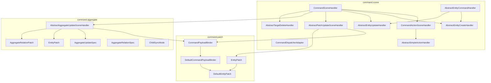

当前主要张力：

| 问题 | 现状 | 风险 |
|---|---|---|
| CRUD 场景接口重复 | 旧 CRUD 空接口只表达操作类型 | Dispatcher 重复代码多，泛型强转集中 |
| 基础设施重复 | Entity、Patch、Aggregate Handler 都持有 registry、binder、routeKey 逻辑 | 以后新增模板时继续复制 |
| Update 语义混杂 | 完整实体更新、字段补丁更新、聚合更新都属于 `UPDATE`，但 payload 语义不同 | 类名容易误导，使用者不清楚该继承哪个 |
| delegate payload 不统一 | 单表 Patch 委托 `WriteCommand`，聚合更新委托 Map | 默认引擎需要理解多种写入协议 |
| Patch 模型重复 | 单表 patch 与聚合 root patch 字段高度重叠 | 单表 patch 和聚合 patch API 会各自演化 |
| Delete 绑定完整实体 | 旧实体删除模板会把 delete payload 绑定成实体 | 删除语义更像目标定位，而不是完整实体 |
| PayloadBinder 过宽 | 同时做 map 化、实体绑定、patch 创建、类型转换、日期解析 | 修改风险集中，测试边界模糊 |

## 目标结构

```mermaid
flowchart TB
    subgraph routing["command.routing"]
        routeIf["CommandSceneHandler&lt;P,R&gt;"]
        actionIf["CommandActionSceneHandler&lt;P,R&gt;"]
        routeRegistry["CommandSceneRegistry"]
        dispatcher["CommandDispatcherAdapter"]
    end

    subgraph handler["command.handler"]
        support["AbstractEntityCommandSupport&lt;T&gt;"]
        entityBase["AbstractEntityCommandHandler&lt;T,R&gt;"]
        create["AbstractEntityCreateHandler&lt;T,R&gt;"]
        update["AbstractEntityUpdateHandler&lt;T,R&gt;"]
        patchUpdate["AbstractPatchUpdateHandler&lt;T,R&gt;"]
        targetDelete["AbstractTargetDeleteHandler&lt;T,R&gt;"]
        aggregateUpdate["AbstractAggregateUpdateHandler&lt;T,R&gt;"]
        action["AbstractSimpleActionHandler&lt;P,R&gt;"]
    end

    subgraph payload["command.payload"]
        payloadMapper["PayloadMapper"]
        entityBinder["EntityBinder"]
        converter["FieldValueConverter"]
        binder["CommandPayloadBinder"]
        patchFactory["PatchFactory"]
    end

    subgraph patch["command.patch"]
        entityPatch["EntityPatch&lt;T&gt;"]
        aggregatePatch["AggregatePatch&lt;R&gt;"]
        relationPatch["AggregateRelationPatch&lt;C&gt;"]
    end

    subgraph write["command.write"]
        writeCommand["WriteCommand&lt;P&gt;"]
        deleteTarget["DeleteTarget"]
    end

    routeIf --> routeRegistry --> dispatcher
    actionIf --> routeRegistry

    routeIf --> support
    actionIf --> action

    support --> entityBase
    support --> patchUpdate
    support --> targetDelete
    support --> aggregateUpdate

    entityBase --> create
    entityBase --> update

    binder --> payloadMapper
    binder --> entityBinder
    binder --> converter
    binder --> patchFactory

    patchFactory --> entityPatch
    aggregatePatch --> relationPatch

    patchUpdate --> entityPatch
    targetDelete --> deleteTarget
    patchUpdate --> writeCommand
    aggregateUpdate --> writeCommand
```

推荐目标心智模型：

- `routing` 只负责场景注册、routeKey 解析和分发。
- `handler` 只放业务扩展模板，不承担底层 payload 解析细节。
- `payload` 负责从动态载荷到实体、字段值、patch 视图的转换。
- `patch` 放“字段是否出现、字段值是什么、哪些字段可委托写入”的视图模型。
- `write` 放内部写入协议，例如 `WriteCommand`、`DeleteTarget`。

注意：上图里的包名是第二阶段的最终目录形态。第一阶段只调整契约和行为，不做包目录迁移。

## Handler 契约收敛

### 当前问题

旧 CRUD 空接口本质相同，只是用类型名表达操作类型，差异主要靠注册方法体现。

### 建议目标

```java
public interface CommandSceneHandler<P, R>
    extends RouteScopedHandler, SceneHandler<CommandSpec<P>, R> {

    CommandOperation operation();
}
```

`ACTION` 保持独立，因为它有额外的契约描述：

```java
public interface CommandActionSceneHandler<P, R>
    extends CommandSceneHandler<P, CommandResult<R>> {

    CommandActionContract contract();
}
```

### 分发结构

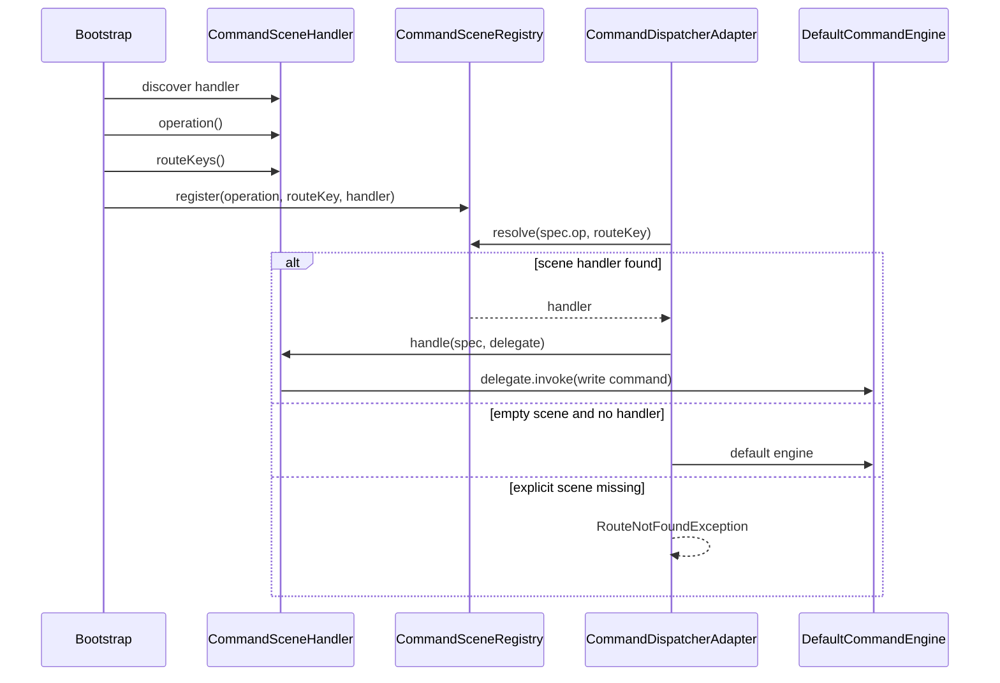

收益：

- Dispatcher 不再需要 `resolveCreateRoute`、`resolveUpdateRoute`、`resolveDeleteRoute` 三份近似代码。
- 注册入口可以统一成 `registerHandler(CommandSceneHandler<?, ?> handler)`。
- `operation()` 成为 handler 自身契约，不再由接口名字隐式表达。

最小可用版本必须补一条硬规则：

- `operation()` 是 handler 操作类型的权威来源。
- `routeKeys()` 仍可保留 `CrudRouteKey.operation`，但注册时必须逐个校验 routeKey 内的 operation 与 `handler.operation()` 一致。
- 如果不一致，启动期直接抛 `ValidationException`，不能默默按其中一边覆盖。
- `ACTION` 继续走 `CommandActionSceneHandler`，但它的 `operation()` 固定为 `CommandOperation.ACTION`。

这样可以在不立刻重写 `CrudRouteKey` 的前提下，先消除旧三个接口造成的注册分叉。

## 实体命令基础类

### 不推荐结构

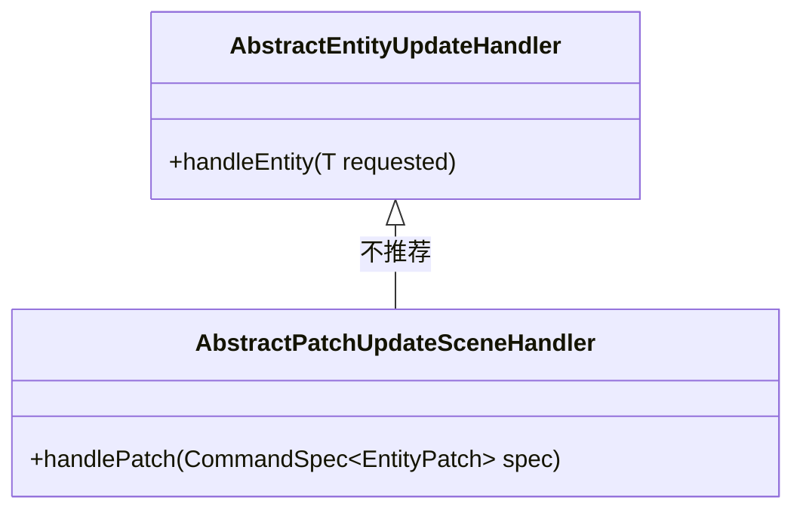

不推荐原因：

- `AbstractEntityUpdateHandler` 的模板流程是 `payload -> T -> handleEntity(T)`。
- `AbstractPatchUpdateSceneHandler` 的模板流程是 `payload -> EntityPatch<T> -> handlePatch(...)`。
- 二者只有基础设施相似，不是同一个业务模板。

### 推荐结构

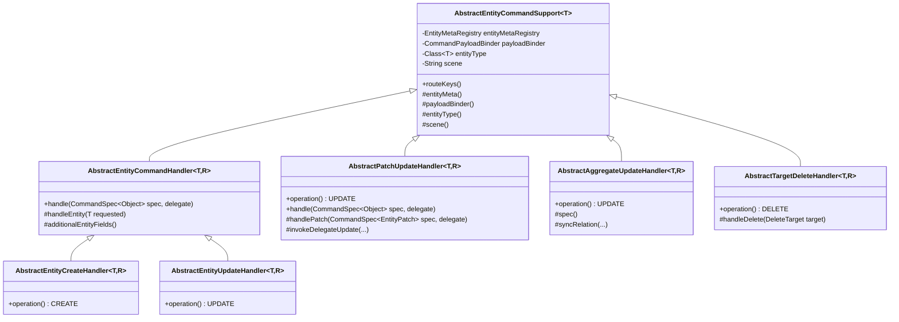

边界规则：

| 模板 | payload 语义 | 业务钩子 |
|---|---|---|
| `AbstractEntityCreateHandler` | 创建实体对象 | `handleEntity(T requested)` |
| `AbstractEntityUpdateHandler` | 完整实体或准完整实体更新 | `handleEntity(T requested)` |
| `AbstractPatchUpdateHandler` | 局部字段更新，需要知道字段是否出现 | `handlePatch(CommandSpec<EntityPatch<T>> spec, delegate)` |
| `AbstractAggregateUpdateHandler` | 聚合根和关系集合更新 | `beforeUpdate`、`syncRelation`、`afterUpdate` |
| `AbstractTargetDeleteHandler` | 根据 id/filter 定位删除目标 | `handleDelete(DeleteTarget target)` |

## Patch 模型统一

### 当前重复

旧单表 patch 视图与聚合 root patch 视图字段高度重叠，应该统一到一个公开 API。

### 建议目标

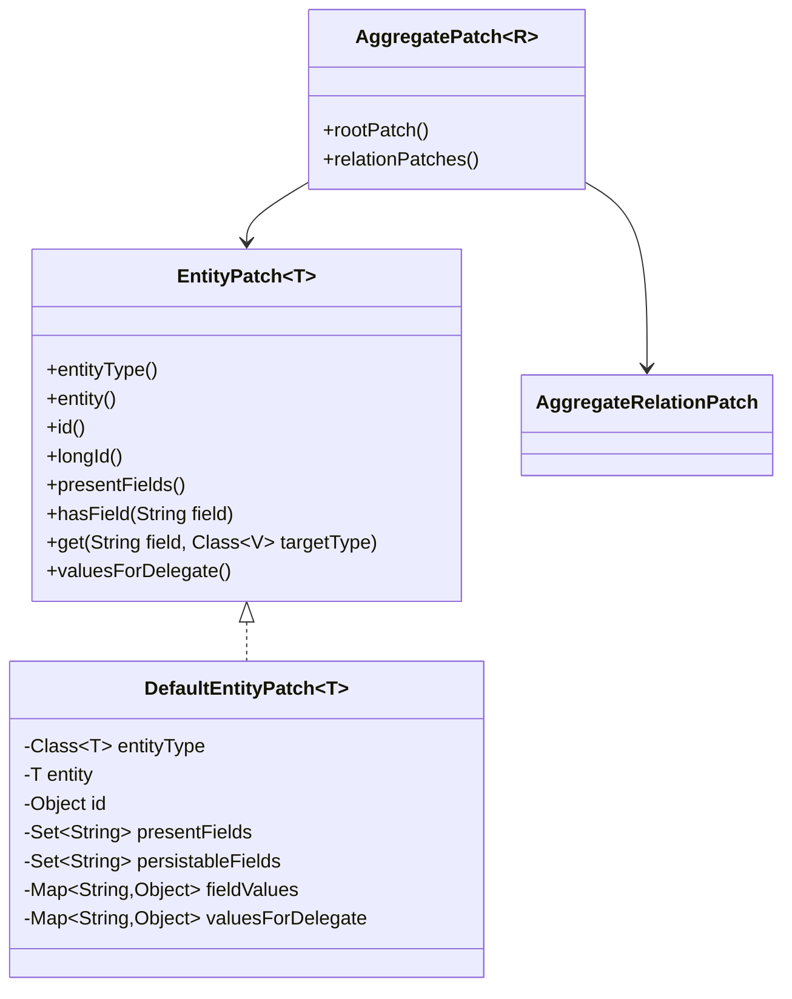

建议：

- `EntityPatch<T>` 成为最终公开的通用字段补丁视图，也是新模板的业务钩子类型。
- 不保留旧 patch 迁移别名；新代码只返回或暴露 `CommandSpec<EntityPatch<T>>`，避免单表 patch 和聚合 root patch 继续分叉。
- 聚合更新使用 `AggregatePatch<R>` 组合 root patch 和 relation patches。
- 单表 patch 与聚合 root patch 不再各自维护一套相似 API。

## Delegate 写入协议统一

### 当前问题

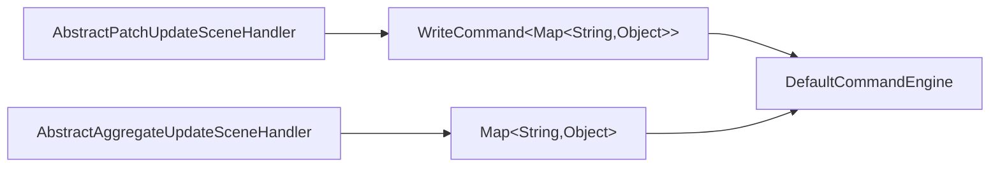

同样是委托默认写入引擎，payload 协议不一致。

### 建议目标

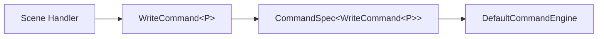

规则：

- SceneHandler 委托默认写入时，一律构造 `WriteCommand`。
- `WriteCommand.id` 和 `WriteCommand.targetFilters` 表达目标定位。
- `WriteCommand.values` 只表达要写入的字段值，不混入 id 定位语义。
- `expectedVersion` 统一放在 `WriteCommand` 内，由默认写入引擎读取。

边界：

- 这个统一只约束 Scene handler 调用 `delegate.invoke(...)` 的内部协议。
- 默认命令引擎对外仍可接受现有 `Map`、`CrudRecord`、`WriteCommand`，否则会把 starter、测试和手写调用方的改动面放大。
- `BatchCommand` 保持现状，仍由默认引擎展开为单条 `WriteCommand`；本次不重构批量协议。
- HTTP assembler 不需要为了本次重构强制把所有单条默认请求包装成 `WriteCommand`，只要保证传入 Scene handler 后再委托时使用 `WriteCommand`。
- SQL allowlist 和 JDBC handler 需要补测试，确认 `WriteCommand.values` 不包含 id，id 只通过 `WriteCommand.id` 或 `targetFilters` 定位。

## Delete 目标模型

### 当前问题

旧实体删除模板会让 delete payload 先绑定成实体 `T`。这对“删除”不是最自然的模型。

### 建议目标

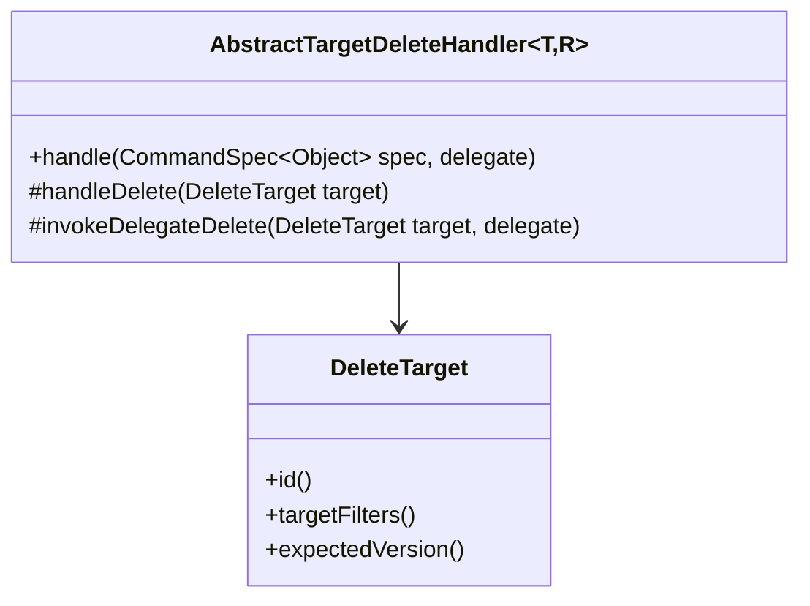

适用规则：

| 删除类型 | 推荐模板 |
|---|---|
| 根据 id 删除 | `AbstractTargetDeleteHandler` |
| 根据 `targetFilters` 条件删除 | `AbstractTargetDeleteHandler` |
| 删除前必须携带完整业务对象 | 单独业务 handler |

破坏式重构中应移除旧实体删除模板，避免误导业务层把删除写成完整实体绑定。

最小可用版本中，`DeleteTarget` 只表达删除目标和版本条件：

- `id`
- `targetFilters`
- `expectedVersion`

`dryRun` 继续保留在 `CommandSpec` 上，不放进 `DeleteTarget`。原因是 dry-run 是整次命令执行策略，不是删除目标本身的属性。

`AbstractTargetDeleteHandler.invokeDelegateDelete(...)` 委托默认引擎时，应构造 `WriteCommand<Map<String,Object>>`：

- `op = DELETE`
- `id = target.id`
- `values = emptyMap`
- `targetFilters = target.targetFilters`
- `expectedVersion = target.expectedVersion`

## PayloadBinder 拆分

### 当前职责

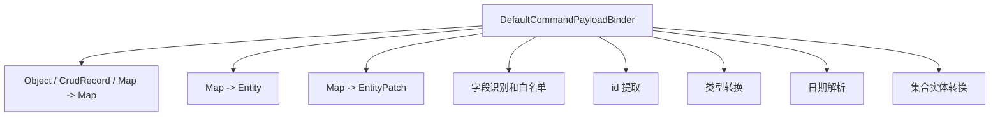

### 建议拆分

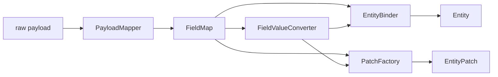

建议接口：

```java
public interface PayloadMapper {
    Map<String, Object> toFieldMap(Object payload);
}

public interface FieldValueConverter {
    <V> V convert(String field, Object value, Class<V> targetType);
}

public interface EntityBinder {
    <T> T bind(Object payload, Class<T> entityType, EntityMeta meta, Set<String> additionalFields);
}

public interface PatchFactory {
    <T> EntityPatch<T> create(Object payload, Class<T> entityType, EntityMeta meta, Set<String> additionalFields);
}
```

`CommandPayloadBinder` 可以保留为 facade，但默认实现内部组合这些小组件。

最小可用版本不强制拆分 `DefaultCommandPayloadBinder`。建议先只做两件事：

- 保持 `CommandPayloadBinder` facade 不变，让 handler 重构不牵动 payload 调用方。
- 为后续拆分补 characterization tests，覆盖 map 化、实体绑定、patch 创建、类型转换、日期解析、集合实体转换。

等 Handler 契约和 Patch 模型稳定后，再把默认实现内部拆成 `PayloadMapper`、`EntityBinder`、`FieldValueConverter`、`PatchFactory`。

## 不兼容修改清单

| 优先级 | 修改点 | 不兼容影响 | 建议 |
|---|---|---|---|
| P0 | 合并 CRUD Handler 接口为 `CommandSceneHandler.operation()` | 业务 handler import、implements、注册方法需要调整；Spring 自动注册要同步调整 | 最小版本必须做 |
| P0 | 注册时校验 `handler.operation()` 与 `routeKeys()` 内 operation 一致 | 错误注册会从运行期变成启动期失败 | 最小版本必须做 |
| P0 | 抽 `AbstractEntityCommandSupport<T>` | 父类构造器和继承层次变化 | 最小版本必须做 |
| P0 | Scene delegate payload 统一为 `WriteCommand` | 聚合更新测试需要调整；默认引擎仍保留外部兼容 | 最小版本必须做 |
| P0 | 以 `EntityPatch<T>` 作为最终 Patch API，删除旧 Patch 迁移别名 | Patch 使用方方法名和包名变化 | 最小版本必须做 |
| P1 | 引入 `DeleteTarget`，删除旧实体删除模板 | 删除 handler 继承关系变化 | 建议做 |
| P2 | 拆分 `DefaultCommandPayloadBinder` | 测试和扩展点变化 | 第二阶段做 |
| P2 | 目录迁移到 `routing/handler/payload/patch/write/aggregate` | import 大量变化 | 第二阶段做，不要和第一阶段混在一起 |

第一阶段必须同步检查的模块：

- `ent-loom-crud-core`: `DefaultCommandRouter`、`CommandDispatcherAdapter`、command scene/patch/aggregate tests。
- `ent-loom-crud-spring`: `SceneHandlerRegistrar` 只按统一 `CommandSceneHandler` 取 Bean。
- `ent-loom-crud-spring-boot-starter`: command assembler 保持外部请求兼容，重点验证 ACTION contract 和默认 command payload 不被误包装。
- `ent-loom-crud-engine-jdbc`: 默认引擎继续兼容 `Map` / `CrudRecord` / `WriteCommand`，并验证 Scene delegate 传入的 `WriteCommand` 行为。
- SQL allowlist: 确认 `WriteCommand.values`、`id`、`targetFilters` 的校验边界不退化。

## 迁移顺序

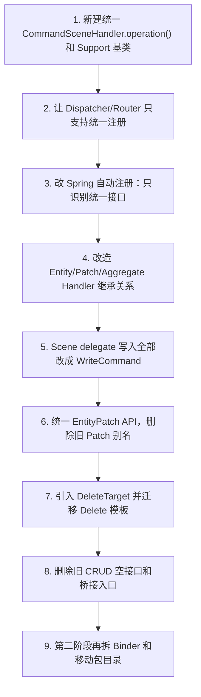

迁移原则：

- 第一阶段不移动包目录，先把行为和契约跑通。
- 第一阶段直接删除旧注册入口和旧空接口，调用方同步迁移。
- 每一步都补一组核心测试：route 注册一致性、Spring 自动注册、patch 字段识别、delegate payload、聚合更新、delete target。
- 第二阶段再考虑拆 `DefaultCommandPayloadBinder` 和移动包目录。

## 最终判断

这次重构真正要解决的是“语义边界”：

- 完整实体写入和字段补丁写入是兄弟模板，不是父子模板。
- CRUD Handler 的操作类型应该是契约属性，不应该靠三个空接口表达。
- 默认写入引擎应该只理解一种内部写入协议。
- Patch 视图应该统一，避免单表和聚合各自长出一套 API。
- Delete 应该表达目标定位，而不是默认绑定完整实体。

如果只做一个最小破坏式版本，建议至少完成：

1. `CommandSceneHandler.operation()` 统一。
2. 注册期校验 `operation()` 与 `routeKeys()` 一致。
3. `AbstractEntityCommandSupport<T>` 抽取。
4. Scene delegate 统一使用 `WriteCommand`，但默认引擎外部输入保持兼容。
5. `EntityPatch<T>` 成为最终 Patch API，不保留旧 Patch 迁移别名。
6. Spring 自动注册和 JDBC 默认引擎补齐对应测试。

这些完成后，`command` 包的继承关系和调用链会明显更清楚，而且不会把第一阶段扩大成目录重排和 payload binder 大拆分。
