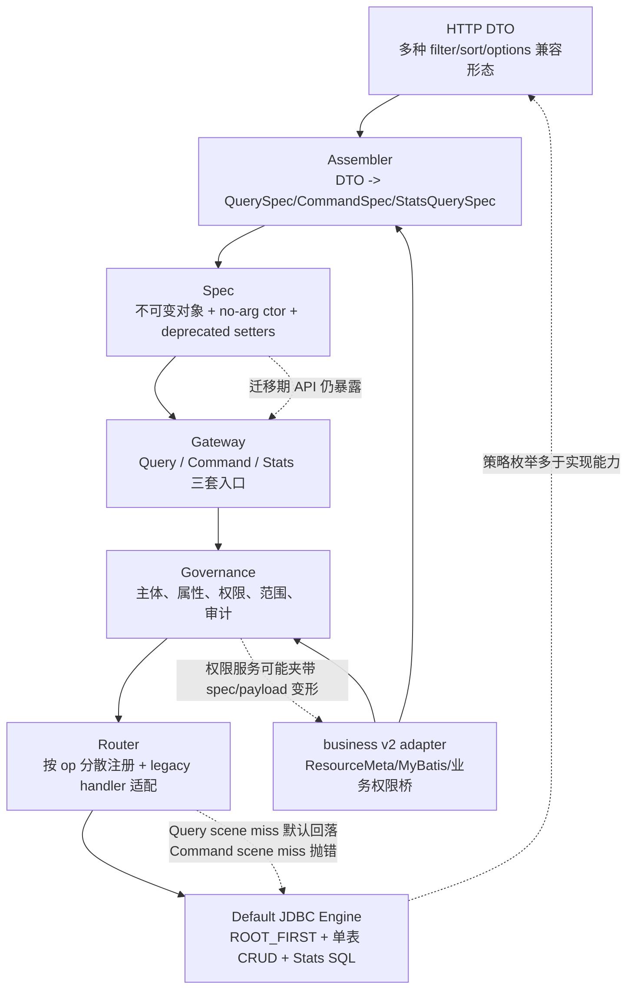
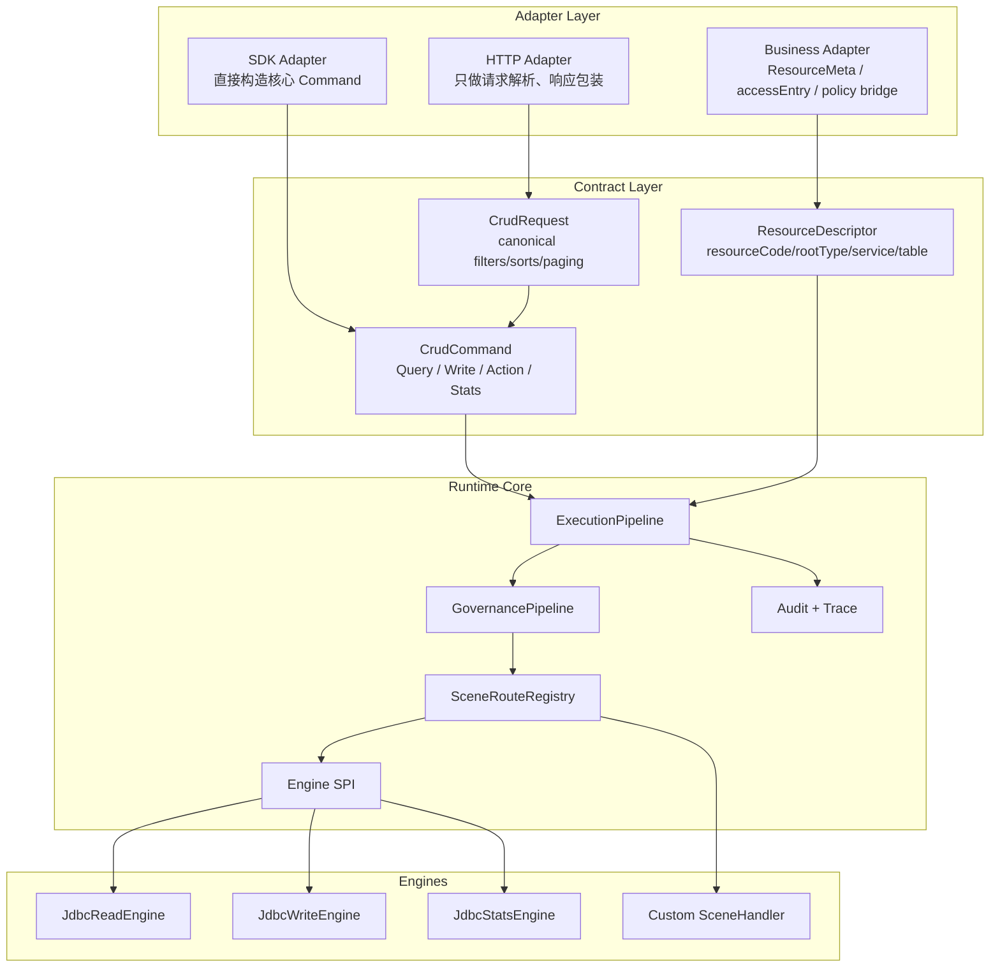
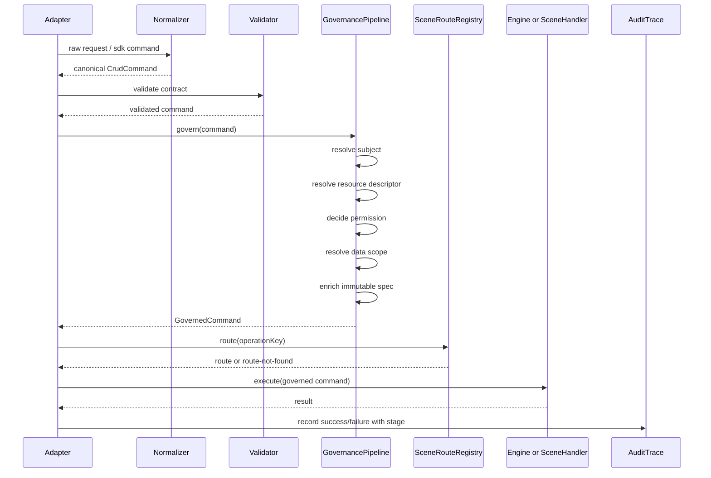
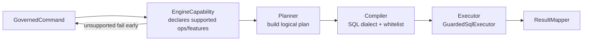
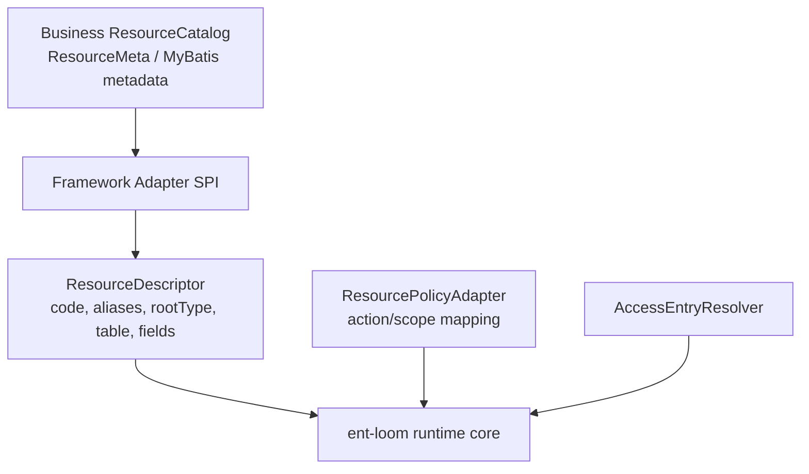

# 小版本重构最佳实践建议

本文按“不考虑兼容、允许破坏式重构”的口径评估当前 `ent-loom-crud`。目标不是继续补丁式扩展 MVP-1，而是在小版本内把框架收敛为更清晰、更硬、更适合业务长期复用的内核。

评估依据：

- 当前模块：`api`、`core`、`relation-query`、`engine-jdbc`、`stats-core`、`stats-engine-jdbc`、`spring`、`spring-boot-starter`。
- 当前主链：`QueryGateway`、`CommandGateway`、`StatsGateway` 进入 `DefaultCrudGovernanceService`，再进入路由/场景 Handler/默认 JDBC 引擎。
- 少量业务接入参考：`business-center/src/main/java/com/jiangbing/business/v2` 中的业务元数据桥、业务 Controller、权限与数据范围适配。

## 一句话结论

当前框架的主方向是对的：统一网关、治理主链、场景 Handler、默认 JDBC 引擎这四个内核值得保留。但要达到小版本最佳实践，最建议做一次“核心合同收敛”：删除迁移兼容层，把 Stats 升为一等操作，把治理改成可审计的阶段管线，把路由和默认引擎边界改成 fail-fast、类型明确、可测试的形态。

## 重构前张力图

重构前主要问题不是“能力少”，而是边界还不够硬：

- 协议层同时承担 HTTP 兼容、SDK 值对象、执行态快照三种职责。
- Query、Command、Stats 三条链路相似但没有抽出统一执行管线。
- 路由注册有新旧两套心智模型，显式 scene 的 miss 语义不一致。
- 治理服务负责流程编排，但阶段事件、失败审计和纯函数边界还不够清晰。
- 默认 JDBC 引擎的策略名、白名单能力和真实 SQL 能力没有完全对齐。

## 目标形态

重构后的心智模型：

- Adapter 可以多样，核心请求形态必须唯一。
- Query、Command、Stats 都是 `CrudCommand` 的不同 operation，不再各自绕一套半重复流程。
- 治理是阶段管线，不是一个大服务方法。
- 路由只做 routeKey 到 handler 的解析，默认引擎只做明确声明支持的能力。
- business v2 的桥接能力沉淀成框架级 Adapter SPI，而不是靠业务侧复制大量胶水。

## P0：最建议在小版本内破坏式调整

| 调整点 | 重构前问题 | 建议目标 | 价值 |
|---|---|---|---|
| 删除迁移期 Spec API | `BaseSpec`、`QuerySpec`、`CommandSpec` 仍保留 no-arg ctor 和 deprecated setter，虽然 setter 会抛异常 | 删除 no-arg ctor/setter，只保留 builder/factory；构造时生成只读、已规范化对象 | 让“不可变 Spec”从运行时约束变成编译期约束 |
| Stats 升为一等协议 | Stats 曾复用普通 Query 语义，容易污染查询协议 | `StatsQuerySpec` 直接继承 `BaseSpec`，通过 `governStats` 进入治理；后续可视命名整洁度把 `StatsQuerySpec` 重命名为 `StatsSpec` | 避免 Query 语义污染 Stats，减少 gateway/validator 特判 |
| 抽统一执行管线 | `QueryGatewayImpl`、`CommandGatewayImpl`、`StatsGatewayImpl` 都在重复 prepare/govern/route/audit | 引入 `ExecutionPipeline`：normalize -> validate -> govern -> route -> execute -> audit | 降低三条链行为漂移，错误和审计更一致 |
| 路由注册去 Legacy | `registerLegacyHandler`、Legacy*SceneHandler 仍存在，并产生两套路由注册模型 | 删除 legacy handler，所有扩展只允许 `SceneHandler` + annotation/explicit routeKeys | 清掉迁移成本，降低泛型强转和测试复杂度 |
| 显式 scene miss 统一 fail-fast | Query scene miss 当前回落默认引擎，Command 非空 scene miss 抛 `RouteNotFound` | 统一规则：空 scene 可走默认引擎；非空 scene 未命中必须失败 | 防止业务以为命中了场景，实际走默认 SQL |
| 资源身份统一 | 默认治理 `resourceAction` 用 `rootType.getSimpleName()`，业务 v2 另有 resourceCode 映射 | 引入 `ResourceDescriptor`，由 `EntityMetaRegistry` 返回稳定 resourceCode、aliases、service | 权限、审计、HTTP entityCode 和业务 resourceCode 不再靠约定碰运气 |
| 治理阶段纯函数化 | 业务权限适配里存在权限判定同时变更命令 payload 的压力 | 当前已在 `DefaultCrudGovernanceService` 内部显式拆出 subject/attributes/validate/resource/permission/scope/enrich 阶段，并把失败 reason 固定为 `GOVERNANCE_*`；下一步可把阶段对象提升为公开扩展 SPI | 权限可测、可审计，减少隐藏副作用 |

### P0 目标执行管线

## P1：默认引擎与协议能力对齐

| 调整点 | 重构前问题 | 建议目标 |
|---|---|---|
| QueryStrategy 与实现对齐 | `DEFAULT/ROOT_FIRST/EXISTS/JOIN` 等心智存在，但默认 planner 只接受 `ROOT_FIRST` | 小版本先只暴露已实现策略；未来策略放到实验包或 feature flag；当前已收敛为公开 `DEFAULT/ROOT_FIRST` |
| `selectFields` 真正生效 | `QuerySpec` 有 `selectFields`，默认 SQL 仍 `select *` | 当前主查询投影已按字段白名单生成；关联展开查询也已改为元数据白名单列；继续用 golden SQL 防回退 |
| 关联过滤语义前置 | 白名单允许单跳路径，但默认编译器拒绝关联过滤/排序 | 当前默认编译器对关联投影/过滤/排序全部在 SQL 执行前 fail-fast；未来如实现 relation predicate plan，需要单独能力声明 |
| 写入目标选择器收敛 | 默认写曾在 `payload.id` 与 `targetFilters` 之间摇摆，容易让前端承受高级目标选择器复杂度 | 当前默认 HTTP command 已拒绝 `options.targetFilters`，对外统一 `payload.id / payload.items[].id`；`targetFilters` 仅作为 core/JDBC 内部高级能力保留 |
| 批量命令独立化 | 旧 `BATCH` 在默认 handler 内循环子命令，子 op 从 payload `"op"` 解析 | 仅保留显式 `CREATE_BATCH/UPDATE_BATCH/DELETE_BATCH/SAVE_OR_UPDATE_BATCH`；HTTP 使用 `payload.items[]/payload.ids[]`，core 使用 `BatchCommand(items: List<WriteCommand>)` |
| 统计时间分桶扩展 | Stats 模型有 `DAY/MONTH/YEAR/HOUR`，JDBC 编译只支持 `DAY` | 小版本只保留 DAY，或按方言补齐全部分桶；不要暴露半实现枚举 |

推荐的默认引擎边界：

核心原则：默认引擎宁可少，也要做到“声明即实现”。业务复杂查询继续走 SceneHandler，但不能让协议暴露一堆默认引擎无法兑现的能力。

## P2：HTTP 与业务桥接收敛

| 调整点 | 重构前问题 | 建议目标 |
|---|---|---|
| HTTP 请求形态唯一化 | read/stats 仍同时支持 `filter`、`filters`、`filterMap`、`filterList`、`sort`、`sorts` | 新版本只保留 `filters[]` 和 `sorts[]`；简写能力放业务 adapter 层。本轮未执行该破坏项，需单独排期 |
| `options` 白名单固化 | 多个 assembler 各自拒绝 `scene`、`sortExpression` 和 attribute key | 抽 `RequestContractValidator`，所有 HTTP 操作共享同一套顶层/option 白名单 |
| business v2 adapter 下沉 | 业务侧 `BusinessV2EntLoomMetaRegistry`、accessEntry 注入、policy 映射承担大量框架桥接责任 | 在框架提供 `ResourceCatalogAdapter`、`AccessEntryResolver`、`ResourcePolicyAdapter` SPI |
| Controller 只包装响应 | `EntCrudBusinessController` 目前复用 Facade 是对的，但 accessEntry 通过 attribute 流转较隐式 | 让 `CrudInvocationContext` 成为显式 adapter 输入，并在 trace/audit 中成为一等字段 |
| 错误合同统一 | HTTP、core、JDBC 各层都抛 `CrudException`，但 stage 和 routeKey 不总是结构化 | 统一 `CrudErrorEnvelope(code, message, stage, routeKey, requestId, reason)` |

### 业务桥接推荐形态

这样 business v2 仍然可以保留现有资源体系，但框架不再只认识 `@EntCrudEntity` 或 `rootType.simpleName()`。

## 阶段顺序

## 最终定稿状态

| 事项 | 最终状态 |
|---|---|
| 核心合同 | 已按破坏式重构口径收敛：不可变 Spec、统一执行管线、显式 scene fail-fast、资源身份统一；治理失败已带 `GOVERNANCE_*` 阶段 reason |
| 默认引擎 | 已按“声明即实现”原则收敛：能力声明、投影字段、关联能力 fail-fast、读写合同、批量写和 Stats 一等协议；新增 Query golden SQL 合同测试 |
| HTTP 合同 | 已固化 options/top-level 白名单和错误信封；默认 command HTTP 已拒绝 `targetFilters`；read/stats 请求形态唯一化仍未执行 |
| 业务桥接 | 已下沉为框架级 Adapter SPI，业务侧不应再复制元数据、accessEntry、policy 桥接胶水 |
| 错误与追踪 | 已统一为 `CrudErrorEnvelope(code, message, stage, routeKey, requestId, traceId, reason)` |
| 兼容残留 | 默认关系回填已 strict，不再默认按子类型反推对象关联字段；显式打开 fallback 仍可用于迁移窗口 |

## 需要保留的设计

以下设计方向不建议推翻：

- `Gateway -> Governance -> Router -> Engine` 的总体方向。
- `SceneHandler + SceneDelegate`，它是业务复杂场景接管默认引擎的关键扩展点。
- `CrudDataScope` 进入默认 SQL 谓词的治理模型。
- `GuardedSqlExecutor` 把 SQL 安全、执行和日志集中拦截的做法。
- `EntityMetaRegistry` 作为注解实体和业务资源桥接的统一入口。

## 小版本验收标准

| 验收项 | 标准 |
|---|---|
| 核心协议 | 不再存在 no-arg Spec、deprecated setter、legacy handler |
| 路由语义 | 空 scene 默认执行；非空 scene miss 一律 fail-fast |
| 治理审计 | 每次失败都有 stage、routeKey、resourceCode、subject、reason |
| 默认引擎 | 暴露的策略和字段能力均有实现或在校验阶段明确拒绝 |
| Stats | 不再依赖普通 QuerySpec 的执行态回填；后续只需补强 golden SQL 和业务 adapter 回归 |
| HTTP | command 写入目标只接受 `payload.id / payload.items[].id`；read/stats 仍需后续收敛为单一 `filters[]/sorts[]` 形态 |
| 业务接入 | business v2 接入代码主要实现 adapter SPI，不再复制框架胶水 |
| 测试 | 增加 contract tests、route miss tests、governance stage tests、golden SQL tests |

## 推荐测试补强

- Contract tests：验证新 Spec 无法构造非法中间态。
- Route tests：覆盖空 scene、显式 scene hit、显式 scene miss。
- Governance tests：已覆盖 attribute/scope 失败阶段 reason；后续继续补 subject、permission、enrich 的独立失败用例。
- Golden SQL tests：已补 Query 编译器投影 SQL 与关联能力拒绝测试；后续继续补 Write、Stats 的 SQL 模板和参数顺序快照。
- Business adapter tests：用最小 ResourceCatalog 验证 resourceCode、accessEntry、scope 维度映射。

## 最小破坏式落地清单

如果小版本只能做一组最小但收益最高的改动，建议锁定这 6 件事：

1. 删除 Spec 兼容 setter/no-arg ctor。
2. Query/Command/Stats 统一进入 `ExecutionPipeline`。
3. 删除 `registerLegacyHandler` 和 Legacy*SceneHandler。
4. 显式 scene miss 统一失败。
5. 用 `ResourceDescriptor` 替换 `rootType.simpleName()` 作为治理资源标识。
6. Stats 从 `QuerySpec` 继承关系中拆出，成为独立 operation。
