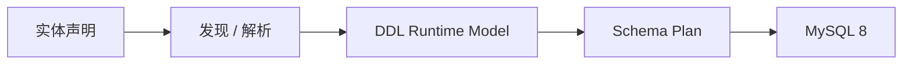

# DDL 领域总览

> 状态：In Progress

DDL 负责把实体结构转化为可控的 MySQL 8 数据库结构，是 ent-loom 实体能力主链的重要基础。当前重点是先完成可运行的建表闭环，再逐步增加差异更新、Meta 投影和全链路验收。

## 阅读路径

1. 先看 [DDL 实施清单](../../evolution/roadmap/ddl/DDL实施清单.md)，确认当前阶段和验收标准。
2. 再看 [DDL 路线图](../../evolution/roadmap/ddl/index.md)，了解阶段依赖和文档分层。
3. 需要查看模块边界时，查看模块文件 `ent-loom-modules/ent-loom-ddl/README.md`。

## 能力主链

## 当前阶段

- E1：DDL Core 建表闭环，进行中。
- E2：实体发现与 Spring Boot 实际执行，后续阶段。
- E3：字段和索引差异更新，后续阶段。
- E4：Meta -> DDL Adapter，等待 DDL Runtime Model 稳定。
- E5：与 CRUD、DOC、UI 的实体全链路验收。

当前 DDL 尚未形成稳定的组件 Architecture 文档；在 E1/E2 的 Runtime Model 和消费者闭环稳定后再补充，避免把目标能力写成当前能力。
