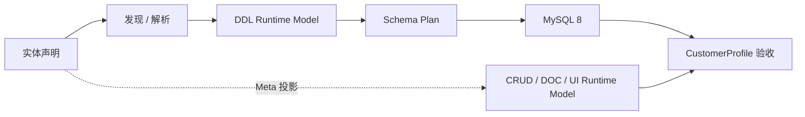

# DDL 领域总览

> 状态：Current
> 最近核验：2026-08-26

DDL 负责把实体结构转化为可控的 MySQL 8 数据库结构，是 ent-loom 实体能力主链的重要基础。当前 E1-E5 已完成：建表、受控结构差异、Meta 投影和一个简单实体的跨模块验收均已有可重复证据。

## 阅读路径

1. 先看 [DDL 实施清单](../../evolution/roadmap/ddl/DDL实施清单.md)，确认当前阶段和验收标准。
2. 再看 [DDL 路线图](../../evolution/roadmap/ddl/index.md)，了解阶段依赖和文档分层。
3. 需要执行简单实体的完整验收时，查看 [实体全链路验收](../../guides/ddl/实体全链路验收.md)。
4. 需要查看模块边界时，查看模块文件 `ent-loom-modules/ent-loom-ddl/README.md`。

## 能力主链

## 当前阶段

- E1：DDL Core 建表闭环，已完成。
- E2：实体发现与 Spring Boot 实际执行，已完成。
- E3：字段和索引差异更新，已完成。
- E4：Meta -> DDL Adapter，已完成。
- E5：与 CRUD、DOC、UI 的简单实体全链路验收，已完成。

E5 验收选择无关系的 `CustomerProfile`，确认静态 Runtime Model 投影、MySQL 8 建表和 H2 + MockMvc CRUD。复杂关系、业务权限、真实 HTTP 服务和通用迁移编排仍不属于当前能力。
