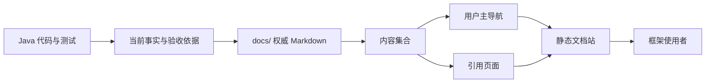
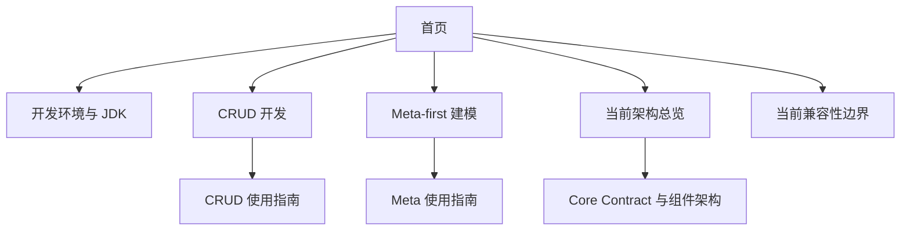
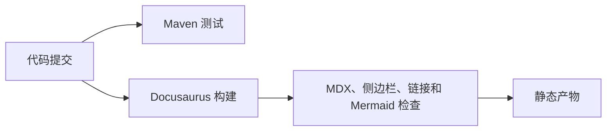

# Docusaurus 文档展示层方案

> 状态：Accepted
> 范围：ent-loom 文档展示层
> 原则：先完成真实内容可访问、链接可验证的用户文档闭环，再补充版本、多语言和自动生成能力

本文是分阶段实施的文档展示层决策；当前阶段以真实内容可访问和链接可验证为完成边界。

## 决策结论

ent-loom 采用独立的 `Docusaurus` 工程作为文档展示层，复用仓库现有 Markdown 文档作为内容来源，不加入 Maven Reactor，也不依赖 `ent-loom-ui`。

`docs/` 仍是文档权威源。Docusaurus 只负责内容加载、页面渲染、导航、构建和静态产物生成；发布平台、搜索服务和版本管理不由 Java 模块承载。

第一阶段只把当前真实存在且经过代码核验的指南、领域入口和架构参考放入用户主导航。设计决策和路线图可以作为被引用的参考页面参与构建，但不进入用户主导航；归档、草稿和模块内部实现文档不进入用户站点。

## 文档分层

需要明确区分内容源、发布集合和主导航，避免通过侧边栏隐藏页面来掩盖断链或未完成内容。

| 层次 | 内容 | 规则 |
|---|---|---|
| 内容源 | `docs/` | 唯一权威 Markdown，不在 `docs-site/` 复制正文 |
| 用户页面 | `guides/`、`domains/`、选定的 `architecture/` | 第一阶段必须能从首页或侧边栏到达 |
| 引用页面 | `evolution/decisions/`、`evolution/roadmap/` | 可被已发布文档引用，但不进入用户主导航，页面状态必须明确 |
| 排除内容 | `archive/`、草稿、`*.txt`、模块内部 `docs/implementation/` | 不进入 Docusaurus 内容集合 |

现有公开文档不得使用指向被排除内容的相对 Markdown 链接。模块内部实现文档如需保留引用，应改为仓库源码链接或维护者参考链接，不作为 Docusaurus 页面解析。

创建 `docs-site` 前必须先处理现有公共文档对模块内部 `docs/implementation/` 的引用：需要面向使用者的内容迁入 `docs/architecture/`，仅供维护者阅读的内容改为绑定分支、Tag 或 commit 的仓库源码链接。不能通过隐藏侧边栏来保留指向被排除页面的断链。

## 展示层关系



## 仓库结构

```text
ent-loom/
├── docs/                       # 权威 Markdown 内容
│   ├── domains/                # 领域阅读入口
│   ├── guides/                 # 接入、开发和使用指南
│   ├── architecture/           # 当前架构与契约
│   ├── evolution/              # 决策、路线图和实施计划
│   └── archive/                # 历史材料，不进入站点
├── docs-site/                  # 独立 Docusaurus 工程
│   ├── package.json            # Node 版本和构建脚本
│   ├── package-lock.json       # 可复现依赖
│   ├── docusaurus.config.ts    # 内容路径、路由和构建检查
│   ├── sidebars.ts             # 用户主导航白名单
│   ├── src/pages/index.tsx     # 站点首页
│   └── src/css/custom.css
└── examples/                   # 后续有真实示例后再纳入
```

`docs-site` 只作为展示工程，不新增 Java 业务模块，不改变现有 Maven 模块边界。文档插件直接读取 `../docs`；站点首页使用独立的 `/` 路由，文档中心使用 `/docs` 路由，避免与 `docs/index.md` 冲突。

## 第一阶段用户视图

第一阶段只使用当前仓库已经存在的入口：



第一阶段纳入用户主导航：

- `docs/guides/` 下已有使用指南。
- `docs/domains/` 下已有 CRUD 和 Meta 领域入口。
- `docs/architecture/` 下经过代码核验的系统、Core 和 CRUD 当前参考。
- 当前兼容性说明，必须明确区分 `Current` 与 `Target`。

第一阶段暂不提供：

- 没有真实正文的快速开始、示例项目、排障和迁移入口。
- `docs/archive/`、草稿和未完成能力。
- 模块内部实现细节和自动生成 Javadoc。

新增用户入口必须先有对应的权威 Markdown 页面，再加入首页或侧边栏；不得先创建空页面或只在首页保留占位链接。

## 内容加载与导航规则

实现时使用 Docusaurus 文档插件加载 `../docs`，通过明确的内容规则排除归档、草稿和模块内部文档；`sidebars.ts` 使用白名单组织用户主导航，不依赖目录自动扫描作为产品导航。

需要保留的 `evolution` 引用页面可以参与内容构建，但必须满足：

1. 页面状态明确标记，且使用统一状态值；不得使用 `Accepted / Implemented` 等组合状态。
2. 不加入首页、主导航和用户推荐阅读路径。
3. 页面中的目标能力不能写成当前已支持能力。

这里的“不进入推荐路径”仅指不进入首页和侧边栏主导航；公共页面可以在正文中通过上下文链接引用 Decision 或 Roadmap，但链接目标必须明确标注其状态，不能让读者误以为是当前使用入口。

文档状态统一按以下口径使用：`Current` 表示当前代码或稳定契约支持，`Accepted` 表示仍有效的设计决策，`Target` 表示已接受但尚未完整落地的目标，`In Progress` 表示正在实施，`Remaining` 表示已确认但尚未完成的路线，`Completed` 表示计划或实施项已完成，`Superseded` 表示已被替代。索引页可以不单独声明状态，但非索引页面必须声明一个主状态；补充说明写入正文，不组合多个状态。纳入站点前统一现有组合状态。

公共页面内所有链接必须属于以下三类之一：

- Docusaurus 可解析的同一内容集合内相对链接。
- 指向仓库、源码或发布文档的完整外部链接。
- 页面内锚点链接。

禁止从 `docs/` 使用指向 `ent-loom-modules/.../docs` 的跨根相对链接。

## 版本与语言策略

第一阶段不启用 Docusaurus 文档版本复制。站点明确标识为“当前主线文档”，不承诺与历史发布构件永久对应。正式发布版本后，采用 Docusaurus 原生 Versioning、Git Tag 和版本快照的组合：

- `docs/` 是当前主线文档的唯一编辑源。
- `versioned_docs/` 是正式发布时由 `docs/` 生成的历史快照，不作为日常编辑源，不手工修改。
- `versioned_sidebars/` 和 `versions.json` 与文档快照一起生成、检查和提交。
- Git Tag 绑定历史代码、POM 和对应文档版本，是历史版本的最终定位依据。
- `build/` 只是静态发布产物，不属于文档源。

版本快照只在明确的发布准备操作中生成；已存在的版本号不得覆盖。正式发布前由仓库脚本检查全部版本文件和快照差异，由人工确认后提交并打 Tag；主线后续修改不得改变已发布版本。指向仓库源码或模块文档的外部链接必须绑定与文档版本一致的 Tag 或 commit。

`Core / Boot 2 / Boot 3 / Boot 4` 是兼容性维度，不是四套文档版本。兼容矩阵至少包含：

| 线路 | 当前状态 | 最低 Java | Spring / Boot | 验证范围 |
|---|---|---:|---|---|
| 完整 Reactor / Boot 3.5 | `Current` | 21+ | Spring 6.2 / Boot 3.5 | JDK 21 |
| Core / Java 8 | `Target` | 8 | 无 Spring | 尚未完成 |
| Boot 2 | `Target` | 8 | Spring 5.3 / Boot 2.7 | 尚未完成 |
| Boot 4 | `Target` | 17 | Spring 7 / Boot 4 | 尚未完成 |

只有已经完成依赖、编译和运行验证的线路，才可以提供可复制的使用代码。`javax` / `jakarta` 或配置入口确实不同且均已验证时，才使用代码组表达差异。

第一阶段以中文为主，不立即开启完整多语言文档。英文版本后续使用 Docusaurus i18n，优先翻译当前用户主路径，不翻译路线图和历史材料。

## 最小构建闭环

Maven 和 Docusaurus 在第一阶段是两个独立的验证入口；只有后续加入可编译示例后，才建立“示例编译通过后才能构建文档”的依赖。



`docs-site` 必须固定 Node.js LTS 主版本，并通过 `package.json` 的 `engines` 与 `.node-version`、Volta 或同类机制声明；依赖锁文件必须提交。第一阶段至少支持：

```bash
cd docs-site
npm ci
npm run start
npm run build
npm run serve
```

构建配置应将内部断链和 Markdown 断链设为失败。现有 Mermaid 文档需要启用 Docusaurus Mermaid 支持；搜索必须明确采用搜索插件，或者在第一阶段明确标记为暂不提供，不能把它视为 Docusaurus 默认能力。

CI 至少独立执行 `./mvnw test` 和 `npm ci && npm run build`。第一阶段发布采用本机手动执行发布脚本：本机完成构建后，通过 SSH/rsync 上传 `docs-site/build/`，服务器只负责静态文件托管，不安装 Node.js、不执行文档构建。站点使用独立域名时，Docusaurus 至少明确配置 `url` 和 `baseUrl: '/'`。

发布脚本必须校验目标服务器和构建产物，上传到带版本号的目录，健康检查通过后再原子切换当前版本，并至少保留一个上一版本用于回滚。发布失败不得切换当前版本。版本号、Git Tag、生产发布和回滚由人工确认并通过仓库脚本执行。

## 实施顺序

1. 创建独立 `docs-site`，固定 Node.js、Docusaurus 版本和依赖锁文件。
2. 配置 `../docs` 内容路径、`/docs` 文档路由、Mermaid 和断链失败策略。
3. 以 `docs/guides/`、`docs/domains/` 和选定的当前架构页面建立侧边栏白名单。
4. 处理公共文档到 `evolution` 和模块内部文档的链接，确保没有跨根相对链接。
5. 创建真实首页，删除不存在的示例、排障和迁移占位入口。
6. 将 Maven 测试和 Docusaurus 构建加入 CI；后续再增加示例编译、搜索、Javadoc、版本和多语言。
7. 首次正式发布时，再启用 Docusaurus Versioning；由仓库脚本生成快照并检查差异，人工确认后提交 Git Tag。
8. 通过本机发布脚本上传静态产物到独立域名对应的服务器，完成健康检查和可回滚切换。

## 非目标

- 不把 Docusaurus 工程加入 Maven Reactor。
- 不将文档展示层实现为 `ent-loom-ui` 能力。
- 不在第一阶段维护四套兼容线文档副本。
- 不在第一阶段迁移到 AsciiDoc 或 Antora。
- 不把路线图、设计草稿和未完成能力伪装成当前可用功能。
- 不在没有真实内容和验证证据时创建示例、排障或迁移入口。

## 验收标准

1. 首页和侧边栏只链接到当前仓库已有的真实页面。
2. `docs/` 仍是唯一权威 Markdown，`docs-site/` 不复制正文。
3. 归档、草稿和模块内部实现不进入站点内容集合；决策和路线图即使作为引用页面构建，也不进入用户主导航。
4. `npm ci`、`npm run start`、`npm run build` 和 `npm run serve` 可在 `docs-site` 独立执行。
5. 内部 Markdown 链接、侧边栏引用和 Mermaid 内容通过构建检查；不存在跨根相对链接。
6. 兼容矩阵明确区分 `Current` 与 `Target`，不对未完成的 Java / Spring 线路作支持承诺。
7. CI 独立验证完整 Maven Reactor 和文档站构建。
8. 后续可以独立增加搜索、多语言、Javadoc、示例验证和发布版本，而不改变 Java 模块边界。
9. 发布脚本能够从本机重复执行；服务器只托管静态产物，发布失败不影响当前版本，发布成功后独立域名可访问并支持上一版本回滚。
10. 正式版本的文档快照与 Git Tag 一一对应，`docs/` 保持唯一日常编辑源，`versioned_docs/` 不被日常开发直接修改。
