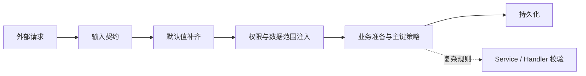

# CRUD 外部输入契约与统一校验

> 状态：Accepted
> 范围：普通 CRUD 的创建、更新请求

## 决策

实体元数据只描述字段结构、可写性、默认值、治理范围和主键策略，不声明普通 CRUD 的外部输入必填。请求输入边界集中由 `CrudInputContract` 表达，复杂业务规则由 Service / Handler 负责。

```yaml
ent:
  loom:
    crud:
      contracts:
        create:
          input-required-fields:
            customer_profile: [displayName, email]
        update:
          forbidden-fields:
            customer_profile: [id, email]
```

## 责任边界

| 层次 | 负责内容 |
|---|---|
| `CrudInputContract` | 创建请求必须提供的字段、更新请求禁止修改的字段 |
| 实体元数据 | 字段、只读、生成、默认值、主键和治理范围结构 |
| Service / Handler | 内部字段补齐、跨字段规则、状态和复杂业务校验 |
| CRUD 公共链路 | 契约校验、权限、数据范围、只读字段和写入安全 |
| 前端 | 表单提示与交互限制 |

契约字段按资源编码解析，也支持实体简单名和 `ResourceDescriptor` 别名。显式配置优先；未匹配到资源配置时不推断创建必填字段。主键要求由 `EntityIdPolicy` 处理，数据库生成主键不要求请求提供。

`input-required-fields` 只表示请求必须显式提供，不表示实体最终一定非空。默认值、系统注入或业务计算得到的字段可以不要求前端传入；最终持久化约束仍由数据库、Bean Validation 或业务 Handler 独立负责。

## 执行顺序



- 创建先校验客户端必须提供的字段，再执行默认值、治理注入和业务准备。
- 默认值只补缺失键，不覆盖显式 `null`。
- 强类型 Handler、Map 和 `CrudRecord` 都先校验外部输入契约；强类型 Handler 随后再执行默认值、治理注入和业务准备，最终实体值及跨字段规则由业务 Handler 负责。
- JDBC 默认 CREATE 和 DAO CREATE 使用同一份 `CrudInputContract`。
- 更新先校验禁改字段，再执行目标条件、只读字段和写入校验；显式 `null` 也属于修改。
- 批量命令复用单条 CREATE/UPDATE 子命令链路。

## 校验值语义

通用必填值校验器只负责稳定的空值判断：字符串不能全为空白，数组、集合和 Map 不能为空；数值、布尔、枚举及其他对象只要求非 `null`。它不负责范围、格式、嵌套对象、跨字段不变量或权限判断。

契约字段不存在、不可写或将生成主键配置为创建输入时，在校验边界立即失败。错误文案优先使用字段 label，并保留字段路径；结构化错误和批量记录定位由后续错误契约继续完善。

## 注解与文档边界

- `EntField` 和 `EntDocField` 不承载 CRUD 外部输入必填语义。
- DOC 公共投影使用 `inputRequired` 表示客户端创建输入提示，不输出实体最终非空结论。
- DDL 的 `nullable`、数据库默认值和 CRUD 输入契约相互独立，不能互相推导。
- `required` 仍可作为 JSON Schema、Spring MVC 参数、集合访问器或其他独立协议的技术关键字；这些用法不属于实体字段输入语义。

## 已完成与后续

当前已完成：外部契约配置、资源编码/别名解析、创建字段校验、更新禁改字段校验、默认 JDBC 与 DAO 命令链统一接入、强类型创建 Handler 接入，以及 DOC `inputRequired` 投影迁移。

后续再独立演进结构化字段错误、导入错误定位和更细粒度的更新空值规则，不重新把外部输入语义放回实体注解。
