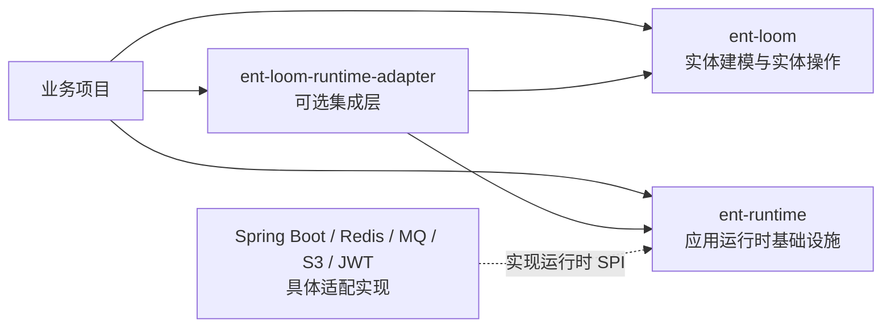
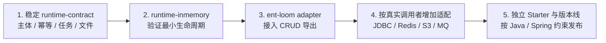

# 应用运行时与实体框架分层决策

> 状态：Accepted
> 来源：`baoyi-cloud` 非业务能力盘点

当前职责和能力映射见 [baoyi-cloud 与 ent-loom 能力边界](../../../architecture/core/baoyi-cloud与ent-loom能力边界.md)。

## 背景

`baoyi-cloud` 同时包含框架模块、通用平台模块、基础设施适配和领域业务。盘点后可以看到，认证主体、缓存/锁、幂等、任务、文件、消息等能力与实体字段和元数据的耦合较轻，但它们会影响整个应用的请求、线程、任务和服务边界。

如果把这些能力继续堆入 `ent-loom`，实体框架会被登录、Redis、MQ、对象存储和调度实现拖重；如果完全不提前定义边界，后续又容易出现主体、任务、文件和事件各自重复建模。

## 决策

1. `ent-loom` 只负责实体建模、实体治理、CRUD、DDL、DOC 和 UI Contract。
2. `ent-runtime` 作为并列的独立 Git 仓库，提供框架无关的应用运行时 Contract、通用 Core 和验证实现。
3. `ent-runtime` 不依赖 `ent-loom`；`ent-loom` 核心也不依赖 `ent-runtime`。
4. `ent-loom-runtime-adapter` 放在 `ent-loom` 一侧，作为可选 Maven 模块同时消费两边的 Contract。
5. Redis、分布式锁、对象存储、MQ、Spring Boot、JWT 等具体实现按运行时模块或适配器独立增加，不进入最小 Core。
6. 支付、额度、用户文件目录、商品同步等平台业务不进入框架核心。

## 为什么这样分层

| 判断 | 结论 |
|---|---|
| 与实体字段耦合 | 认证上下文、缓存/锁、任务、文件和消息可以不依赖实体模型 |
| 与实体治理的连接 | 实体权限、字段权限、数据范围和导出内容仍需要 `ent-loom` 适配 |
| 依赖方向 | 运行时不能反向依赖实体框架；集成关系由 Adapter 承担 |
| 发布边界 | 运行时可以单独构建、测试和发布，实体框架不被基础设施实现强制带入 |
| 交付策略 | 先稳定 Contract，再用内存实现验证一个真实闭环，不一次建设完整平台 |

## 演进顺序

第一阶段采用异步导出作为纵向验收场景：主体上下文进入 CRUD 治理，经过幂等后创建任务，任务结果绑定文件引用，下载时重新执行主体、用途、归属和过期校验。这个场景只用于验证边界，不要求立即实现 Redis、RabbitMQ、对象存储或生产 Worker。

## 决策后果

### 正面后果

- `ent-loom` 保持面向实体的职责，完整 Reactor 不被通用运行时能力持续膨胀。
- `ent-runtime` 可以脱离实体框架进行 Java 8 Core 构建和测试。
- 认证、任务、文件和消息可以服务多个实体框架或业务应用。
- 具体基础设施能够按实现和发布节奏替换，不污染实体 Contract。

### 需要承担的成本

- Adapter 需要维护 `ent-loom` 模型与运行时模型之间的转换。
- 两个仓库需要独立版本、测试和发布；联调必须有明确的 Contract 版本。
- 同一概念可能存在实体侧和运行时侧两个模型，不能通过共享业务实体偷懒耦合。

## 非目标

- 不把 `baoyi-cloud` 的 `CommonDataService`、多表查询或基础 CRUD 原样搬入 `ent-loom`。
- 不因为发现能力缺口就立即新增 auth、cache、task、storage、message 全套空模块。
- 不把 `ent-runtime` 当前的内存验证实现描述为生产级异步调度、分布式锁、对象存储或消息系统。
