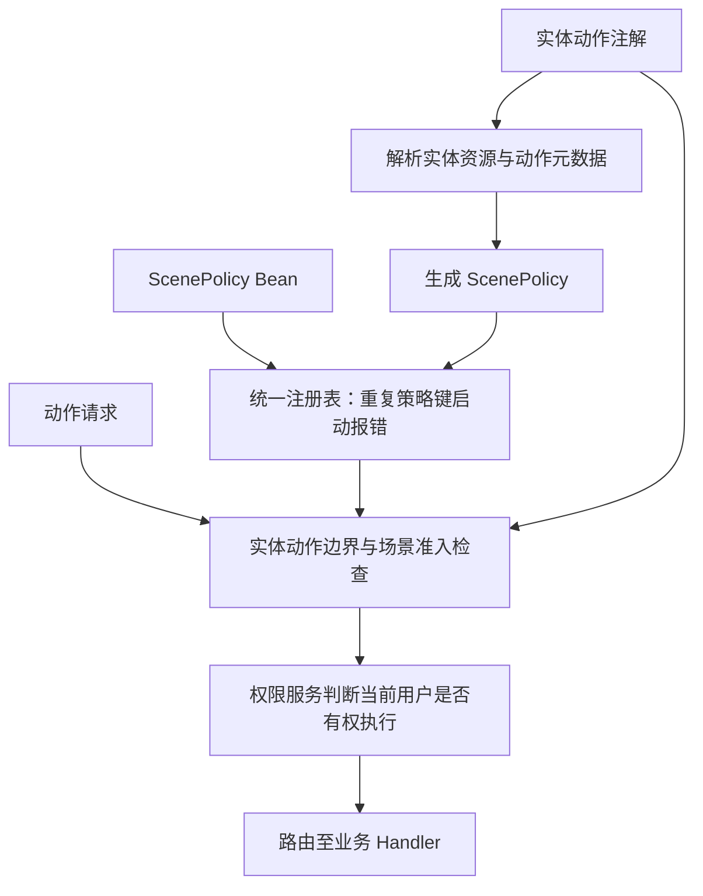

# 动作注解与场景策略统一声明

> 状态：已实现。

## 结论

同时支持实体动作注解与 `@Bean ScenePolicy`，统一注册和执行。
`mini-commerce-spring-boot` 用注解声明下单动作，仅开放 `consumer` 入口。

实体组合业务数据、动作和准入元数据，符合面向实体的框架目标。
注解依赖稳定声明协议，治理逻辑由框架执行，当前用户授权由权限服务判断。

## 声明与执行



图示表达职责关系，不限定检查的内部调用顺序。

## 两种方式的定位

- 纯注解：入口规则固定时，在实体上集中描述动作及基础准入规则。
- 纯 Bean：实体不声明 `@EntCrudActions`，由 `ScenePolicy` Bean 独立配置准入，适用于动态入口、集中治理及第三方实体。
- 混合声明：实体注解约束动作白名单，Bean 仅补充白名单内动作的其他入口；不能覆盖注解已有策略。
- 两种方式形成相同运行时策略，使用同一套治理流程。
- Handler 绑定实体与场景、实现业务；注册 Handler 不自动开放动作。

## 统一规则

1. 策略键为 `accessEntry + resource + operationKey + scene`。
2. 同键重复声明即启动失败，包括注解与 Bean 冲突；不隐式覆盖或合并。
3. 实体声明动作注解后，按白名单约束；空集合关闭全部 ACTION。
4. Bean 可为白名单内动作补充其他入口策略，不能开放白名单外动作。
5. 实体未声明动作注解时，可由 Bean 显式配置准入策略。
6. ACTION 无匹配策略时拒绝；策略匹配成功仍须通过用户权限判断。
7. 注解默认入口为 `base`；portal 为空表示不额外限制 portal。
8. `scene` 是动作标识，`capability` 是业务权限码，允许两者不同。
9. 同一动作可按不同 `accessEntry` 重复声明，动作白名单按规范化的 `scene` 去重；名称须一致，权限码和 portal 限制可不同。
10. 入口按完整策略键精确匹配，不向 `base` 回退；入口和 portal 必须由可信服务端上下文解析。
11. `value`、`name`、`accessEntry`、`capability` 以及已填写的 portal 项不能为空；动作和入口按去空格、转小写后校验冲突。
12. ACTION Bean 必须使用已注册实体的规范资源编码，不能使用别名；空 scene、白名单外策略、白名单外 Handler 绑定及重复执行路由均在启动期报错。

动作边界在场景准入中执行，不依赖业务是否替换权限服务。Core 提供
`ScenePolicyRegistry.create(EntityMetaRegistry, Collection<ScenePolicy>)`，Starter 用它统一收集、校验并冻结两种声明。
已有注解策略的修改需要调整实体声明；需要应用侧完全接管时，采用纯 Bean 模式，不引入覆盖优先级。

## 示例目标

```java
@EntCrudActions(@EntCrudAction(value = Order.PLACE, name = "下单", accessEntry = "consumer", capability = "place-order"))
public class Order {
    public static final String PLACE = "place";
}
```

框架从实体元数据解析 `order`，仅生成 `consumer / order / ACTION / place` 策略。
示例在 `application.yml` 中配置 `ent.loom.crud.governance.access-entry: consumer`，由 Starter 自动装配固定入口，无需入口配置类。
该配置在所有运行模式下生效，不受调用属性覆盖；显式空值或首尾空格在启动时拒绝。
未配置时沿用可信属性解析，最终回退到 `base`；业务提供 `AccessEntryResolver` Bean 时优先使用业务实现。
示例删除 `OrderSceneConfiguration`，保留 Handler 业务实现与动作绑定：

```java
@EntCrudCommandAction(entityClass = Order.class, scene = Order.PLACE)
public class PlaceOrderHandler implements CommandActionSceneHandler<PlaceOrderCommand, PlaceOrderResult> {
    // 实现 handle，路由与入出参合同由框架解析。
}
```

动作标识归实体所有，实体不引用 Handler 类。Handler 对实体动作的引用是实现绑定，不是第二次准入声明；多个入口共用同一个 Handler。

## 程序式替代

需要从启动配置读取入口时，移除实体的 `@EntCrudActions`，保留 `Order.PLACE` 和 Handler 绑定，改用：

```java
@Configuration(proxyBeanMethods = false)
public class OrderSceneConfiguration {
    @Bean
    ScenePolicy placeOrderScenePolicy(
        EntityMetaRegistry entities,
        @Value("${ent.loom.crud.governance.access-entry:consumer}") String accessEntry
    ) {
        String resource = entities.getResourceDescriptor(Order.class).getResourceCode();
        return new ScenePolicy(
            new ScenePolicyKey(accessEntry, resource, CrudOperationKey.of(CommandOperation.ACTION), Order.PLACE),
            "place-order",
            Collections.emptySet()
        );
    }
}
```

此模式无需再声明实体动作白名单，各入口未配置的 ACTION 默认拒绝。示例本身仅为下单开放 `consumer`，因此采用纯注解模式；`base`、`management` 和未知入口的下单请求均拒绝。框架仍支持其他业务按需声明多入口策略。

首期范围：双方式声明、统一注册、边界与冲突校验、示例注解化。
保留 ScenePolicy 对导入、导出等场景的支持，不引入复杂优先级与策略合并。
