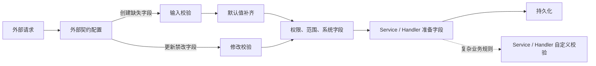

# 外部输入契约与实体校验边界

> 状态：Accepted  
> 范围：普通 CRUD 的创建、更新请求

## 决策

实体模型不按 Java 类型推断 `required`，也不要求内部字段逐一声明输入规则。外部请求的输入要求集中由契约配置表达；复杂业务规则由 Service / Handler 校验。

```yaml
ent:
  loom:
    crud:
      contracts:
        create:
          input-required-fields:
            product: [name, price, active]
            customer: [displayName, email, phone]

        update:
          forbidden-fields:
            customer: [phone]
```

## 职责流转



## 边界

| 层次 | 负责内容 |
|---|---|
| 外部契约 | 创建请求必须传入的字段、更新请求禁止修改的字段 |
| 实体元数据 | 字段、只读、生成、默认值等结构信息 |
| Service / Handler | 内部字段补齐、跨字段规则、状态和复杂业务校验 |
| 前端 | 表单提示与交互限制 |
| 后端公共链路 | 权限、数据范围、只读字段、核心不变量 |

`input-required-fields` 表示请求必须提供字段，不表示实体最终一定非空。系统注入、默认值或业务计算得到的字段可以不要求前端传入。未配置契约时不推断创建必填字段；内部调用仍须经过适用的权限和治理链。

## 注解边界

- 删除 `EntField.required`，实体不再按字段声明普通输入必填或最终必填。
- 删除 `EntDocField.required`，文档注解只承载展示元数据；外部输入必填由 `ent.loom.crud.contracts` 提供。
- 如需保留文档层的输入提示，使用运行时合并后的 `inputRequired` 投影，不再复用 `required` 名称。
- 复杂业务校验、内部字段补齐和最终写入约束由 Service / Handler 负责。

## 实施约束

- 不按 `Long`、`Boolean`、枚举等类型默认推断必填。
- 不把前端校验当作后端安全或业务不变量保障。
- `update.forbidden-fields` 只承载稳定、可复用的修改限制；动态规则写在 Service / Handler。
- 外部契约与实体业务语义分离，减少实体字段和内部流程的配置熵。
- 配置统一使用 `ent.loom` 根前缀，避免引入 `entloom` 或裸 `loom` 命名空间。
