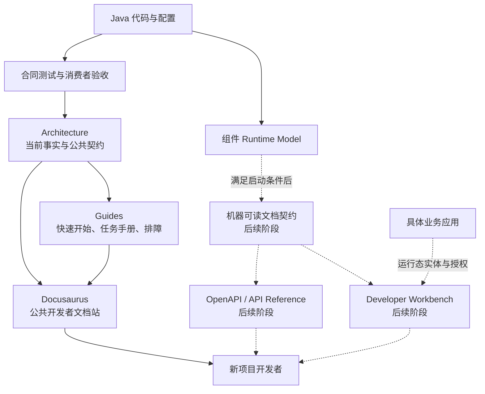

# 开发者文档体验概要设计与实施计划

> 状态：Remaining
> 最近核验：2026-09-01
> 范围：面向全新项目的 ent-loom 开发者文档与后续开发工具
> 关联决策：[Docusaurus 文档展示层方案](../../decisions/core/Docusaurus文档展示层方案.md)

## 目标

面向第一次接入 ent-loom 的开发者，先完成一个真实、可复制、可验证的最小文档闭环：从理解依赖和实体声明开始，启动应用并通过 HTTP 完成一个实体的基础 CRUD。

在此基础上，再按真实项目需求逐步建设机器可读契约、实体文档接口和运行时开发者工作台。旧项目的实体文档工具只作为需求与交互参考，不迁移其 Vue 2 实现、业务实体、业务路径、登录方式或环境配置。

## 历史参考来源

当前临时保留以下本机路径，后续统一清理或替换为绑定 Tag、commit 的稳定仓库链接：

```text
/Users/zubin/IdeaProjects/qingyiwei/qyw/docs/frontend/temp-vue2-entity-doc
/Users/zubin/IdeaProjects/qingyiwei/qyw/framework-parent/ent-loom
```

`temp-vue2-entity-doc` 是旧 `qyw` 项目中的临时 Vue 2 开发者工具，基于当前 ent-loom 框架前身模块提供的实体文档与 CRUD 接口构建。旧项目及该工具不再进行大规模演进，不属于当前框架的兼容目标、代码来源或架构事实。

其主要参考能力包括：

- 运行时实体、字段、枚举、关系和索引浏览。
- CRUD 路由、参数、枚举与响应示例查看。
- 请求体生成、在线请求、响应查看和本地预设。
- 基于实体字段生成前端代码片段。

当前参考文件包括：

- `README.md`：工具定位、运行方式和页面能力。
- `ENT-LOOM-CRUD-ALL-PARAMS.md`：旧版 CRUD 与实体文档接口汇总。
- `ENTITY-DOC-TEMPLATE-ASSET-DESIGN.md`：模板、草稿、预设与资产边界设计。

本计划只提取业务无关的需求、内容组织和交互经验。不得迁移 Vue 2、Element UI、业务实体、`/busCenter` 路径、`accessEntry`、Token、环境地址或旧版 CRUD 协议；任何可复用结论都必须重新对照当前代码和测试核验。

## 当前事实

| 能力 | 当前状态 | 本计划处理方式 |
|---|---|---|
| Docusaurus 展示工程 | 已存在，可加载 `docs/`、渲染 Mermaid 并检查断链 | 继续作为唯一公共文档展示层 |
| CRUD Architecture | 已有 HTTP 契约、运行时架构、操作域和治理说明 | 保持为唯一权威事实，不复制协议全文 |
| CRUD Guide | 已有开发指南和业务接入模板 | 补齐面向首次接入者的任务式路径 |
| E5 实体验收 | 已有 `CustomerProfile` 静态、DDL、CRUD、DOC、UI 验收 | 首期复用为示例与验证证据 |
| DOC Runtime Model | 已有实体、字段等基础文档模型 | 暂不承诺 HTTP 接口和开发者工作台 |
| OpenAPI / 在线调试 | 尚未形成当前能力 | 设置启动条件，首期不实现 |

## 核心取舍

1. **一个公共文档站**：Docusaurus 负责概念、指南、公共契约、示例和排障，不新增第二套静态文档系统。
2. **一个权威结论**：公共协议以 Architecture 为准；Guide 只按任务组织用法，通过链接引用契约，不复制完整参数定义。
3. **先文档闭环，后工具闭环**：先证明开发者仅依靠文档可以跑通最小 CRUD，再判断动态实体浏览和在线调试是否必要。
4. **代码与测试提供证据**：可复制示例必须对应当前代码和可重复执行的测试，不能从旧项目直接搬运后写成当前能力。
5. **运行态能力独立建模**：项目实体、字段、枚举、索引和可用操作属于运行时目录；HTTP 路径、请求和响应属于 API 契约，两者不混成一个万能模型。
6. **默认关闭开发工具**：后续运行时文档接口和工作台只在显式启用、完成认证授权并限制实体暴露范围后可用。

## 概要架构



实线表示首期必须完成的文档闭环；虚线表示满足启动条件后才实施的机器可读契约和开发工具闭环。

## 文档职责

| 内容 | 权威位置 | 展示方式 |
|---|---|---|
| 架构不变量、HTTP 合同、错误语义 | `docs/architecture/` | Docusaurus Architecture |
| 新项目接入、常用任务、可复制示例 | `docs/guides/` | Docusaurus Guide |
| 当前与目标能力边界 | Architecture / Roadmap | 正文链接，不重复描述 |
| 配置项和注解参考 | 对应 Component Architecture 或专用 Reference | 表格与代码片段 |
| 项目实际实体、字段、枚举、索引 | 后续机器可读实体文档契约 | 运行时查询或构建产物 |
| 在线请求、响应、草稿和预设 | 后续 Developer Workbench | 交互工具，不写入公共契约 |

## 首期开发者路径

首期只保证一条主路径，避免同时建设多个不完整入口。


快速开始只解释完成这条路径所需的内容。治理扩展、Scene Handler、关系查询、统计、导入导出等能力通过“下一步”链接进入独立指南，不挤入首屏主路径。

## 内容设计

### 快速开始

快速开始回答“如何从空项目跑通一个实体”，至少包含：

- 当前支持版本和环境要求。
- 最小 Maven 依赖及其模块边界。
- 一个经过测试的 `CustomerProfile` 实体声明。
- 最小数据源、实体暴露和 CRUD Controller 配置。
- 启动命令以及 CREATE、DETAIL 两个可复制请求。
- 成功响应、常见失败和下一步入口。

### CRUD HTTP 调用手册

调用手册按开发任务组织，不再创建“全参数文档”副本：

- 查询：PAGE、LIST、FIND_ONE、DETAIL。
- 写入：CREATE、UPDATE、DELETE、SAVE_OR_UPDATE。
- 业务动作：ACTION 与 scene。
- 统计：最小指标、分组和过滤示例。
- 后续能力：Import、Export、任务和文件。
- 横切主题：过滤、排序、分页、幂等、乐观锁、错误响应。

每个示例包含“适用场景、请求、响应要点、合同链接”，完整字段定义继续由 [CRUD HTTP 契约](../../../architecture/components/crud/HTTP契约.md) 负责。

### 排障

首期排障只覆盖最小路径中能够稳定识别的问题：

- JDK、Maven Wrapper 和依赖版本不满足要求。
- Controller 未启用或 base path 不一致。
- 实体未暴露、资源码错误或 Runtime Model 未注册。
- 主体、权限或数据范围未提供。
- 请求字段、scene、操作组合或 payload 不合法。
- MySQL 连接、表结构或字段映射不一致。

排障结论必须给出可观察信号、原因和处理方式，不能只重复异常消息。

## 机器可读契约边界

机器可读契约在首期文档闭环完成后单独启动。它至少拆分为两个模型：

| 模型 | 负责 | 不负责 |
|---|---|---|
| API Contract | HTTP 路径、方法、请求、响应、错误和认证要求 | 数据库索引、业务数据和本地调试草稿 |
| Entity Documentation Contract | 实体、字段、类型、枚举、关系、索引和能力提示 | HTTP 网关前缀、登录实现和业务权限决策 |

OpenAPI 优先承载标准 HTTP 能力；实体文档契约补充 ent-loom 的实体语义。只有一个标准无法表达需求时才增加扩展字段，不预先创建自定义全量 API 描述协议。

## Developer Workbench 边界

Developer Workbench 是可选开发工具，不是 Docusaurus 的替代品，也不是 `ent-loom-ui` 的默认业务渲染能力。

首个较小闭环只考虑只读实体浏览：

- 搜索已暴露实体。
- 查看字段、类型、枚举、关系和索引。
- 查看当前框架版本与文档契约版本。
- 跳转公共 Docusaurus 契约和使用指南。

在线 CRUD 请求、请求体生成、草稿、命名预设、导入导出和代码片段生成属于后续增强；没有真实新项目需求时不提前实现。

## 启动门槛

| 阶段 | 启动条件 |
|---|---|
| D1 文档最小闭环 | 本计划确认后即可启动 |
| D2 文档质量门禁 | D1 主路径正文完成并能构建 |
| D3 机器可读契约 | 至少一个全新项目需要查询实际实体文档，且现有 DOC Runtime Model 已完成字段语义核验 |
| D4 Developer Workbench | D3 契约稳定，至少一个全新项目证明静态文档不足；形成公共 SPI 前至少有两个真实调用者 |
| D5 在线调试增强 | 只读 Workbench 已验证价值，并完成认证、授权、审计和环境隔离设计 |

## 实施清单

### D0：事实盘点与内容边界

- [ ] 核对 README、Docusaurus 首页、侧边栏、CRUD Architecture 和 Guide 的现有入口及重复内容。
- [ ] 对照当前 Java 代码和测试，建立“当前能力、目标能力、旧项目参考”三类清单。
- [ ] 确认旧实体文档工具只提取通用需求，不复制业务路径、业务实体、认证方式和 Vue 2 实现。
- [ ] 正式发布前移除本机绝对路径，或替换为绑定 Tag、commit 的稳定仓库链接。
- [ ] 为快速开始选定唯一示例 `CustomerProfile`，记录可复用的测试与源码证据。
- [ ] 确认 Architecture、Guide、机器契约和 Workbench 的内容所有权。

验收：每类内容只有一个权威位置；没有把旧项目行为误写为当前框架能力。

### D1：Docusaurus 最小文档闭环

- [ ] 新增面向全新项目的快速开始，并只覆盖一个实体的最小 CRUD 主路径。
- [ ] 写明 JDK 21、Maven Wrapper、依赖、配置、启动和验证前提。
- [ ] 提供经过当前代码核验的 `CustomerProfile` 实体示例。
- [ ] 提供可复制的 CREATE、DETAIL 请求和响应要点。
- [ ] 新增 CRUD HTTP 调用手册，以任务为入口组织常用请求。
- [ ] 增加最小排障章节，覆盖启动、注册、治理、请求校验和数据库问题。
- [ ] 将真实页面加入 Docusaurus 首页和侧边栏，不创建空入口。
- [ ] 检查 Guide 只引用 HTTP 契约，不复制完整参数和错误码定义。

验收：不了解框架内部实现的开发者，可以只按快速开始完成一次 CREATE 和 DETAIL；所有链接和 Mermaid 通过 Docusaurus 构建。

### D2：示例与文档质量门禁

- [ ] 将快速开始中的实体、配置和请求映射到现有 E5 验收，补齐无法复用的最小消费者证据。
- [ ] 建立示例代码与当前 API 的核验方式，避免文档片段长期脱离编译验证。
- [ ] 为 CRUD HTTP 契约补齐调用手册实际需要但当前缺失的字段说明，保持其唯一权威地位。
- [ ] 检查所有示例不含业务项目名称、私有域名、Token、数据库账号或本地绝对路径。
- [ ] 执行 Markdown 链接、侧边栏、Mermaid、TypeScript 和 Docusaurus 构建检查。
- [ ] 选择一名未参与实现的开发者或一次干净环境演练最小主路径，记录阻塞点。
- [ ] 根据演练结果只修正文档、示例或真实框架缺口，不增加未经验证的说明。

验收：快速开始具有可重复证据；文档站构建通过；不存在同一参数在多处独立维护的情况。

### D3：机器可读文档契约

- [ ] 盘点 `DocEntityModel`、CRUD Runtime Model 和 Meta Descriptor 中可稳定公开的字段语义。
- [ ] 定义 Entity Documentation Contract 的最小版本、字段、空值和兼容性规则。
- [ ] 明确实体暴露白名单、敏感字段过滤、认证授权和默认关闭策略。
- [ ] 使用现有 Runtime Model 投影实体、字段、枚举、关系和索引，不直接扫描业务数据库作为唯一事实源。
- [ ] 为合同增加结构快照、未知字段兼容和敏感信息不泄露测试。
- [ ] 评估标准 OpenAPI 对 CRUD HTTP 契约的表达范围，优先生成或复用标准结构。
- [ ] 只有标准结构无法表达实体语义时，才增加有版本的 ent-loom 扩展字段。
- [ ] 为 Docusaurus 增加机器生成内容时，保证生成产物不是日常手工编辑源。

验收：一个全新项目可以安全获得稳定、可版本化的实体文档 JSON；公共 API 契约与实体文档契约职责不重叠。

### D4：只读 Developer Workbench

- [ ] 以一个真实全新项目验证动态实体浏览需求和部署边界。
- [ ] 选择与业务前端无关的独立技术栈，不迁移旧 Vue 2 工程。
- [ ] 实现实体搜索、字段、枚举、关系、索引和版本信息查看。
- [ ] 只消费 D3 机器契约，不在前端硬编码 CRUD 参数、枚举和响应结构。
- [ ] 提供到 Docusaurus 公共契约和指南的上下文链接。
- [ ] 默认只在开发环境启用，并验证未授权访问被拒绝。
- [ ] 验证实体白名单和敏感字段过滤，不暴露数据库连接、文件路径或内部存储键。
- [ ] 在形成公共 SPI 或发布构件前，获得第二个真实项目调用者的复用证据。

验收：工作台能够读取一个真实新项目的实体目录，且关闭工作台不影响框架 Core、CRUD、DOC 或业务应用运行。

### D5：交互调试增强

- [ ] 基于 OpenAPI 或稳定 API Contract 生成请求模板，不在前端维护第二份合同。
- [ ] 先支持只读 PAGE、LIST、FIND_ONE、DETAIL 调试，再评估写操作。
- [ ] 写操作上线前完成环境标识、权限、审计、幂等和危险操作确认设计。
- [ ] 将临时请求草稿与长期命名预设分开存储。
- [ ] 只有出现真实复用需求时，增加预设导入导出和代码片段模板。
- [ ] 验证工作台请求与普通 HTTP 调用经过相同 Gateway、治理、路由和审计主链。

验收：交互调试不产生框架旁路；前端没有复制维护实体模型和 CRUD 公共协议。

### 完成收口

- [ ] 将已落地能力回写对应 Architecture 和 Guide，路线图不代替当前事实。
- [ ] 更新 README、文档中心、领域入口、首页和侧边栏的真实链接。
- [ ] 记录 Maven 与 Docusaurus 的完整验证命令及结果。
- [ ] 删除或收敛重复参数表、重复示例和已经失效的临时说明。
- [ ] 未启动阶段继续保留启动条件，不写成当前已支持能力。

## 非目标

- 不迁移旧项目的 Vue 2、Element UI、登录、网关和业务实体代码。
- 不为旧项目兼容路径设计当前框架公共 API。
- 不在首期建设完整 OpenAPI 平台、在线调试器、代码生成器或低代码页面系统。
- 不把 Docusaurus 变成需要连接业务数据库的运行时服务。
- 不让实体文档接口绕过实体暴露、认证、权限、数据范围或敏感信息过滤。
- 不同时维护 Markdown 参数表、前端常量和 Java DTO 三份公共合同。

## 完成定义

D1-D2 完成即形成首个较小闭环：全新项目开发者能够通过 Docusaurus 跑通一个经过验证的实体 CRUD，并能从任务指南进入权威契约和排障入口。

D3-D5 不属于首个闭环。它们只有满足对应启动门槛后才逐阶段实施；最终目标是公共文档、机器契约和运行时工具各自承担清晰职责，共享代码与 Runtime Model 事实，不产生重复维护的协议副本。
