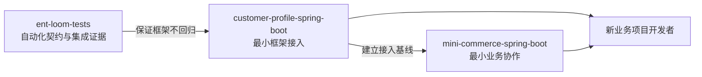
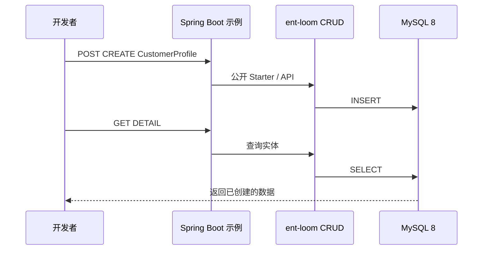
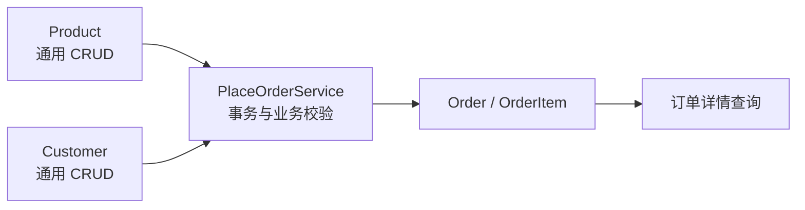

# 示例工程实施计划

> 状态：Completed（单表与商城示例均已完成公开版本、本机真实 MySQL 和 GitHub 门禁验收）
> 范围：面向新业务项目的可运行 `ent-loom` 消费者示例
> 关联：[开发者文档体验概要设计与实施计划](开发者文档体验实施计划.md)、[测试策略与验收分层](../../../architecture/core/测试策略与验收分层.md)

## 当前进度（2026-09-09）

- 已完成：单表示例独立 POM、实体、治理配置、MySQL 建表、请求文件及 IDEA Services 启停说明；本机 MySQL 8.0 的启动、请求与 SQL 核对通过，IDEA Run/Debug/Stop 已由开发者验证。
- 已实现：跨平台非交互验收入口，唯一 Compose 项目和数据卷、随机端口、CREATE 返回 ID 驱动 DETAIL、SQL 核对、失败日志与资源清理；CI 新增 JDK 21 下安装工作区构件至隔离 Maven 仓库后验证消费者的作业。
- 本次验证：JDK 21 完整 Reactor 安装与独立消费者打包通过（跳过 Java 测试；隔离仓库复用第三方缓存，先排除已有 ent-loom 构件再安装当前源码）；四项脚本生命周期测试通过，覆盖成功、响应断言失败、Compose 启动失败及日志收集失败后的资源清理；CI YAML 与 Compose 随机端口配置解析通过。
- 已确认：GitHub Actions 运行 `34333670911` 对提交 `7999c3c` 的六项门禁均通过，包括 Maven Central 公开消费者真实 HTTP/MySQL 验收、Runtime Adapter 合同测试、单表与商城 MySQL 验收、Maven 测试和 Docusaurus 构建；快速开始已作为正式指南接入侧边栏。
- 已完成：`mini-commerce-spring-boot` 的商品、客户、事务下单 Handler、订单详情、失败响应和独立验收脚本；脚本生命周期单测和本机真实 MySQL 验收均已通过，CI 已加入同一路径的独立验收作业。
- 范围说明：`ent-loom 1.0.0` 只确认了公开构件独立构建；`1.0.1` 已修复 Starter 自动配置顺序问题，并通过全新 Maven 本地仓库中的公开构件下载、单表真实启动及 HTTP/MySQL 验收。
- 发布状态：已确认 Maven Central 可获取 `ent-runtime 0.1.1` 和 `ent-loom 1.0.1`。CI 的公开消费者作业已从仅打包改为真实 HTTP/MySQL 验收，并与 Runtime Adapter 门禁一同通过。
- 已补验收：商城通过临时数据库约束制造明细写入失败，确认订单头和明细无残留；原有改价后单价快照验收保留，并补强商品改价实际生效、订单总额和明细金额断言。本机真实 MySQL 验收通过。
- 代码组织：商城按 `catalog`、`configuration`、`order` 分包；订单内部区分 `web`、`application`、`model`、`persistence`、`security`。下单和查询均通过业务入口检查主体与订单动作权限，6 项权限测试、5 项脚本生命周期测试通过。
- 公开单表验收记录：JDK 21，以全新目录 `/tmp/ent-loom-public-review.MQqEy5` 作为 Maven 本地仓库，在单表示例目录执行 `python3 scripts/verify.py --maven-repository /tmp/ent-loom-public-review.MQqEy5`；未安装工作区构件，退出码为 0，应用和 Compose 资源已清理。日志位于单表示例 `target/verification-logs/ent-loom-verify-9edad2ba6fa1/`（本机生成，不入库）。
- 公开商城验收记录：随后在商城示例目录使用同一命令及仅含公开下载构件的仓库，构建、真实业务路径、改价后快照和写入失败回滚均通过，退出码为 0，资源已清理。日志位于商城示例 `target/verification-logs/ent-loom-commerce-verify-0e20f0436d5a/`（本机生成，不入库）。

本机 Docker Hub 镜像拉取阻塞已解除。2026-09-08 在 Colima 上使用 MySQL 8.4.11 和隔离 Maven 仓库执行 `scripts/verify.py`，真实 CREATE -> DETAIL -> SQL 验收通过，退出码为 0；应用正常退出，验收容器、网络和数据卷均已清理，Colima 保持运行。验收日志位于示例目录的 `target/verification-logs/ent-loom-verify-6a542f0a3be2/`（本机生成，不入库）。此前镜像拉取失败路径的日志保留和资源清理也已验证。

## 目标与边界

示例工程面向业务开发者，证明公开构件在一个普通 Spring Boot 项目中可复制、可启动、可观察地工作。它不是框架测试的替代品，也不模拟完整生产系统。

执行原则：先做范围小、用户可独立完成、结果可验证的闭环，再按实际问题完善实践。权限、事务和数据正确性属于闭环底线。第一个交付闭环是单表示例通过公开版本完成依赖获取、启动、HTTP 请求和 SQL 核对；源码验收通过仅代表实现进度。



- `ent-loom-tests` 保留消费者、MySQL 集成和跨模块验收；其读者是框架维护者和 CI。
- `examples/` 保留可读的应用代码、启动说明和请求示例；其读者是业务开发者。
- 两者可以覆盖同一条最短业务路径，但不共享测试 fixture、内部实现或测试装配。

## 目录

```text
examples/
├── README.md
├── customer-profile-spring-boot/
│   ├── README.md
│   ├── pom.xml
│   ├── compose.yaml
│   ├── .env.example
│   ├── requests/customer-profile.http
│   └── src/
│       ├── main/java/com/example/customerprofile/
│       └── main/resources/
└── mini-commerce-spring-boot/
    ├── README.md
    ├── pom.xml
    ├── compose.yaml
    ├── .env.example
    ├── requests/commerce.http
    └── src/
        ├── main/java/com/example/minicommerce/
        └── main/resources/
```

每个示例是独立 Maven 消费者：使用 Spring Boot 的公开版本管理，只声明公开的 `ent-loom` 构件和必需基础依赖，不继承框架内部父 POM，不依赖 `ent-loom-tests` 或任何内部类。

正式交付时，README 与 POM 必须固定一个已发布且通过真实启动验收的 `ent-loom` 版本及其公共 Maven 仓库。在此之前，示例和快速开始页面标记为预览，明确目标版本仍待公开消费验收；当前工作区构件路径仅用于源码验证。框架 CI 中，先以 Maven Wrapper 构建并安装当前工作区构件至隔离的本地仓库，再从各示例目录执行其验证脚本。公开版本验收另用全新 Maven 本地仓库，不安装工作区构件、不复用本机框架缓存，完成依赖下载、启动、HTTP 请求及 SQL 核对。`examples/pom.xml` 只作为可选聚合入口，不进入默认主 Reactor，也不承担构件发布或版本管理职责。

## 示例一：单表接入

目录：`examples/customer-profile-spring-boot`。

该示例只回答“如何把一个普通 Spring Boot 项目接入 ent-loom”。使用一个 `CustomerProfile` 实体，完成实体声明、注册/暴露、开发态主体与权限配置、MySQL 8 连接和真实 HTTP 请求。



- 依赖：Spring Boot、公开 `ent-loom` Starter/API/Annotations、MySQL Driver；测试依赖仅限 Spring Boot Test。
- 不引入 Lombok，保留实体所需的最小显式 Java 代码，避免增加注解处理和 IDE 配置这一入门变量。
- 日常开发默认连接本机 MySQL 8.0+；`compose.yaml` 提供 MySQL 8.4 的干净验收环境。账号和端口只通过 `.env.example` 说明，不提交真实凭据。
- 首期固定使用 `src/main/resources/schema.sql` 建表，并由 Spring Boot 在本地 MySQL 初始化时执行。DDL Starter 不进入此示例；生产迁移策略由业务项目另行选择和说明。
- 首期只验收 `CREATE -> DETAIL`；完整 CRUD、关系和扩展能力另行演示。

## 示例二：最小商城

目录：`examples/mini-commerce-spring-boot`。

该示例以熟悉的业务原型说明：通用实体维护由框架承担，有业务不变量的动作必须进入显式业务 Handler。它不是完整商城，也不承诺覆盖企业所有领域能力。



最短路径：创建商品 -> 创建客户 -> 提交订单 -> 查询订单和明细。

- `Product`、`Customer` 等基础主数据使用通用 CRUD；不重复编写通用分页、字段校验和基础治理代码。
- 下单通过明确的 Command/Handler 实现，以承载事务、价格快照、商品有效性等业务不变量；不得强行把它伪装成通用 `CREATE`。
- 下单入口固定为业务 `POST /orders` Controller，接收 `PlaceOrderCommand`，由 `PlaceOrderService` 在一个 Spring 事务中读取商品和客户、校验有效性、写入 `Order` 与 `OrderItem`，并返回订单 ID。订单详情固定为业务 `GET /orders/{id}` 查询，返回订单与明细；`Order`、`OrderItem` 不暴露给通用 CRUD。
- 订单详情通过 `OrderQueryService`，Controller 不直接访问 Repository。请求与业务命令共用，Repository 保留具体类；不为分层额外引入接口和 DTO 转换。
- 下单与查询共用 `OrderAccessPolicy`，明确检查当前主体及 `order:PLACE`、`order:DETAIL` 动作权限；订单权限独立于主数据 CRUD 权限。示例不演示订单归属或租户隔离，自有 JDBC 不会自动继承 CRUD 数据范围限制。
- `PlaceOrderService` 通过公开 CRUD API 或项目自身的持久化端口读取主数据、写入订单；不得调用框架内部实现、复制 CRUD Controller，或绕过主体、权限和实体暴露治理。商品失效和不存在的客户/商品必须各有可观察的失败响应。
- 价格快照验收：成功下单后修改商品价格，再查询原订单；HTTP 详情与 SQL 均确认订单明细单价及订单总额保持下单时的值。
- 事务回滚验收：在订单已写入、后续明细写入阶段制造可重复的失败，确认请求失败，并通过 SQL 核对本次订单及明细均无残留。失败必须发生在写入之后，仅验证入参校验失败不能证明事务回滚；故障设置仅用于验收，不增加公开故障接口。
- 可引入 Lombok，以减少多个实体、DTO 和配置对象的样板代码；实体限用 `@Getter`、`@Setter`、`@NoArgsConstructor` 等直观注解，避免 `@Data`、`@SneakyThrows`，也不以 Lombok 隐藏框架要求。
- 显式排除登录、支付、库存扣减、优惠券、搜索、消息队列、对象存储、多租户和前端管理台。新增能力应以新的独立示例承载，不持续膨胀本示例。

## 共同约束

1. 每个示例的 README 必须写明环境版本、构件获取方式、MySQL 启动、应用启动、验证请求、停止和清理方式。
2. 示例的开发态主体、权限、实体白名单和 Controller 开关必须显式配置；不得依赖默认放行或隐藏的测试 Bean。
3. 请求示例和交付验收必须命中真实端口，并能与 MySQL 中的状态相互核对。示例业务权限可使用聚焦的单元测试或 MockMvc 验证拒绝路径；不能以 H2、MockMvc 或模拟脚本测试替代真实 HTTP/MySQL 验收。
4. 示例源码优先可读、可复制；少量重复配置优于抽取 `examples-common` 后隐藏关键接入步骤。
5. 生产部署的认证、授权、迁移、审计和基础设施策略必须与本地开发配置区分说明，不将开发便利配置宣传为生产默认值。
6. 每个示例必须提供非交互验证脚本：使用独立 Compose 项目和数据卷启动 MySQL 健康检查，等待应用健康就绪，执行请求并断言响应；`CREATE` 返回的 ID 必须用于 `DETAIL`，且关键字段必须再由 SQL 查询核对。脚本无论成功或失败均停止应用和 Compose 服务；失败时保留应用与容器日志。

## 实施顺序与门禁

1. [x] 完成 `customer-profile-spring-boot` 实现和源码验收，包括 MySQL 8、本地启动、真实 `CREATE` 与 `DETAIL` 请求、SQL 状态核对及预览文档入口。
2. [x] 为单表示例建立可自动执行的构建、启动和 HTTP 冒烟验证，确认工作区构件 CI 作业通过；不替代框架专项测试或公开版本消费验收。
3. [x] 完成第一个公开用户闭环：`ent-runtime 0.1.1` 与 `ent-loom 1.0.1` 已可公开获取，单表示例在全新 Maven 本地仓库中仅消费公开构件，通过下载依赖、启动、`CREATE -> DETAIL -> SQL` 验收；单表示例及快速开始改为正式交付。
4. [x] 完成 `mini-commerce-spring-boot` 实现、脚本生命周期测试和本机真实 MySQL 验收，并接入 CI；当前属于源码实现完成，保留已有成果。
5. [x] 补齐商城事务回滚并加强历史价格快照验收，在单表公开用户闭环完成后，以同一公开版本通过商城干净环境验收，商城示例完成交付。
6. [x] GitHub Actions 运行 `34333670911` 已确认 Runtime Adapter 及全部关联门禁通过；计划、示例 README 和快速开始统一使用已公开并通过真实启动验收的 `ent-loom 1.0.1`，本计划完成。
